<details markdown="1">
<summary><strong>Click here</strong> for setup information.</summary>

```{r setup, message=FALSE, results = 'hide'}
knitr::opts_chunk$set(echo = TRUE, eval = FALSE)
set.seed(919191)
#pacman::p_depends(ape, local = TRUE)  
#pacman::p_depends_reverse(ape, local = TRUE)  
library(dada2); packageVersion("dada2")
library(ShortRead); packageVersion("ShortRead")
library(ggplot2); packageVersion("ggplot2")
pacman::p_load(rmarkdown, DT, gridExtra, grid, 
               formatR, reactable, downloadthis,
               captioner, dplyr, sparkline, 
               install = FALSE, update = FALSE)

options(scipen=999)
knitr::opts_current$get(c(
  "cache",
  "cache.path",
  "cache.rebuild",
  "dependson",
  "autodep"
))
```
</details>

```{r, include=FALSE, eval=TRUE}
remove(list = ls())
```

```{r, echo=FALSE, eval=TRUE}
xaringanExtra::use_panelset()
```

```{r, echo = FALSE, eval = TRUE, results = 'hide'}
# Create the caption(s) with captioner
caption_tab_ssu <- captioner(prefix = "(16S rRNA) Table", suffix = " |", style = "b")
caption_fig_ssu <- captioner(prefix = "(16S rRNA) Figure", suffix = " |", style = "b")

caption_tab_its <- captioner(prefix = "(ITS) Table", suffix = " |", style = "b")
caption_fig_its <- captioner(prefix = "(ITS) Figure", suffix = " |", style = "b")
# Create a function for referring to the tables in text
ref <- function(x) str_extract(x, "[^|]*") %>% 
  trimws(which = "right", whitespace = "[ ]")
```

```{r, echo = FALSE, eval = TRUE}
source("assets/captions/captions_dada2.R")
```

# Prerequisites

In order to run this workflow, you either need the *raw* data, available on the [figshare project site](), or the *trimmed* data, available from the European Nucleotide Archive (ENA) under project accession number [PRJEB45074](https://www.ebi.ac.uk/ena/browser/view/PRJEB45074). See the [Data Availability](data-availability.html) page for more details.

This workflow contains the code we used to process the 16S rRNA and ITS data sets using [DADA2](https://benjjneb.github.io/dada2/) [@callahan2016dada2]. Workflow construction is based on the [DADA2 Pipeline Tutorial (1.8)](https://benjjneb.github.io/dada2/tutorial_1_8.html) and the primer identification section of the [DADA2 ITS Pipeline Workflow (1.8)](https://benjjneb.github.io/dada2/ITS_workflow.html).

<aside>
Because the workflows share many variable names, you must either split the workflow into a script for each data set OR run the command `remove(list = ls())` before beginning the next workflow.
</aside>

# 16s rRNA Data

## Overview

```{r, echo=FALSE, layout="l-body-outset", eval=TRUE}
seq_table <- read.table("files/dada2/tables/ssu_sample_seq_info.txt",
                        header = TRUE, sep = "\t")
```

## Sequence Files & Samples

We sequenced a total of `r nrow(seq_table)` samples collected from `r length(unique(seq_table$Location))` different locations and `r length(unique(seq_table$Forest_age))` forest ages.

<small>`r caption_tab_ssu("seq_dets_ssu")`</small>
```{r, echo=FALSE, layout="l-body-outset", eval=TRUE}
seq_table %>%
  download_this(
    output_name = "ssu_sample_seq_info",
    output_extension = ".csv",
    button_label = "Download data as csv file",
    button_type = "default",
    csv2 = FALSE,
    has_icon = TRUE,
    icon = "fa fa-save")

reactable(seq_table,
  defaultColDef = colDef(
    header = function(value) gsub("_", " ", value, fixed = TRUE),
    cell = function(value) format(value, nsmall = 1),
    align = "center", filterable = TRUE, sortable = TRUE, resizable = TRUE,
    footerStyle = list(fontWeight = "bold")
    ), 
  columns = list(
    Sample_ID = colDef(name = "Sample ID", 
                       sticky = "left", 
                       style = list(borderRight = "1px solid #eee"),
                       headerStyle = list(borderRight = "1px solid #eee"), 
                       align = "left",
                       minWidth = 150, footer = "Total reads"), 
    raw_reads = colDef(footer = function(values) sprintf("%.0f", sum(values)), 
                       filterable = FALSE)
    ), 
  searchable = TRUE, defaultPageSize = 5, 
  pageSizeOptions = c(5, 10, nrow(seq_table)), 
  showPageSizeOptions = TRUE, highlight = TRUE, 
  bordered = TRUE, striped = TRUE, compact = FALSE, 
  wrap = FALSE, showSortable = TRUE, fullWidth = TRUE,
  theme = reactableTheme(style = list(fontSize = "0.8em")))
```

</br>

### Workflow

The workflow consists of the following steps:

| Step | What we’re doing                                           | Command                |
|------|------------------------------------------------------------|------------------------|
| 1    | **Remove Primers**                                         |                        |
|      | prepare input file names & paths                           | multiple               |
|      | Define  primers (all orientations)                         | multiple               |
|      | Remove  primers                                            | `cutadapt`             |
| 2    | **Filtering, Error Correction, Dereplication**             |                        |
|      | assess quality & filter reads                              | `filterAndTrim()`      |
|      | generate an error model for the data                       | `learnErrors()`        |
|      | dereplicate sequences                                      | `derepFastq`           |
| 3    | **DADA2 & ASV Inference**                                  |                        |
|      | infer ASVs on both forward & reverse reads independently   | `dada()`               |
| 4    | **Merge Paired Reads & Construct Sequence Tables**         |                        |
|      | merge paired reads                                         | `mergePairs()`         |
|      | generate count tables                                      | `makeSequenceTable()`  |
|      | merge all sequence tables                                  | `mergeSequenceTables()`|
|      | collapse no mismatch                                       | `collapseNoMismatch()` |
| 5    | **Remove Chimeras**                                        |                        |
|      | screen for & remove chimeras                               | `removeBimeraDenovo()` |
| 6    | **Assign Taxonomy**                                        |                        |
|      | assign taxonomy & finish workflow                          | `assignTaxonomy()`     |
| 7    | **Track reads through workflow**                           |                        |


# 1. Remove Primers

To begin, we run the samples for Year 0. Year 0 was sequenced with custom sequencing primers---so the reads begin with the amplicon itself instead of the PCR primer. To make downstream processing easier, we run the same workflow to remove primers and the other years (see below) even though this is not necessary for Year 0 samples. Basically, the workflow for Year 0 is just to create dummy object names so everything matches with subsequent years.

::: l-body
::: {.panelset}

::: {.panel}
## Year 0

### Rename samples

First, we need to setup the working environment by renaming the fastq files and defining a path for the working directory. To make the parsing easier, we will eliminate the lane and well number from each sample. If you do not wish to do that you will need to adjust the code accordingly. 

> CAUTION. You should check that this code works on a few backup files before proceeding.

```{r, warning=FALSE}
setwd("RAW_Year_0")
orig_fastq <- list.files(pattern = "*.fastq.gz")
newname_fastq <- gsub("_S.*_L001", "", orig_fastq)
newname_fastq <- gsub("_001", "", newname_fastq)
file.rename(orig_fastq, newname_fastq)
setwd("../")
```

```{r}
path <- "RAW_Year_0"  
head(list.files(path))
```

```{r, echo=FALSE, eval=TRUE}
c("AR-T220-5_R1.fastq.gz", "AR-T220-5_R2.fastq.gz", "AR-T221-6_R1.fastq.gz", 
  "AR-T221-6_R2.fastq.gz", "AR-T222-7_R1.fastq.gz", "AR-T222-7_R2.fastq.gz")
```


```{r}
fnFs <- sort(list.files(path, pattern = "_R1.fastq.gz", full.names = TRUE))
fnRs <- sort(list.files(path, pattern = "_R2.fastq.gz", full.names = TRUE))
```

```{r, layout="l-body-outset", warning=FALSE, fig.height=3}
p1_pre <- plotQualityProfile(fnFs[1:59], aggregate = TRUE)
p2_pre <- plotQualityProfile(fnRs[1:59], aggregate = TRUE)

p3_pre <- grid.arrange(p1_pre, p2_pre, nrow = 1)
ggsave("figures/ssu_raw_plot_qscores_year_0.png", p3_pre, width = 7, height = 3)
```

```{r, echo=FALSE, eval=FALSE}
system("cp files/dada2/figures/ssu_raw_plot_qscores_year_0.png include/dada2/ssu_raw_plot_qscores_year_0.png")
```

```{r, echo=FALSE, layout="l-body", warning=FALSE, fig.height=4, fig.width=4, eval=TRUE}
knitr::include_graphics("include/dada2/ssu_raw_plot_qscores_year_0.png")
```
<small>`r caption_fig_ssu("raw_qual_scores_ssu_y0")`</small>

```{r}
fnFs.filtN <- file.path(path, basename(fnFs)) 
fnRs.filtN <- file.path(path, basename(fnRs))
```

```{r}
path.cut <- file.path(path, "cutadapt")
if(!dir.exists(path.cut)) dir.create(path.cut)
fnFs.cut <- file.path(path.cut, basename(fnFs))
fnRs.cut <- file.path(path.cut, basename(fnRs))
```


```{r}
list_of_files <- list.files(path, ".fastq.gz$")
file.copy(file.path(path, list_of_files), path.cut)
```

Now, for each sample, we can take a look at the total number of raw reads.

```{r, echo=FALSE, eval=TRUE}
seq_table <- read.table("files/dada2/tables/ssu_cut_year_0.txt",
                       header = TRUE, sep = "\t")
```
<small>`r caption_tab_ssu("seq_cutadapt_ssu_y0")`</small>

```{r, echo=FALSE, layout="l-body-outset", eval=TRUE}
seq_table %>%
  download_this(
    output_name = "ssu_cutadapt_year_0",
    output_extension = ".csv",
    button_label = "Download data as csv file",
    button_type = "default",
    csv2 = FALSE,
    has_icon = TRUE,
    icon = "fa fa-save")

reactable(seq_table,
  defaultColDef = colDef(
    header = function(value) gsub("_", " ", value, fixed = TRUE),
    cell = function(value) format(value, nsmall = 1),
    align = "center", filterable = FALSE, sortable = TRUE, resizable = TRUE,
    footerStyle = list(fontWeight = "bold")
    ), 
  columns = list(
    Sample_ID = colDef(name = "Sample ID", 
                       sticky = "left", 
                       style = list(borderRight = "1px solid #eee"),
                       headerStyle = list(borderRight = "1px solid #eee"), 
                       align = "left",
                       minWidth = 150, footer = "Total reads", filterable = TRUE), 
    raw_reads = colDef(footer = function(values) sprintf("%.0f", sum(values))),
    pre_filt_reads = colDef(footer = function(values) sprintf("%.0f", sum(values))),
    cutadapt_reads = colDef(footer = function(values) sprintf("%.0f", sum(values)))
    ), 
  searchable = FALSE, defaultPageSize = 5, 
  pageSizeOptions = c(5, 10, nrow(seq_table)), 
  showPageSizeOptions = TRUE, highlight = TRUE, 
  bordered = TRUE, striped = TRUE, compact = FALSE, 
  wrap = FALSE, showSortable = TRUE, fullWidth = TRUE,
  theme = reactableTheme(style = list(fontSize = "0.8em")))
```

> [Back to top of this section](#remove-primers)

:::

::: {.panel}
## Year 1

### Rename samples

First, we need to setup the working environment by renaming the fastq files and defining a path for the working directory. To make the parsing easier, we will eliminate the lane and well number from each sample. If you do not wish to do that you will need to adjust the code accordingly. 

> CAUTION. You should check that this code works on a few backup files before proceeding.

```{r, warning=FALSE}
setwd("RAW_Year_1")
orig_fastq <- list.files(pattern = "*.fastq.gz")
newname_fastq <- gsub("_S.*_L001", "", orig_fastq)
newname_fastq <- gsub("_001", "", newname_fastq)
file.rename(orig_fastq, newname_fastq)
setwd("../")
```

```{r}
path <- "RAW_Year_1"  
head(list.files(path))
```

```{r, echo=FALSE, eval=TRUE}
c("S11-T22_R1.fastq.gz", "S11-T22_R2.fastq.gz", "S11-T224_R1.fastq.gz", 
  "S11-T224_R2.fastq.gz", "S11-T225_R1.fastq.gz", "S11-T225_R2.fastq.gz")
```

Then, we generate matched lists of the forward and reverse read files. We also parse out the sample name.

```{r}
fnFs <- sort(list.files(path, pattern = "_R1.fastq.gz", full.names = TRUE))
fnRs <- sort(list.files(path, pattern = "_R2.fastq.gz", full.names = TRUE))
```

```{r, layout="l-body-outset", warning=FALSE, fig.height=3}
p1_pre <- plotQualityProfile(fnFs[1:50], aggregate = TRUE)
p2_pre <- plotQualityProfile(fnRs[1:50], aggregate = TRUE)

p3_pre <- grid.arrange(p1_pre, p2_pre, nrow = 1)
ggsave("figures/ssu_raw_plot_qscores_year_1.png", p3_pre, width = 7, height = 3)
```

```{r, echo=FALSE, eval=FALSE}
system("cp files/dada2/figures/ssu_raw_plot_qscores_year_1.png include/dada2/ssu_raw_plot_qscores_year_1.png")
```

```{r, echo=FALSE, layout="l-body", warning=FALSE, fig.height=4, fig.width=4, eval=TRUE}
knitr::include_graphics("include/dada2/ssu_raw_plot_qscores_year_1.png")
```
<small>`r caption_fig_ssu("raw_qual_scores_ssu_y1")`</small>

### Define Primers

Before we start the DADA2 workflow we need to run [catadapt](https://github.com/marcelm/cutadapt) [@martin2011cutadapt] on all `fastq.gz` files to trim the primers. For this part of the study we used  the primer pair 505F (GTGCCAGCMGCCGCGGTAA) and 806R   (GGACTACHVGGGTWTCTAAT) [@caporaso2011global] which should yield an amplicon length of about 253 bp.

First we define the primers.

```{r}
FWD <- "GTGCCAGCMGCCGCGGTAA"
REV <- "TGGACTACHVGGGTWTCTAAT"
```

Next, we check the presence and orientation of these primers in the data. I started doing this for ITS data because of primer read-through but I really like the general idea of doing it just to make sure nothing funny is going of with the data.

To do this we will create all orientations of the input primer sequences. In other words the *Forward*, *Complement*, *Reverse*, and *Reverse Complement* variations.

```{r}
allOrients <- function(primer) {
    require(Biostrings)
    dna <- DNAString(primer) 
    orients <- c(Forward = dna, 
                 Complement = complement(dna), 
                 Reverse = reverse(dna), 
                 RevComp = reverseComplement(dna))
    return(sapply(orients, toString))
}
FWD.orients <- allOrients(FWD)
REV.orients <- allOrients(REV)
FWD.orients
REV.orients
```

```
              Forward            Complement               Reverse 
"GTGCCAGCMGCCGCGGTAA" "CACGGTCGKCGGCGCCATT" "AATGGCGCCGMCGACCGTG" 
              RevComp 
"TTACCGCGGCKGCTGGCAC" 
                Forward              Complement                 Reverse 
"TGGACTACHVGGGTWTCTAAT" "ACCTGATGDBCCCAWAGATTA" "TAATCTWTGGGVHCATCAGGT" 
                RevComp 
"ATTAGAWACCCBDGTAGTCCA" 
```

```{r}
fnFs.filtN <- file.path(path, basename(fnFs)) 
fnRs.filtN <- file.path(path, basename(fnRs))
```

Nice.  Time to assess the number of times a primer (and all possible primer orientation) appear in the forward and reverse reads. According to the workflow, counting the primers on one set of paired end fastq files is sufficient to see if there is a problem. This assumes that all the files were created using the same library prep. Basically for both primers, we will search for all four orientations in both forward and reverse reads. Since this is 16S rRNA we do not anticipate any issues but it is worth checking.

```{r, echo=FALSE, eval=TRUE}
sampnum <- 2
```

```{r}
primerHits <- function(primer, fn) {
    # Counts number of reads in which the primer is found
    nhits <- vcountPattern(primer, sread(readFastq(fn)), fixed = FALSE)
    return(sum(nhits > 0))
}
```

#### Forward primers

```{r}
rbind(FWD.ForwardReads = sapply(FWD.orients, primerHits, fn = fnFs.filtN[[sampnum]]), 
    FWD.ReverseReads = sapply(FWD.orients, primerHits, fn = fnRs.filtN[[sampnum]]))
```

```
                 Forward Complement Reverse RevComp
FWD.ForwardReads  185429          8       8       8
FWD.ReverseReads      30         27      27     756
```

#### Reverse primers

```{r}
rbind(REV.ForwardReads = sapply(REV.orients, primerHits, fn = fnFs.filtN[[sampnum]]), 
       REV.ReverseReads = sapply(REV.orients, primerHits, fn = fnRs.filtN[[sampnum]]))
```

```
                 Forward Complement Reverse RevComp
REV.ForwardReads       7          8       6     654
REV.ReverseReads  180509         24      26      26
```

As expected, forward primers predominantly in the forward reads and very little evidence of reverse primers.

### Remove Primers

Now we can run [catadapt](https://github.com/marcelm/cutadapt) [@martin2011cutadapt] to remove the primers from the fastq sequences. A little setup first. If this command executes successfully it means R has found cutadapt.

```{r}
cutadapt <- "/home/scottjj/miniconda3/envs/cutadapt/bin/cutadapt"
system2(cutadapt, args = "--version") # Run shell commands from R
```

```
2.8
```

We set paths and trim the forward primer and the reverse-complement of the reverse primer off of R1 (forward reads) and trim the reverse primer and the reverse-complement of the forward primer off of R2 (reverse reads).

```{r}
path.cut <- file.path(path, "cutadapt")
if(!dir.exists(path.cut)) dir.create(path.cut)
fnFs.cut <- file.path(path.cut, basename(fnFs))
fnRs.cut <- file.path(path.cut, basename(fnRs))

FWD.RC <- dada2:::rc(FWD)
REV.RC <- dada2:::rc(REV)

R1.flags <- paste("-g", FWD, "-a", REV.RC) 
R2.flags <- paste("-G", REV, "-A", FWD.RC) 

for(i in seq_along(fnFs)) {system2(cutadapt, 
                                   args = c(R1.flags, R2.flags, 
                                            "--minimum-length", 20, 
                                            "--times", 2, 
                                            "--error-rate", 0.10, 
                                            "--no-indels",
                                            "--discard-untrimmed",
                                            "--output", fnFs.cut[i], 
                                            "--paired-output", fnRs.cut[i],
                                            "--report minimal",
                                            fnFs.filtN[i], fnRs.filtN[i]))}
```


*Note*. If the code above removes all of the base pairs in a sequence, you will get downstream errors unless you set the `-m` flag. This flag sets the minimum length and reads shorter than this will be discarded. Without this flag, reads of length 0 will be kept and cause issues. *Also, a lot of output will be written to the screen by cutadapt!*.

We can now count the number of primers in the sequences from the output of cutadapt.

```{r}
rbind(
    FWD.ForwardReads = sapply(FWD.orients, primerHits, fn = fnFs.cut[[sampnum]]), 
    FWD.ReverseReads = sapply(FWD.orients, primerHits, fn = fnRs.cut[[sampnum]]), 
    REV.ForwardReads = sapply(REV.orients, primerHits, fn = fnFs.cut[[sampnum]]), 
    REV.ReverseReads = sapply(REV.orients, primerHits, fn = fnRs.cut[[sampnum]]))
```

```
                 Forward Complement Reverse RevComp
FWD.ForwardReads       8          8       8       8
FWD.ReverseReads      28         25      25      27
REV.ForwardReads       7          8       6       6
REV.ReverseReads      24         22      24      24
```

Basically, primers are no longer detected in the cutadapted reads. 

```{r}
p1_cut <- plotQualityProfile(fnFs.cut[1:50], aggregate = TRUE)
p2_cut <- plotQualityProfile(fnRs.cut[1:50], aggregate = TRUE)

p3_cut <- grid.arrange(p1_cut, p2_cut, nrow = 1)
ggsave("figures/ssu_cut_plot_qscores_year_1.png", p3_cut, width = 7, height = 3)
```

```{r, echo=FALSE, eval=FALSE}
system("cp files/dada2/figures/ssu_cut_plot_qscores_year_1.png include/dada2/ssu_cut_plot_qscores_year_1.png")
```

```{r, echo=FALSE, layout="l-body", warning=FALSE, fig.height=4, fig.width=4, eval=TRUE}
knitr::include_graphics("include/dada2/ssu_cut_plot_qscores_year_1.png")
```
<small>`r caption_fig_ssu("cut_qual_scores_ssu_y1")`</small>

Now, for each sample, we can take a look at how primer removal affected the total number of raw reads.

```{r, echo=FALSE, eval=TRUE}
seq_table <- read.table("files/dada2/tables/ssu_cut_year_1.txt",
                       header = TRUE, sep = "\t")
```

<small>`r caption_tab_ssu("seq_cutadapt_ssu_y1")`</small>

```{r, echo=FALSE, layout="l-body-outset", eval=TRUE}
seq_table %>%
  download_this(
    output_name = "ssu_cutadapt_year_1",
    output_extension = ".csv",
    button_label = "Download data as csv file",
    button_type = "default",
    csv2 = FALSE,
    has_icon = TRUE,
    icon = "fa fa-save")

reactable(seq_table,
  defaultColDef = colDef(
    header = function(value) gsub("_", " ", value, fixed = TRUE),
    cell = function(value) format(value, nsmall = 1),
    align = "center", filterable = FALSE, sortable = TRUE, resizable = TRUE,
    footerStyle = list(fontWeight = "bold")
    ), 
  columns = list(
    Sample_ID = colDef(name = "Sample ID", 
                       sticky = "left", 
                       style = list(borderRight = "1px solid #eee"),
                       headerStyle = list(borderRight = "1px solid #eee"), 
                       align = "left",
                       minWidth = 150, footer = "Total reads", filterable = TRUE), 
    raw_reads = colDef(footer = function(values) sprintf("%.0f", sum(values))),
    pre_filt_reads = colDef(footer = function(values) sprintf("%.0f", sum(values))),
    cutadapt_reads = colDef(footer = function(values) sprintf("%.0f", sum(values)))
    ), 
  searchable = FALSE, defaultPageSize = 5, 
  pageSizeOptions = c(5, 10, nrow(seq_table)), 
  showPageSizeOptions = TRUE, highlight = TRUE, 
  bordered = TRUE, striped = TRUE, compact = FALSE, 
  wrap = FALSE, showSortable = TRUE, fullWidth = TRUE,
  theme = reactableTheme(style = list(fontSize = "0.8em")))
```
> [Back to top of this section](#remove-primers)

:::

::: {.panel}
## Year 4

### Rename samples

First, we need to setup the working environment by renaming the fastq files and defining a path for the working directory. To make the parsing easier, we will eliminate the lane and well number from each sample. If you do not wish to do that you will need to adjust the code accordingly. 

> CAUTION. You should check that this code works on a few backup files before proceeding.

```{r, warning=FALSE}
setwd("RAW_Year_4")
orig_fastq <- list.files(pattern = "*.fastq.gz")
newname_fastq <- gsub("_S.*_L001", "", orig_fastq)
newname_fastq <- gsub("_001", "", newname_fastq)
file.rename(orig_fastq, newname_fastq)
setwd("../")
```

```{r}
path <- "RAW_Year_4"  
head(list.files(path))
```

```{r, echo=FALSE, eval=TRUE}
c("04-1_R1.fastq.gz", "04-1_R2.fastq.gz", "04-10_R1.fastq.gz", 
  "04-10_R2.fastq.gz", "04-11_R1.fastq.gz", "04-11_R2.fastq.gz")
```

Then, we generate matched lists of the forward and reverse read files. We also parse out the sample name.

```{r}
fnFs <- sort(list.files(path, pattern = "_R1.fastq.gz", full.names = TRUE))
fnRs <- sort(list.files(path, pattern = "_R2.fastq.gz", full.names = TRUE))
```

```{r, layout="l-body-outset", warning=FALSE, fig.height=3}
p1_pre <- plotQualityProfile(fnFs[1:60], aggregate = TRUE)
p2_pre <- plotQualityProfile(fnRs[1:60], aggregate = TRUE)

p3_pre <- grid.arrange(p1_pre, p2_pre, nrow = 1)
ggsave("figures/ssu_raw_plot_qscores_year_4.png", p3_pre, width = 7, height = 3)
```

```{r, echo=FALSE, eval=FALSE}
system("cp files/dada2/figures/ssu_raw_plot_qscores_year_4.png include/dada2/ssu_raw_plot_qscores_year_4.png")
```

```{r, echo=FALSE, layout="l-body", warning=FALSE, fig.height=4, fig.width=4, eval=TRUE}
knitr::include_graphics("include/dada2/ssu_raw_plot_qscores_year_4.png")
```
<small>`r caption_fig_ssu("raw_qual_scores_ssu_y4")`</small>

### Define Primers

Before we start the DADA2 workflow we need to run [catadapt](https://github.com/marcelm/cutadapt) [@martin2011cutadapt] on all `fastq.gz` files to trim the primers. For this part of the study we used  the primer pair 505F (GTGCCAGCMGCCGCGGTAA) and 806R   (GGACTACHVGGGTWTCTAAT) [@caporaso2011global] which should yield an amplicon length of about 253 bp.

First we define the primers.


```{r}
FWD <- "GTGCCAGCMGCCGCGGTAA"
REV <- "TGGACTACHVGGGTWTCTAAT"
```
Next, we check the presence and orientation of these primers in the data. I started doing this for ITS data because of primer read-through but I really like the general idea of doing it just to make sure nothing funny is going of with the data.

To do this we will create all orientations of the input primer sequences. In other words the *Forward*, *Complement*, *Reverse*, and *Reverse Complement* variations.

```{r}
allOrients <- function(primer) {
    require(Biostrings)
    dna <- DNAString(primer) 
    orients <- c(Forward = dna, 
                 Complement = complement(dna), 
                 Reverse = reverse(dna), 
                 RevComp = reverseComplement(dna))
    return(sapply(orients, toString))
}
FWD.orients <- allOrients(FWD)
REV.orients <- allOrients(REV)
FWD.orients
REV.orients
```

```
              Forward            Complement               Reverse 
"GTGCCAGCMGCCGCGGTAA" "CACGGTCGKCGGCGCCATT" "AATGGCGCCGMCGACCGTG" 
              RevComp 
"TTACCGCGGCKGCTGGCAC" 
                Forward              Complement                 Reverse 
"TGGACTACHVGGGTWTCTAAT" "ACCTGATGDBCCCAWAGATTA" "TAATCTWTGGGVHCATCAGGT" 
                RevComp 
"ATTAGAWACCCBDGTAGTCCA" 
```

```{r}
fnFs.filtN <- file.path(path, basename(fnFs)) 
fnRs.filtN <- file.path(path, basename(fnRs))
```

Nice.  Time to assess the number of times a primer (and all possible primer orientation) appear in the forward and reverse reads. According to the workflow, counting the primers on one set of paired end fastq files is sufficient to see if there is a problem. This assumes that all the files were created using the same library prep. Basically for both primers, we will search for all four orientations in both forward and reverse reads. Since this is 16S rRNA we do not anticipate any issues but it is worth checking.

```{r, echo=FALSE, eval=TRUE}
sampnum <- 2
```

```{r}
primerHits <- function(primer, fn) {
    # Counts number of reads in which the primer is found
    nhits <- vcountPattern(primer, sread(readFastq(fn)), fixed = FALSE)
    return(sum(nhits > 0))
}
```

#### Forward primers

```{r}
rbind(FWD.ForwardReads = sapply(FWD.orients, primerHits, fn = fnFs.filtN[[sampnum]]), 
    FWD.ReverseReads = sapply(FWD.orients, primerHits, fn = fnRs.filtN[[sampnum]]))
```

```
                 Forward Complement Reverse RevComp
FWD.ForwardReads  139337          0       0       0
FWD.ReverseReads       0          0       0      79
```

#### Reverse primers

```{r}
rbind(REV.ForwardReads = sapply(REV.orients, primerHits, fn = fnFs.filtN[[sampnum]]), 
       REV.ReverseReads = sapply(REV.orients, primerHits, fn = fnRs.filtN[[sampnum]]))
```

```
                 Forward Complement Reverse RevComp
REV.ForwardReads       0          0       0      73
REV.ReverseReads  142207          0       0       0
```

As expected, forward primers predominantly in the forward reads and very little evidence of reverse primers.

### Remove Primers

Now we can run [catadapt](https://github.com/marcelm/cutadapt) [@martin2011cutadapt] to remove the primers from the fastq sequences. A little setup first. If this command executes successfully it means R has found cutadapt.

```{r}
cutadapt <- "/home/scottjj/miniconda3/envs/cutadapt/bin/cutadapt"
system2(cutadapt, args = "--version") # Run shell commands from R
```

```
2.8
```

We set paths and trim the forward primer and the reverse-complement of the reverse primer off of R1 (forward reads) and trim the reverse primer and the reverse-complement of the forward primer off of R2 (reverse reads).

```{r}
path.cut <- file.path(path, "cutadapt")
if(!dir.exists(path.cut)) dir.create(path.cut)
fnFs.cut <- file.path(path.cut, basename(fnFs))
fnRs.cut <- file.path(path.cut, basename(fnRs))

FWD.RC <- dada2:::rc(FWD)
REV.RC <- dada2:::rc(REV)

R1.flags <- paste("-g", FWD, "-a", REV.RC) 
R2.flags <- paste("-G", REV, "-A", FWD.RC) 

for(i in seq_along(fnFs)) {system2(cutadapt, 
                                   args = c(R1.flags, R2.flags, 
                                            "--minimum-length", 20, 
                                            "--times", 2, 
                                            "--error-rate", 0.10, 
                                            "--no-indels",
                                            "--discard-untrimmed",
                                            "--output", fnFs.cut[i], 
                                            "--paired-output", fnRs.cut[i],
                                            "--report minimal",
                                            fnFs.filtN[i], fnRs.filtN[i]))}
```


*Note*. If the code above removes all of the base pairs in a sequence, you will get downstream errors unless you set the `-m` flag. This flag sets the minimum length and reads shorter than this will be discarded. Without this flag, reads of length 0 will be kept and cause issues. *Also, a lot of output will be written to the screen by cutadapt!*.

We can now count the number of primers in the sequences from the output of cutadapt.

```{r}
rbind(
    FWD.ForwardReads = sapply(FWD.orients, primerHits, fn = fnFs.cut[[sampnum]]), 
    FWD.ReverseReads = sapply(FWD.orients, primerHits, fn = fnRs.cut[[sampnum]]), 
    REV.ForwardReads = sapply(REV.orients, primerHits, fn = fnFs.cut[[sampnum]]), 
    REV.ReverseReads = sapply(REV.orients, primerHits, fn = fnRs.cut[[sampnum]]))
```

```
                 Forward Complement Reverse RevComp
FWD.ForwardReads       0          0       0       0
FWD.ReverseReads       0          0       0       0
REV.ForwardReads       0          0       0       0
REV.ReverseReads       0          0       0       0
```

Basically, primers are no longer detected in the cutadapted reads. 

```{r}
p1_cut <- plotQualityProfile(fnFs.cut[1:60], aggregate = TRUE)
p2_cut <- plotQualityProfile(fnRs.cut[1:60], aggregate = TRUE)

p3_cut <- grid.arrange(p1_cut, p2_cut, nrow = 1)
ggsave("figures/ssu_cut_plot_qscores_year_4.png", p3_cut, width = 7, height = 3)
```

```{r, echo=FALSE, eval=FALSE}
system("cp files/dada2/figures/ssu_cut_plot_qscores_year_4.png include/dada2/ssu_cut_plot_qscores_year_4.png")
```

```{r, echo=FALSE, layout="l-body", warning=FALSE, fig.height=4, fig.width=4, eval=TRUE}
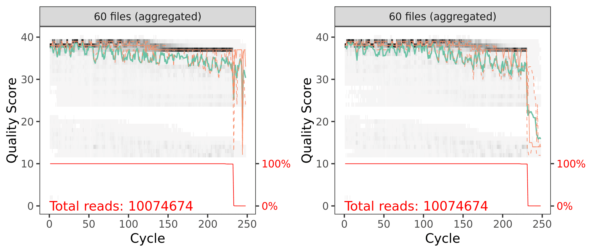
```
<small>`r caption_fig_ssu("cut_qual_scores_ssu_y4")`</small>

Now, for each sample, we can take a look at how primer removal affected the total number of raw reads.

```{r, echo=FALSE, eval=TRUE}
seq_table <- read.table("files/dada2/tables/ssu_cut_year_4.txt",
                       header = TRUE, sep = "\t")
```

<small>`r caption_tab_ssu("seq_cutadapt_ssu_y4")`</small>

```{r, echo=FALSE, layout="l-body-outset", eval=TRUE}
seq_table %>%
  download_this(
    output_name = "ssu_cutadapt_year_4",
    output_extension = ".csv",
    button_label = "Download data as csv file",
    button_type = "default",
    csv2 = FALSE,
    has_icon = TRUE,
    icon = "fa fa-save")

reactable(seq_table,
  defaultColDef = colDef(
    header = function(value) gsub("_", " ", value, fixed = TRUE),
    cell = function(value) format(value, nsmall = 1),
    align = "center", filterable = FALSE, sortable = TRUE, resizable = TRUE,
    footerStyle = list(fontWeight = "bold")
    ), 
  columns = list(
    Sample_ID = colDef(name = "Sample ID", 
                       sticky = "left", 
                       style = list(borderRight = "1px solid #eee"),
                       headerStyle = list(borderRight = "1px solid #eee"), 
                       align = "left",
                       minWidth = 150, footer = "Total reads", filterable = TRUE), 
    raw_reads = colDef(footer = function(values) sprintf("%.0f", sum(values))),
    pre_filt_reads = colDef(footer = function(values) sprintf("%.0f", sum(values))),
    cutadapt_reads = colDef(footer = function(values) sprintf("%.0f", sum(values)))
    ), 
  searchable = FALSE, defaultPageSize = 5, 
  pageSizeOptions = c(5, 10, nrow(seq_table)), 
  showPageSizeOptions = TRUE, highlight = TRUE, 
  bordered = TRUE, striped = TRUE, compact = FALSE, 
  wrap = FALSE, showSortable = TRUE, fullWidth = TRUE,
  theme = reactableTheme(style = list(fontSize = "0.8em")))
```
> [Back to top of this section](#remove-primers)

:::
:::
:::

# 2. Filtering, Error Correction, Dereplication

::: l-body
::: {.panelset}

::: {.panel}
## Year 0

We need the forward and reverse fastq file names and the sample names.

```{r}
cutFs <- sort(list.files(path.cut, pattern = "_R1.fastq.gz", full.names = TRUE))
cutRs <- sort(list.files(path.cut, pattern = "_R2.fastq.gz", full.names = TRUE))

get.sample.name <- function(fname) strsplit(basename(fname), "_")[[1]][1]
sample.names <- unname(sapply(cutFs, get.sample.name))
head(sample.names)
```

```{r, eval=TRUE}
c("AR-T220-5", "AR-T221-6", "AR-T222-7", "AR-T223-1", "S11-T22-1", "S11-T224-2")
```

First let's look at the quality of our reads. The numbers in brackets specify which samples to view. Here we are looking at an aggregate plot of all data (except the negative control)

### Filtering


```{r}
out <- filterAndTrim(cutFs, filtFs, cutRs, filtRs,  
                     maxN = 0, maxEE = 2, truncQ = 2, 
                     rm.phix = TRUE, compress = TRUE, 
                     trimRight = c(25,100), multithread = 20) 
out
```

<aside>
These parameters should be set based on the anticipated length of the amplicon and the read quality.
</aside>

And here is a table of how the filtering step affected the number of reads in each sample. As you can see, there are a few samples that started with a low read count to begin with---we will likely remove those samples at some point.

<br/>

```{r, echo=FALSE, eval=TRUE}
seq_table <- read.table("files/dada2/tables/ssu_filt_year_0.txt",
                       header = TRUE, sep = "\t")
```
<small>`r caption_tab_ssu("filter_ssu_y0")`</small>

```{r, echo=FALSE, layout="l-body", eval=TRUE}
seq_table %>%
  download_this(
    output_name = "ssu_filter_year_0",
    output_extension = ".csv",
    button_label = "Download data as csv file",
    button_type = "default",
    csv2 = FALSE,
    has_icon = TRUE,
    icon = "fa fa-save")

reactable(seq_table,
  defaultColDef = colDef(
    header = function(value) gsub("_", " ", value, fixed = TRUE),
    cell = function(value) format(value, nsmall = 1),
    align = "center", filterable = FALSE, sortable = TRUE, resizable = TRUE,
    footerStyle = list(fontWeight = "bold")
    ), 
  columns = list(
    Sample_ID = colDef(name = "Sample ID", 
                       sticky = "left", 
                       style = list(borderRight = "1px solid #eee"),
                       headerStyle = list(borderRight = "1px solid #eee"), 
                       align = "left",
                       minWidth = 150, footer = "Total reads", filterable = TRUE), 
    reads_in = colDef(footer = function(values) sprintf("%.0f", sum(values))),
    reads_out = colDef(footer = function(values) sprintf("%.0f", sum(values)))
    ), 
  searchable = FALSE, defaultPageSize = 5, 
  pageSizeOptions = c(5, 10, nrow(seq_table)), 
  showPageSizeOptions = TRUE, highlight = TRUE, 
  bordered = TRUE, striped = TRUE, compact = FALSE, 
  wrap = FALSE, showSortable = TRUE, fullWidth = TRUE,
  theme = reactableTheme(style = list(fontSize = "0.8em")))
```

```{r, layout="l-body-outset", warning=FALSE, fig.height=3}
p1 <- plotQualityProfile(filtFs[1:59], aggregate = TRUE)
p2 <- plotQualityProfile(filtRs[1:59], aggregate = TRUE)

p3 <- grid.arrange(p1, p2, nrow = 1)
ggsave("figures/ssu_post_filt_plot_qscores_year_0.png", p3, width = 7, height = 3)
```

```{r, echo=FALSE, eval=FALSE}
system("cp files/dada2/figures/ssu_post_filt_plot_qscores_year_0.png include/dada2/ssu_post_filt_plot_qscores_year_0.png")
```

```{r, echo=FALSE, layout="l-body", warning=FALSE, fig.height=4, fig.width=4, eval=TRUE}
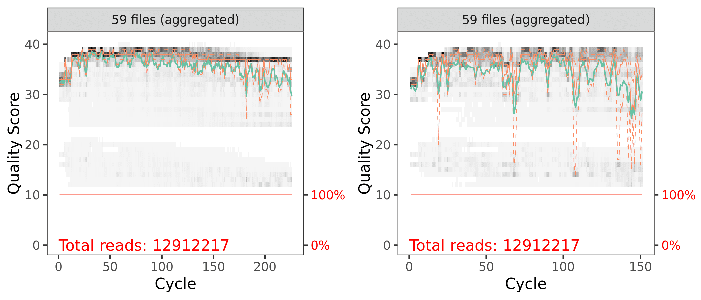
```
<small>`r caption_fig_ssu("filt_qual_scores_ssu_y0")`</small>

### Learn Error Rates

Now it is time to assess the error rate of the data. The DADA2 algorithm uses a parametric error model. Every amplicon data set has a different set of error rates and the `learnErrors` method learns this error model *from the data*. It does this by alternating estimation of the error rates and inference of sample composition until they converge on a jointly consistent solution. The algorithm begins with an initial guess, for which the maximum possible error rates in the data are used.

#### Forward Reads

```{r}
errF <- learnErrors(filtFs, multithread = TRUE)
```

```
137732536 total bases in 609436 reads from 3 samples will be used for learning the error rates.
```

```{r, warning=FALSE, layout="l-body-outset"}
plotErrors(errF, nominalQ=TRUE)
```

```{r}
p3 <- plotErrors(errF, nominalQ = TRUE)
ggsave("figures/ssu_plot_errorR_1_year_0.png", p3, width = 7, height = 5)
ggsave("figures/ssu_plot_errorR_1_year_0.png", p3)
```

```{r, echo=FALSE, eval=FALSE}
system("cp files/dada2/figures/ssu_plot_errorF_1_year_0.png include/dada2/ssu_plot_errorF_1_year_0.png")
```

```{r, echo=FALSE, layout="l-body-outset", eval=TRUE}
knitr::include_graphics("include/dada2/ssu_plot_errorF_1_year_0.png")
```
<small>`r caption_fig_ssu("error_F_ssu_y0")`</small>

#### Reverse Reads

```{r}
errR <- learnErrors(filtRs, multithread = TRUE)
```

```
134118226 total bases in 888206 reads from 4 samples will be used for learning the error rates.
```

```{r, warning=FALSE, layout="l-body-outset"}
plotErrors(errF, nominalQ=TRUE)
```

```{r}
p4 <- plotErrors(errR, nominalQ = TRUE)
ggsave("figures/ssu_plot_errorR_2_year_0.png", p4, width = 7, height = 5)
ggsave("figures/ssu_plot_errorR_2_year_0.png", p4)
```

```{r, echo=FALSE, eval=FALSE}
system("cp files/dada2/figures/ssu_plot_errorR_1_year_0.png include/dada2/ssu_plot_errorR_1_year_0.png")
```

```{r, echo=FALSE, layout="l-body-outset", eval=TRUE}
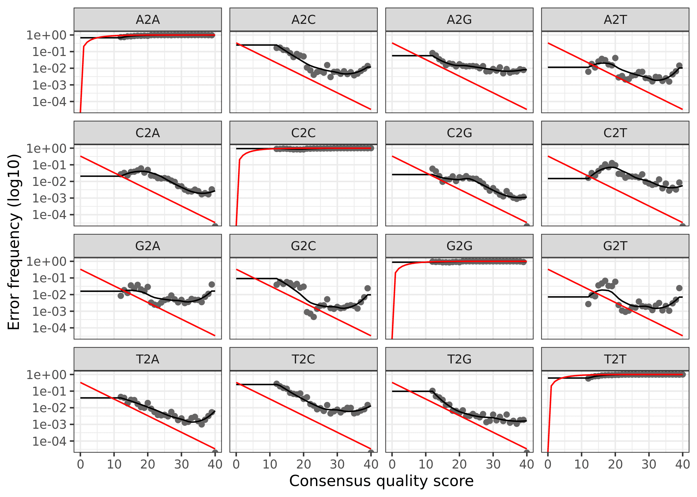
```
<small>`r caption_fig_ssu("error_R_ssu_y0")`</small>

The error rates for each possible transition (A to C, A to G, etc.) are shown. Points are the observed error rates for each consensus quality score. The black line shows the estimated error rates after convergence of the machine-learning algorithm. The red line shows the error rates expected under the nominal definition of the Q-score. Here the estimated error rates (black line) are a good fit to the observed rates (points), and the error rates drop with increased quality as expected.

### Dereplicate Reads

Now we can use `derepFastq` to identify the unique sequences in the forward and reverse fastq files.

```{r}
derepFs <- derepFastq(filtFs, verbose = TRUE)
derepRs <- derepFastq(filtRs, verbose = TRUE)
```

```{r}
names(derepFs) <- sample.names
names(derepRs) <- sample.names
```

<details markdown="1">
<summary>**Detailed results** of `derep` forward and reverse reads for Year 0</summary>
<pre><code>
Dereplicating sequence entries in Fastq file: RAW_Year_0/cutadapt/filtered/AR-T220-5_R1.fastq.gz
Encountered 101113 unique sequences from 196572 total sequences read.
Dereplicating sequence entries in Fastq file: RAW_Year_0/cutadapt/filtered/AR-T221-6_R1.fastq.gz
Encountered 96061 unique sequences from 188522 total sequences read.
Dereplicating sequence entries in Fastq file: RAW_Year_0/cutadapt/filtered/AR-T222-7_R1.fastq.gz
Encountered 114385 unique sequences from 224342 total sequences read.
Dereplicating sequence entries in Fastq file: RAW_Year_0/cutadapt/filtered/AR-T223-1_R1.fastq.gz
Encountered 147385 unique sequences from 278770 total sequences read.
Dereplicating sequence entries in Fastq file: RAW_Year_0/cutadapt/filtered/S11-T22-1_R1.fastq.gz
Encountered 83878 unique sequences from 151974 total sequences read.
Dereplicating sequence entries in Fastq file: RAW_Year_0/cutadapt/filtered/S11-T224-2_R1.fastq.gz
Encountered 96818 unique sequences from 188798 total sequences read.
Dereplicating sequence entries in Fastq file: RAW_Year_0/cutadapt/filtered/S11-T225-3_R1.fastq.gz
Encountered 70971 unique sequences from 139788 total sequences read.
Dereplicating sequence entries in Fastq file: RAW_Year_0/cutadapt/filtered/S11-T226-4_R1.fastq.gz
Encountered 234721 unique sequences from 430830 total sequences read.
Dereplicating sequence entries in Fastq file: RAW_Year_0/cutadapt/filtered/S14-T217-2_R1.fastq.gz
Encountered 108557 unique sequences from 222795 total sequences read.
Dereplicating sequence entries in Fastq file: RAW_Year_0/cutadapt/filtered/S14-T218-3_R1.fastq.gz
Encountered 100001 unique sequences from 188677 total sequences read.
Dereplicating sequence entries in Fastq file: RAW_Year_0/cutadapt/filtered/S14-T219-4_R1.fastq.gz
Encountered 90137 unique sequences from 170388 total sequences read.
Dereplicating sequence entries in Fastq file: RAW_Year_0/cutadapt/filtered/S14-T28-1_R1.fastq.gz
Encountered 134696 unique sequences from 260523 total sequences read.
Dereplicating sequence entries in Fastq file: RAW_Year_0/cutadapt/filtered/S16-T230-6_R1.fastq.gz
Encountered 118823 unique sequences from 226250 total sequences read.
Dereplicating sequence entries in Fastq file: RAW_Year_0/cutadapt/filtered/S16-T231-7_R1.fastq.gz
Encountered 102578 unique sequences from 195043 total sequences read.
Dereplicating sequence entries in Fastq file: RAW_Year_0/cutadapt/filtered/S16-T232-8_R1.fastq.gz
Encountered 91235 unique sequences from 179173 total sequences read.
Dereplicating sequence entries in Fastq file: RAW_Year_0/cutadapt/filtered/S16-T32-5_R1.fastq.gz
Encountered 277843 unique sequences from 511411 total sequences read.
Dereplicating sequence entries in Fastq file: RAW_Year_0/cutadapt/filtered/S17-T227-1_R1.fastq.gz
Encountered 65952 unique sequences from 123466 total sequences read.
Dereplicating sequence entries in Fastq file: RAW_Year_0/cutadapt/filtered/S17-T228-2_R1.fastq.gz
Encountered 118096 unique sequences from 204553 total sequences read.
Dereplicating sequence entries in Fastq file: RAW_Year_0/cutadapt/filtered/S17-T229-3_R1.fastq.gz
Encountered 118293 unique sequences from 208938 total sequences read.
Dereplicating sequence entries in Fastq file: RAW_Year_0/cutadapt/filtered/S17-T34-4_R1.fastq.gz
Encountered 120133 unique sequences from 214506 total sequences read.
Dereplicating sequence entries in Fastq file: RAW_Year_0/cutadapt/filtered/S30-T203-5_R1.fastq.gz
Encountered 71368 unique sequences from 135252 total sequences read.
Dereplicating sequence entries in Fastq file: RAW_Year_0/cutadapt/filtered/S30-T204-6_R1.fastq.gz
Encountered 92072 unique sequences from 188744 total sequences read.
Dereplicating sequence entries in Fastq file: RAW_Year_0/cutadapt/filtered/S30-T205-8_R1.fastq.gz
Encountered 177393 unique sequences from 342940 total sequences read.
Dereplicating sequence entries in Fastq file: RAW_Year_0/cutadapt/filtered/S30-T260-7_R1.fastq.gz
Encountered 66246 unique sequences from 128815 total sequences read.
Dereplicating sequence entries in Fastq file: RAW_Year_0/cutadapt/filtered/S31-T206-2_R1.fastq.gz
Encountered 89679 unique sequences from 178037 total sequences read.
Dereplicating sequence entries in Fastq file: RAW_Year_0/cutadapt/filtered/S31-T207-3_R1.fastq.gz
Encountered 100169 unique sequences from 199727 total sequences read.
Dereplicating sequence entries in Fastq file: RAW_Year_0/cutadapt/filtered/S31-T208-4_R1.fastq.gz
Encountered 106947 unique sequences from 211562 total sequences read.
Dereplicating sequence entries in Fastq file: RAW_Year_0/cutadapt/filtered/S31-T62-1_R1.fastq.gz
Encountered 149657 unique sequences from 295203 total sequences read.
Dereplicating sequence entries in Fastq file: RAW_Year_0/cutadapt/filtered/S33-T243-P-Yellow_R1.fastq.gz
Encountered 122457 unique sequences from 245916 total sequences read.
Dereplicating sequence entries in Fastq file: RAW_Year_0/cutadapt/filtered/S33-T244-9701_R1.fastq.gz
Encountered 93577 unique sequences from 186907 total sequences read.
Dereplicating sequence entries in Fastq file: RAW_Year_0/cutadapt/filtered/S33-T245-Yellow_R1.fastq.gz
Encountered 120274 unique sequences from 241730 total sequences read.
Dereplicating sequence entries in Fastq file: RAW_Year_0/cutadapt/filtered/S33-T66-Control_R1.fastq.gz
Encountered 258256 unique sequences from 489715 total sequences read.
Dereplicating sequence entries in Fastq file: RAW_Year_0/cutadapt/filtered/S41-T200-2_R1.fastq.gz
Encountered 148788 unique sequences from 274948 total sequences read.
Dereplicating sequence entries in Fastq file: RAW_Year_0/cutadapt/filtered/S41-T201-3_R1.fastq.gz
Encountered 70908 unique sequences from 147204 total sequences read.
Dereplicating sequence entries in Fastq file: RAW_Year_0/cutadapt/filtered/S41-T202-4_R1.fastq.gz
Encountered 154470 unique sequences from 287740 total sequences read.
Dereplicating sequence entries in Fastq file: RAW_Year_0/cutadapt/filtered/S41-T80_R1.fastq.gz
Encountered 80841 unique sequences from 157335 total sequences read.
Dereplicating sequence entries in Fastq file: RAW_Year_0/cutadapt/filtered/S66-T132-5_R1.fastq.gz
Encountered 141082 unique sequences from 276128 total sequences read.
Dereplicating sequence entries in Fastq file: RAW_Year_0/cutadapt/filtered/S66-T233-6_R1.fastq.gz
Encountered 84063 unique sequences from 157981 total sequences read.
Dereplicating sequence entries in Fastq file: RAW_Year_0/cutadapt/filtered/S66-T235-8_R1.fastq.gz
Encountered 78534 unique sequences from 153834 total sequences read.
Dereplicating sequence entries in Fastq file: RAW_Year_0/cutadapt/filtered/S69-T213-1_R1.fastq.gz
Encountered 86103 unique sequences from 167135 total sequences read.
Dereplicating sequence entries in Fastq file: RAW_Year_0/cutadapt/filtered/S69-T214-2_R1.fastq.gz
Encountered 83504 unique sequences from 164946 total sequences read.
Dereplicating sequence entries in Fastq file: RAW_Year_0/cutadapt/filtered/S69-T215-3_R1.fastq.gz
Encountered 73830 unique sequences from 144642 total sequences read.
Dereplicating sequence entries in Fastq file: RAW_Year_0/cutadapt/filtered/S69-T216-4_R1.fastq.gz
Encountered 97404 unique sequences from 197394 total sequences read.
Dereplicating sequence entries in Fastq file: RAW_Year_0/cutadapt/filtered/S7-240-Red-P_R1.fastq.gz
Encountered 117606 unique sequences from 234109 total sequences read.
Dereplicating sequence entries in Fastq file: RAW_Year_0/cutadapt/filtered/S7-T13-Control_R1.fastq.gz
Encountered 114011 unique sequences from 209222 total sequences read.
Dereplicating sequence entries in Fastq file: RAW_Year_0/cutadapt/filtered/S7-T241-Yellow_R1.fastq.gz
Encountered 112406 unique sequences from 232626 total sequences read.
Dereplicating sequence entries in Fastq file: RAW_Year_0/cutadapt/filtered/S7-T242-Nitrogen_R1.fastq.gz
Encountered 103200 unique sequences from 204246 total sequences read.
Dereplicating sequence entries in Fastq file: RAW_Year_0/cutadapt/filtered/S71-T236-1_R1.fastq.gz
Encountered 84852 unique sequences from 174479 total sequences read.
Dereplicating sequence entries in Fastq file: RAW_Year_0/cutadapt/filtered/S71-T237-2_R1.fastq.gz
Encountered 94149 unique sequences from 178994 total sequences read.
Dereplicating sequence entries in Fastq file: RAW_Year_0/cutadapt/filtered/S71-T238-3_R1.fastq.gz
Encountered 95993 unique sequences from 206800 total sequences read.
Dereplicating sequence entries in Fastq file: RAW_Year_0/cutadapt/filtered/S71-T239-4_R1.fastq.gz
Encountered 109585 unique sequences from 211947 total sequences read.
Dereplicating sequence entries in Fastq file: RAW_Year_0/cutadapt/filtered/S72-3-2nd-Closest_R1.fastq.gz
Encountered 132035 unique sequences from 263468 total sequences read.
Dereplicating sequence entries in Fastq file: RAW_Year_0/cutadapt/filtered/S72-Closest-4_R1.fastq.gz
Encountered 97945 unique sequences from 200072 total sequences read.
Dereplicating sequence entries in Fastq file: RAW_Year_0/cutadapt/filtered/S72-T-2nd-Farthest_R1.fastq.gz
Encountered 198416 unique sequences from 392079 total sequences read.
Dereplicating sequence entries in Fastq file: RAW_Year_0/cutadapt/filtered/ST72-T-Farthest-1_R1.fastq.gz
Encountered 105815 unique sequences from 198590 total sequences read.
Dereplicating sequence entries in Fastq file: RAW_Year_0/cutadapt/filtered/T209-5-Potrero_R1.fastq.gz
Encountered 114779 unique sequences from 238538 total sequences read.
Dereplicating sequence entries in Fastq file: RAW_Year_0/cutadapt/filtered/T210-6-Potrero_R1.fastq.gz
Encountered 82541 unique sequences from 156794 total sequences read.
Dereplicating sequence entries in Fastq file: RAW_Year_0/cutadapt/filtered/T211-7-Potrero_R1.fastq.gz
Encountered 87475 unique sequences from 179349 total sequences read.
Dereplicating sequence entries in Fastq file: RAW_Year_0/cutadapt/filtered/T212-8-Potrero_R1.fastq.gz
Encountered 73107 unique sequences from 151750 total sequences read.
Dereplicating sequence entries in Fastq file: RAW_Year_0/cutadapt/filtered/AR-T220-5_R2.fastq.gz
Encountered 98515 unique sequences from 196572 total sequences read.
Dereplicating sequence entries in Fastq file: RAW_Year_0/cutadapt/filtered/AR-T221-6_R2.fastq.gz
Encountered 98997 unique sequences from 188522 total sequences read.
Dereplicating sequence entries in Fastq file: RAW_Year_0/cutadapt/filtered/AR-T222-7_R2.fastq.gz
Encountered 117040 unique sequences from 224342 total sequences read.
Dereplicating sequence entries in Fastq file: RAW_Year_0/cutadapt/filtered/AR-T223-1_R2.fastq.gz
Encountered 148052 unique sequences from 278770 total sequences read.
Dereplicating sequence entries in Fastq file: RAW_Year_0/cutadapt/filtered/S11-T22-1_R2.fastq.gz
Encountered 86174 unique sequences from 151974 total sequences read.
Dereplicating sequence entries in Fastq file: RAW_Year_0/cutadapt/filtered/S11-T224-2_R2.fastq.gz
Encountered 93968 unique sequences from 188798 total sequences read.
Dereplicating sequence entries in Fastq file: RAW_Year_0/cutadapt/filtered/S11-T225-3_R2.fastq.gz
Encountered 74108 unique sequences from 139788 total sequences read.
Dereplicating sequence entries in Fastq file: RAW_Year_0/cutadapt/filtered/S11-T226-4_R2.fastq.gz
Encountered 224440 unique sequences from 430830 total sequences read.
Dereplicating sequence entries in Fastq file: RAW_Year_0/cutadapt/filtered/S14-T217-2_R2.fastq.gz
Encountered 109885 unique sequences from 222795 total sequences read.
Dereplicating sequence entries in Fastq file: RAW_Year_0/cutadapt/filtered/S14-T218-3_R2.fastq.gz
Encountered 105790 unique sequences from 188677 total sequences read.
Dereplicating sequence entries in Fastq file: RAW_Year_0/cutadapt/filtered/S14-T219-4_R2.fastq.gz
Encountered 95462 unique sequences from 170388 total sequences read.
Dereplicating sequence entries in Fastq file: RAW_Year_0/cutadapt/filtered/S14-T28-1_R2.fastq.gz
Encountered 136159 unique sequences from 260523 total sequences read.
Dereplicating sequence entries in Fastq file: RAW_Year_0/cutadapt/filtered/S16-T230-6_R2.fastq.gz
Encountered 118769 unique sequences from 226250 total sequences read.
Dereplicating sequence entries in Fastq file: RAW_Year_0/cutadapt/filtered/S16-T231-7_R2.fastq.gz
Encountered 108299 unique sequences from 195043 total sequences read.
Dereplicating sequence entries in Fastq file: RAW_Year_0/cutadapt/filtered/S16-T232-8_R2.fastq.gz
Encountered 89811 unique sequences from 179173 total sequences read.
Dereplicating sequence entries in Fastq file: RAW_Year_0/cutadapt/filtered/S16-T32-5_R2.fastq.gz
Encountered 270344 unique sequences from 511411 total sequences read.
Dereplicating sequence entries in Fastq file: RAW_Year_0/cutadapt/filtered/S17-T227-1_R2.fastq.gz
Encountered 66776 unique sequences from 123466 total sequences read.
Dereplicating sequence entries in Fastq file: RAW_Year_0/cutadapt/filtered/S17-T228-2_R2.fastq.gz
Encountered 116806 unique sequences from 204553 total sequences read.
Dereplicating sequence entries in Fastq file: RAW_Year_0/cutadapt/filtered/S17-T229-3_R2.fastq.gz
Encountered 126780 unique sequences from 208938 total sequences read.
Dereplicating sequence entries in Fastq file: RAW_Year_0/cutadapt/filtered/S17-T34-4_R2.fastq.gz
Encountered 120597 unique sequences from 214506 total sequences read.
Dereplicating sequence entries in Fastq file: RAW_Year_0/cutadapt/filtered/S30-T203-5_R2.fastq.gz
Encountered 74307 unique sequences from 135252 total sequences read.
Dereplicating sequence entries in Fastq file: RAW_Year_0/cutadapt/filtered/S30-T204-6_R2.fastq.gz
Encountered 86094 unique sequences from 188744 total sequences read.
Dereplicating sequence entries in Fastq file: RAW_Year_0/cutadapt/filtered/S30-T205-8_R2.fastq.gz
Encountered 186595 unique sequences from 342940 total sequences read.
Dereplicating sequence entries in Fastq file: RAW_Year_0/cutadapt/filtered/S30-T260-7_R2.fastq.gz
Encountered 66713 unique sequences from 128815 total sequences read.
Dereplicating sequence entries in Fastq file: RAW_Year_0/cutadapt/filtered/S31-T206-2_R2.fastq.gz
Encountered 84564 unique sequences from 178037 total sequences read.
Dereplicating sequence entries in Fastq file: RAW_Year_0/cutadapt/filtered/S31-T207-3_R2.fastq.gz
Encountered 98326 unique sequences from 199727 total sequences read.
Dereplicating sequence entries in Fastq file: RAW_Year_0/cutadapt/filtered/S31-T208-4_R2.fastq.gz
Encountered 103721 unique sequences from 211562 total sequences read.
Dereplicating sequence entries in Fastq file: RAW_Year_0/cutadapt/filtered/S31-T62-1_R2.fastq.gz
Encountered 143718 unique sequences from 295203 total sequences read.
Dereplicating sequence entries in Fastq file: RAW_Year_0/cutadapt/filtered/S33-T243-P-Yellow_R2.fastq.gz
Encountered 121030 unique sequences from 245916 total sequences read.
Dereplicating sequence entries in Fastq file: RAW_Year_0/cutadapt/filtered/S33-T244-9701_R2.fastq.gz
Encountered 94815 unique sequences from 186907 total sequences read.
Dereplicating sequence entries in Fastq file: RAW_Year_0/cutadapt/filtered/S33-T245-Yellow_R2.fastq.gz
Encountered 124992 unique sequences from 241730 total sequences read.
Dereplicating sequence entries in Fastq file: RAW_Year_0/cutadapt/filtered/S33-T66-Control_R2.fastq.gz
Encountered 239786 unique sequences from 489715 total sequences read.
Dereplicating sequence entries in Fastq file: RAW_Year_0/cutadapt/filtered/S41-T200-2_R2.fastq.gz
Encountered 143680 unique sequences from 274948 total sequences read.
Dereplicating sequence entries in Fastq file: RAW_Year_0/cutadapt/filtered/S41-T201-3_R2.fastq.gz
Encountered 69545 unique sequences from 147204 total sequences read.
Dereplicating sequence entries in Fastq file: RAW_Year_0/cutadapt/filtered/S41-T202-4_R2.fastq.gz
Encountered 154992 unique sequences from 287740 total sequences read.
Dereplicating sequence entries in Fastq file: RAW_Year_0/cutadapt/filtered/S41-T80_R2.fastq.gz
Encountered 81786 unique sequences from 157335 total sequences read.
Dereplicating sequence entries in Fastq file: RAW_Year_0/cutadapt/filtered/S66-T132-5_R2.fastq.gz
Encountered 145983 unique sequences from 276128 total sequences read.
Dereplicating sequence entries in Fastq file: RAW_Year_0/cutadapt/filtered/S66-T233-6_R2.fastq.gz
Encountered 84914 unique sequences from 157981 total sequences read.
Dereplicating sequence entries in Fastq file: RAW_Year_0/cutadapt/filtered/S66-T235-8_R2.fastq.gz
Encountered 78450 unique sequences from 153834 total sequences read.
Dereplicating sequence entries in Fastq file: RAW_Year_0/cutadapt/filtered/S69-T213-1_R2.fastq.gz
Encountered 87393 unique sequences from 167135 total sequences read.
Dereplicating sequence entries in Fastq file: RAW_Year_0/cutadapt/filtered/S69-T214-2_R2.fastq.gz
Encountered 82460 unique sequences from 164946 total sequences read.
Dereplicating sequence entries in Fastq file: RAW_Year_0/cutadapt/filtered/S69-T215-3_R2.fastq.gz
Encountered 75535 unique sequences from 144642 total sequences read.
Dereplicating sequence entries in Fastq file: RAW_Year_0/cutadapt/filtered/S69-T216-4_R2.fastq.gz
Encountered 96871 unique sequences from 197394 total sequences read.
Dereplicating sequence entries in Fastq file: RAW_Year_0/cutadapt/filtered/S7-240-Red-P_R2.fastq.gz
Encountered 114119 unique sequences from 234109 total sequences read.
Dereplicating sequence entries in Fastq file: RAW_Year_0/cutadapt/filtered/S7-T13-Control_R2.fastq.gz
Encountered 117087 unique sequences from 209222 total sequences read.
Dereplicating sequence entries in Fastq file: RAW_Year_0/cutadapt/filtered/S7-T241-Yellow_R2.fastq.gz
Encountered 112522 unique sequences from 232626 total sequences read.
Dereplicating sequence entries in Fastq file: RAW_Year_0/cutadapt/filtered/S7-T242-Nitrogen_R2.fastq.gz
Encountered 94870 unique sequences from 204246 total sequences read.
Dereplicating sequence entries in Fastq file: RAW_Year_0/cutadapt/filtered/S71-T236-1_R2.fastq.gz
Encountered 85044 unique sequences from 174479 total sequences read.
Dereplicating sequence entries in Fastq file: RAW_Year_0/cutadapt/filtered/S71-T237-2_R2.fastq.gz
Encountered 97950 unique sequences from 178994 total sequences read.
Dereplicating sequence entries in Fastq file: RAW_Year_0/cutadapt/filtered/S71-T238-3_R2.fastq.gz
Encountered 94345 unique sequences from 206800 total sequences read.
Dereplicating sequence entries in Fastq file: RAW_Year_0/cutadapt/filtered/S71-T239-4_R2.fastq.gz
Encountered 109480 unique sequences from 211947 total sequences read.
Dereplicating sequence entries in Fastq file: RAW_Year_0/cutadapt/filtered/S72-3-2nd-Closest_R2.fastq.gz
Encountered 129096 unique sequences from 263468 total sequences read.
Dereplicating sequence entries in Fastq file: RAW_Year_0/cutadapt/filtered/S72-Closest-4_R2.fastq.gz
Encountered 122780 unique sequences from 200072 total sequences read.
Dereplicating sequence entries in Fastq file: RAW_Year_0/cutadapt/filtered/S72-T-2nd-Farthest_R2.fastq.gz
Encountered 190447 unique sequences from 392079 total sequences read.
Dereplicating sequence entries in Fastq file: RAW_Year_0/cutadapt/filtered/ST72-T-Farthest-1_R2.fastq.gz
Encountered 105184 unique sequences from 198590 total sequences read.
Dereplicating sequence entries in Fastq file: RAW_Year_0/cutadapt/filtered/T209-5-Potrero_R2.fastq.gz
Encountered 115688 unique sequences from 238538 total sequences read.
Dereplicating sequence entries in Fastq file: RAW_Year_0/cutadapt/filtered/T210-6-Potrero_R2.fastq.gz
Encountered 85224 unique sequences from 156794 total sequences read.
Dereplicating sequence entries in Fastq file: RAW_Year_0/cutadapt/filtered/T211-7-Potrero_R2.fastq.gz
Encountered 95645 unique sequences from 179349 total sequences read.
Dereplicating sequence entries in Fastq file: RAW_Year_0/cutadapt/filtered/T212-8-Potrero_R2.fastq.gz
Encountered 75551 unique sequences from 151750 total sequences read.
</code></pre>
</details>
> [Back to top of this section](#filtering-error-correction-dereplication)

:::

::: {.panel}
## Year 1

We need the forward and reverse fastq file names and the sample names.

```{r}
cutFs <- sort(list.files(path.cut, pattern = "_R1.fastq.gz", full.names = TRUE))
cutRs <- sort(list.files(path.cut, pattern = "_R2.fastq.gz", full.names = TRUE))

get.sample.name <- function(fname) strsplit(basename(fname), "_")[[1]][1]
sample.names <- unname(sapply(cutFs, get.sample.name))
head(sample.names)
```

```{r, eval=TRUE}
c("S11-T22", "S11-T224", "S11-T225", "S11-T226", "S14-T217", "S14-T218")
```

### Filtering

```{r}
out <- filterAndTrim(cutFs, filtFs, cutRs, filtRs,  
                     maxN = 0, maxEE = 2, truncQ = 2, 
                     rm.phix = TRUE, compress = TRUE, 
                     trimRight = c(0,30), multithread = 20) 
out
```

And here is a table of how the filtering step affected the number of reads in each sample. As you can see, there are a few samples that started with a low read count to begin with---we will likely remove those samples at some point.

<br/>

```{r, echo=FALSE, eval=TRUE}
seq_table <- read.table("files/dada2/tables/ssu_filt_year_1.txt",
                       header = TRUE, sep = "\t")
```
<small>`r caption_tab_ssu("filter_ssu_y1")`</small>

```{r, echo=FALSE, layout="l-body", eval=TRUE}
seq_table %>%
  download_this(
    output_name = "ssu_filter_year_1",
    output_extension = ".csv",
    button_label = "Download data as csv file",
    button_type = "default",
    csv2 = FALSE,
    has_icon = TRUE,
    icon = "fa fa-save")

reactable(seq_table,
  defaultColDef = colDef(
    header = function(value) gsub("_", " ", value, fixed = TRUE),
    cell = function(value) format(value, nsmall = 1),
    align = "center", filterable = FALSE, sortable = TRUE, resizable = TRUE,
    footerStyle = list(fontWeight = "bold")
    ), 
  columns = list(
    Sample_ID = colDef(name = "Sample ID", 
                       sticky = "left", 
                       style = list(borderRight = "1px solid #eee"),
                       headerStyle = list(borderRight = "1px solid #eee"), 
                       align = "left",
                       minWidth = 150, footer = "Total reads", filterable = TRUE), 
    reads_in = colDef(footer = function(values) sprintf("%.0f", sum(values))),
    reads_out = colDef(footer = function(values) sprintf("%.0f", sum(values)))
    ), 
  searchable = FALSE, defaultPageSize = 5, 
  pageSizeOptions = c(5, 10, nrow(seq_table)), 
  showPageSizeOptions = TRUE, highlight = TRUE, 
  bordered = TRUE, striped = TRUE, compact = FALSE, 
  wrap = FALSE, showSortable = TRUE, fullWidth = TRUE,
  theme = reactableTheme(style = list(fontSize = "0.8em")))
```

```{r, layout="l-body-outset", warning=FALSE, fig.height=3}
p1 <- plotQualityProfile(filtFs[1:50], aggregate = TRUE)
p2 <- plotQualityProfile(filtRs[1:50], aggregate = TRUE)

p3 <- grid.arrange(p1, p2, nrow = 1)
ggsave("figures/ssu_post_filt_plot_qscores_year_1.png", p3, width = 7, height = 3)
```

```{r, echo=FALSE, eval=FALSE}
system("cp files/dada2/figures/ssu_post_filt_plot_qscores_year_1.png include/dada2/ssu_post_filt_plot_qscores_year_1.png")
```

```{r, echo=FALSE, layout="l-body", warning=FALSE, fig.height=4, fig.width=4, eval=TRUE}
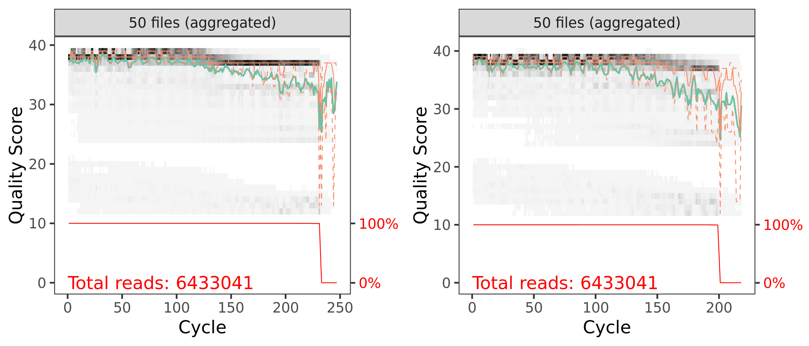
```
<small>`r caption_fig_ssu("filt_qual_scores_ssu_y1")`</small>

### Learn Error Rates

Now it is time to assess the error rate of the data. The DADA2 algorithm uses a parametric error model. Every amplicon data set has a different set of error rates and the `learnErrors` method learns this error model *from the data*. It does this by alternating estimation of the error rates and inference of sample composition until they converge on a jointly consistent solution. The algorithm begins with an initial guess, for which the maximum possible error rates in the data are used.

#### Forward Reads

```{r}
errF <- learnErrors(filtFs, multithread = TRUE)
```

```
104657172 total bases in 453084 reads from 3 samples will be used for learning the error rates.
```

```{r, warning=FALSE, layout="l-body-outset"}
plotErrors(errF, nominalQ=TRUE)
```

```{r}
p3 <- plotErrors(errF, nominalQ = TRUE)
ggsave("figures/ssu_plot_errorR_1_year_1.png", p3, width = 7, height = 5)
ggsave("figures/ssu_plot_errorR_1_year_1.png", p3)
```

```{r, echo=FALSE, eval=FALSE}
system("cp files/dada2/figures/ssu_plot_errorF_1_year_1.png include/dada2/ssu_plot_errorF_1_year_1.png")
```

```{r, echo=FALSE, layout="l-body-outset", eval=TRUE}
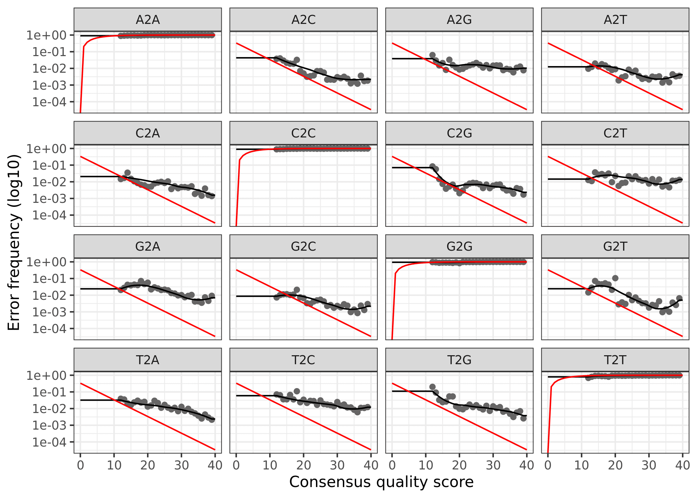
```
<small>`r caption_fig_ssu("error_F_ssu_y1")`</small>


#### Reverse Reads

```{r}
errR <- learnErrors(filtRs, multithread = TRUE)
```

```
120581701 total bases in 606056 reads from 4 samples will be used for learning the error rates.
```

```{r, warning=FALSE, layout="l-body-outset"}
plotErrors(errF, nominalQ=TRUE)
```

```{r}
p4 <- plotErrors(errR, nominalQ = TRUE)
ggsave("figures/ssu_plot_errorR_2_year_1.png", p4, width = 7, height = 5)
ggsave("figures/ssu_plot_errorR_2_year_1.png", p4)
```

```{r, echo=FALSE, eval=FALSE}
system("cp files/dada2/figures/ssu_plot_errorR_1_year_1.png include/dada2/ssu_plot_errorR_1_year_1.png")
```

```{r, echo=FALSE, layout="l-body-outset", eval=TRUE}
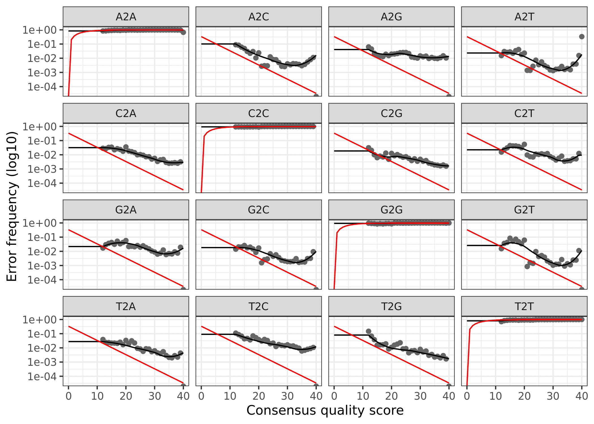
```
<small>`r caption_fig_ssu("error_R_ssu_y1")`</small>

The error rates for each possible transition (A to C, A to G, etc.) are shown. Points are the observed error rates for each consensus quality score. The black line shows the estimated error rates after convergence of the machine-learning algorithm. The red line shows the error rates expected under the nominal definition of the Q-score. Here the estimated error rates (black line) are a good fit to the observed rates (points), and the error rates drop with increased quality as expected.

### Dereplicate Reads

Now we can use `derepFastq` to identify the unique sequences in the forward and reverse fastq files.

#### Forward Reads

```{r}
derepFs <- derepFastq(filtFs, verbose = TRUE)
derepRs <- derepFastq(filtRs, verbose = TRUE)
```

```{r}
names(derepFs) <- sample.names
names(derepRs) <- sample.names
```

<details markdown="1">
<summary>**Detailed results** of `derep` forward and reverse reads for Year 1</summary>
<pre><code>
Dereplicating sequence entries in Fastq file: RAW_Year_1/cutadapt/filtered/S11-T22_R1.fastq.gz
Encountered 70839 unique sequences from 145657 total sequences read.
Dereplicating sequence entries in Fastq file: RAW_Year_1/cutadapt/filtered/S11-T224_R1.fastq.gz
Encountered 74744 unique sequences from 152698 total sequences read.
Dereplicating sequence entries in Fastq file: RAW_Year_1/cutadapt/filtered/S11-T225_R1.fastq.gz
Encountered 75132 unique sequences from 154729 total sequences read.
Dereplicating sequence entries in Fastq file: RAW_Year_1/cutadapt/filtered/S11-T226_R1.fastq.gz
Encountered 73860 unique sequences from 152972 total sequences read.
Dereplicating sequence entries in Fastq file: RAW_Year_1/cutadapt/filtered/S14-T217_R1.fastq.gz
Encountered 69903 unique sequences from 149688 total sequences read.
Dereplicating sequence entries in Fastq file: RAW_Year_1/cutadapt/filtered/S14-T218_R1.fastq.gz
Encountered 65748 unique sequences from 137733 total sequences read.
Dereplicating sequence entries in Fastq file: RAW_Year_1/cutadapt/filtered/S14-T219_R1.fastq.gz
Encountered 7952 unique sequences from 13252 total sequences read.
Dereplicating sequence entries in Fastq file: RAW_Year_1/cutadapt/filtered/S14-T28_R1.fastq.gz
Encountered 63669 unique sequences from 138246 total sequences read.
Dereplicating sequence entries in Fastq file: RAW_Year_1/cutadapt/filtered/S16-T230_R1.fastq.gz
Encountered 53731 unique sequences from 114932 total sequences read.
Dereplicating sequence entries in Fastq file: RAW_Year_1/cutadapt/filtered/S16-T231_R1.fastq.gz
Encountered 64864 unique sequences from 142059 total sequences read.
Dereplicating sequence entries in Fastq file: RAW_Year_1/cutadapt/filtered/S16-T232_R1.fastq.gz
Encountered 40690 unique sequences from 86428 total sequences read.
Dereplicating sequence entries in Fastq file: RAW_Year_1/cutadapt/filtered/S16-T32_R1.fastq.gz
Encountered 66734 unique sequences from 148188 total sequences read.
Dereplicating sequence entries in Fastq file: RAW_Year_1/cutadapt/filtered/S17-T227_R1.fastq.gz
Encountered 73752 unique sequences from 142743 total sequences read.
Dereplicating sequence entries in Fastq file: RAW_Year_1/cutadapt/filtered/S17-T228_R1.fastq.gz
Encountered 53656 unique sequences from 102566 total sequences read.
Dereplicating sequence entries in Fastq file: RAW_Year_1/cutadapt/filtered/S17-T229_R1.fastq.gz
Encountered 68212 unique sequences from 134330 total sequences read.
Dereplicating sequence entries in Fastq file: RAW_Year_1/cutadapt/filtered/S17-T34_R1.fastq.gz
Encountered 79598 unique sequences from 153596 total sequences read.
Dereplicating sequence entries in Fastq file: RAW_Year_1/cutadapt/filtered/S30-T203_R1.fastq.gz
Encountered 76513 unique sequences from 160140 total sequences read.
Dereplicating sequence entries in Fastq file: RAW_Year_1/cutadapt/filtered/S30-T204_R1.fastq.gz
Encountered 16928 unique sequences from 29530 total sequences read.
Dereplicating sequence entries in Fastq file: RAW_Year_1/cutadapt/filtered/S30-T205_R1.fastq.gz
Encountered 70206 unique sequences from 143221 total sequences read.
Dereplicating sequence entries in Fastq file: RAW_Year_1/cutadapt/filtered/S31-T206_R1.fastq.gz
Encountered 69192 unique sequences from 142205 total sequences read.
Dereplicating sequence entries in Fastq file: RAW_Year_1/cutadapt/filtered/S31-T208_R1.fastq.gz
Encountered 19266 unique sequences from 34435 total sequences read.
Dereplicating sequence entries in Fastq file: RAW_Year_1/cutadapt/filtered/S31-T62_R1.fastq.gz
Encountered 36008 unique sequences from 71750 total sequences read.
Dereplicating sequence entries in Fastq file: RAW_Year_1/cutadapt/filtered/S33-T243_R1.fastq.gz
Encountered 65944 unique sequences from 131874 total sequences read.
Dereplicating sequence entries in Fastq file: RAW_Year_1/cutadapt/filtered/S33-T244_R1.fastq.gz
Encountered 68109 unique sequences from 152761 total sequences read.
Dereplicating sequence entries in Fastq file: RAW_Year_1/cutadapt/filtered/S33-T245_R1.fastq.gz
Encountered 76930 unique sequences from 161076 total sequences read.
Dereplicating sequence entries in Fastq file: RAW_Year_1/cutadapt/filtered/S33-T66_R1.fastq.gz
Encountered 55254 unique sequences from 115384 total sequences read.
Dereplicating sequence entries in Fastq file: RAW_Year_1/cutadapt/filtered/S41-T201_R1.fastq.gz
Encountered 70568 unique sequences from 162485 total sequences read.
Dereplicating sequence entries in Fastq file: RAW_Year_1/cutadapt/filtered/S41-T202_R1.fastq.gz
Encountered 64550 unique sequences from 138425 total sequences read.
Dereplicating sequence entries in Fastq file: RAW_Year_1/cutadapt/filtered/S41-T81_R1.fastq.gz
Encountered 68766 unique sequences from 143577 total sequences read.
Dereplicating sequence entries in Fastq file: RAW_Year_1/cutadapt/filtered/S66-T233_R1.fastq.gz
Encountered 44623 unique sequences from 93932 total sequences read.
Dereplicating sequence entries in Fastq file: RAW_Year_1/cutadapt/filtered/S66-T234_R1.fastq.gz
Encountered 74539 unique sequences from 157038 total sequences read.
Dereplicating sequence entries in Fastq file: RAW_Year_1/cutadapt/filtered/S68-T209_R1.fastq.gz
Encountered 83429 unique sequences from 188836 total sequences read.
Dereplicating sequence entries in Fastq file: RAW_Year_1/cutadapt/filtered/S68-T210_R1.fastq.gz
Encountered 63315 unique sequences from 147694 total sequences read.
Dereplicating sequence entries in Fastq file: RAW_Year_1/cutadapt/filtered/S68-T212_R1.fastq.gz
Encountered 59675 unique sequences from 138163 total sequences read.
Dereplicating sequence entries in Fastq file: RAW_Year_1/cutadapt/filtered/S69-T213_R1.fastq.gz
Encountered 65238 unique sequences from 145005 total sequences read.
Dereplicating sequence entries in Fastq file: RAW_Year_1/cutadapt/filtered/S69-T216_R1.fastq.gz
Encountered 63259 unique sequences from 145401 total sequences read.
Dereplicating sequence entries in Fastq file: RAW_Year_1/cutadapt/filtered/S7-T13_R1.fastq.gz
Encountered 65484 unique sequences from 134998 total sequences read.
Dereplicating sequence entries in Fastq file: RAW_Year_1/cutadapt/filtered/S7-T240_R1.fastq.gz
Encountered 82027 unique sequences from 163737 total sequences read.
Dereplicating sequence entries in Fastq file: RAW_Year_1/cutadapt/filtered/S7-T241_R1.fastq.gz
Encountered 65873 unique sequences from 134518 total sequences read.
Dereplicating sequence entries in Fastq file: RAW_Year_1/cutadapt/filtered/S7-T242_R1.fastq.gz
Encountered 78595 unique sequences from 158073 total sequences read.
Dereplicating sequence entries in Fastq file: RAW_Year_1/cutadapt/filtered/S70-T220_R1.fastq.gz
Encountered 54575 unique sequences from 124961 total sequences read.
Dereplicating sequence entries in Fastq file: RAW_Year_1/cutadapt/filtered/S70-T221_R1.fastq.gz
Encountered 13313 unique sequences from 26666 total sequences read.
Dereplicating sequence entries in Fastq file: RAW_Year_1/cutadapt/filtered/S70-T222_R1.fastq.gz
Encountered 40272 unique sequences from 89418 total sequences read.
Dereplicating sequence entries in Fastq file: RAW_Year_1/cutadapt/filtered/S70-T223_R1.fastq.gz
Encountered 57563 unique sequences from 127644 total sequences read.
Dereplicating sequence entries in Fastq file: RAW_Year_1/cutadapt/filtered/S71-T236_R1.fastq.gz
Encountered 65000 unique sequences from 161410 total sequences read.
Dereplicating sequence entries in Fastq file: RAW_Year_1/cutadapt/filtered/S71-T237_R1.fastq.gz
Encountered 62261 unique sequences from 145092 total sequences read.
Dereplicating sequence entries in Fastq file: RAW_Year_1/cutadapt/filtered/S71-T238_R1.fastq.gz
Encountered 58811 unique sequences from 132677 total sequences read.
Dereplicating sequence entries in Fastq file: RAW_Year_1/cutadapt/filtered/S71-T239_R1.fastq.gz
Encountered 72747 unique sequences from 158589 total sequences read.
Dereplicating sequence entries in Fastq file: RAW_Year_1/cutadapt/filtered/S72-T246_R1.fastq.gz
Encountered 62647 unique sequences from 135385 total sequences read.
Dereplicating sequence entries in Fastq file: RAW_Year_1/cutadapt/filtered/S72-T247_R1.fastq.gz
Encountered 33861 unique sequences from 67124 total sequences read.
Dereplicating sequence entries in Fastq file: RAW_Year_1/cutadapt/filtered/S11-T22_R2.fastq.gz
Encountered 69490 unique sequences from 145657 total sequences read.
Dereplicating sequence entries in Fastq file: RAW_Year_1/cutadapt/filtered/S11-T224_R2.fastq.gz
Encountered 72933 unique sequences from 152698 total sequences read.
Dereplicating sequence entries in Fastq file: RAW_Year_1/cutadapt/filtered/S11-T225_R2.fastq.gz
Encountered 73916 unique sequences from 154729 total sequences read.
Dereplicating sequence entries in Fastq file: RAW_Year_1/cutadapt/filtered/S11-T226_R2.fastq.gz
Encountered 74552 unique sequences from 152972 total sequences read.
Dereplicating sequence entries in Fastq file: RAW_Year_1/cutadapt/filtered/S14-T217_R2.fastq.gz
Encountered 68650 unique sequences from 149688 total sequences read.
Dereplicating sequence entries in Fastq file: RAW_Year_1/cutadapt/filtered/S14-T218_R2.fastq.gz
Encountered 66133 unique sequences from 137733 total sequences read.
Dereplicating sequence entries in Fastq file: RAW_Year_1/cutadapt/filtered/S14-T219_R2.fastq.gz
Encountered 8061 unique sequences from 13252 total sequences read.
Dereplicating sequence entries in Fastq file: RAW_Year_1/cutadapt/filtered/S14-T28_R2.fastq.gz
Encountered 63109 unique sequences from 138246 total sequences read.
Dereplicating sequence entries in Fastq file: RAW_Year_1/cutadapt/filtered/S16-T230_R2.fastq.gz
Encountered 55271 unique sequences from 114932 total sequences read.
Dereplicating sequence entries in Fastq file: RAW_Year_1/cutadapt/filtered/S16-T231_R2.fastq.gz
Encountered 65667 unique sequences from 142059 total sequences read.
Dereplicating sequence entries in Fastq file: RAW_Year_1/cutadapt/filtered/S16-T232_R2.fastq.gz
Encountered 42244 unique sequences from 86428 total sequences read.
Dereplicating sequence entries in Fastq file: RAW_Year_1/cutadapt/filtered/S16-T32_R2.fastq.gz
Encountered 68593 unique sequences from 148188 total sequences read.
Dereplicating sequence entries in Fastq file: RAW_Year_1/cutadapt/filtered/S17-T227_R2.fastq.gz
Encountered 71173 unique sequences from 142743 total sequences read.
Dereplicating sequence entries in Fastq file: RAW_Year_1/cutadapt/filtered/S17-T228_R2.fastq.gz
Encountered 51614 unique sequences from 102566 total sequences read.
Dereplicating sequence entries in Fastq file: RAW_Year_1/cutadapt/filtered/S17-T229_R2.fastq.gz
Encountered 64785 unique sequences from 134330 total sequences read.
Dereplicating sequence entries in Fastq file: RAW_Year_1/cutadapt/filtered/S17-T34_R2.fastq.gz
Encountered 75889 unique sequences from 153596 total sequences read.
Dereplicating sequence entries in Fastq file: RAW_Year_1/cutadapt/filtered/S30-T203_R2.fastq.gz
Encountered 74900 unique sequences from 160140 total sequences read.
Dereplicating sequence entries in Fastq file: RAW_Year_1/cutadapt/filtered/S30-T204_R2.fastq.gz
Encountered 16240 unique sequences from 29530 total sequences read.
Dereplicating sequence entries in Fastq file: RAW_Year_1/cutadapt/filtered/S30-T205_R2.fastq.gz
Encountered 69582 unique sequences from 143221 total sequences read.
Dereplicating sequence entries in Fastq file: RAW_Year_1/cutadapt/filtered/S31-T206_R2.fastq.gz
Encountered 65509 unique sequences from 142205 total sequences read.
Dereplicating sequence entries in Fastq file: RAW_Year_1/cutadapt/filtered/S31-T208_R2.fastq.gz
Encountered 18038 unique sequences from 34435 total sequences read.
Dereplicating sequence entries in Fastq file: RAW_Year_1/cutadapt/filtered/S31-T62_R2.fastq.gz
Encountered 33432 unique sequences from 71750 total sequences read.
Dereplicating sequence entries in Fastq file: RAW_Year_1/cutadapt/filtered/S33-T243_R2.fastq.gz
Encountered 63329 unique sequences from 131874 total sequences read.
Dereplicating sequence entries in Fastq file: RAW_Year_1/cutadapt/filtered/S33-T244_R2.fastq.gz
Encountered 65398 unique sequences from 152761 total sequences read.
Dereplicating sequence entries in Fastq file: RAW_Year_1/cutadapt/filtered/S33-T245_R2.fastq.gz
Encountered 73856 unique sequences from 161076 total sequences read.
Dereplicating sequence entries in Fastq file: RAW_Year_1/cutadapt/filtered/S33-T66_R2.fastq.gz
Encountered 51971 unique sequences from 115384 total sequences read.
Dereplicating sequence entries in Fastq file: RAW_Year_1/cutadapt/filtered/S41-T201_R2.fastq.gz
Encountered 81476 unique sequences from 162485 total sequences read.
Dereplicating sequence entries in Fastq file: RAW_Year_1/cutadapt/filtered/S41-T202_R2.fastq.gz
Encountered 74797 unique sequences from 138425 total sequences read.
Dereplicating sequence entries in Fastq file: RAW_Year_1/cutadapt/filtered/S41-T81_R2.fastq.gz
Encountered 67444 unique sequences from 143577 total sequences read.
Dereplicating sequence entries in Fastq file: RAW_Year_1/cutadapt/filtered/S66-T233_R2.fastq.gz
Encountered 46951 unique sequences from 93932 total sequences read.
Dereplicating sequence entries in Fastq file: RAW_Year_1/cutadapt/filtered/S66-T234_R2.fastq.gz
Encountered 72298 unique sequences from 157038 total sequences read.
Dereplicating sequence entries in Fastq file: RAW_Year_1/cutadapt/filtered/S68-T209_R2.fastq.gz
Encountered 82497 unique sequences from 188836 total sequences read.
Dereplicating sequence entries in Fastq file: RAW_Year_1/cutadapt/filtered/S68-T210_R2.fastq.gz
Encountered 65250 unique sequences from 147694 total sequences read.
Dereplicating sequence entries in Fastq file: RAW_Year_1/cutadapt/filtered/S68-T212_R2.fastq.gz
Encountered 60126 unique sequences from 138163 total sequences read.
Dereplicating sequence entries in Fastq file: RAW_Year_1/cutadapt/filtered/S69-T213_R2.fastq.gz
Encountered 64467 unique sequences from 145005 total sequences read.
Dereplicating sequence entries in Fastq file: RAW_Year_1/cutadapt/filtered/S69-T216_R2.fastq.gz
Encountered 62335 unique sequences from 145401 total sequences read.
Dereplicating sequence entries in Fastq file: RAW_Year_1/cutadapt/filtered/S7-T13_R2.fastq.gz
Encountered 64745 unique sequences from 134998 total sequences read.
Dereplicating sequence entries in Fastq file: RAW_Year_1/cutadapt/filtered/S7-T240_R2.fastq.gz
Encountered 78904 unique sequences from 163737 total sequences read.
Dereplicating sequence entries in Fastq file: RAW_Year_1/cutadapt/filtered/S7-T241_R2.fastq.gz
Encountered 62693 unique sequences from 134518 total sequences read.
Dereplicating sequence entries in Fastq file: RAW_Year_1/cutadapt/filtered/S7-T242_R2.fastq.gz
Encountered 73661 unique sequences from 158073 total sequences read.
Dereplicating sequence entries in Fastq file: RAW_Year_1/cutadapt/filtered/S70-T220_R2.fastq.gz
Encountered 55200 unique sequences from 124961 total sequences read.
Dereplicating sequence entries in Fastq file: RAW_Year_1/cutadapt/filtered/S70-T221_R2.fastq.gz
Encountered 13278 unique sequences from 26666 total sequences read.
Dereplicating sequence entries in Fastq file: RAW_Year_1/cutadapt/filtered/S70-T222_R2.fastq.gz
Encountered 41814 unique sequences from 89418 total sequences read.
Dereplicating sequence entries in Fastq file: RAW_Year_1/cutadapt/filtered/S70-T223_R2.fastq.gz
Encountered 58843 unique sequences from 127644 total sequences read.
Dereplicating sequence entries in Fastq file: RAW_Year_1/cutadapt/filtered/S71-T236_R2.fastq.gz
Encountered 65451 unique sequences from 161410 total sequences read.
Dereplicating sequence entries in Fastq file: RAW_Year_1/cutadapt/filtered/S71-T237_R2.fastq.gz
Encountered 63731 unique sequences from 145092 total sequences read.
Dereplicating sequence entries in Fastq file: RAW_Year_1/cutadapt/filtered/S71-T238_R2.fastq.gz
Encountered 61706 unique sequences from 132677 total sequences read.
Dereplicating sequence entries in Fastq file: RAW_Year_1/cutadapt/filtered/S71-T239_R2.fastq.gz
Encountered 73739 unique sequences from 158589 total sequences read.
Dereplicating sequence entries in Fastq file: RAW_Year_1/cutadapt/filtered/S72-T246_R2.fastq.gz
Encountered 63563 unique sequences from 135385 total sequences read.
Dereplicating sequence entries in Fastq file: RAW_Year_1/cutadapt/filtered/S72-T247_R2.fastq.gz
Encountered 34304 unique sequences from 67124 total sequences read.
</code></pre>
</details>
> [Back to top of this section](#filtering-error-correction-dereplication)

:::

::: {.panel}
## Year 4

We need the forward and reverse fastq file names and the sample names.

```{r}
cutFs <- sort(list.files(path.cut, pattern = "_R1.fastq.gz", full.names = TRUE))
cutRs <- sort(list.files(path.cut, pattern = "_R2.fastq.gz", full.names = TRUE))

get.sample.name <- function(fname) strsplit(basename(fname), "_")[[1]][1]
sample.names <- unname(sapply(cutFs, get.sample.name))
head(sample.names)
```

```{r, eval=TRUE}
c("04-1",  "04-10", "04-11", "04-12", "04-13", "04-14")
```

### Filtering

```{r}
out <- filterAndTrim(cutFs, filtFs, cutRs, filtRs,  
                     maxN = 0, maxEE = 2, 
                     truncQ = 2, rm.phix = TRUE, 
                     compress = TRUE, multithread = 20) 
out
```


And here is a table of how the filtering step affected the number of reads in each sample. As you can see, there are a few samples that started with a low read count to begin with---we will likely remove those samples at some point.

<br/>

```{r, echo=FALSE, eval=TRUE}
seq_table <- read.table("files/dada2/tables/ssu_filt_year_4.txt",
                       header = TRUE, sep = "\t")
```
<small>`r caption_tab_ssu("filter_ssu_y4")`</small>

```{r, echo=FALSE, layout="l-body", eval=TRUE}
seq_table %>%
  download_this(
    output_name = "ssu_filter_year_4",
    output_extension = ".csv",
    button_label = "Download data as csv file",
    button_type = "default",
    csv2 = FALSE,
    has_icon = TRUE,
    icon = "fa fa-save")

reactable(seq_table,
  defaultColDef = colDef(
    header = function(value) gsub("_", " ", value, fixed = TRUE),
    cell = function(value) format(value, nsmall = 1),
    align = "center", filterable = FALSE, sortable = TRUE, resizable = TRUE,
    footerStyle = list(fontWeight = "bold")
    ), 
  columns = list(
    Sample_ID = colDef(name = "Sample ID", 
                       sticky = "left", 
                       style = list(borderRight = "1px solid #eee"),
                       headerStyle = list(borderRight = "1px solid #eee"), 
                       align = "left",
                       minWidth = 150, footer = "Total reads", filterable = TRUE), 
    reads_in = colDef(footer = function(values) sprintf("%.0f", sum(values))),
    reads_out = colDef(footer = function(values) sprintf("%.0f", sum(values)))
    ), 
  searchable = FALSE, defaultPageSize = 5, 
  pageSizeOptions = c(5, 10, nrow(seq_table)), 
  showPageSizeOptions = TRUE, highlight = TRUE, 
  bordered = TRUE, striped = TRUE, compact = FALSE, 
  wrap = FALSE, showSortable = TRUE, fullWidth = TRUE,
  theme = reactableTheme(style = list(fontSize = "0.8em")))
```

```{r, layout="l-body-outset", warning=FALSE, fig.height=3}
p1 <- plotQualityProfile(filtFs[1:60], aggregate = TRUE)
p2 <- plotQualityProfile(filtRs[1:60], aggregate = TRUE)

p3 <- grid.arrange(p1, p2, nrow = 1)
ggsave("figures/ssu_post_filt_plot_qscores_year_4.png", p3, width = 7, height = 3)
```

```{r, echo=FALSE, eval=FALSE}
system("cp files/dada2/figures/ssu_post_filt_plot_qscores_year_4.png include/dada2/ssu_post_filt_plot_qscores_year_4.png")
```

```{r, echo=FALSE, layout="l-body", warning=FALSE, fig.height=4, fig.width=4, eval=TRUE}
knitr::include_graphics("include/dada2/ssu_post_filt_plot_qscores_year_4.png")
```
<small>`r caption_fig_ssu("filt_qual_scores_ssu_y4")`</small>

### Learn Error Rates

Now it is time to assess the error rate of the data. The DADA2 algorithm uses a parametric error model. Every amplicon data set has a different set of error rates and the `learnErrors` method learns this error model *from the data*. It does this by alternating estimation of the error rates and inference of sample composition until they converge on a jointly consistent solution. The algorithm begins with an initial guess, for which the maximum possible error rates in the data are used.

#### Forward Reads

```{r}
errF <- learnErrors(filtFs, multithread = TRUE)
```

```
130766230 total bases in 563799 reads from 4 samples will be used for learning the error rates.
```

```{r, warning=FALSE, layout="l-body-outset"}
plotErrors(errF, nominalQ=TRUE)
```

```{r}
p3 <- plotErrors(errF, nominalQ = TRUE)
ggsave("figures/ssu_plot_errorR_1_year_4.png", p3, width = 7, height = 5)
ggsave("figures/ssu_plot_errorR_1_year_4.png", p3)
```

```{r, echo=FALSE, eval=FALSE}
system("cp files/dada2/figures/ssu_plot_errorF_1_year_4.png include/dada2/ssu_plot_errorF_1_year_4.png")
```

```{r, echo=FALSE, layout="l-body-outset", eval=TRUE}
knitr::include_graphics("include/dada2/ssu_plot_errorF_1_year_4.png")
```
<small>`r caption_fig_ssu("error_F_ssu_y4")`</small>

#### Reverse Reads

```{r}
errR <- learnErrors(filtRs, multithread = TRUE)
```

```
130202280 total bases in 563799 reads from 4 samples will be used for learning the error rates.
```

```{r, warning=FALSE, layout="l-body-outset"}
plotErrors(errF, nominalQ=TRUE)
```

```{r}
p4 <- plotErrors(errR, nominalQ = TRUE)
ggsave("figures/ssu_plot_errorR_2_year_4.png", p4, width = 7, height = 5)
ggsave("figures/ssu_plot_errorR_2_year_4.png", p4)
```

```{r, echo=FALSE, eval=FALSE}
system("cp files/dada2/figures/ssu_plot_errorR_1_year_4.png include/dada2/ssu_plot_errorR_1_year_4.png")
```

```{r, echo=FALSE, layout="l-body-outset", eval=TRUE}

```
<small>`r caption_fig_ssu("error_R_ssu_y4")`</small>

The error rates for each possible transition (A to C, A to G, etc.) are shown. Points are the observed error rates for each consensus quality score. The black line shows the estimated error rates after convergence of the machine-learning algorithm. The red line shows the error rates expected under the nominal definition of the Q-score. Here the estimated error rates (black line) are a good fit to the observed rates (points), and the error rates drop with increased quality as expected.

### Dereplicate Reads

Now we can use `derepFastq` to identify the unique sequences in the forward and reverse fastq files.

#### Forward Reads

```{r}
derepFs <- derepFastq(filtFs, verbose = TRUE)
derepRs <- derepFastq(filtRs, verbose = TRUE)
```

```{r}
names(derepFs) <- sample.names
names(derepRs) <- sample.names
```

<details markdown="1">
<summary>**Detailed results** of `derep` forward and reverse reads for Year 4</summary>
<pre><code>
Dereplicating sequence entries in Fastq file: RAW_Year_4/cutadapt/filtered/04-1_R1.fastq.gz
Encountered 66592 unique sequences from 143758 total sequences read.
Dereplicating sequence entries in Fastq file: RAW_Year_4/cutadapt/filtered/04-10_R1.fastq.gz
Encountered 53019 unique sequences from 124212 total sequences read.
Dereplicating sequence entries in Fastq file: RAW_Year_4/cutadapt/filtered/04-11_R1.fastq.gz
Encountered 60904 unique sequences from 150857 total sequences read.
Dereplicating sequence entries in Fastq file: RAW_Year_4/cutadapt/filtered/04-12_R1.fastq.gz
Encountered 57869 unique sequences from 144972 total sequences read.
Dereplicating sequence entries in Fastq file: RAW_Year_4/cutadapt/filtered/04-13_R1.fastq.gz
Encountered 66053 unique sequences from 159429 total sequences read.
Dereplicating sequence entries in Fastq file: RAW_Year_4/cutadapt/filtered/04-14_R1.fastq.gz
Encountered 78150 unique sequences from 189805 total sequences read.
Dereplicating sequence entries in Fastq file: RAW_Year_4/cutadapt/filtered/04-15_R1.fastq.gz
Encountered 71279 unique sequences from 163930 total sequences read.
Dereplicating sequence entries in Fastq file: RAW_Year_4/cutadapt/filtered/04-16_R1.fastq.gz
Encountered 70542 unique sequences from 174216 total sequences read.
Dereplicating sequence entries in Fastq file: RAW_Year_4/cutadapt/filtered/04-17_R1.fastq.gz
Encountered 59631 unique sequences from 131149 total sequences read.
Dereplicating sequence entries in Fastq file: RAW_Year_4/cutadapt/filtered/04-18_R1.fastq.gz
Encountered 69714 unique sequences from 172311 total sequences read.
Dereplicating sequence entries in Fastq file: RAW_Year_4/cutadapt/filtered/04-19_R1.fastq.gz
Encountered 60574 unique sequences from 144515 total sequences read.
Dereplicating sequence entries in Fastq file: RAW_Year_4/cutadapt/filtered/04-2_R1.fastq.gz
Encountered 59122 unique sequences from 114553 total sequences read.
Dereplicating sequence entries in Fastq file: RAW_Year_4/cutadapt/filtered/04-20_R1.fastq.gz
Encountered 60022 unique sequences from 145206 total sequences read.
Dereplicating sequence entries in Fastq file: RAW_Year_4/cutadapt/filtered/04-21_R1.fastq.gz
Encountered 82901 unique sequences from 192021 total sequences read.
Dereplicating sequence entries in Fastq file: RAW_Year_4/cutadapt/filtered/04-22_R1.fastq.gz
Encountered 79303 unique sequences from 185109 total sequences read.
Dereplicating sequence entries in Fastq file: RAW_Year_4/cutadapt/filtered/04-23_R1.fastq.gz
Encountered 76869 unique sequences from 178671 total sequences read.
Dereplicating sequence entries in Fastq file: RAW_Year_4/cutadapt/filtered/04-24_R1.fastq.gz
Encountered 60848 unique sequences from 135470 total sequences read.
Dereplicating sequence entries in Fastq file: RAW_Year_4/cutadapt/filtered/04-25_R1.fastq.gz
Encountered 53940 unique sequences from 131236 total sequences read.
Dereplicating sequence entries in Fastq file: RAW_Year_4/cutadapt/filtered/04-26_R1.fastq.gz
Encountered 65638 unique sequences from 162047 total sequences read.
Dereplicating sequence entries in Fastq file: RAW_Year_4/cutadapt/filtered/04-27_R1.fastq.gz
Encountered 59805 unique sequences from 157009 total sequences read.
Dereplicating sequence entries in Fastq file: RAW_Year_4/cutadapt/filtered/04-28_R1.fastq.gz
Encountered 50841 unique sequences from 127159 total sequences read.
Dereplicating sequence entries in Fastq file: RAW_Year_4/cutadapt/filtered/04-29_R1.fastq.gz
Encountered 68360 unique sequences from 181889 total sequences read.
Dereplicating sequence entries in Fastq file: RAW_Year_4/cutadapt/filtered/04-3_R1.fastq.gz
Encountered 63082 unique sequences from 160634 total sequences read.
Dereplicating sequence entries in Fastq file: RAW_Year_4/cutadapt/filtered/04-30_R1.fastq.gz
Encountered 74332 unique sequences from 174942 total sequences read.
Dereplicating sequence entries in Fastq file: RAW_Year_4/cutadapt/filtered/04-31_R1.fastq.gz
Encountered 64397 unique sequences from 174937 total sequences read.
Dereplicating sequence entries in Fastq file: RAW_Year_4/cutadapt/filtered/04-32_R1.fastq.gz
Encountered 62572 unique sequences from 141810 total sequences read.
Dereplicating sequence entries in Fastq file: RAW_Year_4/cutadapt/filtered/04-33_R1.fastq.gz
Encountered 52915 unique sequences from 123684 total sequences read.
Dereplicating sequence entries in Fastq file: RAW_Year_4/cutadapt/filtered/04-34_R1.fastq.gz
Encountered 64306 unique sequences from 170874 total sequences read.
Dereplicating sequence entries in Fastq file: RAW_Year_4/cutadapt/filtered/04-35_R1.fastq.gz
Encountered 62361 unique sequences from 150412 total sequences read.
Dereplicating sequence entries in Fastq file: RAW_Year_4/cutadapt/filtered/04-36_R1.fastq.gz
Encountered 47745 unique sequences from 111776 total sequences read.
Dereplicating sequence entries in Fastq file: RAW_Year_4/cutadapt/filtered/04-37_R1.fastq.gz
Encountered 69442 unique sequences from 171214 total sequences read.
Dereplicating sequence entries in Fastq file: RAW_Year_4/cutadapt/filtered/04-38_R1.fastq.gz
Encountered 69248 unique sequences from 180614 total sequences read.
Dereplicating sequence entries in Fastq file: RAW_Year_4/cutadapt/filtered/04-39_R1.fastq.gz
Encountered 67103 unique sequences from 161762 total sequences read.
Dereplicating sequence entries in Fastq file: RAW_Year_4/cutadapt/filtered/04-4_R1.fastq.gz
Encountered 55809 unique sequences from 113864 total sequences read.
Dereplicating sequence entries in Fastq file: RAW_Year_4/cutadapt/filtered/04-40_R1.fastq.gz
Encountered 61009 unique sequences from 130360 total sequences read.
Dereplicating sequence entries in Fastq file: RAW_Year_4/cutadapt/filtered/04-41_R1.fastq.gz
Encountered 42621 unique sequences from 104131 total sequences read.
Dereplicating sequence entries in Fastq file: RAW_Year_4/cutadapt/filtered/04-42_R1.fastq.gz
Encountered 51802 unique sequences from 127026 total sequences read.
Dereplicating sequence entries in Fastq file: RAW_Year_4/cutadapt/filtered/04-43_R1.fastq.gz
Encountered 59323 unique sequences from 147737 total sequences read.
Dereplicating sequence entries in Fastq file: RAW_Year_4/cutadapt/filtered/04-44_R1.fastq.gz
Encountered 51873 unique sequences from 122966 total sequences read.
Dereplicating sequence entries in Fastq file: RAW_Year_4/cutadapt/filtered/04-45_R1.fastq.gz
Encountered 57004 unique sequences from 141971 total sequences read.
Dereplicating sequence entries in Fastq file: RAW_Year_4/cutadapt/filtered/04-46_R1.fastq.gz
Encountered 63251 unique sequences from 171693 total sequences read.
Dereplicating sequence entries in Fastq file: RAW_Year_4/cutadapt/filtered/04-47_R1.fastq.gz
Encountered 53283 unique sequences from 145233 total sequences read.
Dereplicating sequence entries in Fastq file: RAW_Year_4/cutadapt/filtered/04-48_R1.fastq.gz
Encountered 50429 unique sequences from 115470 total sequences read.
Dereplicating sequence entries in Fastq file: RAW_Year_4/cutadapt/filtered/04-49_R1.fastq.gz
Encountered 44336 unique sequences from 100315 total sequences read.
Dereplicating sequence entries in Fastq file: RAW_Year_4/cutadapt/filtered/04-5_R1.fastq.gz
Encountered 70759 unique sequences from 158325 total sequences read.
Dereplicating sequence entries in Fastq file: RAW_Year_4/cutadapt/filtered/04-50_R1.fastq.gz
Encountered 64361 unique sequences from 157386 total sequences read.
Dereplicating sequence entries in Fastq file: RAW_Year_4/cutadapt/filtered/04-51_R1.fastq.gz
Encountered 57701 unique sequences from 148245 total sequences read.
Dereplicating sequence entries in Fastq file: RAW_Year_4/cutadapt/filtered/04-52_R1.fastq.gz
Encountered 52164 unique sequences from 127975 total sequences read.
Dereplicating sequence entries in Fastq file: RAW_Year_4/cutadapt/filtered/04-53_R1.fastq.gz
Encountered 59740 unique sequences from 147163 total sequences read.
Dereplicating sequence entries in Fastq file: RAW_Year_4/cutadapt/filtered/04-54_R1.fastq.gz
Encountered 68241 unique sequences from 180821 total sequences read.
Dereplicating sequence entries in Fastq file: RAW_Year_4/cutadapt/filtered/04-55_R1.fastq.gz
Encountered 69347 unique sequences from 169571 total sequences read.
Dereplicating sequence entries in Fastq file: RAW_Year_4/cutadapt/filtered/04-56_R1.fastq.gz
Encountered 63065 unique sequences from 149854 total sequences read.
Dereplicating sequence entries in Fastq file: RAW_Year_4/cutadapt/filtered/04-57_R1.fastq.gz
Encountered 42038 unique sequences from 107144 total sequences read.
Dereplicating sequence entries in Fastq file: RAW_Year_4/cutadapt/filtered/04-58_R1.fastq.gz
Encountered 42263 unique sequences from 109806 total sequences read.
Dereplicating sequence entries in Fastq file: RAW_Year_4/cutadapt/filtered/04-59_R1.fastq.gz
Encountered 51605 unique sequences from 140693 total sequences read.
Dereplicating sequence entries in Fastq file: RAW_Year_4/cutadapt/filtered/04-6_R1.fastq.gz
Encountered 57081 unique sequences from 146028 total sequences read.
Dereplicating sequence entries in Fastq file: RAW_Year_4/cutadapt/filtered/04-60_R1.fastq.gz
Encountered 40164 unique sequences from 96296 total sequences read.
Dereplicating sequence entries in Fastq file: RAW_Year_4/cutadapt/filtered/04-7_R1.fastq.gz
Encountered 51921 unique sequences from 147253 total sequences read.
Dereplicating sequence entries in Fastq file: RAW_Year_4/cutadapt/filtered/04-8_R1.fastq.gz
Encountered 70572 unique sequences from 170582 total sequences read.
Dereplicating sequence entries in Fastq file: RAW_Year_4/cutadapt/filtered/04-9_R1.fastq.gz
Encountered 54343 unique sequences from 119655 total sequences read.
Dereplicating sequence entries in Fastq file: RAW_Year_4/cutadapt/filtered/04-1_R2.fastq.gz
Encountered 69276 unique sequences from 143758 total sequences read.
Dereplicating sequence entries in Fastq file: RAW_Year_4/cutadapt/filtered/04-10_R2.fastq.gz
Encountered 52056 unique sequences from 124212 total sequences read.
Dereplicating sequence entries in Fastq file: RAW_Year_4/cutadapt/filtered/04-11_R2.fastq.gz
Encountered 59234 unique sequences from 150857 total sequences read.
Dereplicating sequence entries in Fastq file: RAW_Year_4/cutadapt/filtered/04-12_R2.fastq.gz
Encountered 58788 unique sequences from 144972 total sequences read.
Dereplicating sequence entries in Fastq file: RAW_Year_4/cutadapt/filtered/04-13_R2.fastq.gz
Encountered 64764 unique sequences from 159429 total sequences read.
Dereplicating sequence entries in Fastq file: RAW_Year_4/cutadapt/filtered/04-14_R2.fastq.gz
Encountered 78288 unique sequences from 189805 total sequences read.
Dereplicating sequence entries in Fastq file: RAW_Year_4/cutadapt/filtered/04-15_R2.fastq.gz
Encountered 81604 unique sequences from 163930 total sequences read.
Dereplicating sequence entries in Fastq file: RAW_Year_4/cutadapt/filtered/04-16_R2.fastq.gz
Encountered 69827 unique sequences from 174216 total sequences read.
Dereplicating sequence entries in Fastq file: RAW_Year_4/cutadapt/filtered/04-17_R2.fastq.gz
Encountered 60034 unique sequences from 131149 total sequences read.
Dereplicating sequence entries in Fastq file: RAW_Year_4/cutadapt/filtered/04-18_R2.fastq.gz
Encountered 68159 unique sequences from 172311 total sequences read.
Dereplicating sequence entries in Fastq file: RAW_Year_4/cutadapt/filtered/04-19_R2.fastq.gz
Encountered 58840 unique sequences from 144515 total sequences read.
Dereplicating sequence entries in Fastq file: RAW_Year_4/cutadapt/filtered/04-2_R2.fastq.gz
Encountered 58940 unique sequences from 114553 total sequences read.
Dereplicating sequence entries in Fastq file: RAW_Year_4/cutadapt/filtered/04-20_R2.fastq.gz
Encountered 61188 unique sequences from 145206 total sequences read.
Dereplicating sequence entries in Fastq file: RAW_Year_4/cutadapt/filtered/04-21_R2.fastq.gz
Encountered 82651 unique sequences from 192021 total sequences read.
Dereplicating sequence entries in Fastq file: RAW_Year_4/cutadapt/filtered/04-22_R2.fastq.gz
Encountered 80949 unique sequences from 185109 total sequences read.
Dereplicating sequence entries in Fastq file: RAW_Year_4/cutadapt/filtered/04-23_R2.fastq.gz
Encountered 89911 unique sequences from 178671 total sequences read.
Dereplicating sequence entries in Fastq file: RAW_Year_4/cutadapt/filtered/04-24_R2.fastq.gz
Encountered 61283 unique sequences from 135470 total sequences read.
Dereplicating sequence entries in Fastq file: RAW_Year_4/cutadapt/filtered/04-25_R2.fastq.gz
Encountered 54610 unique sequences from 131236 total sequences read.
Dereplicating sequence entries in Fastq file: RAW_Year_4/cutadapt/filtered/04-26_R2.fastq.gz
Encountered 65171 unique sequences from 162047 total sequences read.
Dereplicating sequence entries in Fastq file: RAW_Year_4/cutadapt/filtered/04-27_R2.fastq.gz
Encountered 58925 unique sequences from 157009 total sequences read.
Dereplicating sequence entries in Fastq file: RAW_Year_4/cutadapt/filtered/04-28_R2.fastq.gz
Encountered 53137 unique sequences from 127159 total sequences read.
Dereplicating sequence entries in Fastq file: RAW_Year_4/cutadapt/filtered/04-29_R2.fastq.gz
Encountered 69192 unique sequences from 181889 total sequences read.
Dereplicating sequence entries in Fastq file: RAW_Year_4/cutadapt/filtered/04-3_R2.fastq.gz
Encountered 63978 unique sequences from 160634 total sequences read.
Dereplicating sequence entries in Fastq file: RAW_Year_4/cutadapt/filtered/04-30_R2.fastq.gz
Encountered 75805 unique sequences from 174942 total sequences read.
Dereplicating sequence entries in Fastq file: RAW_Year_4/cutadapt/filtered/04-31_R2.fastq.gz
Encountered 78377 unique sequences from 174937 total sequences read.
Dereplicating sequence entries in Fastq file: RAW_Year_4/cutadapt/filtered/04-32_R2.fastq.gz
Encountered 63972 unique sequences from 141810 total sequences read.
Dereplicating sequence entries in Fastq file: RAW_Year_4/cutadapt/filtered/04-33_R2.fastq.gz
Encountered 55744 unique sequences from 123684 total sequences read.
Dereplicating sequence entries in Fastq file: RAW_Year_4/cutadapt/filtered/04-34_R2.fastq.gz
Encountered 66476 unique sequences from 170874 total sequences read.
Dereplicating sequence entries in Fastq file: RAW_Year_4/cutadapt/filtered/04-35_R2.fastq.gz
Encountered 63065 unique sequences from 150412 total sequences read.
Dereplicating sequence entries in Fastq file: RAW_Year_4/cutadapt/filtered/04-36_R2.fastq.gz
Encountered 49899 unique sequences from 111776 total sequences read.
Dereplicating sequence entries in Fastq file: RAW_Year_4/cutadapt/filtered/04-37_R2.fastq.gz
Encountered 71646 unique sequences from 171214 total sequences read.
Dereplicating sequence entries in Fastq file: RAW_Year_4/cutadapt/filtered/04-38_R2.fastq.gz
Encountered 72983 unique sequences from 180614 total sequences read.
Dereplicating sequence entries in Fastq file: RAW_Year_4/cutadapt/filtered/04-39_R2.fastq.gz
Encountered 83153 unique sequences from 161762 total sequences read.
Dereplicating sequence entries in Fastq file: RAW_Year_4/cutadapt/filtered/04-4_R2.fastq.gz
Encountered 58506 unique sequences from 113864 total sequences read.
Dereplicating sequence entries in Fastq file: RAW_Year_4/cutadapt/filtered/04-40_R2.fastq.gz
Encountered 63753 unique sequences from 130360 total sequences read.
Dereplicating sequence entries in Fastq file: RAW_Year_4/cutadapt/filtered/04-41_R2.fastq.gz
Encountered 45750 unique sequences from 104131 total sequences read.
Dereplicating sequence entries in Fastq file: RAW_Year_4/cutadapt/filtered/04-42_R2.fastq.gz
Encountered 53991 unique sequences from 127026 total sequences read.
Dereplicating sequence entries in Fastq file: RAW_Year_4/cutadapt/filtered/04-43_R2.fastq.gz
Encountered 62395 unique sequences from 147737 total sequences read.
Dereplicating sequence entries in Fastq file: RAW_Year_4/cutadapt/filtered/04-44_R2.fastq.gz
Encountered 57417 unique sequences from 122966 total sequences read.
Dereplicating sequence entries in Fastq file: RAW_Year_4/cutadapt/filtered/04-45_R2.fastq.gz
Encountered 61307 unique sequences from 141971 total sequences read.
Dereplicating sequence entries in Fastq file: RAW_Year_4/cutadapt/filtered/04-46_R2.fastq.gz
Encountered 70418 unique sequences from 171693 total sequences read.
Dereplicating sequence entries in Fastq file: RAW_Year_4/cutadapt/filtered/04-47_R2.fastq.gz
Encountered 70934 unique sequences from 145233 total sequences read.
Dereplicating sequence entries in Fastq file: RAW_Year_4/cutadapt/filtered/04-48_R2.fastq.gz
Encountered 54924 unique sequences from 115470 total sequences read.
Dereplicating sequence entries in Fastq file: RAW_Year_4/cutadapt/filtered/04-49_R2.fastq.gz
Encountered 44438 unique sequences from 100315 total sequences read.
Dereplicating sequence entries in Fastq file: RAW_Year_4/cutadapt/filtered/04-5_R2.fastq.gz
Encountered 72765 unique sequences from 158325 total sequences read.
Dereplicating sequence entries in Fastq file: RAW_Year_4/cutadapt/filtered/04-50_R2.fastq.gz
Encountered 63102 unique sequences from 157386 total sequences read.
Dereplicating sequence entries in Fastq file: RAW_Year_4/cutadapt/filtered/04-51_R2.fastq.gz
Encountered 55504 unique sequences from 148245 total sequences read.
Dereplicating sequence entries in Fastq file: RAW_Year_4/cutadapt/filtered/04-52_R2.fastq.gz
Encountered 53519 unique sequences from 127975 total sequences read.
Dereplicating sequence entries in Fastq file: RAW_Year_4/cutadapt/filtered/04-53_R2.fastq.gz
Encountered 58861 unique sequences from 147163 total sequences read.
Dereplicating sequence entries in Fastq file: RAW_Year_4/cutadapt/filtered/04-54_R2.fastq.gz
Encountered 68762 unique sequences from 180821 total sequences read.
Dereplicating sequence entries in Fastq file: RAW_Year_4/cutadapt/filtered/04-55_R2.fastq.gz
Encountered 81432 unique sequences from 169571 total sequences read.
Dereplicating sequence entries in Fastq file: RAW_Year_4/cutadapt/filtered/04-56_R2.fastq.gz
Encountered 63427 unique sequences from 149854 total sequences read.
Dereplicating sequence entries in Fastq file: RAW_Year_4/cutadapt/filtered/04-57_R2.fastq.gz
Encountered 43860 unique sequences from 107144 total sequences read.
Dereplicating sequence entries in Fastq file: RAW_Year_4/cutadapt/filtered/04-58_R2.fastq.gz
Encountered 42659 unique sequences from 109806 total sequences read.
Dereplicating sequence entries in Fastq file: RAW_Year_4/cutadapt/filtered/04-59_R2.fastq.gz
Encountered 51326 unique sequences from 140693 total sequences read.
Dereplicating sequence entries in Fastq file: RAW_Year_4/cutadapt/filtered/04-6_R2.fastq.gz
Encountered 60720 unique sequences from 146028 total sequences read.
Dereplicating sequence entries in Fastq file: RAW_Year_4/cutadapt/filtered/04-60_R2.fastq.gz
Encountered 41249 unique sequences from 96296 total sequences read.
Dereplicating sequence entries in Fastq file: RAW_Year_4/cutadapt/filtered/04-7_R2.fastq.gz
Encountered 70279 unique sequences from 147253 total sequences read.
Dereplicating sequence entries in Fastq file: RAW_Year_4/cutadapt/filtered/04-8_R2.fastq.gz
Encountered 74393 unique sequences from 170582 total sequences read.
Dereplicating sequence entries in Fastq file: RAW_Year_4/cutadapt/filtered/04-9_R2.fastq.gz
Encountered 53811 unique sequences from 119655 total sequences read.
</code></pre>
</details>
> [Back to top of this section](#filtering-error-correction-dereplication)

:::
:::
:::

# 3. DADA2 & ASV Inference

At this point we are ready to apply the core sample inference algorithm (dada) to the filtered and trimmed sequence data. DADA2 offers three options for whether and how to pool samples for ASV inference. 

If `pool = TRUE`, the algorithm will pool together all samples prior to sample inference.  
If `pool = FALSE`, sample inference is performed on each sample individually.  
If `pool = "pseudo"`, the algorithm will perform pseudo-pooling between individually processed samples.

For our final analysis, we chose `pool = FALSE` for this data set. 

::: l-body
::: {.panelset}

::: {.panel}

## Year 0

```{r}
dadaFs <- dada(derepFs, err = errF, pool = FALSE, multithread = TRUE)
```

<details markdown="1">
<summary>**Detailed results** of `dada` on forward reads, Year 0</summary>
<pre><code>
Sample 1 - 196572 reads in 101113 unique sequences.
Sample 2 - 188522 reads in 96061 unique sequences.
Sample 3 - 224342 reads in 114385 unique sequences.
Sample 4 - 278770 reads in 147385 unique sequences.
Sample 5 - 151974 reads in 83878 unique sequences.
Sample 6 - 188798 reads in 96818 unique sequences.
Sample 7 - 139788 reads in 70971 unique sequences.
Sample 8 - 430830 reads in 234721 unique sequences.
Sample 9 - 222795 reads in 108557 unique sequences.
Sample 10 - 188677 reads in 100001 unique sequences.
Sample 11 - 170388 reads in 90137 unique sequences.
Sample 12 - 260523 reads in 134696 unique sequences.
Sample 13 - 226250 reads in 118823 unique sequences.
Sample 14 - 195043 reads in 102578 unique sequences.
Sample 15 - 179173 reads in 91235 unique sequences.
Sample 16 - 511411 reads in 277843 unique sequences.
Sample 17 - 123466 reads in 65952 unique sequences.
Sample 18 - 204553 reads in 118096 unique sequences.
Sample 19 - 208938 reads in 118293 unique sequences.
Sample 20 - 214506 reads in 120133 unique sequences.
Sample 21 - 135252 reads in 71368 unique sequences.
Sample 22 - 188744 reads in 92072 unique sequences.
Sample 23 - 342940 reads in 177393 unique sequences.
Sample 24 - 128815 reads in 66246 unique sequences.
Sample 25 - 178037 reads in 89679 unique sequences.
Sample 26 - 199727 reads in 100169 unique sequences.
Sample 27 - 211562 reads in 106947 unique sequences.
Sample 28 - 295203 reads in 149657 unique sequences.
Sample 29 - 245916 reads in 122457 unique sequences.
Sample 30 - 186907 reads in 93577 unique sequences.
Sample 31 - 241730 reads in 120274 unique sequences.
Sample 32 - 489715 reads in 258256 unique sequences.
Sample 33 - 274948 reads in 148788 unique sequences.
Sample 34 - 147204 reads in 70908 unique sequences.
Sample 35 - 287740 reads in 154470 unique sequences.
Sample 36 - 157335 reads in 80841 unique sequences.
Sample 37 - 276128 reads in 141082 unique sequences.
Sample 38 - 157981 reads in 84063 unique sequences.
Sample 39 - 153834 reads in 78534 unique sequences.
Sample 40 - 167135 reads in 86103 unique sequences.
Sample 41 - 164946 reads in 83504 unique sequences.
Sample 42 - 144642 reads in 73830 unique sequences.
Sample 43 - 197394 reads in 97404 unique sequences.
Sample 44 - 234109 reads in 117606 unique sequences.
Sample 45 - 209222 reads in 114011 unique sequences.
Sample 46 - 232626 reads in 112406 unique sequences.
Sample 47 - 204246 reads in 103200 unique sequences.
Sample 48 - 174479 reads in 84852 unique sequences.
Sample 49 - 178994 reads in 94149 unique sequences.
Sample 50 - 206800 reads in 95993 unique sequences.
Sample 51 - 211947 reads in 109585 unique sequences.
Sample 52 - 263468 reads in 132035 unique sequences.
Sample 53 - 200072 reads in 97945 unique sequences.
Sample 54 - 392079 reads in 198416 unique sequences.
Sample 55 - 198590 reads in 105815 unique sequences.
Sample 56 - 238538 reads in 114779 unique sequences.
Sample 57 - 156794 reads in 82541 unique sequences.
Sample 58 - 179349 reads in 87475 unique sequences.
Sample 59 - 151750 reads in 73107 unique sequences.
</code></pre>
</details>

As an example, we can inspect the returned `dada-class` object for the forward and reverse reads from the sample #`r sampnum`:

```{r}
dadaFs[[sampnum]]
```

```
dada-class: object describing DADA2 denoising results
2553 sequence variants were inferred from 96061 input unique sequences.
Key parameters: OMEGA_A = 1e-40, OMEGA_C = 1e-40, BAND_SIZE = 16
```
This output tells us how many true sequence variants the DADA2 algorithm inferred from the  unique sequences, in this case the sample 2.

```{r}
dadaRs <- dada(derepRs, err = errR, pool = FALSE, multithread = TRUE)
```

<details markdown="1">
<summary>**Detailed results** of `dada` on reverse reads, Year 0</summary>
<pre><code>
Sample 1 - 196572 reads in 98515 unique sequences.
Sample 2 - 188522 reads in 98997 unique sequences.
Sample 3 - 224342 reads in 117040 unique sequences.
Sample 4 - 278770 reads in 148052 unique sequences.
Sample 5 - 151974 reads in 86174 unique sequences.
Sample 6 - 188798 reads in 93968 unique sequences.
Sample 7 - 139788 reads in 74108 unique sequences.
Sample 8 - 430830 reads in 224440 unique sequences.
Sample 9 - 222795 reads in 109885 unique sequences.
Sample 10 - 188677 reads in 105790 unique sequences.
Sample 11 - 170388 reads in 95462 unique sequences.
Sample 12 - 260523 reads in 136159 unique sequences.
Sample 13 - 226250 reads in 118769 unique sequences.
Sample 14 - 195043 reads in 108299 unique sequences.
Sample 15 - 179173 reads in 89811 unique sequences.
Sample 16 - 511411 reads in 270344 unique sequences.
Sample 17 - 123466 reads in 66776 unique sequences.
Sample 18 - 204553 reads in 116806 unique sequences.
Sample 19 - 208938 reads in 126780 unique sequences.
Sample 20 - 214506 reads in 120597 unique sequences.
Sample 21 - 135252 reads in 74307 unique sequences.
Sample 22 - 188744 reads in 86094 unique sequences.
Sample 23 - 342940 reads in 186595 unique sequences.
Sample 24 - 128815 reads in 66713 unique sequences.
Sample 25 - 178037 reads in 84564 unique sequences.
Sample 26 - 199727 reads in 98326 unique sequences.
Sample 27 - 211562 reads in 103721 unique sequences.
Sample 28 - 295203 reads in 143718 unique sequences.
Sample 29 - 245916 reads in 121030 unique sequences.
Sample 30 - 186907 reads in 94815 unique sequences.
Sample 31 - 241730 reads in 124992 unique sequences.
Sample 32 - 489715 reads in 239786 unique sequences.
Sample 33 - 274948 reads in 143680 unique sequences.
Sample 34 - 147204 reads in 69545 unique sequences.
Sample 35 - 287740 reads in 154992 unique sequences.
Sample 36 - 157335 reads in 81786 unique sequences.
Sample 37 - 276128 reads in 145983 unique sequences.
Sample 38 - 157981 reads in 84914 unique sequences.
Sample 39 - 153834 reads in 78450 unique sequences.
Sample 40 - 167135 reads in 87393 unique sequences.
Sample 41 - 164946 reads in 82460 unique sequences.
Sample 42 - 144642 reads in 75535 unique sequences.
Sample 43 - 197394 reads in 96871 unique sequences.
Sample 44 - 234109 reads in 114119 unique sequences.
Sample 45 - 209222 reads in 117087 unique sequences.
Sample 46 - 232626 reads in 112522 unique sequences.
Sample 47 - 204246 reads in 94870 unique sequences.
Sample 48 - 174479 reads in 85044 unique sequences.
Sample 49 - 178994 reads in 97950 unique sequences.
Sample 50 - 206800 reads in 94345 unique sequences.
Sample 51 - 211947 reads in 109480 unique sequences.
Sample 52 - 263468 reads in 129096 unique sequences.
Sample 53 - 200072 reads in 122780 unique sequences.
Sample 54 - 392079 reads in 190447 unique sequences.
Sample 55 - 198590 reads in 105184 unique sequences.
Sample 56 - 238538 reads in 115688 unique sequences.
Sample 57 - 156794 reads in 85224 unique sequences.
Sample 58 - 179349 reads in 95645 unique sequences.
Sample 59 - 151750 reads in 75551 unique sequences.
</code></pre>
</details>

As an example, we can inspect the returned `dada-class` object for the forward and reverse reads from the sample #`r sampnum`:

```{r}
dadaRs[[2]]
```

```
dada-class: object describing DADA2 denoising results
1571 sequence variants were inferred from 98997 input unique sequences.
Key parameters: OMEGA_A = 1e-40, OMEGA_C = 1e-40, BAND_SIZE = 16
```

This output tells us how many true sequence variants the DADA2 algorithm inferred from the  unique sequences, in this case the sample 2.

```{r, echo=FALSE, eval=TRUE}
seq_table <- read.table("files/dada2/tables/ssu_denoise_year_0.txt",
                       header = TRUE, sep = "\t")
```

<small>`r caption_tab_ssu("denoise_ssu_y0")`</small>

```{r, echo=FALSE, layout="l-body-outset", eval=TRUE}
seq_table %>%
  download_this(
    output_name = "ssu_denoise_year_0",
    output_extension = ".csv",
    button_label = "Download data as csv file",
    button_type = "default",
    csv2 = FALSE,
    has_icon = TRUE,
    icon = "fa fa-save")

reactable(seq_table,
  defaultColDef = colDef(
    header = function(value) gsub("_", " ", value, fixed = TRUE),
    cell = function(value) format(value, nsmall = 1),
    align = "center", filterable = FALSE, sortable = TRUE, resizable = TRUE,
    footerStyle = list(fontWeight = "bold")
    ), 
  columns = list(
    Sample_ID = colDef(name = "Sample ID", 
                       sticky = "left", 
                       style = list(borderRight = "1px solid #eee"),
                       headerStyle = list(borderRight = "1px solid #eee"), 
                       align = "left",
                       minWidth = 150, footer = "Total reads", filterable = TRUE), 
    denoiseF = colDef(footer = function(values) sprintf("%.0f", sum(values))),
    denoiseR = colDef(footer = function(values) sprintf("%.0f", sum(values)))
    ), 
  searchable = FALSE, defaultPageSize = 5, 
  pageSizeOptions = c(5, 10, nrow(seq_table)), 
  showPageSizeOptions = TRUE, highlight = TRUE, 
  bordered = TRUE, striped = TRUE, compact = FALSE, 
  wrap = FALSE, showSortable = TRUE, fullWidth = TRUE,
  theme = reactableTheme(style = list(fontSize = "0.8em")))
```
> [Back to top of this section](#dada2-asv-inference)

:::

::: {.panel}
## Year 1


```{r}
dadaFs <- dada(derepFs, err = errF, pool = FALSE, multithread = TRUE)
```

<details markdown="1">
<summary>**Detailed results** of `dada` on forward reads, Year 1</summary>
<pre><code>
Sample 1 - 145657 reads in 70839 unique sequences.
Sample 2 - 152698 reads in 74744 unique sequences.
Sample 3 - 154729 reads in 75132 unique sequences.
Sample 4 - 152972 reads in 73860 unique sequences.
Sample 5 - 149688 reads in 69903 unique sequences.
Sample 6 - 137733 reads in 65748 unique sequences.
Sample 7 - 13252 reads in 7952 unique sequences.
Sample 8 - 138246 reads in 63669 unique sequences.
Sample 9 - 114932 reads in 53731 unique sequences.
Sample 10 - 142059 reads in 64864 unique sequences.
Sample 11 - 86428 reads in 40690 unique sequences.
Sample 12 - 148188 reads in 66734 unique sequences.
Sample 13 - 142743 reads in 73752 unique sequences.
Sample 14 - 102566 reads in 53656 unique sequences.
Sample 15 - 134330 reads in 68212 unique sequences.
Sample 16 - 153596 reads in 79598 unique sequences.
Sample 17 - 160140 reads in 76513 unique sequences.
Sample 18 - 29530 reads in 16928 unique sequences.
Sample 19 - 143221 reads in 70206 unique sequences.
Sample 20 - 142205 reads in 69192 unique sequences.
Sample 21 - 34435 reads in 19266 unique sequences.
Sample 22 - 71750 reads in 36008 unique sequences.
Sample 23 - 131874 reads in 65944 unique sequences.
Sample 24 - 152761 reads in 68109 unique sequences.
Sample 25 - 161076 reads in 76930 unique sequences.
Sample 26 - 115384 reads in 55254 unique sequences.
Sample 27 - 162485 reads in 70568 unique sequences.
Sample 28 - 138425 reads in 64550 unique sequences.
Sample 29 - 143577 reads in 68766 unique sequences.
Sample 30 - 93932 reads in 44623 unique sequences.
Sample 31 - 157038 reads in 74539 unique sequences.
Sample 32 - 188836 reads in 83429 unique sequences.
Sample 33 - 147694 reads in 63315 unique sequences.
Sample 34 - 138163 reads in 59675 unique sequences.
Sample 35 - 145005 reads in 65238 unique sequences.
Sample 36 - 145401 reads in 63259 unique sequences.
Sample 37 - 134998 reads in 65484 unique sequences.
Sample 38 - 163737 reads in 82027 unique sequences.
Sample 39 - 134518 reads in 65873 unique sequences.
Sample 40 - 158073 reads in 78595 unique sequences.
Sample 41 - 124961 reads in 54575 unique sequences.
Sample 42 - 26666 reads in 13313 unique sequences.
Sample 43 - 89418 reads in 40272 unique sequences.
Sample 44 - 127644 reads in 57563 unique sequences.
Sample 45 - 161410 reads in 65000 unique sequences.
Sample 46 - 145092 reads in 62261 unique sequences.
Sample 47 - 132677 reads in 58811 unique sequences.
Sample 48 - 158589 reads in 72747 unique sequences.
Sample 49 - 135385 reads in 62647 unique sequences.
Sample 50 - 67124 reads in 33861 unique sequences.
</code></pre>
</details>

As an example, we can inspect the returned `dada-class` object for the forward and reverse reads from the sample #`r sampnum`:

```{r}
dadaFs[[sampnum]]
```

```
dada-class: object describing DADA2 denoising results
3831 sequence variants were inferred from 74744 input unique sequences.
Key parameters: OMEGA_A = 1e-40, OMEGA_C = 1e-40, BAND_SIZE = 16
```
This output tells us how many true sequence variants the DADA2 algorithm inferred from the  unique sequences, in this case the sample 2.

```{r}
dadaRs <- dada(derepRs, err = errR, pool = FALSE, multithread = TRUE)
```

<details markdown="1">
<summary>**Detailed results** of `dada` on reverse reads, Year 1</summary>
<pre><code>
Sample 1 - 145657 reads in 69490 unique sequences.
Sample 2 - 152698 reads in 72933 unique sequences.
Sample 3 - 154729 reads in 73916 unique sequences.
Sample 4 - 152972 reads in 74552 unique sequences.
Sample 5 - 149688 reads in 68650 unique sequences.
Sample 6 - 137733 reads in 66133 unique sequences.
Sample 7 - 13252 reads in 8061 unique sequences.
Sample 8 - 138246 reads in 63109 unique sequences.
Sample 9 - 114932 reads in 55271 unique sequences.
Sample 10 - 142059 reads in 65667 unique sequences.
Sample 11 - 86428 reads in 42244 unique sequences.
Sample 12 - 148188 reads in 68593 unique sequences.
Sample 13 - 142743 reads in 71173 unique sequences.
Sample 14 - 102566 reads in 51614 unique sequences.
Sample 15 - 134330 reads in 64785 unique sequences.
Sample 16 - 153596 reads in 75889 unique sequences.
Sample 17 - 160140 reads in 74900 unique sequences.
Sample 18 - 29530 reads in 16240 unique sequences.
Sample 19 - 143221 reads in 69582 unique sequences.
Sample 20 - 142205 reads in 65509 unique sequences.
Sample 21 - 34435 reads in 18038 unique sequences.
Sample 22 - 71750 reads in 33432 unique sequences.
Sample 23 - 131874 reads in 63329 unique sequences.
Sample 24 - 152761 reads in 65398 unique sequences.
Sample 25 - 161076 reads in 73856 unique sequences.
Sample 26 - 115384 reads in 51971 unique sequences.
Sample 27 - 162485 reads in 81476 unique sequences.
Sample 28 - 138425 reads in 74797 unique sequences.
Sample 29 - 143577 reads in 67444 unique sequences.
Sample 30 - 93932 reads in 46951 unique sequences.
Sample 31 - 157038 reads in 72298 unique sequences.
Sample 32 - 188836 reads in 82497 unique sequences.
Sample 33 - 147694 reads in 65250 unique sequences.
Sample 34 - 138163 reads in 60126 unique sequences.
Sample 35 - 145005 reads in 64467 unique sequences.
Sample 36 - 145401 reads in 62335 unique sequences.
Sample 37 - 134998 reads in 64745 unique sequences.
Sample 38 - 163737 reads in 78904 unique sequences.
Sample 39 - 134518 reads in 62693 unique sequences.
Sample 40 - 158073 reads in 73661 unique sequences.
Sample 41 - 124961 reads in 55200 unique sequences.
Sample 42 - 26666 reads in 13278 unique sequences.
Sample 43 - 89418 reads in 41814 unique sequences.
Sample 44 - 127644 reads in 58843 unique sequences.
Sample 45 - 161410 reads in 65451 unique sequences.
Sample 46 - 145092 reads in 63731 unique sequences.
Sample 47 - 132677 reads in 61706 unique sequences.
Sample 48 - 158589 reads in 73739 unique sequences.
Sample 49 - 135385 reads in 63563 unique sequences.
Sample 50 - 67124 reads in 34304 unique sequences.
</code></pre>
</details>

As an example, we can inspect the returned `dada-class` object for the forward and reverse reads from the sample #`r sampnum`:

```{r}
dadaRs[[2]]
```

```
dada-class: object describing DADA2 denoising results
3515 sequence variants were inferred from 72933 input unique sequences.
Key parameters: OMEGA_A = 1e-40, OMEGA_C = 1e-40, BAND_SIZE = 16
```

This output tells us how many true sequence variants the DADA2 algorithm inferred from the  unique sequences, in this case the sample 2.

```{r, echo=FALSE, eval=TRUE}
seq_table <- read.table("files/dada2/tables/ssu_denoise_year_1.txt",
                       header = TRUE, sep = "\t")
```
<small>`r caption_tab_ssu("denoise_ssu_y1")`</small>

```{r, echo=FALSE, layout="l-body-outset", eval=TRUE}
seq_table %>%
  download_this(
    output_name = "ssu_denoise_year_1",
    output_extension = ".csv",
    button_label = "Download data as csv file",
    button_type = "default",
    csv2 = FALSE,
    has_icon = TRUE,
    icon = "fa fa-save")

reactable(seq_table,
  defaultColDef = colDef(
    header = function(value) gsub("_", " ", value, fixed = TRUE),
    cell = function(value) format(value, nsmall = 1),
    align = "center", filterable = FALSE, sortable = TRUE, resizable = TRUE,
    footerStyle = list(fontWeight = "bold")
    ), 
  columns = list(
    Sample_ID = colDef(name = "Sample ID", 
                       sticky = "left", 
                       style = list(borderRight = "1px solid #eee"),
                       headerStyle = list(borderRight = "1px solid #eee"), 
                       align = "left",
                       minWidth = 150, footer = "Total reads", filterable = TRUE), 
    denoiseF = colDef(footer = function(values) sprintf("%.0f", sum(values))),
    denoiseR = colDef(footer = function(values) sprintf("%.0f", sum(values)))
    ), 
  searchable = FALSE, defaultPageSize = 5, 
  pageSizeOptions = c(5, 10, nrow(seq_table)), 
  showPageSizeOptions = TRUE, highlight = TRUE, 
  bordered = TRUE, striped = TRUE, compact = FALSE, 
  wrap = FALSE, showSortable = TRUE, fullWidth = TRUE,
  theme = reactableTheme(style = list(fontSize = "0.8em")))
```
> [Back to top of this section](#dada2-asv-inference)

:::

::: {.panel}
## Year 4


```{r}
dadaFs <- dada(derepFs, err = errF, pool = FALSE, multithread = TRUE)
```

<details markdown="1">
<summary>**Detailed results** of `dada` on forward reads, Year 4</summary>
<pre><code>
Sample 1 - 143758 reads in 66592 unique sequences.
Sample 2 - 124212 reads in 53019 unique sequences.
Sample 3 - 150857 reads in 60904 unique sequences.
Sample 4 - 144972 reads in 57869 unique sequences.
Sample 5 - 159429 reads in 66053 unique sequences.
Sample 6 - 189805 reads in 78150 unique sequences.
Sample 7 - 163930 reads in 71279 unique sequences.
Sample 8 - 174216 reads in 70542 unique sequences.
Sample 9 - 131149 reads in 59631 unique sequences.
Sample 10 - 172311 reads in 69714 unique sequences.
Sample 11 - 144515 reads in 60574 unique sequences.
Sample 12 - 114553 reads in 59122 unique sequences.
Sample 13 - 145206 reads in 60022 unique sequences.
Sample 14 - 192021 reads in 82901 unique sequences.
Sample 15 - 185109 reads in 79303 unique sequences.
Sample 16 - 178671 reads in 76869 unique sequences.
Sample 17 - 135470 reads in 60848 unique sequences.
Sample 18 - 131236 reads in 53940 unique sequences.
Sample 19 - 162047 reads in 65638 unique sequences.
Sample 20 - 157009 reads in 59805 unique sequences.
Sample 21 - 127159 reads in 50841 unique sequences.
Sample 22 - 181889 reads in 68360 unique sequences.
Sample 23 - 160634 reads in 63082 unique sequences.
Sample 24 - 174942 reads in 74332 unique sequences.
Sample 25 - 174937 reads in 64397 unique sequences.
Sample 26 - 141810 reads in 62572 unique sequences.
Sample 27 - 123684 reads in 52915 unique sequences.
Sample 28 - 170874 reads in 64306 unique sequences.
Sample 29 - 150412 reads in 62361 unique sequences.
Sample 30 - 111776 reads in 47745 unique sequences.
Sample 31 - 171214 reads in 69442 unique sequences.
Sample 32 - 180614 reads in 69248 unique sequences.
Sample 33 - 161762 reads in 67103 unique sequences.
Sample 34 - 113864 reads in 55809 unique sequences.
Sample 35 - 130360 reads in 61009 unique sequences.
Sample 36 - 104131 reads in 42621 unique sequences.
Sample 37 - 127026 reads in 51802 unique sequences.
Sample 38 - 147737 reads in 59323 unique sequences.
Sample 39 - 122966 reads in 51873 unique sequences.
Sample 40 - 141971 reads in 57004 unique sequences.
Sample 41 - 171693 reads in 63251 unique sequences.
Sample 42 - 145233 reads in 53283 unique sequences.
Sample 43 - 115470 reads in 50429 unique sequences.
Sample 44 - 100315 reads in 44336 unique sequences.
Sample 45 - 158325 reads in 70759 unique sequences.
Sample 46 - 157386 reads in 64361 unique sequences.
Sample 47 - 148245 reads in 57701 unique sequences.
Sample 48 - 127975 reads in 52164 unique sequences.
Sample 49 - 147163 reads in 59740 unique sequences.
Sample 50 - 180821 reads in 68241 unique sequences.
Sample 51 - 169571 reads in 69347 unique sequences.
Sample 52 - 149854 reads in 63065 unique sequences.
Sample 53 - 107144 reads in 42038 unique sequences.
Sample 54 - 109806 reads in 42263 unique sequences.
Sample 55 - 140693 reads in 51605 unique sequences.
Sample 56 - 146028 reads in 57081 unique sequences.
Sample 57 - 96296 reads in 40164 unique sequences.
Sample 58 - 147253 reads in 51921 unique sequences.
Sample 59 - 170582 reads in 70572 unique sequences.
Sample 60 - 119655 reads in 54343 unique sequences.
</code></pre>
</details>

As an example, we can inspect the returned `dada-class` object for the forward and reverse reads from the sample #`r sampnum`:

```{r}
dadaFs[[sampnum]]
```

```
dada-class: object describing DADA2 denoising results
2529 sequence variants were inferred from 53019 input unique sequences.
Key parameters: OMEGA_A = 1e-40, OMEGA_C = 1e-40, BAND_SIZE = 16
```
This output tells us how many true sequence variants the DADA2 algorithm inferred from the  unique sequences, in this case the sample 2.

```{r}
dadaRs <- dada(derepRs, err = errR, pool = FALSE, multithread = TRUE)
```

<details markdown="1">
<summary>**Detailed results** of `dada` on reverse reads, Year 4</summary>
<pre><code>
Sample 1 - 143758 reads in 69276 unique sequences.
Sample 2 - 124212 reads in 52056 unique sequences.
Sample 3 - 150857 reads in 59234 unique sequences.
Sample 4 - 144972 reads in 58788 unique sequences.
Sample 5 - 159429 reads in 64764 unique sequences.
Sample 6 - 189805 reads in 78288 unique sequences.
Sample 7 - 163930 reads in 81604 unique sequences.
Sample 8 - 174216 reads in 69827 unique sequences.
Sample 9 - 131149 reads in 60034 unique sequences.
Sample 10 - 172311 reads in 68159 unique sequences.
Sample 11 - 144515 reads in 58840 unique sequences.
Sample 12 - 114553 reads in 58940 unique sequences.
Sample 13 - 145206 reads in 61188 unique sequences.
Sample 14 - 192021 reads in 82651 unique sequences.
Sample 15 - 185109 reads in 80949 unique sequences.
Sample 16 - 178671 reads in 89911 unique sequences.
Sample 17 - 135470 reads in 61283 unique sequences.
Sample 18 - 131236 reads in 54610 unique sequences.
Sample 19 - 162047 reads in 65171 unique sequences.
Sample 20 - 157009 reads in 58925 unique sequences.
Sample 21 - 127159 reads in 53137 unique sequences.
Sample 22 - 181889 reads in 69192 unique sequences.
Sample 23 - 160634 reads in 63978 unique sequences.
Sample 24 - 174942 reads in 75805 unique sequences.
Sample 25 - 174937 reads in 78377 unique sequences.
Sample 26 - 141810 reads in 63972 unique sequences.
Sample 27 - 123684 reads in 55744 unique sequences.
Sample 28 - 170874 reads in 66476 unique sequences.
Sample 29 - 150412 reads in 63065 unique sequences.
Sample 30 - 111776 reads in 49899 unique sequences.
Sample 31 - 171214 reads in 71646 unique sequences.
Sample 32 - 180614 reads in 72983 unique sequences.
Sample 33 - 161762 reads in 83153 unique sequences.
Sample 34 - 113864 reads in 58506 unique sequences.
Sample 35 - 130360 reads in 63753 unique sequences.
Sample 36 - 104131 reads in 45750 unique sequences.
Sample 37 - 127026 reads in 53991 unique sequences.
Sample 38 - 147737 reads in 62395 unique sequences.
Sample 39 - 122966 reads in 57417 unique sequences.
Sample 40 - 141971 reads in 61307 unique sequences.
Sample 41 - 171693 reads in 70418 unique sequences.
Sample 42 - 145233 reads in 70934 unique sequences.
Sample 43 - 115470 reads in 54924 unique sequences.
Sample 44 - 100315 reads in 44438 unique sequences.
Sample 45 - 158325 reads in 72765 unique sequences.
Sample 46 - 157386 reads in 63102 unique sequences.
Sample 47 - 148245 reads in 55504 unique sequences.
Sample 48 - 127975 reads in 53519 unique sequences.
Sample 49 - 147163 reads in 58861 unique sequences.
Sample 50 - 180821 reads in 68762 unique sequences.
Sample 51 - 169571 reads in 81432 unique sequences.
Sample 52 - 149854 reads in 63427 unique sequences.
Sample 53 - 107144 reads in 43860 unique sequences.
Sample 54 - 109806 reads in 42659 unique sequences.
Sample 55 - 140693 reads in 51326 unique sequences.
Sample 56 - 146028 reads in 60720 unique sequences.
Sample 57 - 96296 reads in 41249 unique sequences.
Sample 58 - 147253 reads in 70279 unique sequences.
Sample 59 - 170582 reads in 74393 unique sequences.
Sample 60 - 119655 reads in 53811 unique sequences.
</code></pre>
</details>

As an example, we can inspect the returned `dada-class` object for the forward and reverse reads from the sample #`r sampnum`:

```{r}
dadaRs[[2]]
```

```
dada-class: object describing DADA2 denoising results
2522 sequence variants were inferred from 52056 input unique sequences.
Key parameters: OMEGA_A = 1e-40, OMEGA_C = 1e-40, BAND_SIZE = 16
```

This output tells us how many true sequence variants the DADA2 algorithm inferred from the  unique sequences, in this case the sample 2.

```{r, echo=FALSE, eval=TRUE}
seq_table <- read.table("files/dada2/tables/ssu_denoise_year_4.txt",
                       header = TRUE, sep = "\t")
```
<small>`r caption_tab_ssu("denoise_ssu_y4")`</small>

```{r, echo=FALSE, layout="l-body-outset", eval=TRUE}
seq_table %>%
  download_this(
    output_name = "ssu_denoise_year_4",
    output_extension = ".csv",
    button_label = "Download data as csv file",
    button_type = "default",
    csv2 = FALSE,
    has_icon = TRUE,
    icon = "fa fa-save")

reactable(seq_table,
  defaultColDef = colDef(
    header = function(value) gsub("_", " ", value, fixed = TRUE),
    cell = function(value) format(value, nsmall = 1),
    align = "center", filterable = FALSE, sortable = TRUE, resizable = TRUE,
    footerStyle = list(fontWeight = "bold")
    ), 
  columns = list(
    Sample_ID = colDef(name = "Sample ID", 
                       sticky = "left", 
                       style = list(borderRight = "1px solid #eee"),
                       headerStyle = list(borderRight = "1px solid #eee"), 
                       align = "left",
                       minWidth = 150, footer = "Total reads", filterable = TRUE), 
    denoiseF = colDef(footer = function(values) sprintf("%.0f", sum(values))),
    denoiseR = colDef(footer = function(values) sprintf("%.0f", sum(values)))
    ), 
  searchable = FALSE, defaultPageSize = 5, 
  pageSizeOptions = c(5, 10, nrow(seq_table)), 
  showPageSizeOptions = TRUE, highlight = TRUE, 
  bordered = TRUE, striped = TRUE, compact = FALSE, 
  wrap = FALSE, showSortable = TRUE, fullWidth = TRUE,
  theme = reactableTheme(style = list(fontSize = "0.8em")))
```
> [Back to top of this section](#dada2-asv-inference)

:::
:::
:::

# 4A. Merge Paired Reads & Construct Sequence Tables

Now we construct an amplicon sequence variant (ASV) table for each Year.

::: l-body
::: {.panelset}

::: {.panel}

## Year 0

```{r}
mergers_year_0 <- mergePairs(dadaFs, derepFs, dadaRs, derepRs, verbose=TRUE, minOverlap = 20)
```


<details markdown="1">
<summary>**Detailed results** of merging reads, Year 0</summary>
<pre><code>
143870 paired-reads (in 1857 unique pairings) successfully merged out of 185215 (in 16925 pairings) input.
137103 paired-reads (in 1701 unique pairings) successfully merged out of 178042 (in 15596 pairings) input.
158764 paired-reads (in 1936 unique pairings) successfully merged out of 210472 (in 19208 pairings) input.
192685 paired-reads (in 2130 unique pairings) successfully merged out of 262808 (in 24745 pairings) input.
102920 paired-reads (in 1605 unique pairings) successfully merged out of 139819 (in 14390 pairings) input.
136921 paired-reads (in 1629 unique pairings) successfully merged out of 177752 (in 15928 pairings) input.
96529 paired-reads (in 1596 unique pairings) successfully merged out of 128654 (in 12479 pairings) input.
289011 paired-reads (in 2950 unique pairings) successfully merged out of 403031 (in 42262 pairings) input.
158453 paired-reads (in 1846 unique pairings) successfully merged out of 211349 (in 18164 pairings) input.
129727 paired-reads (in 1731 unique pairings) successfully merged out of 175024 (in 17335 pairings) input.
118567 paired-reads (in 1602 unique pairings) successfully merged out of 158182 (in 15136 pairings) input.
182364 paired-reads (in 1913 unique pairings) successfully merged out of 246596 (in 23108 pairings) input.
160654 paired-reads (in 1864 unique pairings) successfully merged out of 212206 (in 19798 pairings) input.
137404 paired-reads (in 1699 unique pairings) successfully merged out of 182623 (in 16742 pairings) input.
131149 paired-reads (in 1554 unique pairings) successfully merged out of 168164 (in 14727 pairings) input.
348859 paired-reads (in 3490 unique pairings) successfully merged out of 479624 (in 50500 pairings) input.
85472 paired-reads (in 1379 unique pairings) successfully merged out of 114042 (in 10710 pairings) input.
134694 paired-reads (in 1900 unique pairings) successfully merged out of 188037 (in 21657 pairings) input.
136979 paired-reads (in 1720 unique pairings) successfully merged out of 191997 (in 20655 pairings) input.
143382 paired-reads (in 1887 unique pairings) successfully merged out of 197161 (in 21556 pairings) input.
95322 paired-reads (in 1368 unique pairings) successfully merged out of 126105 (in 11579 pairings) input.
139964 paired-reads (in 1719 unique pairings) successfully merged out of 178523 (in 14817 pairings) input.
243298 paired-reads (in 2695 unique pairings) successfully merged out of 321102 (in 30922 pairings) input.
91056 paired-reads (in 1394 unique pairings) successfully merged out of 119901 (in 11252 pairings) input.
127140 paired-reads (in 1531 unique pairings) successfully merged out of 167618 (in 15340 pairings) input.
142533 paired-reads (in 1618 unique pairings) successfully merged out of 189216 (in 16802 pairings) input.
150112 paired-reads (in 1538 unique pairings) successfully merged out of 201304 (in 17785 pairings) input.
211042 paired-reads (in 1927 unique pairings) successfully merged out of 281211 (in 24386 pairings) input.
179531 paired-reads (in 2100 unique pairings) successfully merged out of 231988 (in 20699 pairings) input.
133971 paired-reads (in 1460 unique pairings) successfully merged out of 176722 (in 14757 pairings) input.
175289 paired-reads (in 1923 unique pairings) successfully merged out of 228602 (in 20119 pairings) input.
355970 paired-reads (in 3097 unique pairings) successfully merged out of 466367 (in 40265 pairings) input.
185695 paired-reads (in 2310 unique pairings) successfully merged out of 256088 (in 26876 pairings) input.
109648 paired-reads (in 1264 unique pairings) successfully merged out of 140072 (in 10694 pairings) input.
197904 paired-reads (in 2122 unique pairings) successfully merged out of 270474 (in 26432 pairings) input.
111718 paired-reads (in 1322 unique pairings) successfully merged out of 148182 (in 13043 pairings) input.
194309 paired-reads (in 2016 unique pairings) successfully merged out of 260786 (in 23771 pairings) input.
110342 paired-reads (in 1615 unique pairings) successfully merged out of 146661 (in 14057 pairings) input.
109558 paired-reads (in 1541 unique pairings) successfully merged out of 143229 (in 12791 pairings) input.
118347 paired-reads (in 1599 unique pairings) successfully merged out of 156152 (in 14744 pairings) input.
122321 paired-reads (in 1536 unique pairings) successfully merged out of 154842 (in 12873 pairings) input.
102756 paired-reads (in 1493 unique pairings) successfully merged out of 134342 (in 12627 pairings) input.
139487 paired-reads (in 1829 unique pairings) successfully merged out of 185005 (in 17134 pairings) input.
167268 paired-reads (in 1758 unique pairings) successfully merged out of 221310 (in 18781 pairings) input.
142364 paired-reads (in 1856 unique pairings) successfully merged out of 194485 (in 19870 pairings) input.
169204 paired-reads (in 1779 unique pairings) successfully merged out of 221604 (in 18562 pairings) input.
143595 paired-reads (in 1723 unique pairings) successfully merged out of 191104 (in 17372 pairings) input.
127512 paired-reads (in 1451 unique pairings) successfully merged out of 165227 (in 13442 pairings) input.
126689 paired-reads (in 1647 unique pairings) successfully merged out of 168096 (in 15720 pairings) input.
155026 paired-reads (in 1894 unique pairings) successfully merged out of 195467 (in 15619 pairings) input.
153000 paired-reads (in 1848 unique pairings) successfully merged out of 199274 (in 17770 pairings) input.
195641 paired-reads (in 2293 unique pairings) successfully merged out of 248227 (in 21172 pairings) input.
143662 paired-reads (in 1460 unique pairings) successfully merged out of 189175 (in 16849 pairings) input.
283938 paired-reads (in 2867 unique pairings) successfully merged out of 370118 (in 33989 pairings) input.
141121 paired-reads (in 1681 unique pairings) successfully merged out of 185235 (in 18083 pairings) input.
176165 paired-reads (in 1802 unique pairings) successfully merged out of 226764 (in 18299 pairings) input.
109863 paired-reads (in 1515 unique pairings) successfully merged out of 145765 (in 13348 pairings) input.
133608 paired-reads (in 1591 unique pairings) successfully merged out of 170004 (in 13954 pairings) input.
113308 paired-reads (in 1493 unique pairings) successfully merged out of 143365 (in 11638 pairings) input.
</code></pre>
</details>

<br/>

```{r}
head(mergers_year_0[[2]])
```

```{r, echo=FALSE, eval=TRUE}
seq_table <- read.table("files/dada2/tables/ssu_merge_year_0.txt",
                       header = TRUE, sep = "\t")
```
<small>`r caption_tab_ssu("merge_ssu_y0")`</small>

```{r, echo=FALSE, layout="l-body-outset", eval=TRUE}
seq_table %>%
  download_this(
    output_name = "ssu_merged_year_1",
    output_extension = ".csv",
    button_label = "Download data as csv file",
    button_type = "default",
    csv2 = FALSE,
    has_icon = TRUE,
    icon = "fa fa-save")

reactable(seq_table,
  defaultColDef = colDef(
    header = function(value) gsub("_", " ", value, fixed = TRUE),
    cell = function(value) format(value, nsmall = 1),
    align = "center", filterable = FALSE, sortable = TRUE, resizable = TRUE,
    footerStyle = list(fontWeight = "bold")
    ), 
  columns = list(
    Sample_ID = colDef(name = "Sample ID", 
                       sticky = "left", 
                       style = list(borderRight = "1px solid #eee"),
                       headerStyle = list(borderRight = "1px solid #eee"), 
                       align = "left",
                       minWidth = 150, footer = "Total reads", filterable = TRUE), 
    denoiseF = colDef(footer = function(values) sprintf("%.0f", sum(values))),
    denoiseR = colDef(footer = function(values) sprintf("%.0f", sum(values))),
    merged = colDef(footer = function(values) sprintf("%.0f", sum(values)))
    ), 
  searchable = FALSE, defaultPageSize = 5, 
  pageSizeOptions = c(5, 10, nrow(seq_table)), 
  showPageSizeOptions = TRUE, highlight = TRUE, 
  bordered = TRUE, striped = TRUE, compact = FALSE, 
  wrap = FALSE, showSortable = TRUE, fullWidth = TRUE,
  theme = reactableTheme(style = list(fontSize = "0.8em")))
```

```{r}
seqtab_year_0 <- makeSequenceTable(mergers_year_0)
dim(seqtab_year_0)
```

```{r, echo=FALSE, eval=TRUE}
seqtab <- c(59, 22717)
seqtab
```

```{r}
table(nchar(getSequences(seqtab_year_0)))
```

```
  226   227   228   229   230   231   232   233   234   235   236   237   238 
  293     6     4     7     3    21     1     3     2     4     2     9    11 
  239   240   241   242   243   244   245   247   248   249   250   251   252 
   15    21    12     4     2     9    13     2     3     5    11     9   132 
  253   254   255   256   257   258   259   260   261   262   263   264   265 
20363  1394   176    40    37     5     3     2     4     3     1     2     3 
  266   267   268   270   271   272   273   274   275   276   277   280   281 
    2     2     4     5     8     4    23     3     5     3     3     1     1 
  282   283   287   297   309   310   313   314   320   340 
    5     1     3     1     1     1     1     1     1     1 
```

The sequence table is a matrix with rows corresponding to (and named by) the samples, and columns corresponding to (and named by) the sequence variants. We have **`r (seqtab)[2]`** sequence variants but also a range of sequence lengths. Since many of these sequence variants are singletons or doubletons, we will just select a range that corresponds to the expected amplicon length and eliminate the spurious reads. However, we will do that after merging the tables from the three years.


```{r, echo=FALSE}
read_length_year_0 <-  data.frame(nchar(getSequences(seqtab_year_0)))
colnames(read_length_year_0) <- "length"
plot_a_year_0 <- qplot(length, data = read_length_year_0, 
                       geom = "histogram", binwidth = 1, 
                       xlab = "read length", ylab = "total variants", 
                       xlim = c(0,450)) 

ggsave("figures/ssu_read_length_before_nopool_year_0.png", 
       plot_a_year_0, width = 7, height = 3)
saveRDS(seqtab_year_0, "rdata/ssu_seqtab_year_0.rds")

gdata::keep(seqtab_year_0, sure = TRUE)
```
> [Back to top of this section](#a.-merge-paired-reads-construct-sequence-tables)

:::

::: {.panel}

## Year 1

```{r}
mergers_year_1 <- mergePairs(dadaFs, derepFs, dadaRs, derepRs, verbose=TRUE, minOverlap = 20)
```

<details markdown="1">
<summary>**Detailed results** of merging reads, Year 1</summary>
<pre><code>
108676 paired-reads (in 2268 unique pairings) successfully merged out of 127692 (in 7564 pairings) input.
110620 paired-reads (in 2700 unique pairings) successfully merged out of 131618 (in 8409 pairings) input.
116226 paired-reads (in 2388 unique pairings) successfully merged out of 136103 (in 7784 pairings) input.
115709 paired-reads (in 2223 unique pairings) successfully merged out of 134973 (in 7784 pairings) input.
116029 paired-reads (in 2110 unique pairings) successfully merged out of 133506 (in 7158 pairings) input.
103178 paired-reads (in 2329 unique pairings) successfully merged out of 120386 (in 6934 pairings) input.
8060 paired-reads (in 407 unique pairings) successfully merged out of 10241 (in 866 pairings) input.
109691 paired-reads (in 2146 unique pairings) successfully merged out of 123079 (in 6333 pairings) input.
88590 paired-reads (in 2057 unique pairings) successfully merged out of 100943 (in 5587 pairings) input.
112601 paired-reads (in 2130 unique pairings) successfully merged out of 127219 (in 6369 pairings) input.
66209 paired-reads (in 1394 unique pairings) successfully merged out of 76144 (in 4080 pairings) input.
115447 paired-reads (in 2282 unique pairings) successfully merged out of 131388 (in 6909 pairings) input.
98091 paired-reads (in 2740 unique pairings) successfully merged out of 119835 (in 8438 pairings) input.
71703 paired-reads (in 2079 unique pairings) successfully merged out of 86233 (in 6005 pairings) input.
96535 paired-reads (in 2418 unique pairings) successfully merged out of 115473 (in 7544 pairings) input.
107540 paired-reads (in 2707 unique pairings) successfully merged out of 129719 (in 8685 pairings) input.
119899 paired-reads (in 2444 unique pairings) successfully merged out of 140934 (in 8377 pairings) input.
19791 paired-reads (in 769 unique pairings) successfully merged out of 23705 (in 1819 pairings) input.
104251 paired-reads (in 2456 unique pairings) successfully merged out of 123951 (in 7819 pairings) input.
106713 paired-reads (in 1897 unique pairings) successfully merged out of 125560 (in 7447 pairings) input.
23272 paired-reads (in 828 unique pairings) successfully merged out of 28046 (in 2207 pairings) input.
54196 paired-reads (in 1128 unique pairings) successfully merged out of 62624 (in 3614 pairings) input.
96695 paired-reads (in 2308 unique pairings) successfully merged out of 113934 (in 7168 pairings) input.
118394 paired-reads (in 2088 unique pairings) successfully merged out of 137057 (in 7259 pairings) input.
121596 paired-reads (in 2174 unique pairings) successfully merged out of 142872 (in 8006 pairings) input.
88791 paired-reads (in 1663 unique pairings) successfully merged out of 102566 (in 5628 pairings) input.
126481 paired-reads (in 2064 unique pairings) successfully merged out of 145789 (in 7722 pairings) input.
100545 paired-reads (in 1967 unique pairings) successfully merged out of 120472 (in 7249 pairings) input.
108329 paired-reads (in 2146 unique pairings) successfully merged out of 125848 (in 6924 pairings) input.
71446 paired-reads (in 1774 unique pairings) successfully merged out of 82275 (in 4622 pairings) input.
119420 paired-reads (in 2685 unique pairings) successfully merged out of 137873 (in 7809 pairings) input.
146702 paired-reads (in 2745 unique pairings) successfully merged out of 168930 (in 8946 pairings) input.
116512 paired-reads (in 2665 unique pairings) successfully merged out of 131292 (in 6720 pairings) input.
110505 paired-reads (in 2118 unique pairings) successfully merged out of 123858 (in 6175 pairings) input.
111669 paired-reads (in 2705 unique pairings) successfully merged out of 127109 (in 7260 pairings) input.
115367 paired-reads (in 2500 unique pairings) successfully merged out of 129562 (in 6530 pairings) input.
99797 paired-reads (in 2252 unique pairings) successfully merged out of 117313 (in 7097 pairings) input.
119685 paired-reads (in 2449 unique pairings) successfully merged out of 142666 (in 9082 pairings) input.
100337 paired-reads (in 1805 unique pairings) successfully merged out of 118663 (in 7125 pairings) input.
117498 paired-reads (in 2141 unique pairings) successfully merged out of 139566 (in 8242 pairings) input.
101234 paired-reads (in 2123 unique pairings) successfully merged out of 112516 (in 5464 pairings) input.
19768 paired-reads (in 665 unique pairings) successfully merged out of 22861 (in 1478 pairings) input.
67556 paired-reads (in 1760 unique pairings) successfully merged out of 78165 (in 4366 pairings) input.
99690 paired-reads (in 2272 unique pairings) successfully merged out of 113171 (in 6061 pairings) input.
133020 paired-reads (in 1957 unique pairings) successfully merged out of 148850 (in 6284 pairings) input.
117193 paired-reads (in 2213 unique pairings) successfully merged out of 130929 (in 6209 pairings) input.
104581 paired-reads (in 2280 unique pairings) successfully merged out of 118255 (in 6205 pairings) input.
123339 paired-reads (in 2394 unique pairings) successfully merged out of 141029 (in 7432 pairings) input.
105846 paired-reads (in 2133 unique pairings) successfully merged out of 119307 (in 6158 pairings) input.
49226 paired-reads (in 1403 unique pairings) successfully merged out of 57134 (in 3585 pairings) input.
</code></pre>
</details>

<br/>

```{r}
head(mergers_year_1[[2]])
```


```{r, echo=FALSE, eval=TRUE}
seq_table <- read.table("files/dada2/tables/ssu_merge_year_1.txt",
                       header = TRUE, sep = "\t")
```
<small>`r caption_tab_ssu("merge_ssu_y1")`</small>

```{r, echo=FALSE, layout="l-body-outset", eval=TRUE}
seq_table %>%
  download_this(
    output_name = "ssu_merged_year_1",
    output_extension = ".csv",
    button_label = "Download data as csv file",
    button_type = "default",
    csv2 = FALSE,
    has_icon = TRUE,
    icon = "fa fa-save")

reactable(seq_table,
  defaultColDef = colDef(
    header = function(value) gsub("_", " ", value, fixed = TRUE),
    cell = function(value) format(value, nsmall = 1),
    align = "center", filterable = FALSE, sortable = TRUE, resizable = TRUE,
    footerStyle = list(fontWeight = "bold")
    ), 
  columns = list(
    Sample_ID = colDef(name = "Sample ID", 
                       sticky = "left", 
                       style = list(borderRight = "1px solid #eee"),
                       headerStyle = list(borderRight = "1px solid #eee"), 
                       align = "left",
                       minWidth = 150, footer = "Total reads", filterable = TRUE), 
    denoiseF = colDef(footer = function(values) sprintf("%.0f", sum(values))),
    denoiseR = colDef(footer = function(values) sprintf("%.0f", sum(values))),
    merged = colDef(footer = function(values) sprintf("%.0f", sum(values)))
    ), 
  searchable = FALSE, defaultPageSize = 5, 
  pageSizeOptions = c(5, 10, nrow(seq_table)), 
  showPageSizeOptions = TRUE, highlight = TRUE, 
  bordered = TRUE, striped = TRUE, compact = FALSE, 
  wrap = FALSE, showSortable = TRUE, fullWidth = TRUE,
  theme = reactableTheme(style = list(fontSize = "0.8em")))
```

```{r}
seqtab_year_1 <- makeSequenceTable(mergers_year_1)
dim(seqtab_year_1)
```

```{r, echo=FALSE, eval=TRUE}
seqtab <- c(50, 41659)
seqtab
```

```{r}
table(nchar(getSequences(seqtab_year_1)))
```

```
   185   192   194   197   198   199   200   201   202   203   204   206   207 
    1     1     2     2     2     1     7     1     3     2     1     1     2 
  209   211   212   213   214   216   217   218   219   220   221   222   223 
    2     2     1     1     2     3     1     3     7    31    62    66    86 
  224   225   226   227   228   231   232   233   234   235   236   237   238 
   12     3     6     7     3    11    14     5     4     7     4    13    12 
  239   240   241   242   243   244   245   246   247   248   249   250   251 
   20    27    15    15     5     7    15     3     5    12    11    23    45 
  252   253   254   255   256   257   258   259   260   261   262   263   264 
  436 37496  2497   301   102    92    15     7     3     7     4     1     1 
  265   266   267   269   270   271   272   273   274   275   276   281   282 
    3     1     2     2     6    13    10    16     2     5     2     3     6 
  284   285   287   288   297   299   309   310   313   314   319   330   358 
    1     1     5     1     1     1     2     2     1     1     2     1     1 
  364   365   366   372   373   388   394   396 
    1     2     1     1     1     1     1     1  
```

We have **`r (seqtab)[2]`** sequence variants but also a range of sequence lengths. Since many of these sequence variants are singletons or doubletons, we will just select a range that corresponds to the expected amplicon length and eliminate the spurious reads. Again, we will do that after merging the tables from the three years.

```{r, echo=FALSE}
read_length_year_1 <-  data.frame(nchar(getSequences(seqtab_year_1)))
colnames(read_length_year_1) <- "length"
plot_a_year_1 <- qplot(length, data = read_length_year_1, 
                       geom = "histogram", binwidth = 1, 
                       xlab = "read length", ylab = "total variants", 
                       xlim = c(0,450)) 

ggsave("figures/ssu_read_length_before_nopool_year_1.png", 
       plot_a_year_1, width = 7, height = 3)
saveRDS(seqtab_year_1, "rdata/ssu_seqtab_year_1.rds")

gdata::keep(seqtab_year_1, sure = TRUE)
```
> [Back to top of this section](#a.-merge-paired-reads-construct-sequence-tables)

:::

::: {.panel}
## Year 4

```{r}
mergers_year_4 <- mergePairs(dadaFs, derepFs, dadaRs, derepRs, verbose=TRUE, minOverlap = 20)
```

<details markdown="1">
<summary>**Detailed results** of merging reads, Year 4</summary>
<pre><code>
121539 paired-reads (in 2149 unique pairings) successfully merged out of 133419 (in 5482 pairings) input.
107627 paired-reads (in 2182 unique pairings) successfully merged out of 115905 (in 4470 pairings) input.
134100 paired-reads (in 2449 unique pairings) successfully merged out of 142865 (in 4984 pairings) input.
128438 paired-reads (in 2308 unique pairings) successfully merged out of 137263 (in 4789 pairings) input.
139547 paired-reads (in 2493 unique pairings) successfully merged out of 149742 (in 5407 pairings) input.
166702 paired-reads (in 3180 unique pairings) successfully merged out of 178434 (in 6560 pairings) input.
136984 paired-reads (in 2865 unique pairings) successfully merged out of 152035 (in 6817 pairings) input.
155294 paired-reads (in 2632 unique pairings) successfully merged out of 164651 (in 5400 pairings) input.
111409 paired-reads (in 2268 unique pairings) successfully merged out of 121369 (in 5011 pairings) input.
152989 paired-reads (in 2621 unique pairings) successfully merged out of 163348 (in 5710 pairings) input.
126841 paired-reads (in 2278 unique pairings) successfully merged out of 136147 (in 5057 pairings) input.
93250 paired-reads (in 1725 unique pairings) successfully merged out of 104018 (in 4766 pairings) input.
127073 paired-reads (in 2423 unique pairings) successfully merged out of 136766 (in 5189 pairings) input.
164862 paired-reads (in 3518 unique pairings) successfully merged out of 178894 (in 7436 pairings) input.
157733 paired-reads (in 3111 unique pairings) successfully merged out of 172675 (in 7006 pairings) input.
148716 paired-reads (in 3025 unique pairings) successfully merged out of 165718 (in 7511 pairings) input.
115026 paired-reads (in 2243 unique pairings) successfully merged out of 125618 (in 5058 pairings) input.
116020 paired-reads (in 2083 unique pairings) successfully merged out of 124281 (in 4544 pairings) input.
144358 paired-reads (in 2452 unique pairings) successfully merged out of 153569 (in 5269 pairings) input.
141492 paired-reads (in 2100 unique pairings) successfully merged out of 150357 (in 4765 pairings) input.
112625 paired-reads (in 1925 unique pairings) successfully merged out of 120139 (in 4197 pairings) input.
163908 paired-reads (in 2468 unique pairings) successfully merged out of 174046 (in 5411 pairings) input.
146029 paired-reads (in 2039 unique pairings) successfully merged out of 153979 (in 4521 pairings) input.
150264 paired-reads (in 2946 unique pairings) successfully merged out of 163290 (in 6672 pairings) input.
153905 paired-reads (in 2077 unique pairings) successfully merged out of 166428 (in 5756 pairings) input.
120699 paired-reads (in 2368 unique pairings) successfully merged out of 132292 (in 5397 pairings) input.
107321 paired-reads (in 2291 unique pairings) successfully merged out of 115604 (in 4627 pairings) input.
154128 paired-reads (in 2342 unique pairings) successfully merged out of 163241 (in 4928 pairings) input.
132141 paired-reads (in 2675 unique pairings) successfully merged out of 141508 (in 5377 pairings) input.
96788 paired-reads (in 2094 unique pairings) successfully merged out of 104358 (in 4291 pairings) input.
150449 paired-reads (in 2980 unique pairings) successfully merged out of 161283 (in 6085 pairings) input.
161995 paired-reads (in 2458 unique pairings) successfully merged out of 172573 (in 5501 pairings) input.
133416 paired-reads (in 2628 unique pairings) successfully merged out of 149672 (in 6991 pairings) input.
91621 paired-reads (in 2229 unique pairings) successfully merged out of 102725 (in 5107 pairings) input.
108898 paired-reads (in 2368 unique pairings) successfully merged out of 120051 (in 5276 pairings) input.
91956 paired-reads (in 1736 unique pairings) successfully merged out of 98248 (in 3703 pairings) input.
113214 paired-reads (in 1701 unique pairings) successfully merged out of 120459 (in 4155 pairings) input.
129436 paired-reads (in 2240 unique pairings) successfully merged out of 139459 (in 5073 pairings) input.
105649 paired-reads (in 2066 unique pairings) successfully merged out of 115253 (in 4863 pairings) input.
124287 paired-reads (in 2318 unique pairings) successfully merged out of 134157 (in 5119 pairings) input.
153667 paired-reads (in 2419 unique pairings) successfully merged out of 163797 (in 5168 pairings) input.
124414 paired-reads (in 1952 unique pairings) successfully merged out of 137054 (in 5294 pairings) input.
98158 paired-reads (in 2273 unique pairings) successfully merged out of 107002 (in 4522 pairings) input.
85752 paired-reads (in 1847 unique pairings) successfully merged out of 93096 (in 3856 pairings) input.
135173 paired-reads (in 3032 unique pairings) successfully merged out of 146545 (in 6187 pairings) input.
138497 paired-reads (in 2565 unique pairings) successfully merged out of 148774 (in 5457 pairings) input.
134366 paired-reads (in 2211 unique pairings) successfully merged out of 141462 (in 4538 pairings) input.
111586 paired-reads (in 2019 unique pairings) successfully merged out of 120347 (in 4433 pairings) input.
130314 paired-reads (in 2189 unique pairings) successfully merged out of 139469 (in 4964 pairings) input.
163065 paired-reads (in 2360 unique pairings) successfully merged out of 172747 (in 5222 pairings) input.
142818 paired-reads (in 2681 unique pairings) successfully merged out of 158522 (in 6671 pairings) input.
131750 paired-reads (in 1972 unique pairings) successfully merged out of 141850 (in 4747 pairings) input.
95969 paired-reads (in 1364 unique pairings) successfully merged out of 102333 (in 3212 pairings) input.
97778 paired-reads (in 1812 unique pairings) successfully merged out of 104338 (in 3545 pairings) input.
128949 paired-reads (in 1893 unique pairings) successfully merged out of 135297 (in 3858 pairings) input.
130044 paired-reads (in 2040 unique pairings) successfully merged out of 138883 (in 4594 pairings) input.
83852 paired-reads (in 1652 unique pairings) successfully merged out of 90277 (in 3294 pairings) input.
125699 paired-reads (in 2607 unique pairings) successfully merged out of 137721 (in 5998 pairings) input.
150618 paired-reads (in 2450 unique pairings) successfully merged out of 161163 (in 5426 pairings) input.
103385 paired-reads (in 2073 unique pairings) successfully merged out of 111372 (in 4330 pairings) input.
</code></pre>
</details>

<br/>

```{r}
head(mergers_year_4[[2]])
```


```{r, echo=FALSE, eval=TRUE}
seq_table <- read.table("files/dada2/tables/ssu_merge_year_4.txt",
                       header = TRUE, sep = "\t")
```
<small>`r caption_tab_ssu("merge_ssu_y4")`</small>

```{r, echo=FALSE, layout="l-body-outset", eval=TRUE}
seq_table %>%
  download_this(
    output_name = "ssu_merged_year_4",
    output_extension = ".csv",
    button_label = "Download data as csv file",
    button_type = "default",
    csv2 = FALSE,
    has_icon = TRUE,
    icon = "fa fa-save")

reactable(seq_table,
  defaultColDef = colDef(
    header = function(value) gsub("_", " ", value, fixed = TRUE),
    cell = function(value) format(value, nsmall = 1),
    align = "center", filterable = FALSE, sortable = TRUE, resizable = TRUE,
    footerStyle = list(fontWeight = "bold")
    ), 
  columns = list(
    Sample_ID = colDef(name = "Sample ID", 
                       sticky = "left", 
                       style = list(borderRight = "1px solid #eee"),
                       headerStyle = list(borderRight = "1px solid #eee"), 
                       align = "left",
                       minWidth = 150, footer = "Total reads", filterable = TRUE), 
    denoiseF = colDef(footer = function(values) sprintf("%.0f", sum(values))),
    denoiseR = colDef(footer = function(values) sprintf("%.0f", sum(values))),
    merged = colDef(footer = function(values) sprintf("%.0f", sum(values)))
    ), 
  searchable = FALSE, defaultPageSize = 5, 
  pageSizeOptions = c(5, 10, nrow(seq_table)), 
  showPageSizeOptions = TRUE, highlight = TRUE, 
  bordered = TRUE, striped = TRUE, compact = FALSE, 
  wrap = FALSE, showSortable = TRUE, fullWidth = TRUE,
  theme = reactableTheme(style = list(fontSize = "0.8em")))
```

```{r}
seqtab_year_4 <- makeSequenceTable(mergers_year_4)
dim(seqtab_year_4)
```

```{r, echo=FALSE, eval=TRUE}
seqtab <- c(60, 32772)
seqtab
```


```{r}
table(nchar(getSequences(seqtab_year_4)))
```

```
   36    64    65    77    87   130   138   161   188   189   191   192   194 
    1     1     1     1     1     1     2     1     1     4     4     1     1 
  195   197   198   200   201   202   203   204   205   206   207   208   209 
    1     4     1     4     5     9     5     8     4     6     8     7     8 
  210   211   212   213   214   215   216   217   218   219   220   221   222 
    2     3     3     3     6     1     3     3     7    11    41   115   129 
  223   224   225   226   227   228   231   232   233   234   235   236   237 
  148    33    13    21    11     4    15    50    17     4     8     6    18 
  238   239   240   241   242   243   244   245   246   247   248   249   250 
   30    32    34    16    26    10    29    40    12    16    36    33    56 
  251   252   253   254   255   256   257   258   259   260   261   262   263 
   81   374 28164  2052   400   183   118    44    13    17    17     8     6 
  264   265   266   267   268   269   270   271   272   273   274   275   276 
    6     1     6     4     6     1     7     2     9    19     5     7     3 
  278   279   280   281   282   284   286   287   288   289   290   291   296 
    2     2     1     2     6     1     1     4     2     1     1     1     3 
  297   298   299   300   301   303   304   305   306   307   308   309   310 
    1     2     1     2     3     1     1     1     1     3     1     2     1 
  315   317   318   319   321   322   324   337   338   339   340   343   358 
    1     1     1     2     1     1     1     1     1     1     1     1     1 
  364   365   366   367   370   387   390   392   393   396   404   421   422 
    2     2     3     2     1     1     3     1     2     1     2     1     1 
  424 
    1 
```

We have **`r (seqtab)[2]`** sequence variants but also a range of sequence lengths. Since many of these sequence variants are singletons or doubletons, we will just select a range that corresponds to the expected amplicon length and eliminate the spurious reads. Again, we will do that after merging the tables from the three years.


```{r, echo=FALSE}
read_length_year_4 <-  data.frame(nchar(getSequences(seqtab_year_4)))
colnames(read_length_year_4) <- "length"
plot_a_year_4 <- qplot(length, data = read_length_year_4, 
                       geom = "histogram", binwidth = 1, 
                       xlab = "read length", ylab = "total variants", 
                       xlim = c(0,450)) 

ggsave("figures/ssu_read_length_before_nopool_year_4.png", 
       plot_a_year_4, width = 7, height = 3)
saveRDS(seqtab_year_4, "rdata/ssu_seqtab_year_4.rds")

gdata::keep(seqtab_year_4, sure = TRUE)
```
:::
:::
:::

# 4B. Merge Sequence Tables

```{r}
st_all <- mergeSequenceTables(seqtab_year_0, seqtab_year_1, seqtab_year_4)
dim(st_all)
```

```{r, echo=FALSE, eval=TRUE}
seqtab <- c(169, 70999)
seqtab
```


```{r}
table(nchar(getSequences(st_all)))
```

```
   36    64    65    77    87   130   138   161   185   188   189   191   192 
    1     1     1     1     1     1     2     1     1     1     4     4     1 
  194   195   197   198   199   200   201   202   203   204   205   206   207 
    3     1     5     3     1    11     6    11     7     8     4     6     9 
  208   209   210   211   212   213   214   215   216   217   218   219   220 
    7     8     2     5     4     3     7     1     6     4     9    16    52 
  221   222   223   224   225   226   227   228   229   230   231   232   233 
  141   149   182    36    14   311    21    11     7     3    46    59    22 
  234   235   236   237   238   239   240   241   242   243   244   245   246 
    9    11    10    26    36    40    50    34    36    16    34    49    15 
  247   248   249   250   251   252   253   254   255   256   257   258   259 
   23    47    43    76   114   805 62321  4357   691   283   224    56    20 
  260   261   262   263   264   265   266   267   268   269   270   271   272 
   21    27    15     8     9     6     8     8     9     3    12    18    21 
  273   274   275   276   277   278   279   280   281   282   283   284   285 
   38     6    14     6     3     2     2     1     5     8     1     1     1 
  286   287   288   289   290   291   296   297   298   299   300   301   303 
    1    10     3     1     1     1     3     2     2     2     2     3     1 
  304   305   306   307   308   309   310   313   314   315   317   318   319 
    1     1     1     3     1     4     2     2     2     1     1     1     3 
  320   321   322   324   330   337   338   339   340   343   358   364   365 
    1     1     1     1     1     1     1     1     2     1     2     3     4 
  366   367   370   372   373   387   388   390   392   393   394   396   404 
    3     2     1     1     1     1     1     3     1     2     1     2     2 
  421   422   424 
    1     1     1 

```

We have **`r (seqtab)[2]`** sequence variants but also a range of sequence lengths. Since many of these sequence variants are singletons or doubletons, we will just select a range that corresponds to the expected amplicon length and eliminate the spurious reads. Again, we will do that after merging the tables from the three years.

```{r, echo=FALSE}
read_length_all <-  data.frame(nchar(getSequences(st_all)))
colnames(read_length_all) <- "length"
plot_all <- qplot(length, data = read_length_all, 
                  geom = "histogram", binwidth = 1, 
                  xlab = "read length", ylab = "total variants", xlim = c(0,450)) 
ggsave("figures/ssu_read_length_before_nopool_all.png", plot_all, 
                                                        width = 7, height = 3)
saveRDS(st_all, "rdata/seqtab_all.rds")
```

```{r, echo=FALSE, eval=FALSE}
system("cp files/dada2/figures/ssu_read_length_before_nopool_all.png include/dada2/ssu_read_length_before_nopool_all.png")
```

```{r, echo=FALSE, layout="l-body-outset", eval=TRUE}
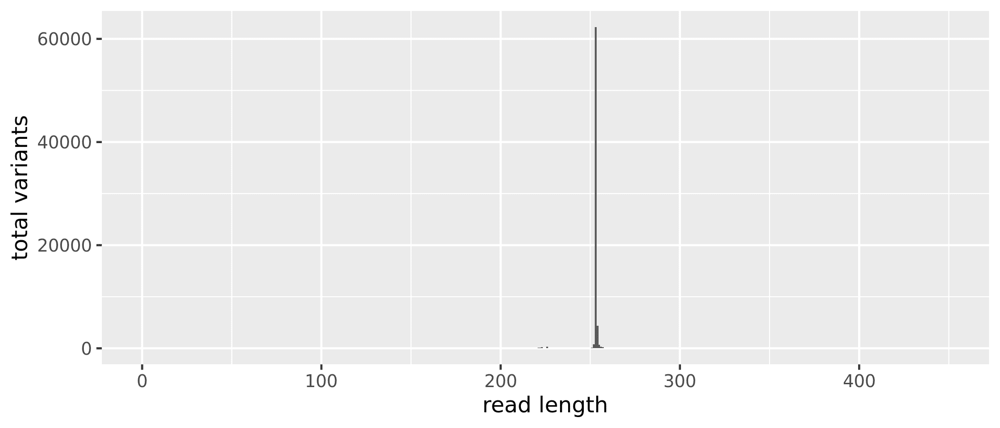
```
<small>`r caption_fig_ssu("read_length_before_ssu")`</small>

# 4C. Collapse No Mismatch

```{r}
seqtab_to_collapse <- collapseNoMismatch(st_all, minOverlap = 20, 
                                         orderBy = "abundance", 
                                         identicalOnly = FALSE, 
                                         vec = TRUE, band = -1, 
                                         verbose = TRUE)
```

```
Output 70769 collapsed sequences out of 70999 input sequences.
```

```{r}
dim(seqtab_to_collapse)
```


```{r, echo=FALSE, eval=TRUE}
seqtab <- c(169, 70769)
seqtab
```

```{r}
table(nchar(getSequences(seqtab_to_collapse)))
```

```
   36    64    65    77    87   130   138   161   185   189   191   192   194 
    1     1     1     1     1     1     2     1     1     4     3     1     2 
  195   197   198   200   201   202   203   204   205   206   207   208   209 
    1     5     3     6     6     9     7     7     4     6     8     7     8 
  210   211   212   213   214   215   216   217   218   219   220   221   222 
    2     4     4     3     7     1     6     3     7    15    50   138   144 
  223   224   225   226   227   228   229   230   231   232   233   234   235 
  173    34    14   151    21    11     7     1    27    56    22     9    11 
  236   237   238   239   240   241   242   243   244   245   246   247   248 
   10    26    35    39    47    34    36    15    34    49    15    23    47 
  249   250   251   252   253   254   255   256   257   258   259   260   261 
   43    76   114   805 62321  4357   690   283   224    56    20    21    27 
  262   263   264   265   266   267   268   269   270   271   272   273   274 
   15     8     9     6     8     8     9     3    12    18    21    38     6 
  275   276   277   278   279   280   281   282   283   284   285   286   287 
   14     6     3     2     2     1     5     8     1     1     1     1    10 
  288   289   290   291   296   297   298   299   300   301   303   304   305 
    3     1     1     1     3     2     2     2     2     3     1     1     1 
  306   307   308   309   310   313   314   315   317   318   319   320   321 
    1     3     1     4     2     2     2     1     1     1     3     1     1 
  322   324   330   337   338   339   340   343   358   364   365   366   367 
    1     1     1     1     1     1     2     1     2     3     4     3     2 
  370   372   373   387   388   390   392   393   394   396   404   421   422 
    1     1     1     1     1     3     1     2     1     2     2     1     1 
  424 
    1 
```

We have **`r (seqtab)[2]`** sequence variants but also a range of sequence lengths. Since many of these sequence variants are singletons or doubletons, we will just select a range that corresponds to the expected amplicon length and eliminate the spurious reads. Again, we will do that after merging the tables from the three years.

```{r, echo=FALSE}
read_length_all_collapse <-  data.frame(nchar(getSequences(seqtab_to_collapse)))
colnames(read_length_all_collapse) <- "length"
plot_all_collapse <- qplot(length, data = read_length_all_collapse, 
                           geom = "histogram", binwidth = 1, 
                           xlab = "read length", 
                           ylab = "total variants", 
                           xlim = c(0,450)) 
ggsave("figures/ssu_read_length_before_nopool_all_collapse.png", 
       plot_all_collapse, width = 7, height = 3)
saveRDS(seqtab_to_collapse, "rdata/seqtab_to_collapse.rds")
```

Now we can just select a range that corresponds to the expected amplicon length and eliminate the spurious reads.

```{r}
seqtab.2 <- seqtab_to_collapse[,nchar(colnames(seqtab_to_collapse)) %in% seq(252,254)]
dim(seqtab.2)
```

<aside>
The values you select should be based on the sequence table generated above.
</aside>

```{r, echo=FALSE, eval=TRUE}
seqtab2 <-  c(169, 67483)
seqtab2
```

```{r}
table(nchar(getSequences(seqtab.2)))
```

```
  252   253   254 
  805 62321  4357 
```

After removing the extreme length variants, we have **`r (seqtab2)[2]`**, a reduction of **`r (seqtab)[2] - (seqtab2)[2]`** sequence variants.

```{r, echo=FALSE}
saveRDS(seqtab.2, "ssu_seqtab.rds")
```

# 5. Remove Chimeras

Even though the `dada` method corrects substitution and indel errors,  chimeric sequences remain. According to the DADA2 documentation, the accuracy of sequence variants after denoising makes identifying chimeric ASVs simpler than when dealing with fuzzy OTUs. Chimeric sequences are identified if they can be *exactly reconstructed* by combining a left-segment and a right-segment from two more abundant *parent* sequences.

```{r}
seqtab.nochim <- removeBimeraDenovo(seqtab.2,  method = "consensus", 
                                    multithread = 20, verbose = TRUE)
dim(seqtab.nochim)
```

```
Identified 7831 bimeras out of 67483 input sequences.
```

```{r, echo=FALSE, eval=TRUE}
seqtab3 <- c(169, 59652)
seqtab3
```

```{r}
sum(seqtab.nochim)/sum(seqtab.2)
```

```{r, echo=FALSE, eval=TRUE}
chim_rem <- 0.9675082
0.9675082
```

```
  252   253   254 
  798 54863  3991 
```

Chimera checking removed an additional **`r (seqtab2)[2] - (seqtab3)[2]`** sequence variants however, when we account for the abundances of each variant, we see chimeras accounts for about **`r 100*(1-chim_rem)`%** of the merged sequence reads. Not bad.

The last thing we want to do is write the sequence table to an `RDS` file.

```{r}
saveRDS(seqtab.nochim, "ssu_seqtab.nochim.rds")
```

Now, let's look at the distribution of ASVs by the number of samples

```{r}
table(colSums(seqtab.nochim > 0))
```

```
    1     2     3     4     5     6     7     8     9    10    11    12    13 
39758  5638  2688  1746  1206   897   727   543   463   383   347   309   261 
   14    15    16    17    18    19    20    21    22    23    24    25    26 
  246   194   184   169   166   145   148   129   103   118   107   120    79 
   27    28    29    30    31    32    33    34    35    36    37    38    39 
   91    83    68    70    67    69    71    65    62    70    61    45    60 
   40    41    42    43    44    45    46    47    48    49    50    51    52 
   46    49    47    56    42    37    41    41    31    31    27    34    31 
   53    54    55    56    57    58    59    60    61    62    63    64    65 
   30    33    30    34    26    30    26    24    25    28    21    22    29 
   66    67    68    69    70    71    72    73    74    75    76    77    78 
   14    13    24    20    15    17    18    13    20    14    20    18    17 
   79    80    81    82    83    84    85    86    87    88    89    90    91 
   11    16    20    17    19    20    14    13    18     6    15    19    12 
   92    93    94    95    96    97    98    99   100   101   102   103   104 
   15    10     5    12    14     9    18    13    20    12     9    15     6 
  105   106   107   108   109   110   111   112   113   114   115   116   117 
    7     5    13    11     9    14    15     6    11     2     7    10     5 
  118   119   120   121   122   123   124   125   126   127   128   129   130 
    6     5     7     6     6     4     6    11     1    10     8     8     2 
  132   133   134   135   136   137   138   139   140   141   142   143   144 
    7     8     6     6     6     5    11     7     6     4    10     6     7 
  145   146   147   148   149   150   151   152   153   155   156   157   158 
    6     8     4     8     7     6     4     7     6     8     8     3     2 
  159   160   161   162   163   164   165   166   167   168   169 
    6     6     9     4     4     7     6     5    10     6    20 
```

```{r, echo=FALSE, eval=TRUE}
sample_by_asvs <- read.table("include/dada2/ssu_seqtab_sum_samples_by_asvs.txt", 
                            header = TRUE, sep = "\t")
sample_by_asvs$Freq <- log(sample_by_asvs$Freq)
plot(sample_by_asvs, type = "s", main = "Total ASVs per sample", 
     xlab = "Number of Samples", ylab = "Number of ASVs")
```

And the distribution of total ASVs across samples. 

```{r}
table(rowSums(seqtab.nochim > 0))
```


```
 397  634  754  792 1052 1145 1192 1247 1263 1267 1282 1301 1302 1309 1313 1319 
   1    1    1    1    1    1    1    1    1    1    1    1    1    1    1    1 
1322 1355 1366 1368 1383 1396 1410 1411 1425 1432 1446 1450 1455 1472 1483 1486 
   1    1    1    1    1    1    1    1    1    1    1    1    1    1    1    1 
1494 1495 1496 1500 1512 1516 1522 1524 1539 1549 1556 1568 1588 1593 1601 1611 
   1    1    2    1    1    1    1    1    1    1    1    1    1    1    2    1 
1615 1617 1624 1628 1636 1668 1669 1675 1681 1687 1698 1702 1708 1714 1732 1737 
   1    1    1    1    1    1    1    1    1    1    1    1    1    1    1    1 
1750 1756 1778 1797 1809 1825 1829 1836 1845 1855 1870 1874 1895 1941 1942 1945 
   1    1    1    1    1    1    1    1    1    2    1    1    1    1    1    1 
1955 1957 1958 1966 1976 1981 1985 1986 1987 1991 1994 1997 2000 2002 2004 2005 
   1    1    1    1    1    1    1    1    1    1    2    1    1    1    1    1 
2009 2014 2029 2089 2092 2096 2110 2119 2122 2129 2132 2135 2141 2148 2152 2167 
   1    1    1    1    1    1    1    1    1    1    1    1    1    1    1    1 
2174 2191 2194 2199 2201 2203 2210 2217 2241 2245 2259 2275 2281 2286 2288 2300 
   1    1    1    1    1    1    1    1    1    3    1    1    2    1    1    1 
2325 2330 2334 2338 2347 2353 2362 2363 2370 2400 2447 2483 2484 2492 2496 2510 
   1    2    1    1    1    1    1    1    1    1    1    1    1    1    1    1 
2516 2535 2542 2558 2567 2573 2583 2596 2652 2755 2820 2848 2892 2927 2994 3051 
   1    1    1    1    1    1    1    1    1    1    1    1    1    1    1    1 
3412 
   1 
```

```{r, echo=FALSE, eval=TRUE}
asv_by_sample <- read.table("include/dada2/ssu_seqtab_sum_asvs_by_samples.txt", 
                            header = TRUE, sep = "\t")
hist(asv_by_sample$Total_ASVs, main = "Total ASVs per sample", 
     xlab = "Number of ASVs", ylab = "Number of Samples", 
     border = "#323232", col = "#56B4E9", 
     xlim = c (0,3500), ylim = c(0,50), breaks = 10)
```


# 6. Assign Taxonomy

The `assignTaxonomy` command implements the naive Bayesian classifier, so for reproducible results you need to set a random number seed (see issue [#538](https://github.com/benjjneb/dada2/issues/538)). We did this at the beginning of the workflow. For taxonomic assignment, we are using the Silva version 138 [@quast2012silva]. The developers of DADA2 maintain a [formatted version of the database](https://benjjneb.github.io/dada2/training.html).

We will read in the `RDS` file containing the sequence table saved above. We also need to run `remove(list = ls())` command, otherwise the final image we save will be huge. This way, the image only contains the sample data, seqtab, and taxtab *after* running `removeBimeraDenovo`.

```{r, echo=FALSE}
remove(list = ls())
seqtab <- readRDS("rdata/seqtab.nochim.rds")
```

And then native Bayesian classifier against the Silva database.

```{r}
tax_silva <- assignTaxonomy(seqtab, "TAXONOMY_FILES/silva_nr_v138_train_set.fa.gz", 
                            multithread = TRUE, verbose = TRUE)
saveRDS(tax_silva, "rdata/tax_silva.rds")
```


```{r, echo=FALSE}
# Classify with IdTAX db
remove(list = ls())
seqtab <- readRDS("ssu_seqtab.nochim.rds")

tax_silva <- assignTaxonomy(seqtab, "silva_nr_v138_train_set.fa.gz", multithread = TRUE)

dna <- DNAStringSet(getSequences(seqtab)) # Create a DNAStringSet from the ASVs
load("SILVA_SSU_r138_2018.RData")
ids <- IdTaxa(dna, trainingSet, strand = "top", processors = NULL, verbose = FALSE) # use all processors
ranks <- c("domain", "phylum", "class", "order", "family", "genus") # ranks of interest
# Convert the output object of class "Taxa" to a matrix analogous to the output from assignTaxonomy
tax_id <- t(sapply(ids, function(x) {
        m <- match(ranks, x$rank)
        taxa <- x$taxon[m]
        taxa[startsWith(taxa, "unclassified_")] <- NA
        taxa
}))
colnames(tax_id) <- ranks; rownames(tax_id) <- getSequences(seqtab)

save.image("ssu_data_prep_wf_ALT.rdata")
saveRDS(seqtab, "ssu_seqtab.nochim.2.rds")
saveRDS(tax_silva, "ssu_tax_silva.rds")
saveRDS(tax_id, "ssu_tax_id.rds")
```

# 7. Summary

```{r blah, echo=FALSE}
cut_0 <- read.table("files/agua/dada2/tables/ssu_cut_year_0.txt", header = TRUE)
cut_0$year <- "Y0"
cut_1 <- read.table("files/agua/dada2/tables/ssu_cut_year_1.txt", header = TRUE)
cut_1$year <- "Y1"
cut_4 <- read.table("files/agua/dada2/tables/ssu_cut_year_4.txt", header = TRUE)
cut_4$year <- "Y4"
cut_all <- rbind(cut_0, cut_1, cut_4)
cut_all <- cut_all[, c(1,4,2,3)]
cut_all$SampleId  <- gsub(x = cut_all$SampleId, pattern = "_R1", replacement = "") 

filt_0 <- read.table("files/agua/dada2/tables/ssu_filt_year_0.txt", header = TRUE)
filt_1 <- read.table("files/agua/dada2/tables/ssu_filt_year_1.txt", header = TRUE)
filt_4 <- read.table("files/agua/dada2/tables/ssu_filt_year_4.txt", header = TRUE)
filt_all <- rbind(filt_0, filt_1, filt_4)
filt_all$reads.in <- NULL
filt_all$SampleId  <- gsub(x = filt_all$SampleId, pattern = "_R1", replacement = "") 
filt_all <- filt_all %>% dplyr::rename("filtered" = 2)

denoise_0 <- read.table("files/agua/dada2/tables/ssu_denoise_year_0.txt", header = TRUE)
denoise_1 <- read.table("files/agua/dada2/tables/ssu_denoise_year_1.txt", header = TRUE)
denoise_4 <- read.table("files/agua/dada2/tables/ssu_denoise_year_4.txt", header = TRUE)
denoise_all <- rbind(denoise_0, denoise_1, denoise_4)

merge_0 <- read.table("files/agua/dada2/tables/ssu_merge_year_0.txt", header = TRUE)
merge_1 <- read.table("files/agua/dada2/tables/ssu_merge_year_1.txt", header = TRUE)
merge_4 <- read.table("files/agua/dada2/tables/ssu_merge_year_4.txt", header = TRUE)
merge_all <- rbind(merge_0, merge_1, merge_4)
merge_all[,c(2:3)] <- NULL

seqtab.nochim <- readRDS("files/agua/dada2/rdata/ssu_seqtab.nochim.rds")
nochime <- data.frame(rowSums(seqtab.nochim))
nochime <- nochime %>% dplyr::rename("nochim" = 1)
nochime <- nochime %>% tibble::rownames_to_column("SampleId")

track_changes <- dplyr::left_join(cut_all, filt_all) %>%
                 dplyr::left_join(., denoise_all) %>%
                 dplyr::left_join(., merge_all) %>%
                 dplyr::left_join(., nochime)

track_changes$perc_remain <- track_changes$nochim/track_changes$raw
track_changes$perc_remain <- round(track_changes$perc_remain, digits = 3)
write.table(track_changes, "files/dada2/tables/ssu_read_changes.txt", 
                            sep = "\t", quote = FALSE, row.names = FALSE)
```


```{r, echo=FALSE, layout="l-body-outset", eval=TRUE}
seq_table <- read.table("files/dada2/tables/ssu_read_changes.txt",
                        header = TRUE, sep = "\t")
```
<small>`r caption_tab_ssu("track_ssu")`</small>

```{r, echo=FALSE, layout="l-body-outset", eval=TRUE}
seq_table %>%
  download_this(
    output_name = "ssu_read_changes",
    output_extension = ".csv",
    button_label = "Download data as csv file",
    button_type = "default",
    csv2 = FALSE,
    has_icon = TRUE,
    icon = "fa fa-save")

reactable(seq_table,
  defaultColDef = colDef(
    header = function(value) gsub("_", " ", value, fixed = TRUE),
    cell = function(value) format(value, nsmall = 1),
    align = "center", filterable = FALSE, sortable = TRUE, resizable = TRUE,
    footerStyle = list(fontWeight = "bold")
    ), 
  columns = list(
    Sample_ID = colDef(name = "Sample ID", 
                       sticky = "left", 
                       style = list(borderRight = "1px solid #eee"),
                       headerStyle = list(borderRight = "1px solid #eee"), 
                       align = "left",
                       minWidth = 150, footer = "Total reads", filterable = TRUE), 
    year = colDef(filterable = TRUE),
    raw = colDef(footer = function(values) sprintf("%.0f", sum(values))),
    cut = colDef(footer = function(values) sprintf("%.0f", sum(values))),
    filter = colDef(footer = function(values) sprintf("%.0f", sum(values))),
    denoiseF = colDef(footer = function(values) sprintf("%.0f", sum(values))),
    denoiseR = colDef(footer = function(values) sprintf("%.0f", sum(values))),
    merged = colDef(footer = function(values) sprintf("%.0f", sum(values))),
    nochim = colDef(footer = function(values) sprintf("%.0f", sum(values)))
    ), 
  searchable = FALSE, defaultPageSize = 5, 
  pageSizeOptions = c(5, 10, nrow(seq_table)), 
  showPageSizeOptions = TRUE, highlight = TRUE, 
  bordered = TRUE, striped = TRUE, compact = FALSE, 
  wrap = FALSE, showSortable = TRUE, fullWidth = TRUE,
  theme = reactableTheme(style = list(fontSize = "0.8em")))
```

## R Session Information & Code

This workflow was run on the [Smithsonian High Performance Cluster (SI/HPC)](https://doi.org/10.25572/SIHPC), Smithsonian Institution. Below are the specific packages and versions used in this workflow using both `sessionInfo()` and `devtools::session_info()`. Click the arrow to see the details.

<details markdown="1">
<summary>**Show/hide**  R Session Info</summary>
```
R version 4.0.0 (2020-04-24)
Platform: x86_64-conda_cos6-linux-gnu (64-bit)
Running under: CentOS Linux 7 (Core)

Matrix products: default
BLAS/LAPACK: /home/scottjj/miniconda3/envs/R-4/lib/libopenblasp-r0.3.9.so

locale:
 [1] LC_CTYPE=en_US.UTF-8       LC_NUMERIC=C              
 [3] LC_TIME=en_US.UTF-8        LC_COLLATE=en_US.UTF-8    
 [5] LC_MONETARY=en_US.UTF-8    LC_MESSAGES=en_US.UTF-8   
 [7] LC_PAPER=en_US.UTF-8       LC_NAME=C                 
 [9] LC_ADDRESS=C               LC_TELEPHONE=C            
[11] LC_MEASUREMENT=en_US.UTF-8 LC_IDENTIFICATION=C       

attached base packages:
 [1] grid      stats4    parallel  stats     graphics  grDevices utils    
 [8] datasets  methods   base     

other attached packages:
 [1] DECIPHER_2.16.1             RSQLite_2.2.0              
 [3] gridExtra_2.3               ggplot2_3.3.2              
 [5] ShortRead_1.46.0            GenomicAlignments_1.24.0   
 [7] SummarizedExperiment_1.18.2 DelayedArray_0.14.1        
 [9] matrixStats_0.56.0          Biobase_2.48.0             
[11] Rsamtools_2.4.0             GenomicRanges_1.40.0       
[13] GenomeInfoDb_1.24.2         Biostrings_2.56.0          
[15] XVector_0.28.0              IRanges_2.22.2             
[17] S4Vectors_0.26.1            BiocParallel_1.22.0        
[19] BiocGenerics_0.34.0         dada2_1.16.0               
[21] Rcpp_1.0.5                 

loaded via a namespace (and not attached):
 [1] tidyselect_1.1.0       purrr_0.3.4            reshape2_1.4.4        
 [4] lattice_0.20-41        colorspace_1.4-1       vctrs_0.3.4           
 [7] generics_0.0.2         blob_1.2.1             rlang_0.4.7           
[10] pillar_1.4.6           glue_1.4.2             withr_2.2.0           
[13] DBI_1.1.0              bit64_4.0.2            RColorBrewer_1.1-2    
[16] jpeg_0.1-8.1           GenomeInfoDbData_1.2.3 lifecycle_0.2.0       
[19] plyr_1.8.6             stringr_1.4.0          zlibbioc_1.34.0       
[22] munsell_0.5.0          gtable_0.3.0           hwriter_1.3.2         
[25] memoise_1.1.0          latticeExtra_0.6-29    scales_1.1.1          
[28] RcppParallel_5.0.2     bit_4.0.4              digest_0.6.25         
[31] png_0.1-7              stringi_1.5.3          dplyr_1.0.2           
[34] tools_4.0.0            bitops_1.0-6           magrittr_1.5          
[37] RCurl_1.98-1.2         tibble_3.0.3           crayon_1.3.4          
[40] pkgconfig_2.0.3        ellipsis_0.3.1         Matrix_1.2-18         
[43] R6_2.4.1               compiler_4.0.0        
─ Session info ───────────────────────────────────────────────────────────────
 setting  value                       
 version  R version 4.0.0 (2020-04-24)
 os       CentOS Linux 7 (Core)       
 system   x86_64, linux-gnu           
 ui       X11                         
 language (EN)                        
 collate  en_US.UTF-8                 
 ctype    en_US.UTF-8                 
 tz       America/New_York            
 date     2020-12-04                  

─ Packages ───────────────────────────────────────────────────────────────────
 package              * version  date       lib source        
 assertthat             0.2.1    2019-03-21 [1] CRAN (R 4.0.0)
 backports              1.1.9    2020-08-24 [1] CRAN (R 4.0.0)
 Biobase              * 2.48.0   2020-04-27 [1] Bioconductor  
 BiocGenerics         * 0.34.0   2020-04-27 [1] Bioconductor  
 BiocParallel         * 1.22.0   2020-04-27 [1] Bioconductor  
 Biostrings           * 2.56.0   2020-04-27 [1] Bioconductor  
 bit                    4.0.4    2020-08-04 [1] CRAN (R 4.0.0)
 bit64                  4.0.2    2020-07-30 [1] CRAN (R 4.0.0)
 bitops                 1.0-6    2013-08-17 [1] CRAN (R 4.0.0)
 blob                   1.2.1    2020-01-20 [1] CRAN (R 4.0.0)
 callr                  3.4.4    2020-09-07 [1] CRAN (R 4.0.0)
 cli                    2.0.2    2020-02-28 [1] CRAN (R 4.0.0)
 colorspace             1.4-1    2019-03-18 [1] CRAN (R 4.0.0)
 crayon                 1.3.4    2017-09-16 [1] CRAN (R 4.0.0)
 dada2                * 1.16.0   2020-04-27 [1] Bioconductor  
 DBI                    1.1.0    2019-12-15 [1] CRAN (R 4.0.0)
 DECIPHER             * 2.16.1   2020-05-11 [1] Bioconductor  
 DelayedArray         * 0.14.1   2020-07-14 [1] Bioconductor  
 desc                   1.2.0    2018-05-01 [1] CRAN (R 4.0.0)
 devtools               2.3.1    2020-07-21 [1] CRAN (R 4.0.0)
 digest                 0.6.25   2020-02-23 [1] CRAN (R 4.0.0)
 dplyr                  1.0.2    2020-08-18 [1] CRAN (R 4.0.0)
 ellipsis               0.3.1    2020-05-15 [1] CRAN (R 4.0.0)
 fansi                  0.4.1    2020-01-08 [1] CRAN (R 4.0.0)
 fs                     1.5.0    2020-07-31 [1] CRAN (R 4.0.0)
 generics               0.0.2    2018-11-29 [1] CRAN (R 4.0.0)
 GenomeInfoDb         * 1.24.2   2020-06-15 [1] Bioconductor  
 GenomeInfoDbData       1.2.3    2020-05-22 [1] Bioconductor  
 GenomicAlignments    * 1.24.0   2020-04-27 [1] Bioconductor  
 GenomicRanges        * 1.40.0   2020-04-27 [1] Bioconductor  
 ggplot2              * 3.3.2    2020-06-19 [1] CRAN (R 4.0.0)
 glue                   1.4.2    2020-08-27 [1] CRAN (R 4.0.0)
 gridExtra            * 2.3      2017-09-09 [1] CRAN (R 4.0.0)
 gtable                 0.3.0    2019-03-25 [1] CRAN (R 4.0.0)
 hwriter                1.3.2    2014-09-10 [1] CRAN (R 4.0.0)
 IRanges              * 2.22.2   2020-05-21 [1] Bioconductor  
 jpeg                   0.1-8.1  2019-10-24 [1] CRAN (R 4.0.0)
 lattice                0.20-41  2020-04-02 [1] CRAN (R 4.0.0)
 latticeExtra           0.6-29   2019-12-19 [1] CRAN (R 4.0.0)
 lifecycle              0.2.0    2020-03-06 [1] CRAN (R 4.0.0)
 magrittr               1.5      2014-11-22 [1] CRAN (R 4.0.0)
 Matrix                 1.2-18   2019-11-27 [1] CRAN (R 4.0.0)
 matrixStats          * 0.56.0   2020-03-13 [1] CRAN (R 4.0.0)
 memoise                1.1.0    2017-04-21 [1] CRAN (R 4.0.0)
 munsell                0.5.0    2018-06-12 [1] CRAN (R 4.0.0)
 pillar                 1.4.6    2020-07-10 [1] CRAN (R 4.0.0)
 pkgbuild               1.1.0    2020-07-13 [1] CRAN (R 4.0.0)
 pkgconfig              2.0.3    2019-09-22 [1] CRAN (R 4.0.0)
 pkgload                1.1.0    2020-05-29 [1] CRAN (R 4.0.0)
 plyr                   1.8.6    2020-03-03 [1] CRAN (R 4.0.0)
 png                    0.1-7    2013-12-03 [1] CRAN (R 4.0.0)
 prettyunits            1.1.1    2020-01-24 [1] CRAN (R 4.0.0)
 processx               3.4.4    2020-09-03 [1] CRAN (R 4.0.0)
 ps                     1.3.4    2020-08-11 [1] CRAN (R 4.0.0)
 purrr                  0.3.4    2020-04-17 [1] CRAN (R 4.0.0)
 R6                     2.4.1    2019-11-12 [1] CRAN (R 4.0.0)
 RColorBrewer           1.1-2    2014-12-07 [1] CRAN (R 4.0.0)
 Rcpp                 * 1.0.5    2020-07-06 [1] CRAN (R 4.0.0)
 RcppParallel           5.0.2    2020-06-24 [1] CRAN (R 4.0.0)
 RCurl                  1.98-1.2 2020-04-18 [1] CRAN (R 4.0.0)
 remotes                2.2.0    2020-07-21 [1] CRAN (R 4.0.0)
 reshape2               1.4.4    2020-04-09 [1] CRAN (R 4.0.0)
 rlang                  0.4.7    2020-07-09 [1] CRAN (R 4.0.0)
 rprojroot              1.3-2    2018-01-03 [1] CRAN (R 4.0.0)
 Rsamtools            * 2.4.0    2020-04-27 [1] Bioconductor  
 RSQLite              * 2.2.0    2020-01-07 [1] CRAN (R 4.0.0)
 S4Vectors            * 0.26.1   2020-05-16 [1] Bioconductor  
 scales                 1.1.1    2020-05-11 [1] CRAN (R 4.0.0)
 sessioninfo            1.1.1    2018-11-05 [1] CRAN (R 4.0.0)
 ShortRead            * 1.46.0   2020-04-27 [1] Bioconductor  
 stringi                1.5.3    2020-09-09 [1] CRAN (R 4.0.0)
 stringr                1.4.0    2019-02-10 [1] CRAN (R 4.0.0)
 SummarizedExperiment * 1.18.2   2020-07-09 [1] Bioconductor  
 testthat               2.3.2    2020-03-02 [1] CRAN (R 4.0.0)
 tibble                 3.0.3    2020-07-10 [1] CRAN (R 4.0.0)
 tidyselect             1.1.0    2020-05-11 [1] CRAN (R 4.0.0)
 usethis                1.6.1    2020-04-29 [1] CRAN (R 4.0.0)
 vctrs                  0.3.4    2020-08-29 [1] CRAN (R 4.0.0)
 withr                  2.2.0    2020-04-20 [1] CRAN (R 4.0.0)
 XVector              * 0.28.0   2020-04-27 [1] Bioconductor  
 zlibbioc               1.34.0   2020-04-27 [1] Bioconductor  
```
</details>

<br/>

# ITS

## Overview

## Sequence Files & Samples

```{r, echo=FALSE, layout="l-body-outset", eval=TRUE}
seq_table <- read.table("files/dada2/tables/its_sample_seq_info.txt",
                        header = TRUE, sep = "\t")
```

We sequenced a total of `r nrow(seq_table)` samples collected from `r length(unique(seq_table$Location))` different locations and `r length(unique(seq_table$Forest_age))` forest ages.

<br/>

<small>`r caption_tab_its("seq_dets_its")`</small>
```{r, echo=FALSE, layout="l-body-outset", eval=TRUE}
seq_table %>%
  download_this(
    output_name = "its_sample_seq_info",
    output_extension = ".csv",
    button_label = "Download data as csv file",
    button_type = "default",
    csv2 = FALSE,
    has_icon = TRUE,
    icon = "fa fa-save")

reactable(seq_table,
  defaultColDef = colDef(
    header = function(value) gsub("_", " ", value, fixed = TRUE),
    cell = function(value) format(value, nsmall = 1),
    align = "center", filterable = TRUE, sortable = TRUE, resizable = TRUE,
    footerStyle = list(fontWeight = "bold")
    ), 
  columns = list(
    Sample_ID = colDef(name = "Sample ID", 
                       sticky = "left", 
                       style = list(borderRight = "1px solid #eee"),
                       headerStyle = list(borderRight = "1px solid #eee"), 
                       align = "left",
                       minWidth = 150, footer = "Total reads", filterable = TRUE), 
    raw_reads = colDef(footer = function(values) sprintf("%.0f", sum(values)), filterable = FALSE)
    ), 
  searchable = TRUE, defaultPageSize = 5, 
  pageSizeOptions = c(5, 10, nrow(seq_table)), 
  showPageSizeOptions = TRUE, highlight = TRUE, 
  bordered = TRUE, striped = TRUE, compact = FALSE, 
  wrap = FALSE, showSortable = TRUE, fullWidth = TRUE,
  theme = reactableTheme(style = list(fontSize = "0.8em")))
```

### Workflow

The workflow consists of the following steps:

| Step | What we’re doing                                           | Command                |
|------|------------------------------------------------------------|------------------------|
| 1    | **Remove Primers**                                         |                        |
|      | prepare input file names & paths                           | multiple               |
|      | Define  primers (all orientations)                         | multiple               |
|      | Remove  primers                                            | `cutadapt`             |
| 2    | **Filtering, Error Correction, Dereplication**             |                        |
|      | assess quality & filter reads                              | `filterAndTrim()`      |
|      | generate an error model for the data                       | `learnErrors()`        |
|      | dereplicate sequences                                      | `derepFastq`           |
| 3    | **DADA2 & ASV Inference**                                  |                        |
|      | infer ASVs on both forward & reverse reads independently   | `dada()`               |
| 4    | **Merge Paired Reads & Construct Sequence Tables**         |                        |
|      | merge paired reads                                         | `mergePairs()`         |
|      | generate count tables                                      | `makeSequenceTable()`  |
|      | merge all sequence tables                                  | `mergeSequenceTables()`|
|      | collapse no mismatch                                       | `collapseNoMismatch()` |
| 5    | **Remove Chimeras**                                        |                        |
|      | screen for & remove chimeras                               | `removeBimeraDenovo()` |
| 6    | **Assign Taxonomy**                                        |                        |
|      | assign taxonomy & finish workflow                          | `assignTaxonomy()`     |
| 7    | **Track reads through workflow**                           |                        |


# 1. Remove Primers

::: l-body
::: {.panelset}

::: {.panel}
## Year 0

### Rename samples

First, we need to setup the working environment by renaming the fastq files and defining a path for the working directory. To make the parsing easier, we will eliminate the lane and well number from each sample. If you do not wish to do that you will need to adjust the code accordingly. 

> CAUTION. You should check that this code works on a few backup files before proceeding.

```{r ddd}
setwd("RAW_Year_0")
orig_fastq <- list.files(pattern = "*.fastq.gz")
newname_fastq <- gsub("_S.*_L001", "", orig_fastq)
newname_fastq <- gsub("_001", "", newname_fastq)
file.rename(orig_fastq, newname_fastq)
setwd("../")
```

```{r}
path <- "RAW_Year_0"  
head(list.files(path))
```

```{r, echo=FALSE, eval=TRUE}
c("00-1_R1.fastq.gz",  "00-1_R2.fastq.gz",  "00-10_R1.fastq.gz", "00-10_R2.fastq.gz", "00-11_R1.fastq.gz", "00-11_R2.fastq.gz")
```

Then, we generate matched lists of the forward and reverse read files. We also parse out the sample name.

```{r}
fnFs <- sort(list.files(path, pattern = "_R1.fastq.gz", full.names = TRUE))
fnRs <- sort(list.files(path, pattern = "_R2.fastq.gz", full.names = TRUE))
```

```{r, layout="l-body-outset", warning=FALSE, fig.height=3}
p1_pre <- plotQualityProfile(fnFs[1:61], aggregate = TRUE)
p2_pre <- plotQualityProfile(fnRs[1:61], aggregate = TRUE)

p3_pre <- grid.arrange(p1_pre, p2_pre, nrow = 1)
ggsave("figures/its_raw_plot_qscores_year_0.png", p3_pre, width = 7, height = 3)
```

```{r, echo=FALSE, eval=FALSE}
system("cp files/dada2/figures/its_raw_plot_qscores_year_0.png include/dada2/its_raw_plot_qscores_year_0.png")
```

```{r, echo=FALSE, layout="l-body", warning=FALSE, fig.height=4, fig.width=4, eval=TRUE}
knitr::include_graphics("include/dada2/its_raw_plot_qscores_year_0.png")
```
<small>`r caption_fig_its("raw_qual_scores_its_y0")`</small>

### Define Primers

Before we start the DADA2 workflow we need to run [catadapt](https://github.com/marcelm/cutadapt) [@martin2011cutadapt] on all `fastq.gz` files to trim the primers. For this part of the study we used  the primer pair 505F (GTGCCAGCMGCCGCGGTAA) and 806R   (GGACTACHVGGGTWTCTAAT) [@caporaso2011global] which should yield an amplicon length of about 253 bp.

First we define the primers.

```{r}
FWD <- "CTTGGTCATTTAGAGGAAGTAA"
REV <- "GCTGCGTTCTTCATCGATGC"
```

Next, we check the presence and orientation of these primers in the data. 

To do this we will create all orientations of the input primer sequences. In other words the *Forward*, *Complement*, *Reverse*, and *Reverse Complement* variations.

```{r}
allOrients <- function(primer) {
    require(Biostrings)
    dna <- DNAString(primer) 
    orients <- c(Forward = dna, 
                 Complement = complement(dna), 
                 Reverse = reverse(dna), 
                 RevComp = reverseComplement(dna))
    return(sapply(orients, toString))
}
FWD.orients <- allOrients(FWD)
REV.orients <- allOrients(REV)
FWD.orients
REV.orients
```

```
                 Forward               Complement                  Reverse 
"CTTGGTCATTTAGAGGAAGTAA" "GAACCAGTAAATCTCCTTCATT" "AATGAAGGAGATTTACTGGTTC" 
                 RevComp 
"TTACTTCCTCTAAATGACCAAG" 
               Forward             Complement                Reverse 
"GCTGCGTTCTTCATCGATGC" "CGACGCAAGAAGTAGCTACG" "CGTAGCTACTTCTTGCGTCG" 
               RevComp 
"GCATCGATGAAGAACGCAGC" 
```

```{r}
fnFs.filtN <- file.path(path, basename(fnFs)) 
fnRs.filtN <- file.path(path, basename(fnRs))
```

Nice.  Time to assess the number of times a primer (and all possible primer orientation) appear in the forward and reverse reads. According to the workflow, counting the primers on one set of paired end fastq files is sufficient to see if there is a problem. This assumes that all the files were created using the same library prep. Basically for both primers, we will search for all four orientations in both forward and reverse reads. Since this is 16S rRNA we do not anticipate any issues but it is worth checking.

```{r, echo=FALSE, eval=TRUE}
sampnum <- 2
```


```{r}
primerHits <- function(primer, fn) {
    # Counts number of reads in which the primer is found
    nhits <- vcountPattern(primer, sread(readFastq(fn)), fixed = FALSE)
    return(sum(nhits > 0))
}
```

#### Forward primers

```{r}
rbind(FWD.ForwardReads = sapply(FWD.orients, primerHits, fn = fnFs.filtN[[sampnum]]), 
    FWD.ReverseReads = sapply(FWD.orients, primerHits, fn = fnRs.filtN[[sampnum]]))
```

```
                 Forward Complement Reverse RevComp
FWD.ForwardReads   92419          0       0       0
FWD.ReverseReads       0          0       0   12211
```

#### Reverse primers

```{r}
rbind(REV.ForwardReads = sapply(REV.orients, primerHits, fn = fnFs.filtN[[sampnum]]), 
       REV.ReverseReads = sapply(REV.orients, primerHits, fn = fnRs.filtN[[sampnum]]))
```

```
                 Forward Complement Reverse RevComp
REV.ForwardReads       0          0       0   13339
REV.ReverseReads   91081          0       0       0
```

As expected, forward primers predominantly in the forward reads and very little evidence of reverse primers.

### Remove Primers

Now we can run [catadapt](https://github.com/marcelm/cutadapt) [@martin2011cutadapt] to remove the primers from the fastq sequences. A little setup first. If this command executes successfully it means R has found cutadapt.

```{r}
cutadapt <- "/home/scottjj/miniconda3/envs/cutadapt/bin/cutadapt"
system2(cutadapt, args = "--version") # Run shell commands from R
```

```
2.8
```

We set paths and trim the forward primer and the reverse-complement of the reverse primer off of R1 (forward reads) and trim the reverse primer and the reverse-complement of the forward primer off of R2 (reverse reads).

```{r}
path.cut <- file.path(path, "cutadapt")
if(!dir.exists(path.cut)) dir.create(path.cut)
fnFs.cut <- file.path(path.cut, basename(fnFs))
fnRs.cut <- file.path(path.cut, basename(fnRs))

FWD.RC <- dada2:::rc(FWD)
REV.RC <- dada2:::rc(REV)

R1.flags <- paste("-g", FWD, "-a", REV.RC) 
R2.flags <- paste("-G", REV, "-A", FWD.RC) 

for(i in seq_along(fnFs)) {system2(cutadapt, 
                                   args = c(R1.flags, R2.flags, 
                                            "--minimum-length", 20, 
                                            "--times", 2, 
                                            "--error-rate", 0.10, 
                                            "--no-indels",
                                            "--discard-untrimmed",
                                            "--output", fnFs.cut[i], 
                                            "--paired-output", fnRs.cut[i],
                                            "--report minimal",
                                            fnFs.filtN[i], fnRs.filtN[i]))}
```

*Note*. If the code above removes all of the base pairs in a sequence, you will get downstream errors unless you set the `-m` flag. This flag sets the minimum length and reads shorter than this will be discarded. Without this flag, reads of length 0 will be kept and cause issues. *Also, a lot of output will be written to the screen by cutadapt!*.

We can now count the number of primers in the sequences from the output of cutadapt.

```{r}
rbind(
    FWD.ForwardReads = sapply(FWD.orients, primerHits, fn = fnFs.cut[[sampnum]]), 
    FWD.ReverseReads = sapply(FWD.orients, primerHits, fn = fnRs.cut[[sampnum]]), 
    REV.ForwardReads = sapply(REV.orients, primerHits, fn = fnFs.cut[[sampnum]]), 
    REV.ReverseReads = sapply(REV.orients, primerHits, fn = fnRs.cut[[sampnum]]))
```

```
                 Forward Complement Reverse RevComp
FWD.ForwardReads       0          0       0       0
FWD.ReverseReads       0          0       0       0
REV.ForwardReads       0          0       0       0
REV.ReverseReads       2          0       0       0
```

Basically, primers are no longer detected in the cutadapted reads. 

```{r}
p1_cut <- plotQualityProfile(fnFs.cut[1:61], aggregate = TRUE)
p2_cut <- plotQualityProfile(fnRs.cut[1:61], aggregate = TRUE)

p3_cut <- grid.arrange(p1_cut, p2_cut, nrow = 1)
ggsave("figures/its_cut_plot_qscores_year_0.png", p3_cut, width = 7, height = 3)
```

```{r, echo=FALSE, eval=FALSE}
system("cp files/dada2/figures/its_cut_plot_qscores_year_0.png include/dada2/its_cut_plot_qscores_year_0.png")
```

```{r, echo=FALSE, layout="l-body", warning=FALSE, fig.height=4, fig.width=4, eval=TRUE}
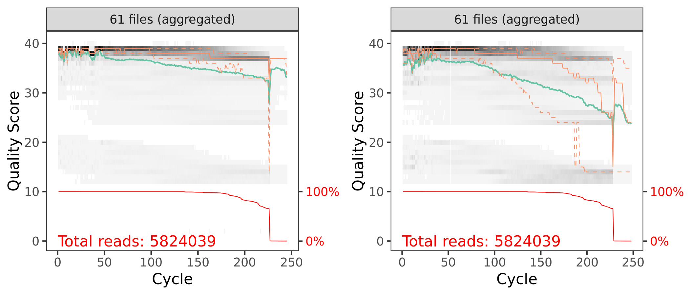
```
<small>`r caption_fig_its("cut_qual_scores_its_y1")`</small>

Now, for each sample, we can take a look at how primer removal affected the total number of raw reads.

```{r, echo=FALSE, eval=TRUE}
seq_table <- read.table("files/dada2/tables/its_cut_year_0.txt",
                       header = TRUE, sep = "\t")
```
<small>`r caption_tab_its("seq_cutadapt_its_y0")`</small>

```{r, echo=FALSE, layout="l-body-outset", eval=TRUE}
seq_table %>%
  download_this(
    output_name = "its_cutadapt_year_0",
    output_extension = ".csv",
    button_label = "Download data as csv file",
    button_type = "default",
    csv2 = FALSE,
    has_icon = TRUE,
    icon = "fa fa-save")

reactable(seq_table,
  defaultColDef = colDef(
    header = function(value) gsub("_", " ", value, fixed = TRUE),
    cell = function(value) format(value, nsmall = 1),
    align = "center", filterable = FALSE, sortable = TRUE, resizable = TRUE,
    footerStyle = list(fontWeight = "bold")
    ), 
  columns = list(
    Sample_ID = colDef(name = "Sample ID", 
                       sticky = "left", 
                       style = list(borderRight = "1px solid #eee"),
                       headerStyle = list(borderRight = "1px solid #eee"), 
                       align = "left",
                       minWidth = 150, footer = "Total reads", filterable = TRUE), 
    raw_reads = colDef(footer = function(values) sprintf("%.0f", sum(values))),
    pre_filt_reads = colDef(footer = function(values) sprintf("%.0f", sum(values))),
    cutadapt_reads = colDef(footer = function(values) sprintf("%.0f", sum(values)))
    ), 
  searchable = FALSE, defaultPageSize = 5, 
  pageSizeOptions = c(5, 10, nrow(seq_table)), 
  showPageSizeOptions = TRUE, highlight = TRUE, 
  bordered = TRUE, striped = TRUE, compact = FALSE, 
  wrap = FALSE, showSortable = TRUE, fullWidth = TRUE,
  theme = reactableTheme(style = list(fontSize = "0.8em")))
```
> [Back to top of this section](#remove-primers-3)

:::

::: {.panel}

## Year 1

### Rename samples

```{r, warning=FALSE}
setwd("RAW_Year_1")
orig_fastq <- list.files(pattern = "*.fastq.gz")
newname_fastq <- gsub("_S.*_L001", "", orig_fastq)
newname_fastq <- gsub("_001", "", newname_fastq)
file.rename(orig_fastq, newname_fastq)
setwd("../")
```

```{r}
path <- "RAW_Year_1"  
head(list.files(path))
```

```{r, echo=FALSE, eval=TRUE}
c("S11-T22_R1.fastq.gz",  "S11-T22_R2.fastq.gz",  "S11-T224_R1.fastq.gz",
"S11-T224_R2.fastq.gz", "S11-T225_R1.fastq.gz", "S11-T225_R2.fastq.gz")
```


```{r}
fnFs <- sort(list.files(path, pattern = "_R1.fastq.gz", full.names = TRUE))
fnRs <- sort(list.files(path, pattern = "_R2.fastq.gz", full.names = TRUE))
```


```{r, layout="l-body-outset", warning=FALSE, fig.height=3}
p1_pre <- plotQualityProfile(fnFs[1:61], aggregate = TRUE)
p2_pre <- plotQualityProfile(fnRs[1:61], aggregate = TRUE)

p3_pre <- grid.arrange(p1_pre, p2_pre, nrow = 1)
ggsave("figures/its_raw_plot_qscores_year_1.png", p3_pre, width = 7, height = 3)
```


```{r, echo=FALSE, eval=FALSE}
system("cp files/dada2/figures/its_raw_plot_qscores_year_1.png include/dada2/its_raw_plot_qscores_year_1.png")
```

```{r, echo=FALSE, layout="l-body", warning=FALSE, fig.height=4, fig.width=4, eval=TRUE}
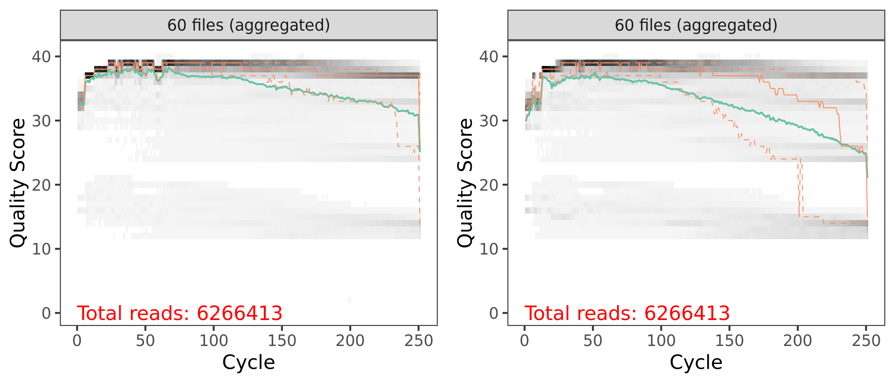
```
<small>`r caption_fig_its("raw_qual_scores_its_y1")`</small>

### Define Primers

```{r}
FWD <- "CTTGGTCATTTAGAGGAAGTAA"
REV <- "GCTGCGTTCTTCATCGATGC"
```


```{r}
allOrients <- function(primer) {
    require(Biostrings)
    dna <- DNAString(primer) 
    orients <- c(Forward = dna, 
                 Complement = complement(dna), 
                 Reverse = reverse(dna), 
                 RevComp = reverseComplement(dna))
    return(sapply(orients, toString))
}
FWD.orients <- allOrients(FWD)
REV.orients <- allOrients(REV)
FWD.orients
REV.orients
```

```
                 Forward               Complement                  Reverse 
"CTTGGTCATTTAGAGGAAGTAA" "GAACCAGTAAATCTCCTTCATT" "AATGAAGGAGATTTACTGGTTC" 
                 RevComp 
"TTACTTCCTCTAAATGACCAAG" 
               Forward             Complement                Reverse 
"GCTGCGTTCTTCATCGATGC" "CGACGCAAGAAGTAGCTACG" "CGTAGCTACTTCTTGCGTCG" 
               RevComp 
"GCATCGATGAAGAACGCAGC" 
```


```{r}
fnFs.filtN <- file.path(path, basename(fnFs)) 
fnRs.filtN <- file.path(path, basename(fnRs))
```

```{r, echo=FALSE, eval=TRUE}
sampnum <- 2
```


```{r}
primerHits <- function(primer, fn) {
    # Counts number of reads in which the primer is found
    nhits <- vcountPattern(primer, sread(readFastq(fn)), fixed = FALSE)
    return(sum(nhits > 0))
}
```

#### Forward primers

```{r}
rbind(FWD.ForwardReads = sapply(FWD.orients, primerHits, fn = fnFs.filtN[[sampnum]]), 
    FWD.ReverseReads = sapply(FWD.orients, primerHits, fn = fnRs.filtN[[sampnum]]))
```

```
                 Forward Complement Reverse RevComp
FWD.ForwardReads  115278          0       0       0
FWD.ReverseReads       0          0       0   43171
```

#### Reverse primers

```{r}
rbind(REV.ForwardReads = sapply(REV.orients, primerHits, fn = fnFs.filtN[[sampnum]]), 
       REV.ReverseReads = sapply(REV.orients, primerHits, fn = fnRs.filtN[[sampnum]]))
```

```
                 Forward Complement Reverse RevComp
REV.ForwardReads       0          0       0   10780
REV.ReverseReads  111101          0       0       0
```

### Remove Primers

Now we can run [catadapt](https://github.com/marcelm/cutadapt) [@martin2011cutadapt] to remove the primers from the fastq sequences. A little setup first. If this command executes successfully it means R has found cutadapt.

```{r}
cutadapt <- "/home/scottjj/miniconda3/envs/cutadapt/bin/cutadapt"
system2(cutadapt, args = "--version") # Run shell commands from R
```

```
2.8
```

```{r}
path.cut <- file.path(path, "cutadapt")
if(!dir.exists(path.cut)) dir.create(path.cut)
fnFs.cut <- file.path(path.cut, basename(fnFs))
fnRs.cut <- file.path(path.cut, basename(fnRs))

FWD.RC <- dada2:::rc(FWD)
REV.RC <- dada2:::rc(REV)

R1.flags <- paste("-g", FWD, "-a", REV.RC) 
R2.flags <- paste("-G", REV, "-A", FWD.RC) 

for(i in seq_along(fnFs)) {system2(cutadapt, 
                                   args = c(R1.flags, R2.flags, 
                                            "--minimum-length", 20, 
                                            "--times", 2, 
                                            "--error-rate", 0.10, 
                                            "--no-indels",
                                            "--discard-untrimmed",
                                            "--output", fnFs.cut[i], 
                                            "--paired-output", fnRs.cut[i],
                                            "--report minimal",
                                            fnFs.filtN[i], fnRs.filtN[i]))}
```


```{r}
rbind(
    FWD.ForwardReads = sapply(FWD.orients, primerHits, fn = fnFs.cut[[sampnum]]), 
    FWD.ReverseReads = sapply(FWD.orients, primerHits, fn = fnRs.cut[[sampnum]]), 
    REV.ForwardReads = sapply(REV.orients, primerHits, fn = fnFs.cut[[sampnum]]), 
    REV.ReverseReads = sapply(REV.orients, primerHits, fn = fnRs.cut[[sampnum]]))
```

```
                 Forward Complement Reverse RevComp
FWD.ForwardReads       0          0       0       0
FWD.ReverseReads       0          0       0       0
REV.ForwardReads       0          0       0       0
REV.ReverseReads       0          0       0       0
```

Basically, primers are no longer detected in the cutadapted reads. 

```{r}
p1_cut <- plotQualityProfile(fnFs.cut[1:61], aggregate = TRUE)
p2_cut <- plotQualityProfile(fnRs.cut[1:61], aggregate = TRUE)

p3_cut <- grid.arrange(p1_cut, p2_cut, nrow = 1)
ggsave("figures/its_cut_plot_qscores_year_1.png", p3_cut, width = 7, height = 3)
```

```{r, echo=FALSE, eval=FALSE}
system("cp files/dada2/figures/its_cut_plot_qscores_year_1.png include/dada2/its_cut_plot_qscores_year_1.png")
```

```{r, echo=FALSE, layout="l-body", warning=FALSE, fig.height=4, fig.width=4, eval=TRUE}
knitr::include_graphics("include/dada2/its_cut_plot_qscores_year_1.png")
```
<small>`r caption_fig_its("cut_qual_scores_its_y1")`</small>

Now, for each sample, we can take a look at how primer removal affected the total number of raw reads.

<br/>

```{r, echo=FALSE, eval=TRUE}
seq_table <- read.table("files/dada2/tables/its_cut_year_1.txt",
                       header = TRUE, sep = "\t")
```
<small>`r caption_tab_its("seq_cutadapt_its_y1")`</small>

```{r, echo=FALSE, layout="l-body-outset", eval=TRUE}
seq_table %>%
  download_this(
    output_name = "its_cutadapt_year_1",
    output_extension = ".csv",
    button_label = "Download data as csv file",
    button_type = "default",
    csv2 = FALSE,
    has_icon = TRUE,
    icon = "fa fa-save")

reactable(seq_table,
  defaultColDef = colDef(
    header = function(value) gsub("_", " ", value, fixed = TRUE),
    cell = function(value) format(value, nsmall = 1),
    align = "center", filterable = FALSE, sortable = TRUE, resizable = TRUE,
    footerStyle = list(fontWeight = "bold")
    ), 
  columns = list(
    Sample_ID = colDef(name = "Sample ID", 
                       sticky = "left", 
                       style = list(borderRight = "1px solid #eee"),
                       headerStyle = list(borderRight = "1px solid #eee"), 
                       align = "left",
                       minWidth = 150, footer = "Total reads", filterable = TRUE), 
    raw_reads = colDef(footer = function(values) sprintf("%.0f", sum(values))),
    pre_filt_reads = colDef(footer = function(values) sprintf("%.0f", sum(values))),
    cutadapt_reads = colDef(footer = function(values) sprintf("%.0f", sum(values)))
    ), 
  searchable = FALSE, defaultPageSize = 5, 
  pageSizeOptions = c(5, 10, nrow(seq_table)), 
  showPageSizeOptions = TRUE, highlight = TRUE, 
  bordered = TRUE, striped = TRUE, compact = FALSE, 
  wrap = FALSE, showSortable = TRUE, fullWidth = TRUE,
  theme = reactableTheme(style = list(fontSize = "0.8em")))
```
> [Back to top of this section](#remove-primers-3)

:::

::: {.panel}

## Year 4

### Rename samples

```{r, warning=FALSE}
setwd("RAW_Year_4")
orig_fastq <- list.files(pattern = "*.fastq.gz")
newname_fastq <- gsub("_S.*_L001", "", orig_fastq)
newname_fastq <- gsub("_001", "", newname_fastq)
file.rename(orig_fastq, newname_fastq)
setwd("../")
```

```{r}
path <- "RAW_Year_4"  
head(list.files(path))
```

```{r, echo=FALSE, eval=TRUE}
c("04-1_R1.fastq.gz",  "04-1_R2.fastq.gz",  "04-10_R1.fastq.gz",
"04-10_R2.fastq.gz", "04-11_R1.fastq.gz", "04-11_R2.fastq.gz")
```


```{r}
fnFs <- sort(list.files(path, pattern = "_R1.fastq.gz", full.names = TRUE))
fnRs <- sort(list.files(path, pattern = "_R2.fastq.gz", full.names = TRUE))
```


```{r, layout="l-body-outset", warning=FALSE, fig.height=3}
p1_pre <- plotQualityProfile(fnFs[1:61], aggregate = TRUE)
p2_pre <- plotQualityProfile(fnRs[1:61], aggregate = TRUE)

p3_pre <- grid.arrange(p1_pre, p2_pre, nrow = 1)
ggsave("figures/its_raw_plot_qscores_year_4.png", p3_pre, width = 7, height = 3)
```

```{r, echo=FALSE, eval=FALSE}
system("cp files/dada2/figures/its_raw_plot_qscores_year_4.png include/dada2/its_raw_plot_qscores_year_4.png")
```

```{r, echo=FALSE, layout="l-body", warning=FALSE, fig.height=4, fig.width=4, eval=TRUE}
knitr::include_graphics("include/dada2/its_raw_plot_qscores_year_4.png")
```
<small>`r caption_fig_its("raw_qual_scores_its_y4")`</small>

### Define Primers

```{r}
FWD <- "CTTGGTCATTTAGAGGAAGTAA"
REV <- "GCTGCGTTCTTCATCGATGC"
```


```{r}
allOrients <- function(primer) {
    require(Biostrings)
    dna <- DNAString(primer) 
    orients <- c(Forward = dna, 
                 Complement = complement(dna), 
                 Reverse = reverse(dna), 
                 RevComp = reverseComplement(dna))
    return(sapply(orients, toString))
}
FWD.orients <- allOrients(FWD)
REV.orients <- allOrients(REV)
FWD.orients
REV.orients
```

```
                 Forward               Complement                  Reverse 
"CTTGGTCATTTAGAGGAAGTAA" "GAACCAGTAAATCTCCTTCATT" "AATGAAGGAGATTTACTGGTTC" 
                 RevComp 
"TTACTTCCTCTAAATGACCAAG" 
               Forward             Complement                Reverse 
"GCTGCGTTCTTCATCGATGC" "CGACGCAAGAAGTAGCTACG" "CGTAGCTACTTCTTGCGTCG" 
               RevComp 
"GCATCGATGAAGAACGCAGC" 
```


```{r}
fnFs.filtN <- file.path(path, basename(fnFs)) 
fnRs.filtN <- file.path(path, basename(fnRs))
```

```{r, echo=FALSE, eval=TRUE}
sampnum <- 2
```


```{r}
primerHits <- function(primer, fn) {
    # Counts number of reads in which the primer is found
    nhits <- vcountPattern(primer, sread(readFastq(fn)), fixed = FALSE)
    return(sum(nhits > 0))
}
```

#### Forward primers

```{r}
rbind(FWD.ForwardReads = sapply(FWD.orients, primerHits, fn = fnFs.filtN[[sampnum]]), 
    FWD.ReverseReads = sapply(FWD.orients, primerHits, fn = fnRs.filtN[[sampnum]]))
```

```
                 Forward Complement Reverse RevComp
FWD.ForwardReads  124637          0       0       0
FWD.ReverseReads       0          0       0   13998
```

#### Reverse primers

```{r}
rbind(REV.ForwardReads = sapply(REV.orients, primerHits, fn = fnFs.filtN[[sampnum]]), 
       REV.ReverseReads = sapply(REV.orients, primerHits, fn = fnRs.filtN[[sampnum]]))
```

```
                 Forward Complement Reverse RevComp
REV.ForwardReads       0          0       0   13928
REV.ReverseReads  122656          0       0       0
```

### Remove Primers

Now we can run [catadapt](https://github.com/marcelm/cutadapt) [@martin2011cutadapt] to remove the primers from the fastq sequences. A little setup first. If this command executes successfully it means R has found cutadapt.

```{r}
cutadapt <- "/home/scottjj/miniconda3/envs/cutadapt/bin/cutadapt"
system2(cutadapt, args = "--version") # Run shell commands from R
```

```
2.8
```

```{r}
path.cut <- file.path(path, "cutadapt")
if(!dir.exists(path.cut)) dir.create(path.cut)
fnFs.cut <- file.path(path.cut, basename(fnFs))
fnRs.cut <- file.path(path.cut, basename(fnRs))

FWD.RC <- dada2:::rc(FWD)
REV.RC <- dada2:::rc(REV)

R1.flags <- paste("-g", FWD, "-a", REV.RC) 
R2.flags <- paste("-G", REV, "-A", FWD.RC) 

for(i in seq_along(fnFs)) {system2(cutadapt, 
                                   args = c(R1.flags, R2.flags, 
                                            "--minimum-length", 20, 
                                            "--times", 2, 
                                            "--error-rate", 0.10, 
                                            "--no-indels",
                                            "--discard-untrimmed",
                                            "--output", fnFs.cut[i], 
                                            "--paired-output", fnRs.cut[i],
                                            "--report minimal",
                                            fnFs.filtN[i], fnRs.filtN[i]))}
```


```{r}
rbind(
    FWD.ForwardReads = sapply(FWD.orients, primerHits, fn = fnFs.cut[[sampnum]]), 
    FWD.ReverseReads = sapply(FWD.orients, primerHits, fn = fnRs.cut[[sampnum]]), 
    REV.ForwardReads = sapply(REV.orients, primerHits, fn = fnFs.cut[[sampnum]]), 
    REV.ReverseReads = sapply(REV.orients, primerHits, fn = fnRs.cut[[sampnum]]))
```

```
                 Forward Complement Reverse RevComp
FWD.ForwardReads       0          0       0       0
FWD.ReverseReads       0          0       0       0
REV.ForwardReads       0          0       0       0
REV.ReverseReads       0          0       0       0
```

Basically, primers are no longer detected in the cutadapted reads. 

```{r}
p1_cut <- plotQualityProfile(fnFs.cut[1:61], aggregate = TRUE)
p2_cut <- plotQualityProfile(fnRs.cut[1:61], aggregate = TRUE)

p3_cut <- grid.arrange(p1_cut, p2_cut, nrow = 1)
ggsave("figures/its_cut_plot_qscores_year_4.png", p3_cut, width = 7, height = 3)
```

```{r, echo=FALSE, eval=FALSE}
system("cp files/dada2/figures/its_cut_plot_qscores_year_4.png include/dada2/its_cut_plot_qscores_year_4.png")
```

```{r, echo=FALSE, layout="l-body", warning=FALSE, fig.height=4, fig.width=4, eval=TRUE}
knitr::include_graphics("include/dada2/its_cut_plot_qscores_year_4.png")
```
<small>`r caption_fig_its("cut_qual_scores_its_y4")`</small>

Now, for each sample, we can take a look at how primer removal affected the total number of raw reads.

```{r, echo=FALSE, eval=TRUE}
seq_table <- read.table("files/dada2/tables/its_cut_year_4.txt",
                       header = TRUE, sep = "\t")
```
<small>`r caption_tab_its("seq_cutadapt_its_y4")`</small>

```{r, echo=FALSE, layout="l-body-outset", eval=TRUE}
seq_table %>%
  download_this(
    output_name = "its_cutadapt_year_4",
    output_extension = ".csv",
    button_label = "Download data as csv file",
    button_type = "default",
    csv2 = FALSE,
    has_icon = TRUE,
    icon = "fa fa-save")

reactable(seq_table,
  defaultColDef = colDef(
    header = function(value) gsub("_", " ", value, fixed = TRUE),
    cell = function(value) format(value, nsmall = 1),
    align = "center", filterable = FALSE, sortable = TRUE, resizable = TRUE,
    footerStyle = list(fontWeight = "bold")
    ), 
  columns = list(
    Sample_ID = colDef(name = "Sample ID", 
                       sticky = "left", 
                       style = list(borderRight = "1px solid #eee"),
                       headerStyle = list(borderRight = "1px solid #eee"), 
                       align = "left",
                       minWidth = 150, footer = "Total reads", filterable = TRUE), 
    raw_reads = colDef(footer = function(values) sprintf("%.0f", sum(values))),
    pre_filt_reads = colDef(footer = function(values) sprintf("%.0f", sum(values))),
    cutadapt_reads = colDef(footer = function(values) sprintf("%.0f", sum(values)))
    ), 
  searchable = FALSE, defaultPageSize = 5, 
  pageSizeOptions = c(5, 10, nrow(seq_table)), 
  showPageSizeOptions = TRUE, highlight = TRUE, 
  bordered = TRUE, striped = TRUE, compact = FALSE, 
  wrap = FALSE, showSortable = TRUE, fullWidth = TRUE,
  theme = reactableTheme(style = list(fontSize = "0.8em")))
```
> [Back to top of this section](#remove-primers-3)

:::
:::
:::


# 2. Filtering, Error Correction, Dereplication

::: l-body
::: {.panelset}

::: {.panel}

## Year 0

We need the forward and reverse fastq file names and the sample names.

```{r}
cutFs <- sort(list.files(path.cut, pattern = "_R1.fastq.gz", full.names = TRUE))
cutRs <- sort(list.files(path.cut, pattern = "_R2.fastq.gz", full.names = TRUE))

get.sample.name <- function(fname) strsplit(basename(fname), "_")[[1]][1]
sample.names <- unname(sapply(cutFs, get.sample.name))
head(sample.names)
```

```{r, eval=TRUE}
c("00-1",  "00-10", "00-11", "00-12", "00-13", "00-14")
```

First lets look at the quality of our reads. The numbers in brackets specify which samples to view. Here we are looking at an aggregate plot of all data (except the negative control)

### Filtering

```{r}
out <- filterAndTrim(cutFs, filtFs, cutRs, filtRs,  
                     maxN = 0, maxEE = 2, truncQ = 2, 
                     minLen = 50, rm.phix = TRUE, 
                     compress = TRUE, multithread = 20)  
out
```

<aside>
These parameters should be set based on the anticipated length of the amplicon and the read quality.
</aside>

And here is a table of how the filtering step affected the number of reads in each sample. As you can see, there are a few samples that started with a low read count to begin with---we will likely remove those samples at some point.

<br/>

```{r, echo=FALSE, eval=TRUE}
seq_table <- read.table("files/dada2/tables/its_filt_year_0.txt",
                       header = TRUE, sep = "\t")
```
<small>`r caption_tab_its("filter_its_y0")`</small>

```{r, echo=FALSE, layout="l-body", eval=TRUE}
seq_table %>%
  download_this(
    output_name = "its_filter_year_0",
    output_extension = ".csv",
    button_label = "Download data as csv file",
    button_type = "default",
    csv2 = FALSE,
    has_icon = TRUE,
    icon = "fa fa-save")

reactable(seq_table,
  defaultColDef = colDef(
    header = function(value) gsub("_", " ", value, fixed = TRUE),
    cell = function(value) format(value, nsmall = 1),
    align = "center", filterable = FALSE, sortable = TRUE, resizable = TRUE,
    footerStyle = list(fontWeight = "bold")
    ), 
  columns = list(
    Sample_ID = colDef(name = "Sample ID", 
                       sticky = "left", 
                       style = list(borderRight = "1px solid #eee"),
                       headerStyle = list(borderRight = "1px solid #eee"), 
                       align = "left",
                       minWidth = 150, footer = "Total reads", filterable = TRUE), 
    reads_in = colDef(footer = function(values) sprintf("%.0f", sum(values))),
    reads_out = colDef(footer = function(values) sprintf("%.0f", sum(values)))
    ), 
  searchable = FALSE, defaultPageSize = 5, 
  pageSizeOptions = c(5, 10, nrow(seq_table)), 
  showPageSizeOptions = TRUE, highlight = TRUE, 
  bordered = TRUE, striped = TRUE, compact = FALSE, 
  wrap = FALSE, showSortable = TRUE, fullWidth = TRUE,
  theme = reactableTheme(style = list(fontSize = "0.8em")))
```

```{r, layout="l-body-outset", warning=FALSE, fig.height=3}
p1 <- plotQualityProfile(filtFs[1:61], aggregate = TRUE)
p2 <- plotQualityProfile(filtRs[1:61], aggregate = TRUE)

p3 <- grid.arrange(p1, p2, nrow = 1)
ggsave("figures/its_post_filt_plot_qscores_year_0.png", p3, width = 7, height = 3)
```

```{r, echo=FALSE, eval=FALSE}
system("cp files/dada2/figures/its_post_filt_plot_qscores_year_0.png include/dada2/its_post_filt_plot_qscores_year_0.png")
```

```{r, echo=FALSE, layout="l-body", warning=FALSE, fig.height=4, fig.width=4, eval=TRUE}
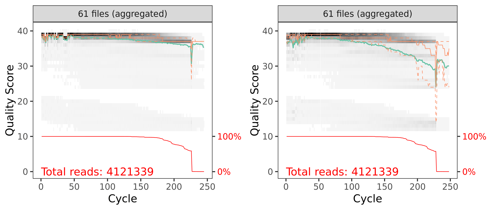
```
<small>`r caption_fig_its("filt_qual_scores_its_y0")`</small>

### Learn Error Rates

Now it is time to assess the error rate of the data. The DADA2 algorithm uses a parametric error model. Every amplicon data set has a different set of error rates and the `learnErrors` method learns this error model *from the data*. It does this by alternating estimation of the error rates and inference of sample composition until they converge on a jointly consistent solution. The algorithm begins with an initial guess, for which the maximum possible error rates in the data are used.

#### Forward Reads

```{r}
errF <- learnErrors(filtFs, multithread = TRUE)
```

```
100074969 total bases in 471445 reads from 6 samples will be used for learning the error rates.
```

```{r, warning=FALSE, layout="l-body-outset"}
plotErrors(errF, nominalQ=TRUE)
```

```{r}
p3 <- plotErrors(errF, nominalQ = TRUE)
ggsave("figures/its_plot_errorR_1_year_0.png", p3, width = 7, height = 5)
ggsave("figures/its_plot_errorR_1_year_0.png", p3)
```

```{r, echo=FALSE, eval=FALSE}
system("cp files/dada2/figures/its_plot_errorF_1_year_0.png include/dada2/its_plot_errorF_1_year_0.png")
```

```{r, echo=FALSE, layout="l-body-outset", eval=TRUE}
knitr::include_graphics("include/dada2/its_plot_errorF_1_year_0.png")
```
<small>`r caption_fig_its("error_F_its_y0")`</small>

#### Reverse Reads

```{r}
errR <- learnErrors(filtRs, multithread = TRUE)
```

```
100661724 total bases in 471445 reads from 6 samples will be used for learning the error rates.
```

```{r, warning=FALSE, layout="l-body-outset"}
plotErrors(errF, nominalQ=TRUE)
```

```{r}
p4 <- plotErrors(errR, nominalQ = TRUE)
ggsave("figures/its_plot_errorR_2_year_0.png", p4, width = 7, height = 5)
ggsave("figures/its_plot_errorR_2_year_0.png", p4)
```

```{r, echo=FALSE, eval=FALSE}
system("cp files/dada2/figures/its_plot_errorR_1_year_0.png include/dada2/its_plot_errorR_1_year_0.png")
```

```{r, echo=FALSE, layout="l-body-outset", eval=TRUE}
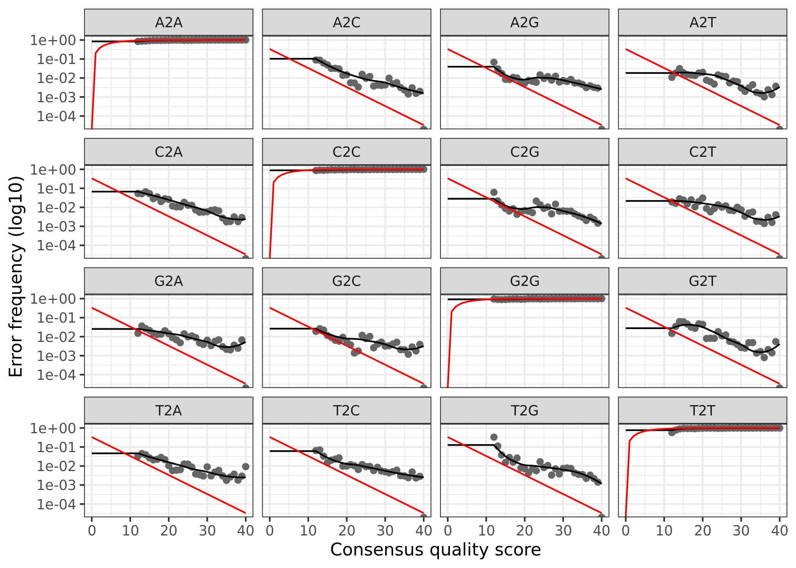
```
<small>`r caption_fig_its("error_R_its_y0")`</small>

The error rates for each possible transition (A to C, A to G, etc.) are shown. Points are the observed error rates for each consensus quality score. The black line shows the estimated error rates after convergence of the machine-learning algorithm. The red line shows the error rates expected under the nominal definition of the Q-score. Here the estimated error rates (black line) are a good fit to the observed rates (points), and the error rates drop with increased quality as expected.

### Dereplicate Reads

Now we can use `derepFastq` to identify the unique sequences in the forward and reverse fastq files.

```{r}
derepFs <- derepFastq(filtFs, verbose = TRUE)
derepRs <- derepFastq(filtRs, verbose = TRUE)
```

```{r}
names(derepFs) <- sample.names
names(derepRs) <- sample.names
```

<details markdown="1">
<summary>**Detailed results** of `derep` forward and reverse reads for Year 0</summary>
<pre><code>
Dereplicating sequence entries in Fastq file: RAW_Year_0/cutadapt/filtered/00-1_R1.fastq.gz
Encountered 17044 unique sequences from 82956 total sequences read.
Dereplicating sequence entries in Fastq file: RAW_Year_0/cutadapt/filtered/00-10_R1.fastq.gz
Encountered 11028 unique sequences from 63553 total sequences read.
Dereplicating sequence entries in Fastq file: RAW_Year_0/cutadapt/filtered/00-11_R1.fastq.gz
Encountered 11005 unique sequences from 62073 total sequences read.
Dereplicating sequence entries in Fastq file: RAW_Year_0/cutadapt/filtered/00-12_R1.fastq.gz
Encountered 15309 unique sequences from 74902 total sequences read.
Dereplicating sequence entries in Fastq file: RAW_Year_0/cutadapt/filtered/00-13_R1.fastq.gz
Encountered 12878 unique sequences from 100332 total sequences read.
Dereplicating sequence entries in Fastq file: RAW_Year_0/cutadapt/filtered/00-14_R1.fastq.gz
Encountered 14157 unique sequences from 87629 total sequences read.
Dereplicating sequence entries in Fastq file: RAW_Year_0/cutadapt/filtered/00-15_R1.fastq.gz
Encountered 9345 unique sequences from 57182 total sequences read.
Dereplicating sequence entries in Fastq file: RAW_Year_0/cutadapt/filtered/00-16_R1.fastq.gz
Encountered 10405 unique sequences from 71866 total sequences read.
Dereplicating sequence entries in Fastq file: RAW_Year_0/cutadapt/filtered/00-17_R1.fastq.gz
Encountered 12179 unique sequences from 68228 total sequences read.
Dereplicating sequence entries in Fastq file: RAW_Year_0/cutadapt/filtered/00-18_R1.fastq.gz
Encountered 8311 unique sequences from 89781 total sequences read.
Dereplicating sequence entries in Fastq file: RAW_Year_0/cutadapt/filtered/00-19_R1.fastq.gz
Encountered 7126 unique sequences from 91844 total sequences read.
Dereplicating sequence entries in Fastq file: RAW_Year_0/cutadapt/filtered/00-2_R1.fastq.gz
Encountered 10173 unique sequences from 48753 total sequences read.
Dereplicating sequence entries in Fastq file: RAW_Year_0/cutadapt/filtered/00-20_R1.fastq.gz
Encountered 15572 unique sequences from 114752 total sequences read.
Dereplicating sequence entries in Fastq file: RAW_Year_0/cutadapt/filtered/00-21_R1.fastq.gz
Encountered 17948 unique sequences from 102376 total sequences read.
Dereplicating sequence entries in Fastq file: RAW_Year_0/cutadapt/filtered/00-22_R1.fastq.gz
Encountered 18069 unique sequences from 113204 total sequences read.
Dereplicating sequence entries in Fastq file: RAW_Year_0/cutadapt/filtered/00-23_R1.fastq.gz
Encountered 7030 unique sequences from 44944 total sequences read.
Dereplicating sequence entries in Fastq file: RAW_Year_0/cutadapt/filtered/00-24_R1.fastq.gz
Encountered 10219 unique sequences from 60905 total sequences read.
Dereplicating sequence entries in Fastq file: RAW_Year_0/cutadapt/filtered/00-25_R1.fastq.gz
Encountered 6379 unique sequences from 37143 total sequences read.
Dereplicating sequence entries in Fastq file: RAW_Year_0/cutadapt/filtered/00-26_R1.fastq.gz
Encountered 12081 unique sequences from 62702 total sequences read.
Dereplicating sequence entries in Fastq file: RAW_Year_0/cutadapt/filtered/00-27_R1.fastq.gz
Encountered 13604 unique sequences from 74081 total sequences read.
Dereplicating sequence entries in Fastq file: RAW_Year_0/cutadapt/filtered/00-28_R1.fastq.gz
Encountered 13762 unique sequences from 77972 total sequences read.
Dereplicating sequence entries in Fastq file: RAW_Year_0/cutadapt/filtered/00-29_R1.fastq.gz
Encountered 14629 unique sequences from 82403 total sequences read.
Dereplicating sequence entries in Fastq file: RAW_Year_0/cutadapt/filtered/00-3_R1.fastq.gz
Encountered 12378 unique sequences from 73752 total sequences read.
Dereplicating sequence entries in Fastq file: RAW_Year_0/cutadapt/filtered/00-30_R1.fastq.gz
Encountered 18036 unique sequences from 106981 total sequences read.
Dereplicating sequence entries in Fastq file: RAW_Year_0/cutadapt/filtered/00-31_R1.fastq.gz
Encountered 14496 unique sequences from 87367 total sequences read.
Dereplicating sequence entries in Fastq file: RAW_Year_0/cutadapt/filtered/00-32_R1.fastq.gz
Encountered 8231 unique sequences from 45861 total sequences read.
Dereplicating sequence entries in Fastq file: RAW_Year_0/cutadapt/filtered/00-33_R1.fastq.gz
Encountered 1421 unique sequences from 4309 total sequences read.
Dereplicating sequence entries in Fastq file: RAW_Year_0/cutadapt/filtered/00-34_R1.fastq.gz
Encountered 13833 unique sequences from 69123 total sequences read.
Dereplicating sequence entries in Fastq file: RAW_Year_0/cutadapt/filtered/00-35_R1.fastq.gz
Encountered 15543 unique sequences from 98984 total sequences read.
Dereplicating sequence entries in Fastq file: RAW_Year_0/cutadapt/filtered/00-36_R1.fastq.gz
Encountered 13008 unique sequences from 73057 total sequences read.
Dereplicating sequence entries in Fastq file: RAW_Year_0/cutadapt/filtered/00-37_R1.fastq.gz
Encountered 17886 unique sequences from 123842 total sequences read.
Dereplicating sequence entries in Fastq file: RAW_Year_0/cutadapt/filtered/00-38_R1.fastq.gz
Encountered 16809 unique sequences from 84357 total sequences read.
Dereplicating sequence entries in Fastq file: RAW_Year_0/cutadapt/filtered/00-39_R1.fastq.gz
Encountered 12272 unique sequences from 69846 total sequences read.
Dereplicating sequence entries in Fastq file: RAW_Year_0/cutadapt/filtered/00-4_R1.fastq.gz
Encountered 12094 unique sequences from 71970 total sequences read.
Dereplicating sequence entries in Fastq file: RAW_Year_0/cutadapt/filtered/00-40_R1.fastq.gz
Encountered 6298 unique sequences from 50267 total sequences read.
Dereplicating sequence entries in Fastq file: RAW_Year_0/cutadapt/filtered/00-41_R1.fastq.gz
Encountered 8442 unique sequences from 31809 total sequences read.
Dereplicating sequence entries in Fastq file: RAW_Year_0/cutadapt/filtered/00-42_R1.fastq.gz
Encountered 11298 unique sequences from 53815 total sequences read.
Dereplicating sequence entries in Fastq file: RAW_Year_0/cutadapt/filtered/00-43_R1.fastq.gz
Encountered 13307 unique sequences from 73254 total sequences read.
Dereplicating sequence entries in Fastq file: RAW_Year_0/cutadapt/filtered/00-44_R1.fastq.gz
Encountered 14146 unique sequences from 76501 total sequences read.
Dereplicating sequence entries in Fastq file: RAW_Year_0/cutadapt/filtered/00-45_R1.fastq.gz
Encountered 13085 unique sequences from 77644 total sequences read.
Dereplicating sequence entries in Fastq file: RAW_Year_0/cutadapt/filtered/00-46_R1.fastq.gz
Encountered 10122 unique sequences from 60080 total sequences read.
Dereplicating sequence entries in Fastq file: RAW_Year_0/cutadapt/filtered/00-47_R1.fastq.gz
Encountered 8653 unique sequences from 41823 total sequences read.
Dereplicating sequence entries in Fastq file: RAW_Year_0/cutadapt/filtered/00-48_R1.fastq.gz
Encountered 13600 unique sequences from 117988 total sequences read.
Dereplicating sequence entries in Fastq file: RAW_Year_0/cutadapt/filtered/00-49_R1.fastq.gz
Encountered 7248 unique sequences from 28048 total sequences read.
Dereplicating sequence entries in Fastq file: RAW_Year_0/cutadapt/filtered/00-5_R1.fastq.gz
Encountered 12510 unique sequences from 93835 total sequences read.
Dereplicating sequence entries in Fastq file: RAW_Year_0/cutadapt/filtered/00-50_R1.fastq.gz
Encountered 6780 unique sequences from 34202 total sequences read.
Dereplicating sequence entries in Fastq file: RAW_Year_0/cutadapt/filtered/00-51_R1.fastq.gz
Encountered 5528 unique sequences from 25595 total sequences read.
Dereplicating sequence entries in Fastq file: RAW_Year_0/cutadapt/filtered/00-52_R1.fastq.gz
Encountered 5820 unique sequences from 26279 total sequences read.
Dereplicating sequence entries in Fastq file: RAW_Year_0/cutadapt/filtered/00-53_R1.fastq.gz
Encountered 3512 unique sequences from 28624 total sequences read.
Dereplicating sequence entries in Fastq file: RAW_Year_0/cutadapt/filtered/00-54_R1.fastq.gz
Encountered 5094 unique sequences from 26143 total sequences read.
Dereplicating sequence entries in Fastq file: RAW_Year_0/cutadapt/filtered/00-55_R1.fastq.gz
Encountered 5055 unique sequences from 25164 total sequences read.
Dereplicating sequence entries in Fastq file: RAW_Year_0/cutadapt/filtered/00-56_R1.fastq.gz
Encountered 3819 unique sequences from 18436 total sequences read.
Dereplicating sequence entries in Fastq file: RAW_Year_0/cutadapt/filtered/00-57_R1.fastq.gz
Encountered 8369 unique sequences from 33620 total sequences read.
Dereplicating sequence entries in Fastq file: RAW_Year_0/cutadapt/filtered/00-58_R1.fastq.gz
Encountered 15685 unique sequences from 84157 total sequences read.
Dereplicating sequence entries in Fastq file: RAW_Year_0/cutadapt/filtered/00-59_R1.fastq.gz
Encountered 18473 unique sequences from 100291 total sequences read.
Dereplicating sequence entries in Fastq file: RAW_Year_0/cutadapt/filtered/00-6_R1.fastq.gz
Encountered 13893 unique sequences from 76649 total sequences read.
Dereplicating sequence entries in Fastq file: RAW_Year_0/cutadapt/filtered/00-60_R1.fastq.gz
Encountered 24031 unique sequences from 145030 total sequences read.
Dereplicating sequence entries in Fastq file: RAW_Year_0/cutadapt/filtered/00-7_R1.fastq.gz
Encountered 10877 unique sequences from 58731 total sequences read.
Dereplicating sequence entries in Fastq file: RAW_Year_0/cutadapt/filtered/00-8_R1.fastq.gz
Encountered 11129 unique sequences from 72238 total sequences read.
Dereplicating sequence entries in Fastq file: RAW_Year_0/cutadapt/filtered/00-9_R1.fastq.gz
Encountered 17971 unique sequences from 78928 total sequences read.
Dereplicating sequence entries in Fastq file: RAW_Year_0/cutadapt/filtered/00-Negative_R1.fastq.gz
Encountered 448 unique sequences from 3158 total sequences read.
Dereplicating sequence entries in Fastq file: RAW_Year_0/cutadapt/filtered/00-1_R2.fastq.gz
Encountered 29923 unique sequences from 82956 total sequences read.
Dereplicating sequence entries in Fastq file: RAW_Year_0/cutadapt/filtered/00-10_R2.fastq.gz
Encountered 21575 unique sequences from 63553 total sequences read.
Dereplicating sequence entries in Fastq file: RAW_Year_0/cutadapt/filtered/00-11_R2.fastq.gz
Encountered 24733 unique sequences from 62073 total sequences read.
Dereplicating sequence entries in Fastq file: RAW_Year_0/cutadapt/filtered/00-12_R2.fastq.gz
Encountered 27876 unique sequences from 74902 total sequences read.
Dereplicating sequence entries in Fastq file: RAW_Year_0/cutadapt/filtered/00-13_R2.fastq.gz
Encountered 30285 unique sequences from 100332 total sequences read.
Dereplicating sequence entries in Fastq file: RAW_Year_0/cutadapt/filtered/00-14_R2.fastq.gz
Encountered 34725 unique sequences from 87629 total sequences read.
Dereplicating sequence entries in Fastq file: RAW_Year_0/cutadapt/filtered/00-15_R2.fastq.gz
Encountered 21691 unique sequences from 57182 total sequences read.
Dereplicating sequence entries in Fastq file: RAW_Year_0/cutadapt/filtered/00-16_R2.fastq.gz
Encountered 23269 unique sequences from 71866 total sequences read.
Dereplicating sequence entries in Fastq file: RAW_Year_0/cutadapt/filtered/00-17_R2.fastq.gz
Encountered 17939 unique sequences from 68228 total sequences read.
Dereplicating sequence entries in Fastq file: RAW_Year_0/cutadapt/filtered/00-18_R2.fastq.gz
Encountered 14773 unique sequences from 89781 total sequences read.
Dereplicating sequence entries in Fastq file: RAW_Year_0/cutadapt/filtered/00-19_R2.fastq.gz
Encountered 15944 unique sequences from 91844 total sequences read.
Dereplicating sequence entries in Fastq file: RAW_Year_0/cutadapt/filtered/00-2_R2.fastq.gz
Encountered 17245 unique sequences from 48753 total sequences read.
Dereplicating sequence entries in Fastq file: RAW_Year_0/cutadapt/filtered/00-20_R2.fastq.gz
Encountered 24096 unique sequences from 114752 total sequences read.
Dereplicating sequence entries in Fastq file: RAW_Year_0/cutadapt/filtered/00-21_R2.fastq.gz
Encountered 34867 unique sequences from 102376 total sequences read.
Dereplicating sequence entries in Fastq file: RAW_Year_0/cutadapt/filtered/00-22_R2.fastq.gz
Encountered 28710 unique sequences from 113204 total sequences read.
Dereplicating sequence entries in Fastq file: RAW_Year_0/cutadapt/filtered/00-23_R2.fastq.gz
Encountered 13077 unique sequences from 44944 total sequences read.
Dereplicating sequence entries in Fastq file: RAW_Year_0/cutadapt/filtered/00-24_R2.fastq.gz
Encountered 16871 unique sequences from 60905 total sequences read.
Dereplicating sequence entries in Fastq file: RAW_Year_0/cutadapt/filtered/00-25_R2.fastq.gz
Encountered 11016 unique sequences from 37143 total sequences read.
Dereplicating sequence entries in Fastq file: RAW_Year_0/cutadapt/filtered/00-26_R2.fastq.gz
Encountered 18605 unique sequences from 62702 total sequences read.
Dereplicating sequence entries in Fastq file: RAW_Year_0/cutadapt/filtered/00-27_R2.fastq.gz
Encountered 22267 unique sequences from 74081 total sequences read.
Dereplicating sequence entries in Fastq file: RAW_Year_0/cutadapt/filtered/00-28_R2.fastq.gz
Encountered 23412 unique sequences from 77972 total sequences read.
Dereplicating sequence entries in Fastq file: RAW_Year_0/cutadapt/filtered/00-29_R2.fastq.gz
Encountered 27394 unique sequences from 82403 total sequences read.
Dereplicating sequence entries in Fastq file: RAW_Year_0/cutadapt/filtered/00-3_R2.fastq.gz
Encountered 24675 unique sequences from 73752 total sequences read.
Dereplicating sequence entries in Fastq file: RAW_Year_0/cutadapt/filtered/00-30_R2.fastq.gz
Encountered 30883 unique sequences from 106981 total sequences read.
Dereplicating sequence entries in Fastq file: RAW_Year_0/cutadapt/filtered/00-31_R2.fastq.gz
Encountered 28539 unique sequences from 87367 total sequences read.
Dereplicating sequence entries in Fastq file: RAW_Year_0/cutadapt/filtered/00-32_R2.fastq.gz
Encountered 14575 unique sequences from 45861 total sequences read.
Dereplicating sequence entries in Fastq file: RAW_Year_0/cutadapt/filtered/00-33_R2.fastq.gz
Encountered 2064 unique sequences from 4309 total sequences read.
Dereplicating sequence entries in Fastq file: RAW_Year_0/cutadapt/filtered/00-34_R2.fastq.gz
Encountered 23337 unique sequences from 69123 total sequences read.
Dereplicating sequence entries in Fastq file: RAW_Year_0/cutadapt/filtered/00-35_R2.fastq.gz
Encountered 29559 unique sequences from 98984 total sequences read.
Dereplicating sequence entries in Fastq file: RAW_Year_0/cutadapt/filtered/00-36_R2.fastq.gz
Encountered 24848 unique sequences from 73057 total sequences read.
Dereplicating sequence entries in Fastq file: RAW_Year_0/cutadapt/filtered/00-37_R2.fastq.gz
Encountered 36328 unique sequences from 123842 total sequences read.
Dereplicating sequence entries in Fastq file: RAW_Year_0/cutadapt/filtered/00-38_R2.fastq.gz
Encountered 29426 unique sequences from 84357 total sequences read.
Dereplicating sequence entries in Fastq file: RAW_Year_0/cutadapt/filtered/00-39_R2.fastq.gz
Encountered 26439 unique sequences from 69846 total sequences read.
Dereplicating sequence entries in Fastq file: RAW_Year_0/cutadapt/filtered/00-4_R2.fastq.gz
Encountered 22204 unique sequences from 71970 total sequences read.
Dereplicating sequence entries in Fastq file: RAW_Year_0/cutadapt/filtered/00-40_R2.fastq.gz
Encountered 10975 unique sequences from 50267 total sequences read.
Dereplicating sequence entries in Fastq file: RAW_Year_0/cutadapt/filtered/00-41_R2.fastq.gz
Encountered 15098 unique sequences from 31809 total sequences read.
Dereplicating sequence entries in Fastq file: RAW_Year_0/cutadapt/filtered/00-42_R2.fastq.gz
Encountered 20921 unique sequences from 53815 total sequences read.
Dereplicating sequence entries in Fastq file: RAW_Year_0/cutadapt/filtered/00-43_R2.fastq.gz
Encountered 28316 unique sequences from 73254 total sequences read.
Dereplicating sequence entries in Fastq file: RAW_Year_0/cutadapt/filtered/00-44_R2.fastq.gz
Encountered 26367 unique sequences from 76501 total sequences read.
Dereplicating sequence entries in Fastq file: RAW_Year_0/cutadapt/filtered/00-45_R2.fastq.gz
Encountered 28810 unique sequences from 77644 total sequences read.
Dereplicating sequence entries in Fastq file: RAW_Year_0/cutadapt/filtered/00-46_R2.fastq.gz
Encountered 24187 unique sequences from 60080 total sequences read.
Dereplicating sequence entries in Fastq file: RAW_Year_0/cutadapt/filtered/00-47_R2.fastq.gz
Encountered 16181 unique sequences from 41823 total sequences read.
Dereplicating sequence entries in Fastq file: RAW_Year_0/cutadapt/filtered/00-48_R2.fastq.gz
Encountered 28200 unique sequences from 117988 total sequences read.
Dereplicating sequence entries in Fastq file: RAW_Year_0/cutadapt/filtered/00-49_R2.fastq.gz
Encountered 11021 unique sequences from 28048 total sequences read.
Dereplicating sequence entries in Fastq file: RAW_Year_0/cutadapt/filtered/00-5_R2.fastq.gz
Encountered 26444 unique sequences from 93835 total sequences read.
Dereplicating sequence entries in Fastq file: RAW_Year_0/cutadapt/filtered/00-50_R2.fastq.gz
Encountered 10992 unique sequences from 34202 total sequences read.
Dereplicating sequence entries in Fastq file: RAW_Year_0/cutadapt/filtered/00-51_R2.fastq.gz
Encountered 10088 unique sequences from 25595 total sequences read.
Dereplicating sequence entries in Fastq file: RAW_Year_0/cutadapt/filtered/00-52_R2.fastq.gz
Encountered 8636 unique sequences from 26279 total sequences read.
Dereplicating sequence entries in Fastq file: RAW_Year_0/cutadapt/filtered/00-53_R2.fastq.gz
Encountered 7512 unique sequences from 28624 total sequences read.
Dereplicating sequence entries in Fastq file: RAW_Year_0/cutadapt/filtered/00-54_R2.fastq.gz
Encountered 8227 unique sequences from 26143 total sequences read.
Dereplicating sequence entries in Fastq file: RAW_Year_0/cutadapt/filtered/00-55_R2.fastq.gz
Encountered 9280 unique sequences from 25164 total sequences read.
Dereplicating sequence entries in Fastq file: RAW_Year_0/cutadapt/filtered/00-56_R2.fastq.gz
Encountered 5581 unique sequences from 18436 total sequences read.
Dereplicating sequence entries in Fastq file: RAW_Year_0/cutadapt/filtered/00-57_R2.fastq.gz
Encountered 13598 unique sequences from 33620 total sequences read.
Dereplicating sequence entries in Fastq file: RAW_Year_0/cutadapt/filtered/00-58_R2.fastq.gz
Encountered 27871 unique sequences from 84157 total sequences read.
Dereplicating sequence entries in Fastq file: RAW_Year_0/cutadapt/filtered/00-59_R2.fastq.gz
Encountered 37101 unique sequences from 100291 total sequences read.
Dereplicating sequence entries in Fastq file: RAW_Year_0/cutadapt/filtered/00-6_R2.fastq.gz
Encountered 25982 unique sequences from 76649 total sequences read.
Dereplicating sequence entries in Fastq file: RAW_Year_0/cutadapt/filtered/00-60_R2.fastq.gz
Encountered 38918 unique sequences from 145030 total sequences read.
Dereplicating sequence entries in Fastq file: RAW_Year_0/cutadapt/filtered/00-7_R2.fastq.gz
Encountered 23514 unique sequences from 58731 total sequences read.
Dereplicating sequence entries in Fastq file: RAW_Year_0/cutadapt/filtered/00-8_R2.fastq.gz
Encountered 20805 unique sequences from 72238 total sequences read.
Dereplicating sequence entries in Fastq file: RAW_Year_0/cutadapt/filtered/00-9_R2.fastq.gz
Encountered 30917 unique sequences from 78928 total sequences read.
Dereplicating sequence entries in Fastq file: RAW_Year_0/cutadapt/filtered/00-Negative_R2.fastq.gz
Encountered 688 unique sequences from 3158 total sequences read.
</code></pre>
</details>
> [Back to top of this section](#filtering-error-correction-dereplication-1)

:::

::: {.panel}

## Year 1

We need the forward and reverse fastq file names and the sample names.

```{r}
cutFs <- sort(list.files(path.cut, pattern = "_R1.fastq.gz", full.names = TRUE))
cutRs <- sort(list.files(path.cut, pattern = "_R2.fastq.gz", full.names = TRUE))

get.sample.name <- function(fname) strsplit(basename(fname), "_")[[1]][1]
sample.names <- unname(sapply(cutFs, get.sample.name))
head(sample.names)
```

```{r, eval=TRUE}
c("S11-T22",  "S11-T224", "S11-T225", "S11-T226", "S14-T217", "S14-T218")
```

### Filtering

```{r}
out <- filterAndTrim(cutFs, filtFs, cutRs, filtRs,  
                     maxN = 0, maxEE = 2, truncQ = 2, 
                     minLen = 50, rm.phix = TRUE, 
                     compress = TRUE, multithread = 20)  
out
```

<aside>
These parameters should be set based on the anticipated length of the amplicon and the read quality.
</aside>

<br/>

```{r, echo=FALSE, eval=TRUE}
seq_table <- read.table("files/dada2/tables/its_filt_year_1.txt",
                       header = TRUE, sep = "\t")
```
<small>`r caption_tab_its("filter_its_y1")`</small>

```{r, echo=FALSE, layout="l-body", eval=TRUE}
seq_table %>%
  download_this(
    output_name = "its_filter_year_1",
    output_extension = ".csv",
    button_label = "Download data as csv file",
    button_type = "default",
    csv2 = FALSE,
    has_icon = TRUE,
    icon = "fa fa-save")

reactable(seq_table,
  defaultColDef = colDef(
    header = function(value) gsub("_", " ", value, fixed = TRUE),
    cell = function(value) format(value, nsmall = 1),
    align = "center", filterable = FALSE, sortable = TRUE, resizable = TRUE,
    footerStyle = list(fontWeight = "bold")
    ), 
  columns = list(
    Sample_ID = colDef(name = "Sample ID", 
                       sticky = "left", 
                       style = list(borderRight = "1px solid #eee"),
                       headerStyle = list(borderRight = "1px solid #eee"), 
                       align = "left",
                       minWidth = 150, footer = "Total reads", filterable = TRUE), 
    reads_in = colDef(footer = function(values) sprintf("%.0f", sum(values))),
    reads_out = colDef(footer = function(values) sprintf("%.0f", sum(values)))
    ), 
  searchable = FALSE, defaultPageSize = 5, 
  pageSizeOptions = c(5, 10, nrow(seq_table)), 
  showPageSizeOptions = TRUE, highlight = TRUE, 
  bordered = TRUE, striped = TRUE, compact = FALSE, 
  wrap = FALSE, showSortable = TRUE, fullWidth = TRUE,
  theme = reactableTheme(style = list(fontSize = "0.8em")))
```
```{r, layout="l-body-outset", warning=FALSE, fig.height=3}
p1 <- plotQualityProfile(filtFs[1:61], aggregate = TRUE)
p2 <- plotQualityProfile(filtRs[1:61], aggregate = TRUE)

p3 <- grid.arrange(p1, p2, nrow = 1)
ggsave("figures/its_post_filt_plot_qscores_bocas_year_1.png", p3, width = 7, height = 3)
```


```{r, echo=FALSE, eval=FALSE}
system("cp files/dada2/figures/its_post_filt_plot_qscores_year_1.png include/dada2/its_post_filt_plot_qscores_year_1.png")
```

```{r, echo=FALSE, layout="l-body", warning=FALSE, fig.height=4, fig.width=4, eval=TRUE}
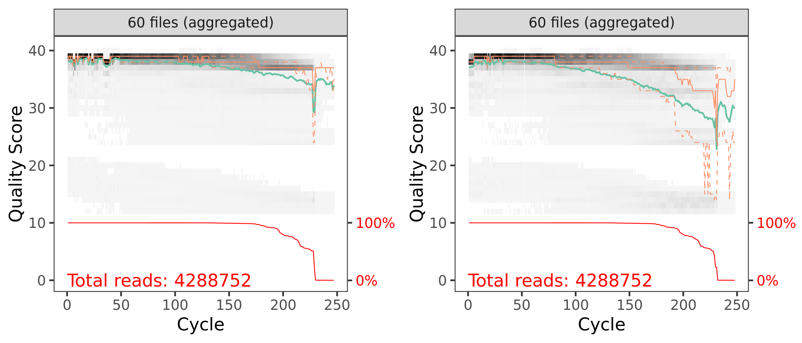
```
<small>`r caption_fig_its("filt_qual_scores_its_y1")`</small>

### Learn Error Rates

#### Forward Reads

```{r}
errF <- learnErrors(filtFs, multithread = TRUE)
```

```
114891541 total bases in 533565 reads from 7 samples will be used for learning the error rates.
```

```{r, warning=FALSE, layout="l-body-outset"}
plotErrors(errF, nominalQ=TRUE)
```

```{r}
p3 <- plotErrors(errF, nominalQ = TRUE)
ggsave("figures/its_plot_errorR_1_year_1.png", p3, width = 7, height = 5)
ggsave("figures/its_plot_errorR_1_year_1.png", p3)
```

```{r, echo=FALSE, eval=FALSE}
system("cp files/dada2/figures/its_plot_errorF_1_year_1.png include/dada2/its_plot_errorF_1_year_1.png")
```

```{r, echo=FALSE, layout="l-body-outset", eval=TRUE}
knitr::include_graphics("include/dada2/its_plot_errorF_1_year_1.png")
```
<small>`r caption_fig_its("error_F_its_y1")`</small>

#### Reverse Reads

```{r}
errR <- learnErrors(filtRs, multithread = TRUE)
```

```
115375309 total bases in 533565 reads from 7 samples will be used for learning the error rates.
```

```{r, warning=FALSE, layout="l-body-outset"}
plotErrors(errF, nominalQ=TRUE)
```

```{r}
p4 <- plotErrors(errR, nominalQ = TRUE)
ggsave("figures/its_plot_errorR_2_year_1.png", p4, width = 7, height = 5)
ggsave("figures/its_plot_errorR_2_year_1.png", p4)
```

```{r, echo=FALSE, eval=FALSE}
system("cp files/dada2/figures/its_plot_errorR_1_year_1.png include/dada2/its_plot_errorR_1_year_1.png")
```

```{r, echo=FALSE, layout="l-body-outset", eval=TRUE}

```
<small>`r caption_fig_its("error_R_its_y1")`</small>

### Dereplicate Reads

```{r}
derepFs <- derepFastq(filtFs, verbose = TRUE)
derepRs <- derepFastq(filtRs, verbose = TRUE)
```

```{r}
names(derepFs) <- sample.names
names(derepRs) <- sample.names
```

<details markdown="1">
<summary>**Detailed results** of `derep` forward and reverse reads for Year 1</summary>
<pre><code>
Dereplicating sequence entries in Fastq file: RAW_Year_1/cutadapt/filtered/S11-T22_R1.fastq.gz
Encountered 13695 unique sequences from 60056 total sequences read.
Dereplicating sequence entries in Fastq file: RAW_Year_1/cutadapt/filtered/S11-T224_R1.fastq.gz
Encountered 11745 unique sequences from 86285 total sequences read.
Dereplicating sequence entries in Fastq file: RAW_Year_1/cutadapt/filtered/S11-T225_R1.fastq.gz
Encountered 11507 unique sequences from 77917 total sequences read.
Dereplicating sequence entries in Fastq file: RAW_Year_1/cutadapt/filtered/S11-T226_R1.fastq.gz
Encountered 12704 unique sequences from 88721 total sequences read.
Dereplicating sequence entries in Fastq file: RAW_Year_1/cutadapt/filtered/S14-T217_R1.fastq.gz
Encountered 16367 unique sequences from 75174 total sequences read.
Dereplicating sequence entries in Fastq file: RAW_Year_1/cutadapt/filtered/S14-T218_R1.fastq.gz
Encountered 9353 unique sequences from 69743 total sequences read.
Dereplicating sequence entries in Fastq file: RAW_Year_1/cutadapt/filtered/S14-T219_R1.fastq.gz
Encountered 15642 unique sequences from 75669 total sequences read.
Dereplicating sequence entries in Fastq file: RAW_Year_1/cutadapt/filtered/S14-T28_R1.fastq.gz
Encountered 13360 unique sequences from 71101 total sequences read.
Dereplicating sequence entries in Fastq file: RAW_Year_1/cutadapt/filtered/S16-T230_R1.fastq.gz
Encountered 7630 unique sequences from 91773 total sequences read.
Dereplicating sequence entries in Fastq file: RAW_Year_1/cutadapt/filtered/S16-T231_R1.fastq.gz
Encountered 9786 unique sequences from 81602 total sequences read.
Dereplicating sequence entries in Fastq file: RAW_Year_1/cutadapt/filtered/S16-T232_R1.fastq.gz
Encountered 13333 unique sequences from 58880 total sequences read.
Dereplicating sequence entries in Fastq file: RAW_Year_1/cutadapt/filtered/S16-T32_R1.fastq.gz
Encountered 12329 unique sequences from 60556 total sequences read.
Dereplicating sequence entries in Fastq file: RAW_Year_1/cutadapt/filtered/S17-T227_R1.fastq.gz
Encountered 14483 unique sequences from 63216 total sequences read.
Dereplicating sequence entries in Fastq file: RAW_Year_1/cutadapt/filtered/S17-T228_R1.fastq.gz
Encountered 15871 unique sequences from 85079 total sequences read.
Dereplicating sequence entries in Fastq file: RAW_Year_1/cutadapt/filtered/S17-T229_R1.fastq.gz
Encountered 13402 unique sequences from 64691 total sequences read.
Dereplicating sequence entries in Fastq file: RAW_Year_1/cutadapt/filtered/S17-T34_R1.fastq.gz
Encountered 10604 unique sequences from 52002 total sequences read.
Dereplicating sequence entries in Fastq file: RAW_Year_1/cutadapt/filtered/S30-T203_R1.fastq.gz
Encountered 14527 unique sequences from 83290 total sequences read.
Dereplicating sequence entries in Fastq file: RAW_Year_1/cutadapt/filtered/S30-T204_R1.fastq.gz
Encountered 14304 unique sequences from 68972 total sequences read.
Dereplicating sequence entries in Fastq file: RAW_Year_1/cutadapt/filtered/S30-T205_R1.fastq.gz
Encountered 15682 unique sequences from 82408 total sequences read.
Dereplicating sequence entries in Fastq file: RAW_Year_1/cutadapt/filtered/S30-T60_R1.fastq.gz
Encountered 11579 unique sequences from 79665 total sequences read.
Dereplicating sequence entries in Fastq file: RAW_Year_1/cutadapt/filtered/S31-T206_R1.fastq.gz
Encountered 14848 unique sequences from 59597 total sequences read.
Dereplicating sequence entries in Fastq file: RAW_Year_1/cutadapt/filtered/S31-T207_R1.fastq.gz
Encountered 15006 unique sequences from 66273 total sequences read.
Dereplicating sequence entries in Fastq file: RAW_Year_1/cutadapt/filtered/S31-T208_R1.fastq.gz
Encountered 13332 unique sequences from 60898 total sequences read.
Dereplicating sequence entries in Fastq file: RAW_Year_1/cutadapt/filtered/S31-T62_R1.fastq.gz
Encountered 10560 unique sequences from 50723 total sequences read.
Dereplicating sequence entries in Fastq file: RAW_Year_1/cutadapt/filtered/S33-T243_R1.fastq.gz
Encountered 11540 unique sequences from 71027 total sequences read.
Dereplicating sequence entries in Fastq file: RAW_Year_1/cutadapt/filtered/S33-T244_R1.fastq.gz
Encountered 12839 unique sequences from 77715 total sequences read.
Dereplicating sequence entries in Fastq file: RAW_Year_1/cutadapt/filtered/S33-T245_R1.fastq.gz
Encountered 14848 unique sequences from 61761 total sequences read.
Dereplicating sequence entries in Fastq file: RAW_Year_1/cutadapt/filtered/S33-T66_R1.fastq.gz
Encountered 13063 unique sequences from 56773 total sequences read.
Dereplicating sequence entries in Fastq file: RAW_Year_1/cutadapt/filtered/S41-T200_R1.fastq.gz
Encountered 16171 unique sequences from 88635 total sequences read.
Dereplicating sequence entries in Fastq file: RAW_Year_1/cutadapt/filtered/S41-T201_R1.fastq.gz
Encountered 11918 unique sequences from 73034 total sequences read.
Dereplicating sequence entries in Fastq file: RAW_Year_1/cutadapt/filtered/S41-T202_R1.fastq.gz
Encountered 16499 unique sequences from 73384 total sequences read.
Dereplicating sequence entries in Fastq file: RAW_Year_1/cutadapt/filtered/S41-T81_R1.fastq.gz
Encountered 11906 unique sequences from 63155 total sequences read.
Dereplicating sequence entries in Fastq file: RAW_Year_1/cutadapt/filtered/S66-T132_R1.fastq.gz
Encountered 8949 unique sequences from 59106 total sequences read.
Dereplicating sequence entries in Fastq file: RAW_Year_1/cutadapt/filtered/S66-T233_R1.fastq.gz
Encountered 11867 unique sequences from 59666 total sequences read.
Dereplicating sequence entries in Fastq file: RAW_Year_1/cutadapt/filtered/S66-T234_R1.fastq.gz
Encountered 10990 unique sequences from 54550 total sequences read.
Dereplicating sequence entries in Fastq file: RAW_Year_1/cutadapt/filtered/S66-T235_R1.fastq.gz
Encountered 12596 unique sequences from 55364 total sequences read.
Dereplicating sequence entries in Fastq file: RAW_Year_1/cutadapt/filtered/S68-T209_R1.fastq.gz
Encountered 11508 unique sequences from 67050 total sequences read.
Dereplicating sequence entries in Fastq file: RAW_Year_1/cutadapt/filtered/S68-T210_R1.fastq.gz
Encountered 14585 unique sequences from 83931 total sequences read.
Dereplicating sequence entries in Fastq file: RAW_Year_1/cutadapt/filtered/S68-T211_R1.fastq.gz
Encountered 12884 unique sequences from 71393 total sequences read.
Dereplicating sequence entries in Fastq file: RAW_Year_1/cutadapt/filtered/S68-T212_R1.fastq.gz
Encountered 13694 unique sequences from 91117 total sequences read.
Dereplicating sequence entries in Fastq file: RAW_Year_1/cutadapt/filtered/S69-T213_R1.fastq.gz
Encountered 10975 unique sequences from 54819 total sequences read.
Dereplicating sequence entries in Fastq file: RAW_Year_1/cutadapt/filtered/S69-T214_R1.fastq.gz
Encountered 8494 unique sequences from 45749 total sequences read.
Dereplicating sequence entries in Fastq file: RAW_Year_1/cutadapt/filtered/S69-T215_R1.fastq.gz
Encountered 12856 unique sequences from 83477 total sequences read.
Dereplicating sequence entries in Fastq file: RAW_Year_1/cutadapt/filtered/S69-T216_R1.fastq.gz
Encountered 10398 unique sequences from 60891 total sequences read.
Dereplicating sequence entries in Fastq file: RAW_Year_1/cutadapt/filtered/S7-T13_R1.fastq.gz
Encountered 9987 unique sequences from 54438 total sequences read.
Dereplicating sequence entries in Fastq file: RAW_Year_1/cutadapt/filtered/S7-T240_R1.fastq.gz
Encountered 15414 unique sequences from 69756 total sequences read.
Dereplicating sequence entries in Fastq file: RAW_Year_1/cutadapt/filtered/S7-T241_R1.fastq.gz
Encountered 13087 unique sequences from 67806 total sequences read.
Dereplicating sequence entries in Fastq file: RAW_Year_1/cutadapt/filtered/S7-T242_R1.fastq.gz
Encountered 11398 unique sequences from 73623 total sequences read.
Dereplicating sequence entries in Fastq file: RAW_Year_1/cutadapt/filtered/S70-T220_R1.fastq.gz
Encountered 6314 unique sequences from 64281 total sequences read.
Dereplicating sequence entries in Fastq file: RAW_Year_1/cutadapt/filtered/S70-T221_R1.fastq.gz
Encountered 15955 unique sequences from 68540 total sequences read.
Dereplicating sequence entries in Fastq file: RAW_Year_1/cutadapt/filtered/S70-T222_R1.fastq.gz
Encountered 11940 unique sequences from 75645 total sequences read.
Dereplicating sequence entries in Fastq file: RAW_Year_1/cutadapt/filtered/S70-T223_R1.fastq.gz
Encountered 5769 unique sequences from 89108 total sequences read.
Dereplicating sequence entries in Fastq file: RAW_Year_1/cutadapt/filtered/S71-T236_R1.fastq.gz
Encountered 14612 unique sequences from 73452 total sequences read.
Dereplicating sequence entries in Fastq file: RAW_Year_1/cutadapt/filtered/S71-T237_R1.fastq.gz
Encountered 15805 unique sequences from 105240 total sequences read.
Dereplicating sequence entries in Fastq file: RAW_Year_1/cutadapt/filtered/S71-T238_R1.fastq.gz
Encountered 16622 unique sequences from 91044 total sequences read.
Dereplicating sequence entries in Fastq file: RAW_Year_1/cutadapt/filtered/S71-T239_R1.fastq.gz
Encountered 14915 unique sequences from 97253 total sequences read.
Dereplicating sequence entries in Fastq file: RAW_Year_1/cutadapt/filtered/S72-T246_R1.fastq.gz
Encountered 14407 unique sequences from 61665 total sequences read.
Dereplicating sequence entries in Fastq file: RAW_Year_1/cutadapt/filtered/S72-T247_R1.fastq.gz
Encountered 13587 unique sequences from 69831 total sequences read.
Dereplicating sequence entries in Fastq file: RAW_Year_1/cutadapt/filtered/S72-T248_R1.fastq.gz
Encountered 13313 unique sequences from 84093 total sequences read.
Dereplicating sequence entries in Fastq file: RAW_Year_1/cutadapt/filtered/S72-T249_R1.fastq.gz
Encountered 10657 unique sequences from 76089 total sequences read.
Dereplicating sequence entries in Fastq file: RAW_Year_1/cutadapt/filtered/S11-T22_R2.fastq.gz
Encountered 23890 unique sequences from 60056 total sequences read.
Dereplicating sequence entries in Fastq file: RAW_Year_1/cutadapt/filtered/S11-T224_R2.fastq.gz
Encountered 21023 unique sequences from 86285 total sequences read.
Dereplicating sequence entries in Fastq file: RAW_Year_1/cutadapt/filtered/S11-T225_R2.fastq.gz
Encountered 23847 unique sequences from 77917 total sequences read.
Dereplicating sequence entries in Fastq file: RAW_Year_1/cutadapt/filtered/S11-T226_R2.fastq.gz
Encountered 29499 unique sequences from 88721 total sequences read.
Dereplicating sequence entries in Fastq file: RAW_Year_1/cutadapt/filtered/S14-T217_R2.fastq.gz
Encountered 27282 unique sequences from 75174 total sequences read.
Dereplicating sequence entries in Fastq file: RAW_Year_1/cutadapt/filtered/S14-T218_R2.fastq.gz
Encountered 20954 unique sequences from 69743 total sequences read.
Dereplicating sequence entries in Fastq file: RAW_Year_1/cutadapt/filtered/S14-T219_R2.fastq.gz
Encountered 24490 unique sequences from 75669 total sequences read.
Dereplicating sequence entries in Fastq file: RAW_Year_1/cutadapt/filtered/S14-T28_R2.fastq.gz
Encountered 30490 unique sequences from 71101 total sequences read.
Dereplicating sequence entries in Fastq file: RAW_Year_1/cutadapt/filtered/S16-T230_R2.fastq.gz
Encountered 19903 unique sequences from 91773 total sequences read.
Dereplicating sequence entries in Fastq file: RAW_Year_1/cutadapt/filtered/S16-T231_R2.fastq.gz
Encountered 19487 unique sequences from 81602 total sequences read.
Dereplicating sequence entries in Fastq file: RAW_Year_1/cutadapt/filtered/S16-T232_R2.fastq.gz
Encountered 22625 unique sequences from 58880 total sequences read.
Dereplicating sequence entries in Fastq file: RAW_Year_1/cutadapt/filtered/S16-T32_R2.fastq.gz
Encountered 23338 unique sequences from 60556 total sequences read.
Dereplicating sequence entries in Fastq file: RAW_Year_1/cutadapt/filtered/S17-T227_R2.fastq.gz
Encountered 23587 unique sequences from 63216 total sequences read.
Dereplicating sequence entries in Fastq file: RAW_Year_1/cutadapt/filtered/S17-T228_R2.fastq.gz
Encountered 27266 unique sequences from 85079 total sequences read.
Dereplicating sequence entries in Fastq file: RAW_Year_1/cutadapt/filtered/S17-T229_R2.fastq.gz
Encountered 22062 unique sequences from 64691 total sequences read.
Dereplicating sequence entries in Fastq file: RAW_Year_1/cutadapt/filtered/S17-T34_R2.fastq.gz
Encountered 22714 unique sequences from 52002 total sequences read.
Dereplicating sequence entries in Fastq file: RAW_Year_1/cutadapt/filtered/S30-T203_R2.fastq.gz
Encountered 24000 unique sequences from 83290 total sequences read.
Dereplicating sequence entries in Fastq file: RAW_Year_1/cutadapt/filtered/S30-T204_R2.fastq.gz
Encountered 24530 unique sequences from 68972 total sequences read.
Dereplicating sequence entries in Fastq file: RAW_Year_1/cutadapt/filtered/S30-T205_R2.fastq.gz
Encountered 26718 unique sequences from 82408 total sequences read.
Dereplicating sequence entries in Fastq file: RAW_Year_1/cutadapt/filtered/S30-T60_R2.fastq.gz
Encountered 22499 unique sequences from 79665 total sequences read.
Dereplicating sequence entries in Fastq file: RAW_Year_1/cutadapt/filtered/S31-T206_R2.fastq.gz
Encountered 26241 unique sequences from 59597 total sequences read.
Dereplicating sequence entries in Fastq file: RAW_Year_1/cutadapt/filtered/S31-T207_R2.fastq.gz
Encountered 26112 unique sequences from 66273 total sequences read.
Dereplicating sequence entries in Fastq file: RAW_Year_1/cutadapt/filtered/S31-T208_R2.fastq.gz
Encountered 23217 unique sequences from 60898 total sequences read.
Dereplicating sequence entries in Fastq file: RAW_Year_1/cutadapt/filtered/S31-T62_R2.fastq.gz
Encountered 19165 unique sequences from 50723 total sequences read.
Dereplicating sequence entries in Fastq file: RAW_Year_1/cutadapt/filtered/S33-T243_R2.fastq.gz
Encountered 22443 unique sequences from 71027 total sequences read.
Dereplicating sequence entries in Fastq file: RAW_Year_1/cutadapt/filtered/S33-T244_R2.fastq.gz
Encountered 21920 unique sequences from 77715 total sequences read.
Dereplicating sequence entries in Fastq file: RAW_Year_1/cutadapt/filtered/S33-T245_R2.fastq.gz
Encountered 26555 unique sequences from 61761 total sequences read.
Dereplicating sequence entries in Fastq file: RAW_Year_1/cutadapt/filtered/S33-T66_R2.fastq.gz
Encountered 21983 unique sequences from 56773 total sequences read.
Dereplicating sequence entries in Fastq file: RAW_Year_1/cutadapt/filtered/S41-T200_R2.fastq.gz
Encountered 27577 unique sequences from 88635 total sequences read.
Dereplicating sequence entries in Fastq file: RAW_Year_1/cutadapt/filtered/S41-T201_R2.fastq.gz
Encountered 26786 unique sequences from 73034 total sequences read.
Dereplicating sequence entries in Fastq file: RAW_Year_1/cutadapt/filtered/S41-T202_R2.fastq.gz
Encountered 26695 unique sequences from 73384 total sequences read.
Dereplicating sequence entries in Fastq file: RAW_Year_1/cutadapt/filtered/S41-T81_R2.fastq.gz
Encountered 26255 unique sequences from 63155 total sequences read.
Dereplicating sequence entries in Fastq file: RAW_Year_1/cutadapt/filtered/S66-T132_R2.fastq.gz
Encountered 17170 unique sequences from 59106 total sequences read.
Dereplicating sequence entries in Fastq file: RAW_Year_1/cutadapt/filtered/S66-T233_R2.fastq.gz
Encountered 19517 unique sequences from 59666 total sequences read.
Dereplicating sequence entries in Fastq file: RAW_Year_1/cutadapt/filtered/S66-T234_R2.fastq.gz
Encountered 18343 unique sequences from 54550 total sequences read.
Dereplicating sequence entries in Fastq file: RAW_Year_1/cutadapt/filtered/S66-T235_R2.fastq.gz
Encountered 23023 unique sequences from 55364 total sequences read.
Dereplicating sequence entries in Fastq file: RAW_Year_1/cutadapt/filtered/S68-T209_R2.fastq.gz
Encountered 24987 unique sequences from 67050 total sequences read.
Dereplicating sequence entries in Fastq file: RAW_Year_1/cutadapt/filtered/S68-T210_R2.fastq.gz
Encountered 26828 unique sequences from 83931 total sequences read.
Dereplicating sequence entries in Fastq file: RAW_Year_1/cutadapt/filtered/S68-T211_R2.fastq.gz
Encountered 23858 unique sequences from 71393 total sequences read.
Dereplicating sequence entries in Fastq file: RAW_Year_1/cutadapt/filtered/S68-T212_R2.fastq.gz
Encountered 25726 unique sequences from 91117 total sequences read.
Dereplicating sequence entries in Fastq file: RAW_Year_1/cutadapt/filtered/S69-T213_R2.fastq.gz
Encountered 19019 unique sequences from 54819 total sequences read.
Dereplicating sequence entries in Fastq file: RAW_Year_1/cutadapt/filtered/S69-T214_R2.fastq.gz
Encountered 16765 unique sequences from 45749 total sequences read.
Dereplicating sequence entries in Fastq file: RAW_Year_1/cutadapt/filtered/S69-T215_R2.fastq.gz
Encountered 20998 unique sequences from 83477 total sequences read.
Dereplicating sequence entries in Fastq file: RAW_Year_1/cutadapt/filtered/S69-T216_R2.fastq.gz
Encountered 22528 unique sequences from 60891 total sequences read.
Dereplicating sequence entries in Fastq file: RAW_Year_1/cutadapt/filtered/S7-T13_R2.fastq.gz
Encountered 23424 unique sequences from 54438 total sequences read.
Dereplicating sequence entries in Fastq file: RAW_Year_1/cutadapt/filtered/S7-T240_R2.fastq.gz
Encountered 24589 unique sequences from 69756 total sequences read.
Dereplicating sequence entries in Fastq file: RAW_Year_1/cutadapt/filtered/S7-T241_R2.fastq.gz
Encountered 24221 unique sequences from 67806 total sequences read.
Dereplicating sequence entries in Fastq file: RAW_Year_1/cutadapt/filtered/S7-T242_R2.fastq.gz
Encountered 19779 unique sequences from 73623 total sequences read.
Dereplicating sequence entries in Fastq file: RAW_Year_1/cutadapt/filtered/S70-T220_R2.fastq.gz
Encountered 22090 unique sequences from 64281 total sequences read.
Dereplicating sequence entries in Fastq file: RAW_Year_1/cutadapt/filtered/S70-T221_R2.fastq.gz
Encountered 25506 unique sequences from 68540 total sequences read.
Dereplicating sequence entries in Fastq file: RAW_Year_1/cutadapt/filtered/S70-T222_R2.fastq.gz
Encountered 25290 unique sequences from 75645 total sequences read.
Dereplicating sequence entries in Fastq file: RAW_Year_1/cutadapt/filtered/S70-T223_R2.fastq.gz
Encountered 17039 unique sequences from 89108 total sequences read.
Dereplicating sequence entries in Fastq file: RAW_Year_1/cutadapt/filtered/S71-T236_R2.fastq.gz
Encountered 27037 unique sequences from 73452 total sequences read.
Dereplicating sequence entries in Fastq file: RAW_Year_1/cutadapt/filtered/S71-T237_R2.fastq.gz
Encountered 25269 unique sequences from 105240 total sequences read.
Dereplicating sequence entries in Fastq file: RAW_Year_1/cutadapt/filtered/S71-T238_R2.fastq.gz
Encountered 29404 unique sequences from 91044 total sequences read.
Dereplicating sequence entries in Fastq file: RAW_Year_1/cutadapt/filtered/S71-T239_R2.fastq.gz
Encountered 28371 unique sequences from 97253 total sequences read.
Dereplicating sequence entries in Fastq file: RAW_Year_1/cutadapt/filtered/S72-T246_R2.fastq.gz
Encountered 23860 unique sequences from 61665 total sequences read.
Dereplicating sequence entries in Fastq file: RAW_Year_1/cutadapt/filtered/S72-T247_R2.fastq.gz
Encountered 23679 unique sequences from 69831 total sequences read.
Dereplicating sequence entries in Fastq file: RAW_Year_1/cutadapt/filtered/S72-T248_R2.fastq.gz
Encountered 24124 unique sequences from 84093 total sequences read.
Dereplicating sequence entries in Fastq file: RAW_Year_1/cutadapt/filtered/S72-T249_R2.fastq.gz
Encountered 24049 unique sequences from 76089 total sequences read.
</code></pre>
</details>
> [Back to top of this section](#filtering-error-correction-dereplication-1)

:::

::: {.panel}

## Year 4

We need the forward and reverse fastq file names and the sample names.

```{r}
cutFs <- sort(list.files(path.cut, pattern = "_R1.fastq.gz", full.names = TRUE))
cutRs <- sort(list.files(path.cut, pattern = "_R2.fastq.gz", full.names = TRUE))

get.sample.name <- function(fname) strsplit(basename(fname), "_")[[1]][1]
sample.names <- unname(sapply(cutFs, get.sample.name))
head(sample.names)
```

```{r, eval=TRUE}
c("04-1",  "04-10", "04-11", "04-12", "04-13", "04-14")
```

### Filtering

```{r}
out <- filterAndTrim(cutFs, filtFs, cutRs, filtRs,  
                     maxN = 0, maxEE = 2, truncQ = 2, 
                     minLen = 50, rm.phix = TRUE, 
                     compress = TRUE, multithread = 20)  
out
```

<aside>
These parameters should be set based on the anticipated length of the amplicon and the read quality.
</aside>

And here is a table of how the filtering step affected the number of reads in each sample. As you can see, there are a few samples that started with a low read count to begin with---we will likely remove those samples at some point.

<br/>

```{r, echo=FALSE, eval=TRUE}
seq_table <- read.table("files/dada2/tables/its_filt_year_4.txt",
                       header = TRUE, sep = "\t")
```
<small>`r caption_tab_its("filter_its_y4")`</small>

```{r, echo=FALSE, layout="l-body", eval=TRUE}
seq_table %>%
  download_this(
    output_name = "its_filter_year_4",
    output_extension = ".csv",
    button_label = "Download data as csv file",
    button_type = "default",
    csv2 = FALSE,
    has_icon = TRUE,
    icon = "fa fa-save")

reactable(seq_table,
  defaultColDef = colDef(
    header = function(value) gsub("_", " ", value, fixed = TRUE),
    cell = function(value) format(value, nsmall = 1),
    align = "center", filterable = FALSE, sortable = TRUE, resizable = TRUE,
    footerStyle = list(fontWeight = "bold")
    ), 
  columns = list(
    Sample_ID = colDef(name = "Sample ID", 
                       sticky = "left", 
                       style = list(borderRight = "1px solid #eee"),
                       headerStyle = list(borderRight = "1px solid #eee"), 
                       align = "left",
                       minWidth = 150, footer = "Total reads", filterable = TRUE), 
    reads_in = colDef(footer = function(values) sprintf("%.0f", sum(values))),
    reads_out = colDef(footer = function(values) sprintf("%.0f", sum(values)))
    ), 
  searchable = FALSE, defaultPageSize = 5, 
  pageSizeOptions = c(5, 10, nrow(seq_table)), 
  showPageSizeOptions = TRUE, highlight = TRUE, 
  bordered = TRUE, striped = TRUE, compact = FALSE, 
  wrap = FALSE, showSortable = TRUE, fullWidth = TRUE,
  theme = reactableTheme(style = list(fontSize = "0.8em")))
```

```{r, layout="l-body-outset", warning=FALSE, fig.height=3}
p1 <- plotQualityProfile(filtFs[1:61], aggregate = TRUE)
p2 <- plotQualityProfile(filtRs[1:61], aggregate = TRUE)

p3 <- grid.arrange(p1, p2, nrow = 1)
ggsave("figures/its_post_filt_plot_qscores_bocas_year_4.png", p3, width = 7, height = 3)
```

```{r, echo=FALSE, eval=FALSE}
system("cp files/dada2/figures/its_post_filt_plot_qscores_year_4.png include/dada2/its_post_filt_plot_qscores_year_4.png")
```

```{r, echo=FALSE, layout="l-body", warning=FALSE, fig.height=4, fig.width=4, eval=TRUE}
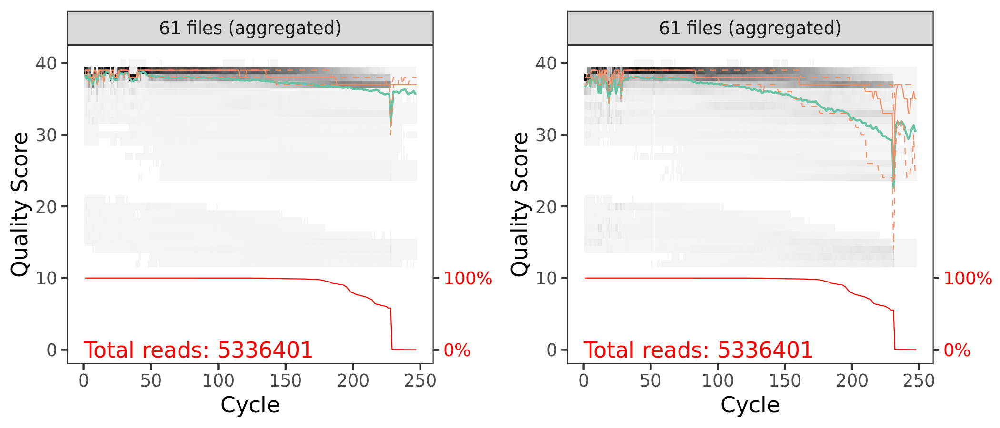
```
<small>`r caption_fig_its("filt_qual_scores_its_y4")`</small>

### Learn Error Rates


#### Forward Reads

```{r}
errF <- learnErrors(filtFs, multithread = TRUE)
```

```
116389858 total bases in 532801 reads from 6 samples will be used for learning the error rates.
```

```{r, warning=FALSE, layout="l-body-outset"}
plotErrors(errF, nominalQ=TRUE)
```

```{r}
p3 <- plotErrors(errF, nominalQ = TRUE)
ggsave("figures/its_plot_errorR_1_year_4.png", p3, width = 7, height = 5)
ggsave("figures/its_plot_errorR_1_year_4.png", p3)
```

```{r, echo=FALSE, eval=FALSE}
system("cp files/dada2/figures/its_plot_errorF_1_year_4.png include/dada2/its_plot_errorF_1_year_4.png")
```

```{r, echo=FALSE, layout="l-body-outset", eval=TRUE}
knitr::include_graphics("include/dada2/its_plot_errorF_1_year_4.png")
```
<small>`r caption_fig_its("error_F_its_y4")`</small>

#### Reverse Reads

```{r}
errR <- learnErrors(filtRs, multithread = TRUE)
```

```
117291604 total bases in 532801 reads from 6 samples will be used for learning the error rates.
```

```{r, warning=FALSE, layout="l-body-outset"}
plotErrors(errF, nominalQ=TRUE)
```

```{r}
p4 <- plotErrors(errR, nominalQ = TRUE)
ggsave("figures/its_plot_errorR_2_year_4.png", p4, width = 7, height = 5)
ggsave("figures/its_plot_errorR_2_year_4.png", p4)
```

```{r, echo=FALSE, eval=FALSE}
system("cp files/dada2/figures/its_plot_errorR_1_year_4.png include/dada2/its_plot_errorR_1_year_4.png")
```

```{r, echo=FALSE, layout="l-body-outset", eval=TRUE}
knitr::include_graphics("include/dada2/its_plot_errorR_1_year_4.png")
```
<small>`r caption_fig_its("error_R_its_y4")`</small>

### Dereplicate Reads


```{r}
derepFs <- derepFastq(filtFs, verbose = TRUE)
derepRs <- derepFastq(filtRs, verbose = TRUE)
```

```{r}
names(derepFs) <- sample.names
names(derepRs) <- sample.names
```

<details markdown="1">
<summary>**Detailed results** of `derep` forward and reverse reads for Year 4</summary>
<pre><code>
Dereplicating sequence entries in Fastq file: RAW_Year_4/cutadapt/filtered/04-1_R1.fastq.gz
Encountered 18038 unique sequences from 83958 total sequences read.
Dereplicating sequence entries in Fastq file: RAW_Year_4/cutadapt/filtered/04-10_R1.fastq.gz
Encountered 20035 unique sequences from 99230 total sequences read.
Dereplicating sequence entries in Fastq file: RAW_Year_4/cutadapt/filtered/04-11_R1.fastq.gz
Encountered 16461 unique sequences from 100945 total sequences read.
Dereplicating sequence entries in Fastq file: RAW_Year_4/cutadapt/filtered/04-12_R1.fastq.gz
Encountered 13603 unique sequences from 69142 total sequences read.
Dereplicating sequence entries in Fastq file: RAW_Year_4/cutadapt/filtered/04-13_R1.fastq.gz
Encountered 17129 unique sequences from 79978 total sequences read.
Dereplicating sequence entries in Fastq file: RAW_Year_4/cutadapt/filtered/04-14_R1.fastq.gz
Encountered 18697 unique sequences from 99548 total sequences read.
Dereplicating sequence entries in Fastq file: RAW_Year_4/cutadapt/filtered/04-15_R1.fastq.gz
Encountered 13618 unique sequences from 82437 total sequences read.
Dereplicating sequence entries in Fastq file: RAW_Year_4/cutadapt/filtered/04-16_R1.fastq.gz
Encountered 15117 unique sequences from 65084 total sequences read.
Dereplicating sequence entries in Fastq file: RAW_Year_4/cutadapt/filtered/04-17_R1.fastq.gz
Encountered 16926 unique sequences from 82433 total sequences read.
Dereplicating sequence entries in Fastq file: RAW_Year_4/cutadapt/filtered/04-18_R1.fastq.gz
Encountered 12814 unique sequences from 96361 total sequences read.
Dereplicating sequence entries in Fastq file: RAW_Year_4/cutadapt/filtered/04-19_R1.fastq.gz
Encountered 17830 unique sequences from 120794 total sequences read.
Dereplicating sequence entries in Fastq file: RAW_Year_4/cutadapt/filtered/04-2_R1.fastq.gz
Encountered 14424 unique sequences from 100278 total sequences read.
Dereplicating sequence entries in Fastq file: RAW_Year_4/cutadapt/filtered/04-20_R1.fastq.gz
Encountered 13900 unique sequences from 79579 total sequences read.
Dereplicating sequence entries in Fastq file: RAW_Year_4/cutadapt/filtered/04-21_R1.fastq.gz
Encountered 17135 unique sequences from 103427 total sequences read.
Dereplicating sequence entries in Fastq file: RAW_Year_4/cutadapt/filtered/04-22_R1.fastq.gz
Encountered 20878 unique sequences from 117929 total sequences read.
Dereplicating sequence entries in Fastq file: RAW_Year_4/cutadapt/filtered/04-23_R1.fastq.gz
Encountered 17634 unique sequences from 115819 total sequences read.
Dereplicating sequence entries in Fastq file: RAW_Year_4/cutadapt/filtered/04-24_R1.fastq.gz
Encountered 16910 unique sequences from 83712 total sequences read.
Dereplicating sequence entries in Fastq file: RAW_Year_4/cutadapt/filtered/04-25_R1.fastq.gz
Encountered 12989 unique sequences from 74640 total sequences read.
Dereplicating sequence entries in Fastq file: RAW_Year_4/cutadapt/filtered/04-26_R1.fastq.gz
Encountered 14411 unique sequences from 113272 total sequences read.
Dereplicating sequence entries in Fastq file: RAW_Year_4/cutadapt/filtered/04-27_R1.fastq.gz
Encountered 16669 unique sequences from 99787 total sequences read.
Dereplicating sequence entries in Fastq file: RAW_Year_4/cutadapt/filtered/04-28_R1.fastq.gz
Encountered 15291 unique sequences from 77879 total sequences read.
Dereplicating sequence entries in Fastq file: RAW_Year_4/cutadapt/filtered/04-29_R1.fastq.gz
Encountered 18091 unique sequences from 100257 total sequences read.
Dereplicating sequence entries in Fastq file: RAW_Year_4/cutadapt/filtered/04-3_R1.fastq.gz
Encountered 18589 unique sequences from 104819 total sequences read.
Dereplicating sequence entries in Fastq file: RAW_Year_4/cutadapt/filtered/04-30_R1.fastq.gz
Encountered 17818 unique sequences from 118197 total sequences read.
Dereplicating sequence entries in Fastq file: RAW_Year_4/cutadapt/filtered/04-31_R1.fastq.gz
Encountered 14349 unique sequences from 81760 total sequences read.
Dereplicating sequence entries in Fastq file: RAW_Year_4/cutadapt/filtered/04-32_R1.fastq.gz
Encountered 15691 unique sequences from 94291 total sequences read.
Dereplicating sequence entries in Fastq file: RAW_Year_4/cutadapt/filtered/04-33_R1.fastq.gz
Encountered 11798 unique sequences from 59928 total sequences read.
Dereplicating sequence entries in Fastq file: RAW_Year_4/cutadapt/filtered/04-34_R1.fastq.gz
Encountered 15089 unique sequences from 103906 total sequences read.
Dereplicating sequence entries in Fastq file: RAW_Year_4/cutadapt/filtered/04-35_R1.fastq.gz
Encountered 16096 unique sequences from 108934 total sequences read.
Dereplicating sequence entries in Fastq file: RAW_Year_4/cutadapt/filtered/04-36_R1.fastq.gz
Encountered 10475 unique sequences from 85503 total sequences read.
Dereplicating sequence entries in Fastq file: RAW_Year_4/cutadapt/filtered/04-37_R1.fastq.gz
Encountered 14992 unique sequences from 89896 total sequences read.
Dereplicating sequence entries in Fastq file: RAW_Year_4/cutadapt/filtered/04-38_R1.fastq.gz
Encountered 11274 unique sequences from 100997 total sequences read.
Dereplicating sequence entries in Fastq file: RAW_Year_4/cutadapt/filtered/04-39_R1.fastq.gz
Encountered 11995 unique sequences from 84779 total sequences read.
Dereplicating sequence entries in Fastq file: RAW_Year_4/cutadapt/filtered/04-4_R1.fastq.gz
Encountered 13570 unique sequences from 81013 total sequences read.
Dereplicating sequence entries in Fastq file: RAW_Year_4/cutadapt/filtered/04-40_R1.fastq.gz
Encountered 10445 unique sequences from 75107 total sequences read.
Dereplicating sequence entries in Fastq file: RAW_Year_4/cutadapt/filtered/04-41_R1.fastq.gz
Encountered 11421 unique sequences from 59642 total sequences read.
Dereplicating sequence entries in Fastq file: RAW_Year_4/cutadapt/filtered/04-42_R1.fastq.gz
Encountered 13470 unique sequences from 90042 total sequences read.
Dereplicating sequence entries in Fastq file: RAW_Year_4/cutadapt/filtered/04-43_R1.fastq.gz
Encountered 17528 unique sequences from 97070 total sequences read.
Dereplicating sequence entries in Fastq file: RAW_Year_4/cutadapt/filtered/04-44_R1.fastq.gz
Encountered 9517 unique sequences from 59520 total sequences read.
Dereplicating sequence entries in Fastq file: RAW_Year_4/cutadapt/filtered/04-45_R1.fastq.gz
Encountered 13541 unique sequences from 67190 total sequences read.
Dereplicating sequence entries in Fastq file: RAW_Year_4/cutadapt/filtered/04-46_R1.fastq.gz
Encountered 13429 unique sequences from 78359 total sequences read.
Dereplicating sequence entries in Fastq file: RAW_Year_4/cutadapt/filtered/04-47_R1.fastq.gz
Encountered 9096 unique sequences from 69298 total sequences read.
Dereplicating sequence entries in Fastq file: RAW_Year_4/cutadapt/filtered/04-48_R1.fastq.gz
Encountered 11515 unique sequences from 73110 total sequences read.
Dereplicating sequence entries in Fastq file: RAW_Year_4/cutadapt/filtered/04-49_R1.fastq.gz
Encountered 11425 unique sequences from 66420 total sequences read.
Dereplicating sequence entries in Fastq file: RAW_Year_4/cutadapt/filtered/04-5_R1.fastq.gz
Encountered 17920 unique sequences from 116949 total sequences read.
Dereplicating sequence entries in Fastq file: RAW_Year_4/cutadapt/filtered/04-50_R1.fastq.gz
Encountered 12755 unique sequences from 61216 total sequences read.
Dereplicating sequence entries in Fastq file: RAW_Year_4/cutadapt/filtered/04-51_R1.fastq.gz
Encountered 22719 unique sequences from 124072 total sequences read.
Dereplicating sequence entries in Fastq file: RAW_Year_4/cutadapt/filtered/04-52_R1.fastq.gz
Encountered 12231 unique sequences from 68890 total sequences read.
Dereplicating sequence entries in Fastq file: RAW_Year_4/cutadapt/filtered/04-53_R1.fastq.gz
Encountered 19885 unique sequences from 111125 total sequences read.
Dereplicating sequence entries in Fastq file: RAW_Year_4/cutadapt/filtered/04-54_R1.fastq.gz
Encountered 17611 unique sequences from 104169 total sequences read.
Dereplicating sequence entries in Fastq file: RAW_Year_4/cutadapt/filtered/04-55_R1.fastq.gz
Encountered 16368 unique sequences from 102767 total sequences read.
Dereplicating sequence entries in Fastq file: RAW_Year_4/cutadapt/filtered/04-56_R1.fastq.gz
Encountered 14735 unique sequences from 71427 total sequences read.
Dereplicating sequence entries in Fastq file: RAW_Year_4/cutadapt/filtered/04-57_R1.fastq.gz
Encountered 9580 unique sequences from 51777 total sequences read.
Dereplicating sequence entries in Fastq file: RAW_Year_4/cutadapt/filtered/04-58_R1.fastq.gz
Encountered 10683 unique sequences from 88126 total sequences read.
Dereplicating sequence entries in Fastq file: RAW_Year_4/cutadapt/filtered/04-59_R1.fastq.gz
Encountered 15128 unique sequences from 78559 total sequences read.
Dereplicating sequence entries in Fastq file: RAW_Year_4/cutadapt/filtered/04-6_R1.fastq.gz
Encountered 19754 unique sequences from 111261 total sequences read.
Dereplicating sequence entries in Fastq file: RAW_Year_4/cutadapt/filtered/04-60_R1.fastq.gz
Encountered 12269 unique sequences from 74713 total sequences read.
Dereplicating sequence entries in Fastq file: RAW_Year_4/cutadapt/filtered/04-7_R1.fastq.gz
Encountered 12502 unique sequences from 119143 total sequences read.
Dereplicating sequence entries in Fastq file: RAW_Year_4/cutadapt/filtered/04-8_R1.fastq.gz
Encountered 14871 unique sequences from 66368 total sequences read.
Dereplicating sequence entries in Fastq file: RAW_Year_4/cutadapt/filtered/04-9_R1.fastq.gz
Encountered 16181 unique sequences from 77692 total sequences read.
Dereplicating sequence entries in Fastq file: RAW_Year_4/cutadapt/filtered/04-Negative_R1.fastq.gz
Encountered 1716 unique sequences from 11877 total sequences read.
Dereplicating sequence entries in Fastq file: RAW_Year_4/cutadapt/filtered/04-1_R2.fastq.gz
Encountered 29505 unique sequences from 83958 total sequences read.
Dereplicating sequence entries in Fastq file: RAW_Year_4/cutadapt/filtered/04-10_R2.fastq.gz
Encountered 27667 unique sequences from 99230 total sequences read.
Dereplicating sequence entries in Fastq file: RAW_Year_4/cutadapt/filtered/04-11_R2.fastq.gz
Encountered 22283 unique sequences from 100945 total sequences read.
Dereplicating sequence entries in Fastq file: RAW_Year_4/cutadapt/filtered/04-12_R2.fastq.gz
Encountered 20123 unique sequences from 69142 total sequences read.
Dereplicating sequence entries in Fastq file: RAW_Year_4/cutadapt/filtered/04-13_R2.fastq.gz
Encountered 24202 unique sequences from 79978 total sequences read.
Dereplicating sequence entries in Fastq file: RAW_Year_4/cutadapt/filtered/04-14_R2.fastq.gz
Encountered 27205 unique sequences from 99548 total sequences read.
Dereplicating sequence entries in Fastq file: RAW_Year_4/cutadapt/filtered/04-15_R2.fastq.gz
Encountered 23103 unique sequences from 82437 total sequences read.
Dereplicating sequence entries in Fastq file: RAW_Year_4/cutadapt/filtered/04-16_R2.fastq.gz
Encountered 22161 unique sequences from 65084 total sequences read.
Dereplicating sequence entries in Fastq file: RAW_Year_4/cutadapt/filtered/04-17_R2.fastq.gz
Encountered 27646 unique sequences from 82433 total sequences read.
Dereplicating sequence entries in Fastq file: RAW_Year_4/cutadapt/filtered/04-18_R2.fastq.gz
Encountered 20095 unique sequences from 96361 total sequences read.
Dereplicating sequence entries in Fastq file: RAW_Year_4/cutadapt/filtered/04-19_R2.fastq.gz
Encountered 29913 unique sequences from 120794 total sequences read.
Dereplicating sequence entries in Fastq file: RAW_Year_4/cutadapt/filtered/04-2_R2.fastq.gz
Encountered 26752 unique sequences from 100278 total sequences read.
Dereplicating sequence entries in Fastq file: RAW_Year_4/cutadapt/filtered/04-20_R2.fastq.gz
Encountered 25595 unique sequences from 79579 total sequences read.
Dereplicating sequence entries in Fastq file: RAW_Year_4/cutadapt/filtered/04-21_R2.fastq.gz
Encountered 30649 unique sequences from 103427 total sequences read.
Dereplicating sequence entries in Fastq file: RAW_Year_4/cutadapt/filtered/04-22_R2.fastq.gz
Encountered 33323 unique sequences from 117929 total sequences read.
Dereplicating sequence entries in Fastq file: RAW_Year_4/cutadapt/filtered/04-23_R2.fastq.gz
Encountered 36747 unique sequences from 115819 total sequences read.
Dereplicating sequence entries in Fastq file: RAW_Year_4/cutadapt/filtered/04-24_R2.fastq.gz
Encountered 28434 unique sequences from 83712 total sequences read.
Dereplicating sequence entries in Fastq file: RAW_Year_4/cutadapt/filtered/04-25_R2.fastq.gz
Encountered 24577 unique sequences from 74640 total sequences read.
Dereplicating sequence entries in Fastq file: RAW_Year_4/cutadapt/filtered/04-26_R2.fastq.gz
Encountered 26894 unique sequences from 113272 total sequences read.
Dereplicating sequence entries in Fastq file: RAW_Year_4/cutadapt/filtered/04-27_R2.fastq.gz
Encountered 32633 unique sequences from 99787 total sequences read.
Dereplicating sequence entries in Fastq file: RAW_Year_4/cutadapt/filtered/04-28_R2.fastq.gz
Encountered 28343 unique sequences from 77879 total sequences read.
Dereplicating sequence entries in Fastq file: RAW_Year_4/cutadapt/filtered/04-29_R2.fastq.gz
Encountered 32959 unique sequences from 100257 total sequences read.
Dereplicating sequence entries in Fastq file: RAW_Year_4/cutadapt/filtered/04-3_R2.fastq.gz
Encountered 34422 unique sequences from 104819 total sequences read.
Dereplicating sequence entries in Fastq file: RAW_Year_4/cutadapt/filtered/04-30_R2.fastq.gz
Encountered 31549 unique sequences from 118197 total sequences read.
Dereplicating sequence entries in Fastq file: RAW_Year_4/cutadapt/filtered/04-31_R2.fastq.gz
Encountered 33388 unique sequences from 81760 total sequences read.
Dereplicating sequence entries in Fastq file: RAW_Year_4/cutadapt/filtered/04-32_R2.fastq.gz
Encountered 30211 unique sequences from 94291 total sequences read.
Dereplicating sequence entries in Fastq file: RAW_Year_4/cutadapt/filtered/04-33_R2.fastq.gz
Encountered 24256 unique sequences from 59928 total sequences read.
Dereplicating sequence entries in Fastq file: RAW_Year_4/cutadapt/filtered/04-34_R2.fastq.gz
Encountered 32285 unique sequences from 103906 total sequences read.
Dereplicating sequence entries in Fastq file: RAW_Year_4/cutadapt/filtered/04-35_R2.fastq.gz
Encountered 33200 unique sequences from 108934 total sequences read.
Dereplicating sequence entries in Fastq file: RAW_Year_4/cutadapt/filtered/04-36_R2.fastq.gz
Encountered 22267 unique sequences from 85503 total sequences read.
Dereplicating sequence entries in Fastq file: RAW_Year_4/cutadapt/filtered/04-37_R2.fastq.gz
Encountered 30560 unique sequences from 89896 total sequences read.
Dereplicating sequence entries in Fastq file: RAW_Year_4/cutadapt/filtered/04-38_R2.fastq.gz
Encountered 26793 unique sequences from 100997 total sequences read.
Dereplicating sequence entries in Fastq file: RAW_Year_4/cutadapt/filtered/04-39_R2.fastq.gz
Encountered 32824 unique sequences from 84779 total sequences read.
Dereplicating sequence entries in Fastq file: RAW_Year_4/cutadapt/filtered/04-4_R2.fastq.gz
Encountered 24939 unique sequences from 81013 total sequences read.
Dereplicating sequence entries in Fastq file: RAW_Year_4/cutadapt/filtered/04-40_R2.fastq.gz
Encountered 23415 unique sequences from 75107 total sequences read.
Dereplicating sequence entries in Fastq file: RAW_Year_4/cutadapt/filtered/04-41_R2.fastq.gz
Encountered 25049 unique sequences from 59642 total sequences read.
Dereplicating sequence entries in Fastq file: RAW_Year_4/cutadapt/filtered/04-42_R2.fastq.gz
Encountered 29399 unique sequences from 90042 total sequences read.
Dereplicating sequence entries in Fastq file: RAW_Year_4/cutadapt/filtered/04-43_R2.fastq.gz
Encountered 39879 unique sequences from 97070 total sequences read.
Dereplicating sequence entries in Fastq file: RAW_Year_4/cutadapt/filtered/04-44_R2.fastq.gz
Encountered 22099 unique sequences from 59520 total sequences read.
Dereplicating sequence entries in Fastq file: RAW_Year_4/cutadapt/filtered/04-45_R2.fastq.gz
Encountered 28364 unique sequences from 67190 total sequences read.
Dereplicating sequence entries in Fastq file: RAW_Year_4/cutadapt/filtered/04-46_R2.fastq.gz
Encountered 29933 unique sequences from 78359 total sequences read.
Dereplicating sequence entries in Fastq file: RAW_Year_4/cutadapt/filtered/04-47_R2.fastq.gz
Encountered 30365 unique sequences from 69298 total sequences read.
Dereplicating sequence entries in Fastq file: RAW_Year_4/cutadapt/filtered/04-48_R2.fastq.gz
Encountered 26183 unique sequences from 73110 total sequences read.
Dereplicating sequence entries in Fastq file: RAW_Year_4/cutadapt/filtered/04-49_R2.fastq.gz
Encountered 20546 unique sequences from 66420 total sequences read.
Dereplicating sequence entries in Fastq file: RAW_Year_4/cutadapt/filtered/04-5_R2.fastq.gz
Encountered 31287 unique sequences from 116949 total sequences read.
Dereplicating sequence entries in Fastq file: RAW_Year_4/cutadapt/filtered/04-50_R2.fastq.gz
Encountered 20827 unique sequences from 61216 total sequences read.
Dereplicating sequence entries in Fastq file: RAW_Year_4/cutadapt/filtered/04-51_R2.fastq.gz
Encountered 39854 unique sequences from 124072 total sequences read.
Dereplicating sequence entries in Fastq file: RAW_Year_4/cutadapt/filtered/04-52_R2.fastq.gz
Encountered 21332 unique sequences from 68890 total sequences read.
Dereplicating sequence entries in Fastq file: RAW_Year_4/cutadapt/filtered/04-53_R2.fastq.gz
Encountered 31472 unique sequences from 111125 total sequences read.
Dereplicating sequence entries in Fastq file: RAW_Year_4/cutadapt/filtered/04-54_R2.fastq.gz
Encountered 31912 unique sequences from 104169 total sequences read.
Dereplicating sequence entries in Fastq file: RAW_Year_4/cutadapt/filtered/04-55_R2.fastq.gz
Encountered 33704 unique sequences from 102767 total sequences read.
Dereplicating sequence entries in Fastq file: RAW_Year_4/cutadapt/filtered/04-56_R2.fastq.gz
Encountered 25702 unique sequences from 71427 total sequences read.
Dereplicating sequence entries in Fastq file: RAW_Year_4/cutadapt/filtered/04-57_R2.fastq.gz
Encountered 18367 unique sequences from 51777 total sequences read.
Dereplicating sequence entries in Fastq file: RAW_Year_4/cutadapt/filtered/04-58_R2.fastq.gz
Encountered 22120 unique sequences from 88126 total sequences read.
Dereplicating sequence entries in Fastq file: RAW_Year_4/cutadapt/filtered/04-59_R2.fastq.gz
Encountered 29736 unique sequences from 78559 total sequences read.
Dereplicating sequence entries in Fastq file: RAW_Year_4/cutadapt/filtered/04-6_R2.fastq.gz
Encountered 35559 unique sequences from 111261 total sequences read.
Dereplicating sequence entries in Fastq file: RAW_Year_4/cutadapt/filtered/04-60_R2.fastq.gz
Encountered 23298 unique sequences from 74713 total sequences read.
Dereplicating sequence entries in Fastq file: RAW_Year_4/cutadapt/filtered/04-7_R2.fastq.gz
Encountered 34406 unique sequences from 119143 total sequences read.
Dereplicating sequence entries in Fastq file: RAW_Year_4/cutadapt/filtered/04-8_R2.fastq.gz
Encountered 25690 unique sequences from 66368 total sequences read.
Dereplicating sequence entries in Fastq file: RAW_Year_4/cutadapt/filtered/04-9_R2.fastq.gz
Encountered 21132 unique sequences from 77692 total sequences read.
Dereplicating sequence entries in Fastq file: RAW_Year_4/cutadapt/filtered/04-Negative_R2.fastq.gz
Encountered 3068 unique sequences from 11877 total sequences read.
</code></pre>
</details>
> [Back to top of this section](#filtering-error-correction-dereplication-1)
:::
:::
:::


<br/>

# 3. DADA2 & ASV Inference

At this point we are ready to apply the core sample inference algorithm (dada) to the filtered and trimmed sequence data. DADA2 offers three options for whether and how to pool samples for ASV inference. 

If `pool = TRUE`, the algorithm will pool together all samples prior to sample inference.  
If `pool = FALSE`, sample inference is performed on each sample individually.  
If `pool = "pseudo"`, the algorithm will perform pseudo-pooling between individually processed samples.

For our final analysis, we chose `pool = FALSE` for this data set. 

::: l-body
::: {.panelset}

::: {.panel}

## Year 0

```{r}
dadaFs <- dada(derepFs, err = errF, pool = FALSE, multithread = TRUE)
```

<details markdown="1">
<summary>**Detailed results** of `dada` on forward reads, Year 0</summary>
<pre><code>
Sample 1 - 82956 reads in 17044 unique sequences.
Sample 2 - 63553 reads in 11028 unique sequences.
Sample 3 - 62073 reads in 11005 unique sequences.
Sample 4 - 74902 reads in 15309 unique sequences.
Sample 5 - 100332 reads in 12878 unique sequences.
Sample 6 - 87629 reads in 14157 unique sequences.
Sample 7 - 57182 reads in 9345 unique sequences.
Sample 8 - 71866 reads in 10405 unique sequences.
Sample 9 - 68228 reads in 12179 unique sequences.
Sample 10 - 89781 reads in 8311 unique sequences.
Sample 11 - 91844 reads in 7126 unique sequences.
Sample 12 - 48753 reads in 10173 unique sequences.
Sample 13 - 114752 reads in 15572 unique sequences.
Sample 14 - 102376 reads in 17948 unique sequences.
Sample 15 - 113204 reads in 18069 unique sequences.
Sample 16 - 44944 reads in 7030 unique sequences.
Sample 17 - 60905 reads in 10219 unique sequences.
Sample 18 - 37143 reads in 6379 unique sequences.
Sample 19 - 62702 reads in 12081 unique sequences.
Sample 20 - 74081 reads in 13604 unique sequences.
Sample 21 - 77972 reads in 13762 unique sequences.
Sample 22 - 82403 reads in 14629 unique sequences.
Sample 23 - 73752 reads in 12378 unique sequences.
Sample 24 - 106981 reads in 18036 unique sequences.
Sample 25 - 87367 reads in 14496 unique sequences.
Sample 26 - 45861 reads in 8231 unique sequences.
Sample 27 - 4309 reads in 1421 unique sequences.
Sample 28 - 69123 reads in 13833 unique sequences.
Sample 29 - 98984 reads in 15543 unique sequences.
Sample 30 - 73057 reads in 13008 unique sequences.
Sample 31 - 123842 reads in 17886 unique sequences.
Sample 32 - 84357 reads in 16809 unique sequences.
Sample 33 - 69846 reads in 12272 unique sequences.
Sample 34 - 71970 reads in 12094 unique sequences.
Sample 35 - 50267 reads in 6298 unique sequences.
Sample 36 - 31809 reads in 8442 unique sequences.
Sample 37 - 53815 reads in 11298 unique sequences.
Sample 38 - 73254 reads in 13307 unique sequences.
Sample 39 - 76501 reads in 14146 unique sequences.
Sample 40 - 77644 reads in 13085 unique sequences.
Sample 41 - 60080 reads in 10122 unique sequences.
Sample 42 - 41823 reads in 8653 unique sequences.
Sample 43 - 117988 reads in 13600 unique sequences.
Sample 44 - 28048 reads in 7248 unique sequences.
Sample 45 - 93835 reads in 12510 unique sequences.
Sample 46 - 34202 reads in 6780 unique sequences.
Sample 47 - 25595 reads in 5528 unique sequences.
Sample 48 - 26279 reads in 5820 unique sequences.
Sample 49 - 28624 reads in 3512 unique sequences.
Sample 50 - 26143 reads in 5094 unique sequences.
Sample 51 - 25164 reads in 5055 unique sequences.
Sample 52 - 18436 reads in 3819 unique sequences.
Sample 53 - 33620 reads in 8369 unique sequences.
Sample 54 - 84157 reads in 15685 unique sequences.
Sample 55 - 100291 reads in 18473 unique sequences.
Sample 56 - 76649 reads in 13893 unique sequences.
Sample 57 - 145030 reads in 24031 unique sequences.
Sample 58 - 58731 reads in 10877 unique sequences.
Sample 59 - 72238 reads in 11129 unique sequences.
Sample 60 - 78928 reads in 17971 unique sequences.
Sample 61 - 3158 reads in 448 unique sequences.
</code></pre>
</details>

As an example, we can inspect the returned `dada-class` object for the forward and reverse reads from the sample #`r sampnum`:

```{r}
dadaFs[[sampnum]]
```

```
dada-class: object describing DADA2 denoising results
666 sequence variants were inferred from 11028 input unique sequences.
Key parameters: OMEGA_A = 1e-40, OMEGA_C = 1e-40, BAND_SIZE = 16
```
This output tells us how many true sequence variants the DADA2 algorithm inferred from the  unique sequences, in this case the sample 2.

```{r}
dadaRs <- dada(derepRs, err = errR, pool = FALSE, multithread = TRUE)
```

<details markdown="1">
<summary>**Detailed results** of `dada` on reverse reads, Year 0</summary>
<pre><code>
Sample 1 - 82956 reads in 29923 unique sequences.
Sample 2 - 63553 reads in 21575 unique sequences.
Sample 3 - 62073 reads in 24733 unique sequences.
Sample 4 - 74902 reads in 27876 unique sequences.
Sample 5 - 100332 reads in 30285 unique sequences.
Sample 6 - 87629 reads in 34725 unique sequences.
Sample 7 - 57182 reads in 21691 unique sequences.
Sample 8 - 71866 reads in 23269 unique sequences.
Sample 9 - 68228 reads in 17939 unique sequences.
Sample 10 - 89781 reads in 14773 unique sequences.
Sample 11 - 91844 reads in 15944 unique sequences.
Sample 12 - 48753 reads in 17245 unique sequences.
Sample 13 - 114752 reads in 24096 unique sequences.
Sample 14 - 102376 reads in 34867 unique sequences.
Sample 15 - 113204 reads in 28710 unique sequences.
Sample 16 - 44944 reads in 13077 unique sequences.
Sample 17 - 60905 reads in 16871 unique sequences.
Sample 18 - 37143 reads in 11016 unique sequences.
Sample 19 - 62702 reads in 18605 unique sequences.
Sample 20 - 74081 reads in 22267 unique sequences.
Sample 21 - 77972 reads in 23412 unique sequences.
Sample 22 - 82403 reads in 27394 unique sequences.
Sample 23 - 73752 reads in 24675 unique sequences.
Sample 24 - 106981 reads in 30883 unique sequences.
Sample 25 - 87367 reads in 28539 unique sequences.
Sample 26 - 45861 reads in 14575 unique sequences.
Sample 27 - 4309 reads in 2064 unique sequences.
Sample 28 - 69123 reads in 23337 unique sequences.
Sample 29 - 98984 reads in 29559 unique sequences.
Sample 30 - 73057 reads in 24848 unique sequences.
Sample 31 - 123842 reads in 36328 unique sequences.
Sample 32 - 84357 reads in 29426 unique sequences.
Sample 33 - 69846 reads in 26439 unique sequences.
Sample 34 - 71970 reads in 22204 unique sequences.
Sample 35 - 50267 reads in 10975 unique sequences.
Sample 36 - 31809 reads in 15098 unique sequences.
Sample 37 - 53815 reads in 20921 unique sequences.
Sample 38 - 73254 reads in 28316 unique sequences.
Sample 39 - 76501 reads in 26367 unique sequences.
Sample 40 - 77644 reads in 28810 unique sequences.
Sample 41 - 60080 reads in 24187 unique sequences.
Sample 42 - 41823 reads in 16181 unique sequences.
Sample 43 - 117988 reads in 28200 unique sequences.
Sample 44 - 28048 reads in 11021 unique sequences.
Sample 45 - 93835 reads in 26444 unique sequences.
Sample 46 - 34202 reads in 10992 unique sequences.
Sample 47 - 25595 reads in 10088 unique sequences.
Sample 48 - 26279 reads in 8636 unique sequences.
Sample 49 - 28624 reads in 7512 unique sequences.
Sample 50 - 26143 reads in 8227 unique sequences.
Sample 51 - 25164 reads in 9280 unique sequences.
Sample 52 - 18436 reads in 5581 unique sequences.
Sample 53 - 33620 reads in 13598 unique sequences.
Sample 54 - 84157 reads in 27871 unique sequences.
Sample 55 - 100291 reads in 37101 unique sequences.
Sample 56 - 76649 reads in 25982 unique sequences.
Sample 57 - 145030 reads in 38918 unique sequences.
Sample 58 - 58731 reads in 23514 unique sequences.
Sample 59 - 72238 reads in 20805 unique sequences.
Sample 60 - 78928 reads in 30917 unique sequences.
Sample 61 - 3158 reads in 688 unique sequences.
</code></pre>
</details>

As an example, we can inspect the returned `dada-class` object for the forward and reverse reads from the sample #`r sampnum`:

```{r}
dadaRs[[2]]
```

```
dada-class: object describing DADA2 denoising results
567 sequence variants were inferred from 21575 input unique sequences.
Key parameters: OMEGA_A = 1e-40, OMEGA_C = 1e-40, BAND_SIZE = 16
```

This output tells us how many true sequence variants the DADA2 algorithm inferred from the  unique sequences, in this case the sample 2.

```{r, echo=FALSE, eval=TRUE}
seq_table <- read.table("files/dada2/tables/its_denoise_year_0.txt",
                       header = TRUE, sep = "\t")
```
<small>`r caption_tab_its("denoise_its_y0")`</small>

```{r, echo=FALSE, layout="l-body-outset", eval=TRUE}
seq_table %>%
  download_this(
    output_name = "its_denoise_year_0",
    output_extension = ".csv",
    button_label = "Download data as csv file",
    button_type = "default",
    csv2 = FALSE,
    has_icon = TRUE,
    icon = "fa fa-save")

reactable(seq_table,
  defaultColDef = colDef(
    header = function(value) gsub("_", " ", value, fixed = TRUE),
    cell = function(value) format(value, nsmall = 1),
    align = "center", filterable = FALSE, sortable = TRUE, resizable = TRUE,
    footerStyle = list(fontWeight = "bold")
    ), 
  columns = list(
    Sample_ID = colDef(name = "Sample ID", 
                       sticky = "left", 
                       style = list(borderRight = "1px solid #eee"),
                       headerStyle = list(borderRight = "1px solid #eee"), 
                       align = "left",
                       minWidth = 150, footer = "Total reads", filterable = TRUE), 
    denoiseF = colDef(footer = function(values) sprintf("%.0f", sum(values))),
    denoiseR = colDef(footer = function(values) sprintf("%.0f", sum(values)))
    ), 
  searchable = FALSE, defaultPageSize = 5, 
  pageSizeOptions = c(5, 10, nrow(seq_table)), 
  showPageSizeOptions = TRUE, highlight = TRUE, 
  bordered = TRUE, striped = TRUE, compact = FALSE, 
  wrap = FALSE, showSortable = TRUE, fullWidth = TRUE,
  theme = reactableTheme(style = list(fontSize = "0.8em")))
```
> [Back to top of this section](#dada2-asv-inference-1)

:::

::: {.panel}
## Year 1


```{r}
dadaFs <- dada(derepFs, err = errF, pool = FALSE, multithread = TRUE)
```

<details markdown="1">
<summary>**Detailed results** of `dada` on forward reads, Year 1</summary>
<pre><code>
Sample 1 - 60056 reads in 13695 unique sequences.
Sample 2 - 86285 reads in 11745 unique sequences.
Sample 3 - 77917 reads in 11507 unique sequences.
Sample 4 - 88721 reads in 12704 unique sequences.
Sample 5 - 75174 reads in 16367 unique sequences.
Sample 6 - 69743 reads in 9353 unique sequences.
Sample 7 - 75669 reads in 15642 unique sequences.
Sample 8 - 71101 reads in 13360 unique sequences.
Sample 9 - 91773 reads in 7630 unique sequences.
Sample 10 - 81602 reads in 9786 unique sequences.
Sample 11 - 58880 reads in 13333 unique sequences.
Sample 12 - 60556 reads in 12329 unique sequences.
Sample 13 - 63216 reads in 14483 unique sequences.
Sample 14 - 85079 reads in 15871 unique sequences.
Sample 15 - 64691 reads in 13402 unique sequences.
Sample 16 - 52002 reads in 10604 unique sequences.
Sample 17 - 83290 reads in 14527 unique sequences.
Sample 18 - 68972 reads in 14304 unique sequences.
Sample 19 - 82408 reads in 15682 unique sequences.
Sample 20 - 79665 reads in 11579 unique sequences.
Sample 21 - 59597 reads in 14848 unique sequences.
Sample 22 - 66273 reads in 15006 unique sequences.
Sample 23 - 60898 reads in 13332 unique sequences.
Sample 24 - 50723 reads in 10560 unique sequences.
Sample 25 - 71027 reads in 11540 unique sequences.
Sample 26 - 77715 reads in 12839 unique sequences.
Sample 27 - 61761 reads in 14848 unique sequences.
Sample 28 - 56773 reads in 13063 unique sequences.
Sample 29 - 88635 reads in 16171 unique sequences.
Sample 30 - 73034 reads in 11918 unique sequences.
Sample 31 - 73384 reads in 16499 unique sequences.
Sample 32 - 63155 reads in 11906 unique sequences.
Sample 33 - 59106 reads in 8949 unique sequences.
Sample 34 - 59666 reads in 11867 unique sequences.
Sample 35 - 54550 reads in 10990 unique sequences.
Sample 36 - 55364 reads in 12596 unique sequences.
Sample 37 - 67050 reads in 11508 unique sequences.
Sample 38 - 83931 reads in 14585 unique sequences.
Sample 39 - 71393 reads in 12884 unique sequences.
Sample 40 - 91117 reads in 13694 unique sequences.
Sample 41 - 54819 reads in 10975 unique sequences.
Sample 42 - 45749 reads in 8494 unique sequences.
Sample 43 - 83477 reads in 12856 unique sequences.
Sample 44 - 60891 reads in 10398 unique sequences.
Sample 45 - 54438 reads in 9987 unique sequences.
Sample 46 - 69756 reads in 15414 unique sequences.
Sample 47 - 67806 reads in 13087 unique sequences.
Sample 48 - 73623 reads in 11398 unique sequences.
Sample 49 - 64281 reads in 6314 unique sequences.
Sample 50 - 68540 reads in 15955 unique sequences.
Sample 51 - 75645 reads in 11940 unique sequences.
Sample 52 - 89108 reads in 5769 unique sequences.
Sample 53 - 73452 reads in 14612 unique sequences.
Sample 54 - 105240 reads in 15805 unique sequences.
Sample 55 - 91044 reads in 16622 unique sequences.
Sample 56 - 97253 reads in 14915 unique sequences.
Sample 57 - 61665 reads in 14407 unique sequences.
Sample 58 - 69831 reads in 13587 unique sequences.
Sample 59 - 84093 reads in 13313 unique sequences.
Sample 60 - 76089 reads in 10657 unique sequences.
</code></pre>
</details>

As an example, we can inspect the returned `dada-class` object for the forward and reverse reads from the sample #`r sampnum`:

```{r}
dadaFs[[sampnum]]
```

```
dada-class: object describing DADA2 denoising results
706 sequence variants were inferred from 11745 input unique sequences.
Key parameters: OMEGA_A = 1e-40, OMEGA_C = 1e-40, BAND_SIZE = 16
```
This output tells us how many true sequence variants the DADA2 algorithm inferred from the  unique sequences, in this case the sample 2.

```{r}
dadaRs <- dada(derepRs, err = errR, pool = FALSE, multithread = TRUE)
```

<details markdown="1">
<summary>**Detailed results** of `dada` on reverse reads, Year 1</summary>
<pre><code>
Sample 1 - 60056 reads in 23890 unique sequences.
Sample 2 - 86285 reads in 21023 unique sequences.
Sample 3 - 77917 reads in 23847 unique sequences.
Sample 4 - 88721 reads in 29499 unique sequences.
Sample 5 - 75174 reads in 27282 unique sequences.
Sample 6 - 69743 reads in 20954 unique sequences.
Sample 7 - 75669 reads in 24490 unique sequences.
Sample 8 - 71101 reads in 30490 unique sequences.
Sample 9 - 91773 reads in 19903 unique sequences.
Sample 10 - 81602 reads in 19487 unique sequences.
Sample 11 - 58880 reads in 22625 unique sequences.
Sample 12 - 60556 reads in 23338 unique sequences.
Sample 13 - 63216 reads in 23587 unique sequences.
Sample 14 - 85079 reads in 27266 unique sequences.
Sample 15 - 64691 reads in 22062 unique sequences.
Sample 16 - 52002 reads in 22714 unique sequences.
Sample 17 - 83290 reads in 24000 unique sequences.
Sample 18 - 68972 reads in 24530 unique sequences.
Sample 19 - 82408 reads in 26718 unique sequences.
Sample 20 - 79665 reads in 22499 unique sequences.
Sample 21 - 59597 reads in 26241 unique sequences.
Sample 22 - 66273 reads in 26112 unique sequences.
Sample 23 - 60898 reads in 23217 unique sequences.
Sample 24 - 50723 reads in 19165 unique sequences.
Sample 25 - 71027 reads in 22443 unique sequences.
Sample 26 - 77715 reads in 21920 unique sequences.
Sample 27 - 61761 reads in 26555 unique sequences.
Sample 28 - 56773 reads in 21983 unique sequences.
Sample 29 - 88635 reads in 27577 unique sequences.
Sample 30 - 73034 reads in 26786 unique sequences.
Sample 31 - 73384 reads in 26695 unique sequences.
Sample 32 - 63155 reads in 26255 unique sequences.
Sample 33 - 59106 reads in 17170 unique sequences.
Sample 34 - 59666 reads in 19517 unique sequences.
Sample 35 - 54550 reads in 18343 unique sequences.
Sample 36 - 55364 reads in 23023 unique sequences.
Sample 37 - 67050 reads in 24987 unique sequences.
Sample 38 - 83931 reads in 26828 unique sequences.
Sample 39 - 71393 reads in 23858 unique sequences.
Sample 40 - 91117 reads in 25726 unique sequences.
Sample 41 - 54819 reads in 19019 unique sequences.
Sample 42 - 45749 reads in 16765 unique sequences.
Sample 43 - 83477 reads in 20998 unique sequences.
Sample 44 - 60891 reads in 22528 unique sequences.
Sample 45 - 54438 reads in 23424 unique sequences.
Sample 46 - 69756 reads in 24589 unique sequences.
Sample 47 - 67806 reads in 24221 unique sequences.
Sample 48 - 73623 reads in 19779 unique sequences.
Sample 49 - 64281 reads in 22090 unique sequences.
Sample 50 - 68540 reads in 25506 unique sequences.
Sample 51 - 75645 reads in 25290 unique sequences.
Sample 52 - 89108 reads in 17039 unique sequences.
Sample 53 - 73452 reads in 27037 unique sequences.
Sample 54 - 105240 reads in 25269 unique sequences.
Sample 55 - 91044 reads in 29404 unique sequences.
Sample 56 - 97253 reads in 28371 unique sequences.
Sample 57 - 61665 reads in 23860 unique sequences.
Sample 58 - 69831 reads in 23679 unique sequences.
Sample 59 - 84093 reads in 24124 unique sequences.
Sample 60 - 76089 reads in 24049 unique sequences.
</code></pre>
</details>


```{r}
dadaRs[[2]]
```

```
dada-class: object describing DADA2 denoising results
536 sequence variants were inferred from 21023 input unique sequences.
Key parameters: OMEGA_A = 1e-40, OMEGA_C = 1e-40, BAND_SIZE = 16
```

This output tells us how many true sequence variants the DADA2 algorithm inferred from the  unique sequences, in this case the sample 2.


```{r, echo=FALSE, eval=TRUE}
seq_table <- read.table("files/dada2/tables/its_denoise_year_1.txt",
                       header = TRUE, sep = "\t")
```
<small>`r caption_tab_its("denoise_its_y1")`</small>

```{r, echo=FALSE, layout="l-body-outset", eval=TRUE}
seq_table %>%
  download_this(
    output_name = "its_denoise_year_1",
    output_extension = ".csv",
    button_label = "Download data as csv file",
    button_type = "default",
    csv2 = FALSE,
    has_icon = TRUE,
    icon = "fa fa-save")

reactable(seq_table,
  defaultColDef = colDef(
    header = function(value) gsub("_", " ", value, fixed = TRUE),
    cell = function(value) format(value, nsmall = 1),
    align = "center", filterable = FALSE, sortable = TRUE, resizable = TRUE,
    footerStyle = list(fontWeight = "bold")
    ), 
  columns = list(
    Sample_ID = colDef(name = "Sample ID", 
                       sticky = "left", 
                       style = list(borderRight = "1px solid #eee"),
                       headerStyle = list(borderRight = "1px solid #eee"), 
                       align = "left",
                       minWidth = 150, footer = "Total reads", filterable = TRUE), 
    denoiseF = colDef(footer = function(values) sprintf("%.0f", sum(values))),
    denoiseR = colDef(footer = function(values) sprintf("%.0f", sum(values)))
    ), 
  searchable = FALSE, defaultPageSize = 5, 
  pageSizeOptions = c(5, 10, nrow(seq_table)), 
  showPageSizeOptions = TRUE, highlight = TRUE, 
  bordered = TRUE, striped = TRUE, compact = FALSE, 
  wrap = FALSE, showSortable = TRUE, fullWidth = TRUE,
  theme = reactableTheme(style = list(fontSize = "0.8em")))
```
> [Back to top of this section](#dada2-asv-inference-1)

:::

::: {.panel}
## Year 4

```{r}
dadaFs <- dada(derepFs, err = errF, pool = FALSE, multithread = TRUE)
```

<details markdown="1">
<summary>**Detailed results** of `dada` on forward reads, Year 4</summary>
<pre><code>
Sample 1 - 83958 reads in 18038 unique sequences.
Sample 2 - 99230 reads in 20035 unique sequences.
Sample 3 - 100945 reads in 16461 unique sequences.
Sample 4 - 69142 reads in 13603 unique sequences.
Sample 5 - 79978 reads in 17129 unique sequences.
Sample 6 - 99548 reads in 18697 unique sequences.
Sample 7 - 82437 reads in 13618 unique sequences.
Sample 8 - 65084 reads in 15117 unique sequences.
Sample 9 - 82433 reads in 16926 unique sequences.
Sample 10 - 96361 reads in 12814 unique sequences.
Sample 11 - 120794 reads in 17830 unique sequences.
Sample 12 - 100278 reads in 14424 unique sequences.
Sample 13 - 79579 reads in 13900 unique sequences.
Sample 14 - 103427 reads in 17135 unique sequences.
Sample 15 - 117929 reads in 20878 unique sequences.
Sample 16 - 115819 reads in 17634 unique sequences.
Sample 17 - 83712 reads in 16910 unique sequences.
Sample 18 - 74640 reads in 12989 unique sequences.
Sample 19 - 113272 reads in 14411 unique sequences.
Sample 20 - 99787 reads in 16669 unique sequences.
Sample 21 - 77879 reads in 15291 unique sequences.
Sample 22 - 100257 reads in 18091 unique sequences.
Sample 23 - 104819 reads in 18589 unique sequences.
Sample 24 - 118197 reads in 17818 unique sequences.
Sample 25 - 81760 reads in 14349 unique sequences.
Sample 26 - 94291 reads in 15691 unique sequences.
Sample 27 - 59928 reads in 11798 unique sequences.
Sample 28 - 103906 reads in 15089 unique sequences.
Sample 29 - 108934 reads in 16096 unique sequences.
Sample 30 - 85503 reads in 10475 unique sequences.
Sample 31 - 89896 reads in 14992 unique sequences.
Sample 32 - 100997 reads in 11274 unique sequences.
Sample 33 - 84779 reads in 11995 unique sequences.
Sample 34 - 81013 reads in 13570 unique sequences.
Sample 35 - 75107 reads in 10445 unique sequences.
Sample 36 - 59642 reads in 11421 unique sequences.
Sample 37 - 90042 reads in 13470 unique sequences.
Sample 38 - 97070 reads in 17528 unique sequences.
Sample 39 - 59520 reads in 9517 unique sequences.
Sample 40 - 67190 reads in 13541 unique sequences.
Sample 41 - 78359 reads in 13429 unique sequences.
Sample 42 - 69298 reads in 9096 unique sequences.
Sample 43 - 73110 reads in 11515 unique sequences.
Sample 44 - 66420 reads in 11425 unique sequences.
Sample 45 - 116949 reads in 17920 unique sequences.
Sample 46 - 61216 reads in 12755 unique sequences.
Sample 47 - 124072 reads in 22719 unique sequences.
Sample 48 - 68890 reads in 12231 unique sequences.
Sample 49 - 111125 reads in 19885 unique sequences.
Sample 50 - 104169 reads in 17611 unique sequences.
Sample 51 - 102767 reads in 16368 unique sequences.
Sample 52 - 71427 reads in 14735 unique sequences.
Sample 53 - 51777 reads in 9580 unique sequences.
Sample 54 - 88126 reads in 10683 unique sequences.
Sample 55 - 78559 reads in 15128 unique sequences.
Sample 56 - 111261 reads in 19754 unique sequences.
Sample 57 - 74713 reads in 12269 unique sequences.
Sample 58 - 119143 reads in 12502 unique sequences.
Sample 59 - 66368 reads in 14871 unique sequences.
Sample 60 - 77692 reads in 16181 unique sequences.
Sample 61 - 11877 reads in 1716 unique sequences.
</code></pre>
</details>

As an example, we can inspect the returned dada-class object for the forward and reverse reads from the sample #2:

```{r}
dadaFs[[sampnum]]
```

```
dada-class: object describing DADA2 denoising results
957 sequence variants were inferred from 20035 input unique sequences.
Key parameters: OMEGA_A = 1e-40, OMEGA_C = 1e-40, BAND_SIZE = 16
```

```{r}
dadaRs <- dada(derepRs, err = errR, pool = FALSE, multithread = TRUE)
```

<details markdown="1">
<summary>**Detailed results** of `dada` on reverse reads, Year 4</summary>
<pre><code>
Sample 1 - 83958 reads in 29505 unique sequences.
Sample 2 - 99230 reads in 27667 unique sequences.
Sample 3 - 100945 reads in 22283 unique sequences.
Sample 4 - 69142 reads in 20123 unique sequences.
Sample 5 - 79978 reads in 24202 unique sequences.
Sample 6 - 99548 reads in 27205 unique sequences.
Sample 7 - 82437 reads in 23103 unique sequences.
Sample 8 - 65084 reads in 22161 unique sequences.
Sample 9 - 82433 reads in 27646 unique sequences.
Sample 10 - 96361 reads in 20095 unique sequences.
Sample 11 - 120794 reads in 29913 unique sequences.
Sample 12 - 100278 reads in 26752 unique sequences.
Sample 13 - 79579 reads in 25595 unique sequences.
Sample 14 - 103427 reads in 30649 unique sequences.
Sample 15 - 117929 reads in 33323 unique sequences.
Sample 16 - 115819 reads in 36747 unique sequences.
Sample 17 - 83712 reads in 28434 unique sequences.
Sample 18 - 74640 reads in 24577 unique sequences.
Sample 19 - 113272 reads in 26894 unique sequences.
Sample 20 - 99787 reads in 32633 unique sequences.
Sample 21 - 77879 reads in 28343 unique sequences.
Sample 22 - 100257 reads in 32959 unique sequences.
Sample 23 - 104819 reads in 34422 unique sequences.
Sample 24 - 118197 reads in 31549 unique sequences.
Sample 25 - 81760 reads in 33388 unique sequences.
Sample 26 - 94291 reads in 30211 unique sequences.
Sample 27 - 59928 reads in 24256 unique sequences.
Sample 28 - 103906 reads in 32285 unique sequences.
Sample 29 - 108934 reads in 33200 unique sequences.
Sample 30 - 85503 reads in 22267 unique sequences.
Sample 31 - 89896 reads in 30560 unique sequences.
Sample 32 - 100997 reads in 26793 unique sequences.
Sample 33 - 84779 reads in 32824 unique sequences.
Sample 34 - 81013 reads in 24939 unique sequences.
Sample 35 - 75107 reads in 23415 unique sequences.
Sample 36 - 59642 reads in 25049 unique sequences.
Sample 37 - 90042 reads in 29399 unique sequences.
Sample 38 - 97070 reads in 39879 unique sequences.
Sample 39 - 59520 reads in 22099 unique sequences.
Sample 40 - 67190 reads in 28364 unique sequences.
Sample 41 - 78359 reads in 29933 unique sequences.
Sample 42 - 69298 reads in 30365 unique sequences.
Sample 43 - 73110 reads in 26183 unique sequences.
Sample 44 - 66420 reads in 20546 unique sequences.
Sample 45 - 116949 reads in 31287 unique sequences.
Sample 46 - 61216 reads in 20827 unique sequences.
Sample 47 - 124072 reads in 39854 unique sequences.
Sample 48 - 68890 reads in 21332 unique sequences.
Sample 49 - 111125 reads in 31472 unique sequences.
Sample 50 - 104169 reads in 31912 unique sequences.
Sample 51 - 102767 reads in 33704 unique sequences.
Sample 52 - 71427 reads in 25702 unique sequences.
Sample 53 - 51777 reads in 18367 unique sequences.
Sample 54 - 88126 reads in 22120 unique sequences.
Sample 55 - 78559 reads in 29736 unique sequences.
Sample 56 - 111261 reads in 35559 unique sequences.
Sample 57 - 74713 reads in 23298 unique sequences.
Sample 58 - 119143 reads in 34406 unique sequences.
Sample 59 - 66368 reads in 25690 unique sequences.
Sample 60 - 77692 reads in 21132 unique sequences.
Sample 61 - 11877 reads in 3068 unique sequences.
</code></pre>
</details>

As an example, we can inspect the returned `dada-class` object for the forward and reverse reads from the sample #`r sampnum`:

```{r}
dadaRs[[2]]
```

```
dada-class: object describing DADA2 denoising results
837 sequence variants were inferred from 27667 input unique sequences.
Key parameters: OMEGA_A = 1e-40, OMEGA_C = 1e-40, BAND_SIZE = 16
```

This output tells us how many true sequence variants the DADA2 algorithm inferred from the  unique sequences, in this case the sample 2.

```{r, echo=FALSE, eval=TRUE}
seq_table <- read.table("files/dada2/tables/its_denoise_year_4.txt",
                       header = TRUE, sep = "\t")
```
<small>`r caption_tab_its("denoise_its_y4")`</small>

```{r, echo=FALSE, layout="l-body-outset", eval=TRUE}
seq_table %>%
  download_this(
    output_name = "its_denoise_year_4",
    output_extension = ".csv",
    button_label = "Download data as csv file",
    button_type = "default",
    csv2 = FALSE,
    has_icon = TRUE,
    icon = "fa fa-save")

reactable(seq_table,
  defaultColDef = colDef(
    header = function(value) gsub("_", " ", value, fixed = TRUE),
    cell = function(value) format(value, nsmall = 1),
    align = "center", filterable = FALSE, sortable = TRUE, resizable = TRUE,
    footerStyle = list(fontWeight = "bold")
    ), 
  columns = list(
    Sample_ID = colDef(name = "Sample ID", 
                       sticky = "left", 
                       style = list(borderRight = "1px solid #eee"),
                       headerStyle = list(borderRight = "1px solid #eee"), 
                       align = "left",
                       minWidth = 150, footer = "Total reads", filterable = TRUE), 
    denoiseF = colDef(footer = function(values) sprintf("%.0f", sum(values))),
    denoiseR = colDef(footer = function(values) sprintf("%.0f", sum(values)))
    ), 
  searchable = FALSE, defaultPageSize = 5, 
  pageSizeOptions = c(5, 10, nrow(seq_table)), 
  showPageSizeOptions = TRUE, highlight = TRUE, 
  bordered = TRUE, striped = TRUE, compact = FALSE, 
  wrap = FALSE, showSortable = TRUE, fullWidth = TRUE,
  theme = reactableTheme(style = list(fontSize = "0.8em")))
```
> [Back to top of this section](#dada2-asv-inference-1)

:::
:::
:::

# 4A. Merge Paired Reads & Construct Sequence Tables

Now we construct an amplicon sequence variant (ASV) table for each Year.

::: l-body
::: {.panelset}

::: {.panel}

## Year 0

```{r}
mergers_year_0 <- mergePairs(dadaFs, derepFs, dadaRs, derepRs, verbose=TRUE, minOverlap = 20)
```

<details markdown="1">
<summary>**Detailed results** of merging reads, Year 0</summary>
<pre><code>
75359 paired-reads (in 656 unique pairings) successfully merged out of 81587 (in 1303 pairings) input.
58907 paired-reads (in 515 unique pairings) successfully merged out of 62770 (in 670 pairings) input.
57667 paired-reads (in 713 unique pairings) successfully merged out of 60782 (in 899 pairings) input.
67000 paired-reads (in 687 unique pairings) successfully merged out of 73672 (in 986 pairings) input.
96070 paired-reads (in 686 unique pairings) successfully merged out of 99012 (in 876 pairings) input.
77447 paired-reads (in 795 unique pairings) successfully merged out of 86565 (in 979 pairings) input.
53270 paired-reads (in 508 unique pairings) successfully merged out of 56233 (in 672 pairings) input.
68499 paired-reads (in 649 unique pairings) successfully merged out of 70754 (in 802 pairings) input.
64461 paired-reads (in 751 unique pairings) successfully merged out of 66691 (in 966 pairings) input.
87498 paired-reads (in 513 unique pairings) successfully merged out of 88877 (in 639 pairings) input.
89901 paired-reads (in 452 unique pairings) successfully merged out of 90901 (in 546 pairings) input.
45026 paired-reads (in 611 unique pairings) successfully merged out of 47772 (in 786 pairings) input.
110888 paired-reads (in 603 unique pairings) successfully merged out of 113880 (in 775 pairings) input.
94975 paired-reads (in 1054 unique pairings) successfully merged out of 100801 (in 1390 pairings) input.
102890 paired-reads (in 993 unique pairings) successfully merged out of 107207 (in 1197 pairings) input.
42318 paired-reads (in 633 unique pairings) successfully merged out of 43835 (in 782 pairings) input.
55677 paired-reads (in 858 unique pairings) successfully merged out of 59264 (in 1038 pairings) input.
33654 paired-reads (in 451 unique pairings) successfully merged out of 36552 (in 552 pairings) input.
59321 paired-reads (in 588 unique pairings) successfully merged out of 61937 (in 751 pairings) input.
69641 paired-reads (in 639 unique pairings) successfully merged out of 73053 (in 828 pairings) input.
72888 paired-reads (in 823 unique pairings) successfully merged out of 76688 (in 1065 pairings) input.
75868 paired-reads (in 522 unique pairings) successfully merged out of 81602 (in 697 pairings) input.
66249 paired-reads (in 780 unique pairings) successfully merged out of 72310 (in 1006 pairings) input.
99830 paired-reads (in 534 unique pairings) successfully merged out of 106289 (in 742 pairings) input.
80456 paired-reads (in 614 unique pairings) successfully merged out of 86518 (in 859 pairings) input.
42479 paired-reads (in 495 unique pairings) successfully merged out of 44814 (in 599 pairings) input.
3525 paired-reads (in 163 unique pairings) successfully merged out of 3847 (in 191 pairings) input.
65056 paired-reads (in 669 unique pairings) successfully merged out of 68244 (in 827 pairings) input.
93371 paired-reads (in 620 unique pairings) successfully merged out of 97907 (in 808 pairings) input.
67825 paired-reads (in 632 unique pairings) successfully merged out of 72162 (in 762 pairings) input.
116808 paired-reads (in 790 unique pairings) successfully merged out of 122410 (in 1073 pairings) input.
75161 paired-reads (in 886 unique pairings) successfully merged out of 82938 (in 1112 pairings) input.
64199 paired-reads (in 760 unique pairings) successfully merged out of 67649 (in 950 pairings) input.
68604 paired-reads (in 761 unique pairings) successfully merged out of 70858 (in 970 pairings) input.
48533 paired-reads (in 372 unique pairings) successfully merged out of 49578 (in 465 pairings) input.
27839 paired-reads (in 601 unique pairings) successfully merged out of 30241 (in 810 pairings) input.
49643 paired-reads (in 800 unique pairings) successfully merged out of 52202 (in 1003 pairings) input.
63348 paired-reads (in 814 unique pairings) successfully merged out of 71425 (in 1107 pairings) input.
72011 paired-reads (in 822 unique pairings) successfully merged out of 74983 (in 1038 pairings) input.
72666 paired-reads (in 712 unique pairings) successfully merged out of 76063 (in 909 pairings) input.
55349 paired-reads (in 402 unique pairings) successfully merged out of 59285 (in 515 pairings) input.
37717 paired-reads (in 580 unique pairings) successfully merged out of 40724 (in 733 pairings) input.
112758 paired-reads (in 632 unique pairings) successfully merged out of 116794 (in 828 pairings) input.
24795 paired-reads (in 526 unique pairings) successfully merged out of 26955 (in 669 pairings) input.
88290 paired-reads (in 651 unique pairings) successfully merged out of 92489 (in 856 pairings) input.
29169 paired-reads (in 407 unique pairings) successfully merged out of 33324 (in 516 pairings) input.
21743 paired-reads (in 477 unique pairings) successfully merged out of 24688 (in 578 pairings) input.
24737 paired-reads (in 458 unique pairings) successfully merged out of 25549 (in 552 pairings) input.
15811 paired-reads (in 287 unique pairings) successfully merged out of 20074 (in 347 pairings) input.
23978 paired-reads (in 352 unique pairings) successfully merged out of 25574 (in 450 pairings) input.
22955 paired-reads (in 449 unique pairings) successfully merged out of 24405 (in 582 pairings) input.
17258 paired-reads (in 312 unique pairings) successfully merged out of 17836 (in 378 pairings) input.
29308 paired-reads (in 665 unique pairings) successfully merged out of 32335 (in 881 pairings) input.
77897 paired-reads (in 1008 unique pairings) successfully merged out of 82282 (in 1253 pairings) input.
88827 paired-reads (in 966 unique pairings) successfully merged out of 98768 (in 1327 pairings) input.
68971 paired-reads (in 781 unique pairings) successfully merged out of 75529 (in 1004 pairings) input.
138183 paired-reads (in 1031 unique pairings) successfully merged out of 142866 (in 1334 pairings) input.
53319 paired-reads (in 702 unique pairings) successfully merged out of 57598 (in 926 pairings) input.
65605 paired-reads (in 602 unique pairings) successfully merged out of 71189 (in 767 pairings) input.
72187 paired-reads (in 689 unique pairings) successfully merged out of 77297 (in 1031 pairings) input.
3134 paired-reads (in 5 unique pairings) successfully merged out of 3134 (in 5 pairings) input.
</code></pre>
</details>

<br/>

```{r}
head(mergers_year_0[[2]])
```

```{r, echo=FALSE, eval=TRUE}
seq_table <- read.table("files/dada2/tables/its_merge_year_0.txt",
                       header = TRUE, sep = "\t")
```
<small>`r caption_tab_its("merge_its_y0")`</small>

```{r, echo=FALSE, layout="l-body-outset", eval=TRUE}
seq_table %>%
  download_this(
    output_name = "its_merged_year_1",
    output_extension = ".csv",
    button_label = "Download data as csv file",
    button_type = "default",
    csv2 = FALSE,
    has_icon = TRUE,
    icon = "fa fa-save")

reactable(seq_table,
  defaultColDef = colDef(
    header = function(value) gsub("_", " ", value, fixed = TRUE),
    cell = function(value) format(value, nsmall = 1),
    align = "center", filterable = FALSE, sortable = TRUE, resizable = TRUE,
    footerStyle = list(fontWeight = "bold")
    ), 
  columns = list(
    Sample_ID = colDef(name = "Sample ID", 
                       sticky = "left", 
                       style = list(borderRight = "1px solid #eee"),
                       headerStyle = list(borderRight = "1px solid #eee"), 
                       align = "left",
                       minWidth = 150, footer = "Total reads", filterable = TRUE), 
    denoiseF = colDef(footer = function(values) sprintf("%.0f", sum(values))),
    denoiseR = colDef(footer = function(values) sprintf("%.0f", sum(values))),
    merged = colDef(footer = function(values) sprintf("%.0f", sum(values)))
    ), 
  searchable = FALSE, defaultPageSize = 5, 
  pageSizeOptions = c(5, 10, nrow(seq_table)), 
  showPageSizeOptions = TRUE, highlight = TRUE, 
  bordered = TRUE, striped = TRUE, compact = FALSE, 
  wrap = FALSE, showSortable = TRUE, fullWidth = TRUE,
  theme = reactableTheme(style = list(fontSize = "0.8em")))
```

```{r}
seqtab_year_0 <- makeSequenceTable(mergers_year_0)
dim(seqtab_year_0)
```

```{r, echo=FALSE, eval=TRUE}
seqtab <- c(61, 16255)
seqtab
```

```{r}
table(nchar(getSequences(seqtab_year_0)))
```

```
 57  66  72  89  90  99 110 111 112 115 116 120 121 122 123 125 126 127 128 129 
  1   1   1   1   1   1   2   1   1   2   2   2   3   2   1   1   1   2   2   2 
130 131 133 134 135 136 137 138 140 141 142 143 144 145 146 147 148 149 150 151 
  2   2   1   2   8   8   3   5   4   6   3  16  14   7  12   9   3   6  11   9 
152 153 154 155 156 157 158 159 160 161 162 163 164 165 166 167 168 169 170 171 
  3   8  11  12   7   5   5  11   6   7   5  13  24  10  30  28  23  17  39  31 
172 173 174 175 176 177 178 179 180 181 182 183 184 185 186 187 188 189 190 191 
 24  28  54  53  76  83 101 117  81  77  86 129  73  55  49  63  63  53  41  61 
192 193 194 195 196 197 198 199 200 201 202 203 204 205 206 207 208 209 210 211 
 73  75  86  88 113 100 101  57  66  58  56  51  60  54  49  71  53  93  82 112 
212 213 214 215 216 217 218 219 220 221 222 223 226 228 229 230 231 232 233 234 
102 108 154 143 115 100 117  85 149 120  98 108 242 483 157 119 109 125 170 127 
235 236 237 238 239 240 241 242 243 244 245 246 247 248 249 250 251 252 253 254 
166 211 164 240 216 193 143 153 133 103 120 120 168 119  97 107 142 102 122 143 
255 256 257 258 259 260 261 262 263 264 265 266 267 268 269 270 271 272 273 274 
155 152 132 110 120  96 113 102 100  93 107 104  74  82  85  95  94 120 102 111 
275 276 277 278 279 280 281 282 283 284 285 286 287 288 289 290 291 292 293 294 
 90 104 105 142  96  92  92  76  49  54  69  67  78  78  47  62  70  72  61  72 
295 296 297 298 299 300 301 302 303 304 305 306 307 308 309 310 311 312 313 314 
 52  57  67  54  53  56  48  47  49  57  76  47  55  80  51  38  54  52  37  54 
315 316 317 318 319 320 321 322 323 324 325 326 327 328 329 330 331 332 333 334 
 30  49  42  44  63  56  34  40  59  42  37  52  37  61  52  56  41  39  40  51 
335 336 337 338 339 340 341 342 343 344 345 346 347 348 349 350 351 352 353 354 
 48  40  28  38  37  28  30  31  41  43  39  25  28  19  35  27  28  24  33  35 
355 356 357 358 359 360 361 362 363 364 365 366 367 368 369 370 371 372 373 374 
 24  22  12  16   6  16  12  22  14  13  17  14  18  16  14   5  21  15  21  12 
375 376 377 378 379 380 381 382 383 384 385 386 387 388 389 390 391 392 393 394 
 17  14  19  25   8   6   5   6   8  13  13   9  10   7  10   5   5   7   3   4 
395 396 397 398 399 400 401 402 403 404 405 406 407 408 409 410 411 412 413 414 
  8   7   5   6  11  12   5   4   3   5   2   3   6   2   5   1   3   2   2   1 
415 416 417 418 419 420 421 422 423 424 425 426 427 428 429 430 431 432 434 
  5   3   1   1   1   1   1   5   1   5   6   1   5   2   3   3   4   6   1 
```

The sequence table is a matrix with rows corresponding to (and named by) the samples, and columns corresponding to (and named by) the sequence variants. We have **`r (seqtab)[2]`** sequence variants but also a range of sequence lengths. Since many of these sequence variants are singletons or doubletons, we will just select a range that corresponds to the expected amplicon length and eliminate the spurious reads. However, we will do that after merging the tables from the three years.


```{r, echo=FALSE}
read_length_year_0 <-  data.frame(nchar(getSequences(seqtab_year_0)))
colnames(read_length_year_0) <- "length"
plot_a_year_0 <- qplot(length, data = read_length_year_0, 
                       geom = "histogram", binwidth = 1, 
                       xlab = "read length", ylab = "total variants", 
                       xlim = c(0,450)) 

ggsave("figures/its_read_length_before_nopool_year_0.png", 
       plot_a_year_0, width = 7, height = 3)
saveRDS(seqtab_year_0, "rdata/its_seqtab_year_0.rds")

gdata::keep(seqtab_year_0, sure = TRUE)
```
> [Back to top of this section](#a.-merge-paired-reads-construct-sequence-tables-1)

:::

::: {.panel}

## Year 1

```{r}
mergers_year_1 <- mergePairs(dadaFs, derepFs, dadaRs, derepRs, verbose=TRUE, minOverlap = 20)
```

<details markdown="1">
<summary>**Detailed results** of merging reads, Year 1</summary>
<pre><code>
52189 paired-reads (in 716 unique pairings) successfully merged out of 58165 (in 949 pairings) input.
79112 paired-reads (in 458 unique pairings) successfully merged out of 84911 (in 627 pairings) input.
73423 paired-reads (in 472 unique pairings) successfully merged out of 76734 (in 631 pairings) input.
82970 paired-reads (in 586 unique pairings) successfully merged out of 87077 (in 810 pairings) input.
70656 paired-reads (in 850 unique pairings) successfully merged out of 73544 (in 1065 pairings) input.
62329 paired-reads (in 366 unique pairings) successfully merged out of 63780 (in 500 pairings) input.
72011 paired-reads (in 632 unique pairings) successfully merged out of 74322 (in 868 pairings) input.
66816 paired-reads (in 624 unique pairings) successfully merged out of 69514 (in 829 pairings) input.
86195 paired-reads (in 208 unique pairings) successfully merged out of 91046 (in 284 pairings) input.
70465 paired-reads (in 225 unique pairings) successfully merged out of 80932 (in 308 pairings) input.
54287 paired-reads (in 575 unique pairings) successfully merged out of 57377 (in 783 pairings) input.
44133 paired-reads (in 481 unique pairings) successfully merged out of 59259 (in 621 pairings) input.
58119 paired-reads (in 804 unique pairings) successfully merged out of 61419 (in 1047 pairings) input.
79263 paired-reads (in 692 unique pairings) successfully merged out of 82878 (in 895 pairings) input.
59698 paired-reads (in 732 unique pairings) successfully merged out of 63147 (in 908 pairings) input.
47755 paired-reads (in 663 unique pairings) successfully merged out of 49629 (in 878 pairings) input.
77788 paired-reads (in 492 unique pairings) successfully merged out of 82012 (in 657 pairings) input.
61077 paired-reads (in 693 unique pairings) successfully merged out of 67239 (in 949 pairings) input.
77558 paired-reads (in 665 unique pairings) successfully merged out of 80961 (in 880 pairings) input.
75752 paired-reads (in 354 unique pairings) successfully merged out of 78826 (in 478 pairings) input.
53744 paired-reads (in 766 unique pairings) successfully merged out of 57388 (in 1027 pairings) input.
62098 paired-reads (in 701 unique pairings) successfully merged out of 64128 (in 944 pairings) input.
53710 paired-reads (in 653 unique pairings) successfully merged out of 58835 (in 865 pairings) input.
45545 paired-reads (in 448 unique pairings) successfully merged out of 49281 (in 619 pairings) input.
63702 paired-reads (in 613 unique pairings) successfully merged out of 69333 (in 816 pairings) input.
73429 paired-reads (in 508 unique pairings) successfully merged out of 76734 (in 654 pairings) input.
54218 paired-reads (in 690 unique pairings) successfully merged out of 59939 (in 921 pairings) input.
52113 paired-reads (in 655 unique pairings) successfully merged out of 55107 (in 846 pairings) input.
83739 paired-reads (in 743 unique pairings) successfully merged out of 86530 (in 988 pairings) input.
66061 paired-reads (in 554 unique pairings) successfully merged out of 71221 (in 748 pairings) input.
69071 paired-reads (in 916 unique pairings) successfully merged out of 71377 (in 1185 pairings) input.
58602 paired-reads (in 609 unique pairings) successfully merged out of 60898 (in 803 pairings) input.
48978 paired-reads (in 361 unique pairings) successfully merged out of 52547 (in 504 pairings) input.
57080 paired-reads (in 518 unique pairings) successfully merged out of 58435 (in 657 pairings) input.
47348 paired-reads (in 540 unique pairings) successfully merged out of 53155 (in 676 pairings) input.
50676 paired-reads (in 623 unique pairings) successfully merged out of 53509 (in 828 pairings) input.
63664 paired-reads (in 508 unique pairings) successfully merged out of 65734 (in 675 pairings) input.
80236 paired-reads (in 613 unique pairings) successfully merged out of 82495 (in 777 pairings) input.
66630 paired-reads (in 626 unique pairings) successfully merged out of 70190 (in 788 pairings) input.
87726 paired-reads (in 525 unique pairings) successfully merged out of 89801 (in 665 pairings) input.
51050 paired-reads (in 512 unique pairings) successfully merged out of 53665 (in 649 pairings) input.
43445 paired-reads (in 326 unique pairings) successfully merged out of 45177 (in 408 pairings) input.
81510 paired-reads (in 341 unique pairings) successfully merged out of 82432 (in 450 pairings) input.
58137 paired-reads (in 432 unique pairings) successfully merged out of 59653 (in 562 pairings) input.
51428 paired-reads (in 461 unique pairings) successfully merged out of 53511 (in 617 pairings) input.
64446 paired-reads (in 694 unique pairings) successfully merged out of 67961 (in 917 pairings) input.
63198 paired-reads (in 530 unique pairings) successfully merged out of 66492 (in 720 pairings) input.
66193 paired-reads (in 575 unique pairings) successfully merged out of 72323 (in 758 pairings) input.
61276 paired-reads (in 275 unique pairings) successfully merged out of 63400 (in 369 pairings) input.
61864 paired-reads (in 639 unique pairings) successfully merged out of 67140 (in 855 pairings) input.
72413 paired-reads (in 509 unique pairings) successfully merged out of 74333 (in 703 pairings) input.
86404 paired-reads (in 97 unique pairings) successfully merged out of 88778 (in 123 pairings) input.
69782 paired-reads (in 441 unique pairings) successfully merged out of 72511 (in 637 pairings) input.
99648 paired-reads (in 428 unique pairings) successfully merged out of 104322 (in 595 pairings) input.
85554 paired-reads (in 645 unique pairings) successfully merged out of 89573 (in 883 pairings) input.
93081 paired-reads (in 508 unique pairings) successfully merged out of 96068 (in 677 pairings) input.
56178 paired-reads (in 694 unique pairings) successfully merged out of 60227 (in 890 pairings) input.
64589 paired-reads (in 536 unique pairings) successfully merged out of 68611 (in 739 pairings) input.
78739 paired-reads (in 520 unique pairings) successfully merged out of 82882 (in 701 pairings) input.
71851 paired-reads (in 439 unique pairings) successfully merged out of 75015 (in 588 pairings) input.
</code></pre>
</details>

<br/>

```{r}
head(mergers_year_1[[2]])
```


```{r, echo=FALSE, eval=TRUE}
seq_table <- read.table("files/dada2/tables/its_merge_year_1.txt",
                       header = TRUE, sep = "\t")
```
<small>`r caption_tab_its("merge_its_y1")`</small>

```{r, echo=FALSE, layout="l-body-outset", eval=TRUE}
seq_table %>%
  download_this(
    output_name = "its_merged_year_1",
    output_extension = ".csv",
    button_label = "Download data as csv file",
    button_type = "default",
    csv2 = FALSE,
    has_icon = TRUE,
    icon = "fa fa-save")

reactable(seq_table,
  defaultColDef = colDef(
    header = function(value) gsub("_", " ", value, fixed = TRUE),
    cell = function(value) format(value, nsmall = 1),
    align = "center", filterable = FALSE, sortable = TRUE, resizable = TRUE,
    footerStyle = list(fontWeight = "bold")
    ), 
  columns = list(
    Sample_ID = colDef(name = "Sample ID", 
                       sticky = "left", 
                       style = list(borderRight = "1px solid #eee"),
                       headerStyle = list(borderRight = "1px solid #eee"), 
                       align = "left",
                       minWidth = 150, footer = "Total reads", filterable = TRUE), 
    denoiseF = colDef(footer = function(values) sprintf("%.0f", sum(values))),
    denoiseR = colDef(footer = function(values) sprintf("%.0f", sum(values))),
    merged = colDef(footer = function(values) sprintf("%.0f", sum(values)))
    ), 
  searchable = FALSE, defaultPageSize = 5, 
  pageSizeOptions = c(5, 10, nrow(seq_table)), 
  showPageSizeOptions = TRUE, highlight = TRUE, 
  bordered = TRUE, striped = TRUE, compact = FALSE, 
  wrap = FALSE, showSortable = TRUE, fullWidth = TRUE,
  theme = reactableTheme(style = list(fontSize = "0.8em")))
```


```{r}
seqtab_year_1 <- makeSequenceTable(mergers_year_1)
dim(seqtab_year_1)
```

```{r, echo=FALSE, eval=TRUE}
seqtab <- c(60, 15901)
seqtab
```

```{r}
table(nchar(getSequences(seqtab_year_1)))
```

```
61  64  65  66  72  76  77  78  80  84  90  91  96  97  98  99 101 102 104 105 
  1   1   1   1   1   1   1   1   1   1   1   1   2   2   2   1   1   1   1   2 
106 110 111 112 115 116 117 118 119 121 122 123 124 126 127 128 129 130 131 132 
  1   2   2   2   2   2   3   1   5   3   2   1   2   2   4   1   1   2   5   1 
133 134 135 136 137 138 139 140 141 142 143 144 145 146 147 148 149 150 151 152 
  2   4   5   9   5  12   8   7  11   7  13  13  13  18   5   5   6   8  10  10 
153 154 155 156 157 158 159 160 161 162 163 164 165 166 167 168 169 170 171 172 
 12  21  16   7   6  11  13  10   7  11  17  30  17  44  29  43  21  42  48  38 
173 174 175 176 177 178 179 180 181 182 183 184 185 186 187 188 189 190 191 192 
 44  57  43  67  77 112 113 128 100  92  94  96  63  57  61  68  58  54  63  71 
193 194 195 196 197 198 199 200 201 202 203 204 205 206 207 208 209 210 211 212 
 85  79 116 152 101 104  74  94  58  65  64  71  69  56  74  72 122  89 108  96 
213 214 215 216 217 218 219 220 221 222 223 224 225 226 228 229 230 231 232 233 
112 139 179 129 105  98  92  98  85  74 100  91 107  41 203 142 176 289 109 139 
234 235 236 237 238 239 240 241 242 243 244 245 246 247 248 249 250 251 252 253 
116 146 157 176 173 219 169 123 126 120 105 101 118 130 121 100  89 122 116 101 
254 255 256 257 258 259 260 261 262 263 264 265 266 267 268 269 270 271 272 273 
138 128 126  99 116 102  97  97  89  96  88  92 111  86  54 107  90  78 129  94 
274 275 276 277 278 279 280 281 282 283 284 285 286 287 288 289 290 291 292 293 
 98  98 102 110 120  98  66  74  52  55  48  72  65  48  93  51  65  58  53  55 
294 295 296 297 298 299 300 301 302 303 304 305 306 307 308 309 310 311 312 313 
 61  67  62  68  50  55  39  45  32  31  53  60  46  47  69  50  28  38  41  30 
314 315 316 317 318 319 320 321 322 323 324 325 326 327 328 329 330 331 332 333 
 49  28  48  33  39  56  32  37  39  55  42  35  43  54  46  48  49  27  44  33 
334 335 336 337 338 339 340 341 342 343 344 345 346 347 348 349 350 351 352 353 
 64  41  37  37  22  30  29  24  41  34  32  36  27  19  20  38  27  30  25  24 
354 355 356 357 358 359 360 361 362 363 364 365 366 367 368 369 370 371 372 373 
 23  19  25  12  23  11  13  15  15  26  13  15  15  18  18  13  15  22  13  27 
374 375 376 377 378 379 380 381 382 383 384 385 386 387 388 389 390 391 392 393 
  9  20  24  28  25   7   8   5  14   8  13  11   6   6   9  14   8  10  10   9 
394 395 396 397 398 399 400 401 402 403 404 405 406 407 408 409 410 411 412 413 
  3  15   7   3   9  21  15   9  11   7   6   6   6   4   3   5   3   4   4   2 
414 415 416 417 418 420 421 422 423 424 425 426 427 428 429 430 431 432 433 434 
  1   6   7   8   4   2   4   5   2   6  11   5  10   5   3   8   8  13   1   2 
435 436 437 438 439 
  3   8   8   2   2 
```

We have **`r (seqtab)[2]`** sequence variants but also a range of sequence lengths. Since many of these sequence variants are singletons or doubletons, we will just select a range that corresponds to the expected amplicon length and eliminate the spurious reads. Again, we will do that after merging the tables from the three years.

```{r, echo=FALSE}
read_length_year_1 <-  data.frame(nchar(getSequences(seqtab_year_1)))
colnames(read_length_year_1) <- "length"
plot_a_year_1 <- qplot(length, data = read_length_year_1, 
                       geom = "histogram", binwidth = 1, 
                       xlab = "read length", ylab = "total variants", 
                       xlim = c(0,450)) 

ggsave("figures/its_read_length_before_nopool_year_1.png", 
       plot_a_year_1, width = 7, height = 3)
saveRDS(seqtab_year_1, "rdata/its_seqtab_year_1.rds")

gdata::keep(seqtab_year_1, sure = TRUE)
```
> [Back to top of this section](#a.-merge-paired-reads-construct-sequence-tables-1)

:::

::: {.panel}

## Year 4

```{r}
mergers_year_4 <- mergePairs(dadaFs, derepFs, dadaRs, derepRs, verbose=TRUE, minOverlap = 20)
```

<details markdown="1">
<summary>**Detailed results** of merging reads, Year 4</summary>
<pre><code>
76689 paired-reads (in 803 unique pairings) successfully merged out of 82032 (in 1133 pairings) input.
92231 paired-reads (in 778 unique pairings) successfully merged out of 98235 (in 1038 pairings) input.
96340 paired-reads (in 778 unique pairings) successfully merged out of 99800 (in 1005 pairings) input.
64031 paired-reads (in 730 unique pairings) successfully merged out of 68091 (in 986 pairings) input.
71340 paired-reads (in 1052 unique pairings) successfully merged out of 78238 (in 1353 pairings) input.
92694 paired-reads (in 921 unique pairings) successfully merged out of 98162 (in 1139 pairings) input.
75125 paired-reads (in 787 unique pairings) successfully merged out of 80875 (in 978 pairings) input.
59789 paired-reads (in 873 unique pairings) successfully merged out of 63690 (in 1136 pairings) input.
71834 paired-reads (in 805 unique pairings) successfully merged out of 79870 (in 1049 pairings) input.
85454 paired-reads (in 441 unique pairings) successfully merged out of 95448 (in 588 pairings) input.
111345 paired-reads (in 736 unique pairings) successfully merged out of 119342 (in 961 pairings) input.
96110 paired-reads (in 740 unique pairings) successfully merged out of 98780 (in 956 pairings) input.
70582 paired-reads (in 772 unique pairings) successfully merged out of 78547 (in 1007 pairings) input.
91027 paired-reads (in 779 unique pairings) successfully merged out of 96489 (in 1068 pairings) input.
104761 paired-reads (in 945 unique pairings) successfully merged out of 116528 (in 1314 pairings) input.
102770 paired-reads (in 842 unique pairings) successfully merged out of 108903 (in 1137 pairings) input.
76039 paired-reads (in 891 unique pairings) successfully merged out of 82344 (in 1185 pairings) input.
67751 paired-reads (in 694 unique pairings) successfully merged out of 73376 (in 931 pairings) input.
107935 paired-reads (in 536 unique pairings) successfully merged out of 112244 (in 688 pairings) input.
93157 paired-reads (in 579 unique pairings) successfully merged out of 98914 (in 856 pairings) input.
71720 paired-reads (in 604 unique pairings) successfully merged out of 76405 (in 783 pairings) input.
92207 paired-reads (in 758 unique pairings) successfully merged out of 98524 (in 988 pairings) input.
97792 paired-reads (in 703 unique pairings) successfully merged out of 103734 (in 914 pairings) input.
113309 paired-reads (in 743 unique pairings) successfully merged out of 116777 (in 976 pairings) input.
74947 paired-reads (in 689 unique pairings) successfully merged out of 80527 (in 900 pairings) input.
87508 paired-reads (in 686 unique pairings) successfully merged out of 92636 (in 925 pairings) input.
53640 paired-reads (in 576 unique pairings) successfully merged out of 58717 (in 804 pairings) input.
92667 paired-reads (in 589 unique pairings) successfully merged out of 101954 (in 775 pairings) input.
102526 paired-reads (in 668 unique pairings) successfully merged out of 107762 (in 913 pairings) input.
82941 paired-reads (in 440 unique pairings) successfully merged out of 84441 (in 584 pairings) input.
80944 paired-reads (in 797 unique pairings) successfully merged out of 88625 (in 1010 pairings) input.
96403 paired-reads (in 458 unique pairings) successfully merged out of 100180 (in 583 pairings) input.
77875 paired-reads (in 734 unique pairings) successfully merged out of 82952 (in 1000 pairings) input.
73048 paired-reads (in 812 unique pairings) successfully merged out of 79885 (in 1003 pairings) input.
62321 paired-reads (in 480 unique pairings) successfully merged out of 73871 (in 665 pairings) input.
53767 paired-reads (in 730 unique pairings) successfully merged out of 58203 (in 905 pairings) input.
86119 paired-reads (in 633 unique pairings) successfully merged out of 88878 (in 839 pairings) input.
89925 paired-reads (in 962 unique pairings) successfully merged out of 95455 (in 1248 pairings) input.
52628 paired-reads (in 587 unique pairings) successfully merged out of 57971 (in 772 pairings) input.
60390 paired-reads (in 855 unique pairings) successfully merged out of 65656 (in 1128 pairings) input.
72778 paired-reads (in 629 unique pairings) successfully merged out of 77092 (in 807 pairings) input.
65845 paired-reads (in 403 unique pairings) successfully merged out of 68163 (in 530 pairings) input.
65914 paired-reads (in 498 unique pairings) successfully merged out of 71854 (in 693 pairings) input.
58931 paired-reads (in 678 unique pairings) successfully merged out of 61822 (in 860 pairings) input.
110791 paired-reads (in 869 unique pairings) successfully merged out of 114942 (in 1114 pairings) input.
57888 paired-reads (in 700 unique pairings) successfully merged out of 60285 (in 874 pairings) input.
113745 paired-reads (in 878 unique pairings) successfully merged out of 121496 (in 1097 pairings) input.
64524 paired-reads (in 796 unique pairings) successfully merged out of 67862 (in 1008 pairings) input.
106078 paired-reads (in 871 unique pairings) successfully merged out of 109779 (in 1147 pairings) input.
96682 paired-reads (in 843 unique pairings) successfully merged out of 102829 (in 1082 pairings) input.
98172 paired-reads (in 809 unique pairings) successfully merged out of 101164 (in 1091 pairings) input.
65482 paired-reads (in 709 unique pairings) successfully merged out of 70131 (in 1118 pairings) input.
47872 paired-reads (in 424 unique pairings) successfully merged out of 51126 (in 631 pairings) input.
80454 paired-reads (in 419 unique pairings) successfully merged out of 87361 (in 524 pairings) input.
70405 paired-reads (in 701 unique pairings) successfully merged out of 77559 (in 905 pairings) input.
105461 paired-reads (in 844 unique pairings) successfully merged out of 110239 (in 1032 pairings) input.
69196 paired-reads (in 655 unique pairings) successfully merged out of 73667 (in 845 pairings) input.
113976 paired-reads (in 610 unique pairings) successfully merged out of 118399 (in 794 pairings) input.
61247 paired-reads (in 690 unique pairings) successfully merged out of 65031 (in 1054 pairings) input.
72112 paired-reads (in 651 unique pairings) successfully merged out of 76179 (in 1005 pairings) input.
11153 paired-reads (in 6 unique pairings) successfully merged out of 11818 (in 13 pairings) input.
</code></pre>
</details>

<br/>

```{r}
head(mergers_year_4[[2]])
```

```{r, echo=FALSE, eval=TRUE}
seq_table <- read.table("files/dada2/tables/its_merge_year_4.txt",
                       header = TRUE, sep = "\t")
```
<small>`r caption_tab_its("merge_its_y4")`</small>

```{r, echo=FALSE, layout="l-body-outset", eval=TRUE}
seq_table %>%
  download_this(
    output_name = "its_merged_year_4",
    output_extension = ".csv",
    button_label = "Download data as csv file",
    button_type = "default",
    csv2 = FALSE,
    has_icon = TRUE,
    icon = "fa fa-save")

reactable(seq_table,
  defaultColDef = colDef(
    header = function(value) gsub("_", " ", value, fixed = TRUE),
    cell = function(value) format(value, nsmall = 1),
    align = "center", filterable = FALSE, sortable = TRUE, resizable = TRUE,
    footerStyle = list(fontWeight = "bold")
    ), 
  columns = list(
    Sample_ID = colDef(name = "Sample ID", 
                       sticky = "left", 
                       style = list(borderRight = "1px solid #eee"),
                       headerStyle = list(borderRight = "1px solid #eee"), 
                       align = "left",
                       minWidth = 150, footer = "Total reads", filterable = TRUE), 
    denoiseF = colDef(footer = function(values) sprintf("%.0f", sum(values))),
    denoiseR = colDef(footer = function(values) sprintf("%.0f", sum(values))),
    merged = colDef(footer = function(values) sprintf("%.0f", sum(values)))
    ), 
  searchable = FALSE, defaultPageSize = 5, 
  pageSizeOptions = c(5, 10, nrow(seq_table)), 
  showPageSizeOptions = TRUE, highlight = TRUE, 
  bordered = TRUE, striped = TRUE, compact = FALSE, 
  wrap = FALSE, showSortable = TRUE, fullWidth = TRUE,
  theme = reactableTheme(style = list(fontSize = "0.8em")))
```

```{r}
seqtab_year_4 <- makeSequenceTable(mergers_year_4)
dim(seqtab_year_4)
```

```{r, echo=FALSE, eval=TRUE}
seqtab <- c(61, 17721)
seqtab
```


```{r}
table(nchar(getSequences(seqtab_year_4)))
```

```
 55  68  72  83  99 104 105 110 112 113 115 116 119 120 121 122 124 125 126 127 
  1   1   1   1   1   1   1   1   2   1   2   1   3   3   3   1   4   1   3   1 
128 129 130 131 133 134 135 136 137 138 139 140 141 142 143 144 145 146 147 148 
  2   4   3   3   1   3   3   5   1   2   9   4   8   4  10  13  17  12  12   9 
149 150 151 152 153 154 155 156 157 158 159 160 161 162 163 164 165 166 167 168 
  5  13  18  11   8  15  12   9   9  10  10  10   6  10  16  33  12  43  25  35 
169 170 171 172 173 174 175 176 177 178 179 180 181 182 183 184 185 186 187 188 
 20  48  38  38  37  54  47  81  87 119 129 104  82  82  93  68  59  67  60  67 
189 190 191 192 193 194 195 196 197 198 199 200 201 202 203 204 205 206 207 208 
 59  43  64  54  85  80  91 141 136 110  80  91  87  76  73  60  63  58  73  75 
209 210 211 212 213 214 215 216 217 218 219 220 221 222 223 224 225 228 230 231 
100  94 126 101  97 156 161 137 113 119  96 118 114  72 132 136 138 504   1 470 
232 233 234 235 236 237 238 239 240 241 242 243 244 245 246 247 248 249 250 251 
139 178 161 186 212 203 244 257 163 166 125 147 136 129 133 102 157 119 121 144 
252 253 254 255 256 257 258 259 260 261 262 263 264 265 266 267 268 269 270 271 
131 155 164 125 164 124 131 140 142 124 118  99 113 113 105  91  94 106  91  92 
272 273 274 275 276 277 278 279 280 281 282 283 284 285 286 287 288 289 290 291 
123 124 121 134 114 153 145 107  62 113  81  61  72  64  77  81  87  49  61  56 
292 293 294 295 296 297 298 299 300 301 302 303 304 305 306 307 308 309 310 311 
 58  66  76  58  70  67  70  53  71  43  62  50  52  55  64  77  94  64  34  52 
312 313 314 315 316 317 318 319 320 321 322 323 324 325 326 327 328 329 330 331 
 54  47  71  52  69  53  56  73  49  45  53  67  31  51  50  47  61  52  60  41 
332 333 334 335 336 337 338 339 340 341 342 343 344 345 346 347 348 349 350 351 
 43  37  56  43  53  32  31  50  22  30  31  27  33  37  32  24  24  27  32  33 
352 353 354 355 356 357 358 359 360 361 362 363 364 365 366 367 368 369 370 371 
 30  23  28  18  17  10  14  13   9   8  13  16   8  11  14  19  13  16   7  24 
372 373 374 375 376 377 378 379 380 381 382 383 384 385 386 387 388 389 390 391 
  6  16   8  10  11  15  19  14  10   6   6   8  10  11   7   7   8  12  15   6 
392 393 394 395 396 397 398 399 400 401 402 403 404 405 406 407 408 409 410 411 
  4   5   4   7  12   6   9  10  14   7   5   8   2   5   3   4   4   3   2   9 
412 413 414 415 416 417 418 419 420 421 422 423 424 425 426 427 428 429 430 431 
  4   2   6   1   4   3   4   7   4   2   2   1   3   6   4   5   6   1   5   4 
432 433 434 435 436 437 438 
  7   1   1   6   7   7   3 
```

We have **`r (seqtab)[2]`** sequence variants but also a range of sequence lengths. Since many of these sequence variants are singletons or doubletons, we will just select a range that corresponds to the expected amplicon length and eliminate the spurious reads. Again, we will do that after merging the tables from the three years.


```{r, echo=FALSE}
read_length_year_4 <-  data.frame(nchar(getSequences(seqtab_year_4)))
colnames(read_length_year_4) <- "length"
plot_a_year_4 <- qplot(length, data = read_length_year_4, 
                       geom = "histogram", binwidth = 1, 
                       xlab = "read length", ylab = "total variants", 
                       xlim = c(0,450)) 

ggsave("figures/its_read_length_before_nopool_year_4.png", 
       plot_a_year_4, width = 7, height = 3)
saveRDS(seqtab_year_4, "rdata/its_seqtab_year_4.rds")

gdata::keep(seqtab_year_4, sure = TRUE)
```
> [Back to top of this section](#a.-merge-paired-reads-construct-sequence-tables-1)

:::
:::
:::

# 4B. Merge Sequence Tables

```{r}
st_all <- mergeSequenceTables(seqtab_year_0, seqtab_year_1, seqtab_year_4)
dim(st_all)
```

```{r, echo=FALSE, eval=TRUE}
seqtab <- c(182, 35383)
seqtab
```


```{r}
table(nchar(getSequences(st_all)))
```

```
  55   57   61   64   65   66   68   72   76   77   78   80   83   84   89   90 
   1    1    1    1    1    2    1    2    1    1    1    1    1    1    1    1 
  91   96   97   98   99  101  102  104  105  106  110  111  112  113  115  116 
   1    2    2    2    1    1    1    2    3    1    4    2    2    1    2    4 
 117  118  119  120  121  122  123  124  125  126  127  128  129  130  131  132 
   3    1    6    5    7    3    2    5    2    4    5    3    5    5    7    1 
 133  134  135  136  137  138  139  140  141  142  143  144  145  146  147  148 
   2    8   10   13    5   15   11   12   20   12   23   25   27   28   14   13 
 149  150  151  152  153  154  155  156  157  158  159  160  161  162  163  164 
   7   28   29   16   22   30   27   16   14   18   18   17   15   20   37   55 
 165  166  167  168  169  170  171  172  173  174  175  176  177  178  179  180 
  25   74   53   64   44   81   77   67   71  106   96  134  152  198  212  191 
 181  182  183  184  185  186  187  188  189  190  191  192  193  194  195  196 
 162  163  208  153  107  115  123  133  101   92  132  145  160  177  195  271 
 197  198  199  200  201  202  203  204  205  206  207  208  209  210  211  212 
 236  198  142  163  145  130  128  126  124  116  159  140  197  174  221  209 
 213  214  215  216  217  218  219  220  221  222  223  224  225  226  228  229 
 220  299  312  255  219  232  187  249  226  162  244  190  193  283 1029  267 
 230  231  232  233  234  235  236  237  238  239  240  241  242  243  244  245 
 267  705  271  334  280  342  382  374  430  453  338  303  287  268  230  228 
 246  247  248  249  250  251  252  253  254  255  256  257  258  259  260  261 
 249  267  253  221  221  278  250  264  296  261  307  252  235  254  223  225 
 262  263  264  265  266  267  268  269  270  271  272  273  274  275  276  277 
 210  218  219  217  226  185  177  212  186  196  264  236  225  223  203  253 
 278  279  280  281  282  283  284  285  286  287  288  289  290  291  292  293 
 273  223  164  197  161  130  135  149  154  164  185  112  132  135  132  133 
 294  295  296  297  298  299  300  301  302  303  304  305  306  307  308  309 
 148  129  129  135  126  116  125  101  107   97  115  141  112  138  166  127 
 310  311  312  313  314  315  316  317  318  319  320  321  322  323  324  325 
  71  107  107   89  131   82  117   91  102  134   94   88  104  133   90   96 
 326  327  328  329  330  331  332  333  334  335  336  337  338  339  340  341 
 112  101  118  110  121   86   89   83  123  102   95   76   74   89   65   71 
 342  343  344  345  346  347  348  349  350  351  352  353  354  355  356  357 
  81   84   80   81   58   57   53   76   70   72   59   57   65   52   51   24 
 358  359  360  361  362  363  364  365  366  367  368  369  370  371  372  373 
  48   26   31   27   42   44   30   34   37   48   36   36   22   48   27   49 
 374  375  376  377  378  379  380  381  382  383  384  385  386  387  388  389 
  27   39   41   47   49   23   21   14   21   22   25   24   17   21   20   30 
 390  391  392  393  394  395  396  397  398  399  400  401  402  403  404  405 
  23   17   20   16   11   22   19   11   20   32   33   18   19   17   13   11 
 406  407  408  409  410  411  412  413  414  415  416  417  418  419  420  421 
   9   12    8    9    4   14    9    6    8   11   12   12    9    7    5    7 
 422  423  424  425  426  427  428  429  430  431  432  433  434  435  436  437 
  10    4   12   19    9   15   11    7   12   14   18    2    4    8   11   13 
 438  439 
   5    2 
```

We have **`r (seqtab)[2]`** sequence variants but also a range of sequence lengths. Since many of these sequence variants are singletons or doubletons, we will just select a range that corresponds to the expected amplicon length and eliminate the spurious reads. Again, we will do that after merging the tables from the three years.

```{r, echo=FALSE}
read_length_all <-  data.frame(nchar(getSequences(st_all)))
colnames(read_length_all) <- "length"
plot_all <- qplot(length, data = read_length_all, 
                  geom = "histogram", binwidth = 1, 
                  xlab = "read length", ylab = "total variants", xlim = c(0,450)) 
ggsave("figures/its_read_length_before_nopool_all.png", plot_all, 
                                                        width = 7, height = 3)
saveRDS(st_all, "rdata/seqtab_all.rds")
```

```{r, echo=FALSE, eval=FALSE}
system("cp files/dada2/figures/its_read_length_before_nopool_all.png include/dada2/its_read_length_before_nopool_all.png")
```

```{r, echo=FALSE, layout="l-body-outset", eval=TRUE}
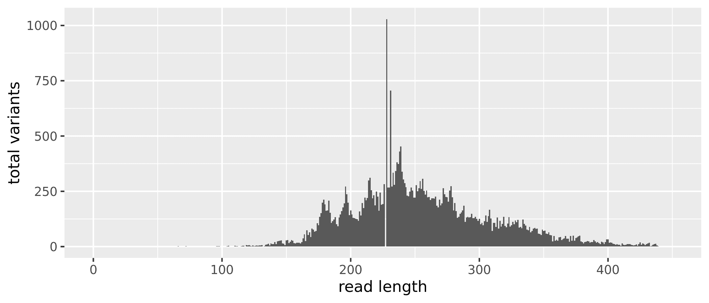
```
<small>`r caption_fig_its("read_length_before_its")`</small>

# 4C. Collapse No Mismatch

```{r}
seqtab_to_collapse <- collapseNoMismatch(st_all, minOverlap = 20, 
                                         orderBy = "abundance", 
                                         identicalOnly = FALSE, 
                                         vec = TRUE, band = -1, 
                                         verbose = TRUE)
```

```
Output 34656 collapsed sequences out of 35383 input sequences.
```

```{r}
dim(seqtab_to_collapse)
```


```{r, echo=FALSE, eval=TRUE}
seqtab <- c(182, 34656)
seqtab
```

```{r}
table(nchar(getSequences(seqtab_to_collapse)))
```

```
 55  57  61  64  65  66  68  72  76  77  78  80  83  84  89  90  91  96  97  98 
  1   1   1   1   1   2   1   2   1   1   1   1   1   1   1   1   1   2   2   2 
 99 101 102 104 105 106 110 111 112 113 115 116 117 118 119 120 121 122 123 124 
  1   1   1   2   3   1   4   2   2   1   2   4   3   1   6   5   7   3   2   5 
125 126 127 128 129 130 131 132 133 134 135 136 137 138 139 140 141 142 143 144 
  2   4   5   3   5   5   7   1   2   8  10  13   5  15  11  12  20  12  23  25 
145 146 147 148 149 150 151 152 153 154 155 156 157 158 159 160 161 162 163 164 
 27  28  14  13   7  28  29  16  22  30  27  16  14  18  18  17  15  20  37  55 
165 166 167 168 169 170 171 172 173 174 175 176 177 178 179 180 181 182 183 184 
 25  74  53  64  43  81  76  67  71 105  96 134 152 198 212 191 162 163 208 153 
185 186 187 188 189 190 191 192 193 194 195 196 197 198 199 200 201 202 203 204 
107 115 123 133 101  91 132 145 160 177 195 271 236 198 142 163 145 129 128 126 
205 206 207 208 209 210 211 212 213 214 215 216 217 218 219 220 221 222 223 224 
124 116 159 140 197 174 221 209 220 299 312 255 219 232 184 248 226 158 244 156 
225 226 228 229 230 231 232 233 234 235 236 237 238 239 240 241 242 243 244 245 
165 189 814 182 163 566 270 334 278 342 382 372 430 453 335 303 286 268 229 228 
246 247 248 249 250 251 252 253 254 255 256 257 258 259 260 261 262 263 264 265 
248 267 253 221 221 278 250 264 296 261 307 251 234 254 223 225 210 218 219 217 
266 267 268 269 270 271 272 273 274 275 276 277 278 279 280 281 282 283 284 285 
226 185 177 212 186 196 264 236 225 223 203 253 273 223 164 197 161 130 135 149 
286 287 288 289 290 291 292 293 294 295 296 297 298 299 300 301 302 303 304 305 
154 164 185 112 132 135 132 133 148 129 129 135 126 116 125 101 107  97 115 141 
306 307 308 309 310 311 312 313 314 315 316 317 318 319 320 321 322 323 324 325 
112 138 166 127  71 107 107  89 131  82 117  91 102 133  94  88 104 133  90  96 
326 327 328 329 330 331 332 333 334 335 336 337 338 339 340 341 342 343 344 345 
112 101 118 110 121  86  89  83 123 102  95  76  74  89  65  71  81  84  80  81 
346 347 348 349 350 351 352 353 354 355 356 357 358 359 360 361 362 363 364 365 
 58  57  53  76  70  72  59  57  65  52  51  24  48  26  31  26  42  44  30  34 
366 367 368 369 370 371 372 373 374 375 376 377 378 379 380 381 382 383 384 385 
 37  48  36  36  22  48  27  49  27  39  41  47  49  23  21  14  21  22  25  24 
386 387 388 389 390 391 392 393 394 395 396 397 398 399 400 401 402 403 404 405 
 17  21  20  30  23  17  20  16  11  22  19  11  20  32  33  18  19  17  13  11 
406 407 408 409 410 411 412 413 414 415 416 417 418 419 420 421 422 423 424 425 
  9  12   8   9   4  14   9   6   8  11  12  12   9   7   5   7  10   4  12  19 
426 427 428 429 430 431 432 433 434 435 436 437 438 439 
  9  15  11   7  12  14  18   2   4   8  11  13   5   2 
```

We have **`r (seqtab)[2]`** sequence variants but also a range of sequence lengths. Since many of these sequence variants are singletons or doubletons, we will just select a range that corresponds to the expected amplicon length and eliminate the spurious reads. Again, we will do that after merging the tables from the three years.

```{r, echo=FALSE}
read_length_all_collapse <-  data.frame(nchar(getSequences(seqtab_to_collapse)))
colnames(read_length_all_collapse) <- "length"
plot_all_collapse <- qplot(length, data = read_length_all_collapse, 
                           geom = "histogram", binwidth = 1, 
                           xlab = "read length", 
                           ylab = "total variants", 
                           xlim = c(0,450)) 
ggsave("figures/its_read_length_before_nopool_all_collapse.png", 
       plot_all_collapse, width = 7, height = 3)
saveRDS(seqtab_to_collapse, "rdata/seqtab_to_collapse.rds")
```

Now we can just select a range that corresponds to the expected amplicon length and eliminate the spurious reads.

```{r}
seqtab.2 <- seqtab_to_collapse[,nchar(colnames(seqtab_to_collapse)) %in% seq(100,450)]
dim(seqtab.2)
```


<aside>
The values you select should be based on the sequence table generated above.
</aside>

```{r, echo=FALSE, eval=TRUE}
seqtab2 <-  c(182, 34630)
seqtab2
```

```{r}
table(nchar(getSequences(seqtab.2)))
```

```
101 102 104 105 106 110 111 112 113 115 116 117 118 119 120 121 122 123 124 125 
  1   1   2   3   1   4   2   2   1   2   4   3   1   6   5   7   3   2   5   2 
126 127 128 129 130 131 132 133 134 135 136 137 138 139 140 141 142 143 144 145 
  4   5   3   5   5   7   1   2   8  10  13   5  15  11  12  20  12  23  25  27 
146 147 148 149 150 151 152 153 154 155 156 157 158 159 160 161 162 163 164 165 
 28  14  13   7  28  29  16  22  30  27  16  14  18  18  17  15  20  37  55  25 
166 167 168 169 170 171 172 173 174 175 176 177 178 179 180 181 182 183 184 185 
 74  53  64  43  81  76  67  71 105  96 134 152 198 212 191 162 163 208 153 107 
186 187 188 189 190 191 192 193 194 195 196 197 198 199 200 201 202 203 204 205 
115 123 133 101  91 132 145 160 177 195 271 236 198 142 163 145 129 128 126 124 
206 207 208 209 210 211 212 213 214 215 216 217 218 219 220 221 222 223 224 225 
116 159 140 197 174 221 209 220 299 312 255 219 232 184 248 226 158 244 156 165 
226 228 229 230 231 232 233 234 235 236 237 238 239 240 241 242 243 244 245 246 
189 814 182 163 566 270 334 278 342 382 372 430 453 335 303 286 268 229 228 248 
247 248 249 250 251 252 253 254 255 256 257 258 259 260 261 262 263 264 265 266 
267 253 221 221 278 250 264 296 261 307 251 234 254 223 225 210 218 219 217 226 
267 268 269 270 271 272 273 274 275 276 277 278 279 280 281 282 283 284 285 286 
185 177 212 186 196 264 236 225 223 203 253 273 223 164 197 161 130 135 149 154 
287 288 289 290 291 292 293 294 295 296 297 298 299 300 301 302 303 304 305 306 
164 185 112 132 135 132 133 148 129 129 135 126 116 125 101 107  97 115 141 112 
307 308 309 310 311 312 313 314 315 316 317 318 319 320 321 322 323 324 325 326 
138 166 127  71 107 107  89 131  82 117  91 102 133  94  88 104 133  90  96 112 
327 328 329 330 331 332 333 334 335 336 337 338 339 340 341 342 343 344 345 346 
101 118 110 121  86  89  83 123 102  95  76  74  89  65  71  81  84  80  81  58 
347 348 349 350 351 352 353 354 355 356 357 358 359 360 361 362 363 364 365 366 
 57  53  76  70  72  59  57  65  52  51  24  48  26  31  26  42  44  30  34  37 
367 368 369 370 371 372 373 374 375 376 377 378 379 380 381 382 383 384 385 386 
 48  36  36  22  48  27  49  27  39  41  47  49  23  21  14  21  22  25  24  17 
387 388 389 390 391 392 393 394 395 396 397 398 399 400 401 402 403 404 405 406 
 21  20  30  23  17  20  16  11  22  19  11  20  32  33  18  19  17  13  11   9 
407 408 409 410 411 412 413 414 415 416 417 418 419 420 421 422 423 424 425 426 
 12   8   9   4  14   9   6   8  11  12  12   9   7   5   7  10   4  12  19   9 
427 428 429 430 431 432 433 434 435 436 437 438 439 
 15  11   7  12  14  18   2   4   8  11  13   5   2 
 ```

After removing the extreme length variants, we have **`r (seqtab2)[2]`**, a reduction of **`r (seqtab)[2] - (seqtab2)[2]`** sequence variants.

```{r, echo=FALSE}
saveRDS(seqtab.2, "its_seqtab.rds")
```

# 5. Remove Chimeras

Even though the `dada` method corrects substitution and indel errors,  chimeric sequences remain. According to the DADA2 documentation, the accuracy of sequence variants after denoising makes identifying chimeric ASVs simpler than when dealing with fuzzy OTUs. Chimeric sequences are identified if they can be *exactly reconstructed* by combining a left-segment and a right-segment from two more abundant *parent* sequences.

```{r}
seqtab.nochim <- removeBimeraDenovo(seqtab.2,  method = "consensus", 
                                    multithread = 20, verbose = TRUE)
dim(seqtab.nochim)
```

```
Identified 936 bimeras out of 34630 input sequences.
```

```{r, echo=FALSE, eval=TRUE}
seqtab3 <- c(182, 33694)
seqtab3
```

```{r}
sum(seqtab.nochim)/sum(seqtab.2)
```

```{r, echo=FALSE, eval=TRUE}
chim_rem <- 0.9675082
0.9939816
```

```
101 102 104 105 106 110 111 112 113 115 116 117 118 119 120 121 122 123 124 125 
  1   1   2   3   1   4   2   2   1   2   4   3   1   6   5   7   3   2   5   2 
126 127 128 129 130 131 132 133 134 135 136 137 138 139 140 141 142 143 144 145 
  3   5   3   5   5   7   1   2   8   9  10   5  15   9  12  20  12  23  25  26 
146 147 148 149 150 151 152 153 154 155 156 157 158 159 160 161 162 163 164 165 
 28  14  13   7  28  29  16  22  30  24  16  13  18  18  17  14  20  37  55  25 
166 167 168 169 170 171 172 173 174 175 176 177 178 179 180 181 182 183 184 185 
 74  53  64  43  77  74  65  71 100  96 134 151 197 203 191 162 158 200 147 107 
186 187 188 189 190 191 192 193 194 195 196 197 198 199 200 201 202 203 204 205 
114 123 130 100  89 127 130 153 158 161 234 223 172 131 144 133 124 124 122 120 
206 207 208 209 210 211 212 213 214 215 216 217 218 219 220 221 222 223 224 225 
115 155 139 183 168 212 207 204 272 261 239 215 228 183 243 223 155 239 156 157 
226 228 229 230 231 232 233 234 235 236 237 238 239 240 241 242 243 244 245 246 
189 801 179 163 562 268 332 274 327 379 369 425 450 329 297 277 261 222 221 246 
247 248 249 250 251 252 253 254 255 256 257 258 259 260 261 262 263 264 265 266 
264 245 221 219 266 243 252 289 257 294 247 232 247 218 218 201 204 215 214 226 
267 268 269 270 271 272 273 274 275 276 277 278 279 280 281 282 283 284 285 286 
167 174 207 185 195 262 229 221 222 202 251 259 221 163 196 161 130 134 149 153 
287 288 289 290 291 292 293 294 295 296 297 298 299 300 301 302 303 304 305 306 
163 185 112 132 134 131 132 146 129 129 133 125 116 125 101 107  97 114 137 112 
307 308 309 310 311 312 313 314 315 316 317 318 319 320 321 322 323 324 325 326 
137 162 124  68 103  99  87 125  79 113  89  94 127  91  84 100 127  85  92 108 
327 328 329 330 331 332 333 334 335 336 337 338 339 340 341 342 343 344 345 346 
 98 117 110 118  82  88  82 122  99  94  74  72  86  62  67  77  81  76  80  57 
347 348 349 350 351 352 353 354 355 356 357 358 359 360 361 362 363 364 365 366 
 57  52  75  64  67  58  56  63  52  50  24  48  26  30  26  41  44  30  32  35 
367 368 369 370 371 372 373 374 375 376 377 378 379 380 381 382 383 384 385 386 
 47  36  36  22  48  27  48  26  39  40  46  47  23  21  14  21  22  25  24  16 
387 388 389 390 391 392 393 394 395 396 397 398 399 400 401 402 403 404 405 406 
 20  20  30  23  16  19  16  11  22  18  11  20  32  33  18  19  16  13  10   9 
407 408 409 410 411 412 413 414 415 416 417 418 419 420 421 422 423 424 425 426 
 12   8   9   4  14   9   6   6  11  12  11   9   7   4   7  10   4  12  19   9 
427 428 429 430 431 432 433 434 435 436 437 438 439 
 14  10   7  11  13  18   2   4   8  11  13   5   2 
```

Chimera checking removed an additional **`r (seqtab2)[2] - (seqtab3)[2]`** sequence variants however, when we account for the abundances of each variant, we see chimeras accounts for about **`r 100*(1-chim_rem)`%** of the merged sequence reads. Not bad.

The last thing we want to do is write the sequence table to an `RDS` file.

```{r}
saveRDS(seqtab.nochim, "its_seqtab.nochim.rds")
```

Now, lets look at the distribution of ASVs by the number of samples

```{r}
table(colSums(seqtab.nochim > 0))
```

```
    1     2     3     4     5     6     7     8     9    10    11    12    13 
21150  4544  2123  1226   804   584   441   360   279   226   176   187   133 
   14    15    16    17    18    19    20    21    22    23    24    25    26 
   91   107    97    80    63    39    65    61    53    42    40    37    39 
   27    28    29    30    31    32    33    34    35    36    37    38    39 
   27    29    28    27    19    31    18    21    20    19    16    23    13 
   40    41    42    43    44    45    46    47    48    49    50    51    52 
   15    15    12    16    16     9    10    11    13    11     8    10    10 
   53    54    55    56    57    58    59    60    61    62    63    64    65 
    5     7    10     8     7     6     2    11     5     7     7     5     4 
   66    67    68    69    70    71    72    73    74    75    76    77    78 
    3     3     7     2     4     2     5     4     3     4     3     5     4 
   79    80    81    82    83    84    85    87    88    91    92    93    94 
    2     3     2     2     6     1     2     1     2     2     1     2     2 
   95    96    97    98    99   101   102   104   106   109   112   114   115 
    1     2     3     1     1     1     3     2     1     1     2     1     2 
  117   118   125   126   133   134   137   141   143   144   146   159   169 
    1     1     1     1     3     2     1     1     1     1     1     2     1 
  175 
    1  
```

```{r, echo=FALSE, eval=TRUE}
sample_by_asvs <- read.table("include/dada2/its_seqtab_sum_samples_by_asvs.txt", 
                            header = TRUE, sep = "\t")
sample_by_asvs$Freq <- log(sample_by_asvs$Freq)
plot(sample_by_asvs, type = "s", main = "Total ASVs per sample", 
     xlab = "Number of Samples", ylab = "Number of ASVs")
```

And the distribution of total ASVs across samples. 

```{r}
table(rowSums(seqtab.nochim > 0))
```


```
   5    6   91  163  194  214  258  286  310  317  322  345  351  354  360  369 
   1    1    1    1    1    1    1    1    1    1    1    1    1    1    1    1 
 401  402  414  420  422  423  431  434  435  437  440  444  449  450  453  458 
   2    1    1    1    1    2    1    1    1    1    1    1    1    1    1    1 
 459  469  477  479  484  486  491  493  496  497  498  502  505  508  512  513 
   1    2    1    1    1    1    1    1    1    1    2    1    1    1    1    1 
 514  517  523  526  536  546  569  570  574  575  576  584  586  589  590  599 
   2    1    2    2    1    1    1    2    1    1    1    2    1    1    1    1 
 601  602  606  609  610  611  619  620  621  626  631  635  638  640  644  646 
   2    2    2    1    2    1    1    2    2    2    1    2    2    1    1    1 
 650  654  660  661  663  664  665  671  677  680  681  682  686  688  689  690 
   1    1    1    1    1    1    1    1    1    1    1    2    1    4    1    2 
 692  697  699  702  707  712  716  717  720  722  726  727  728  730  732  734 
   1    1    2    1    1    1    1    1    1    1    1    1    1    1    1    1 
 751  757  762  767  774  775  776  781  782  792  794  796  798  799  801  809 
   1    2    1    1    1    2    2    1    1    2    1    1    1    1    2    1 
 811  818  831  841  842  847  849  854  863  864  868  872  882  886  907  910 
   2    1    1    1    1    1    1    1    1    1    1    1    1    1    1    1 
 935  956  959  982 1006 1017 1045 1046 
   1    1    1    1    1    1    1    1 
```

```{r, echo=FALSE, eval=TRUE}
asv_by_sample <- read.table("include/dada2/its_seqtab_sum_asvs_by_samples.txt", 
                            header = TRUE, sep = "\t")
hist(asv_by_sample$Total_ASVs, main = "Total ASVs per sample", 
     xlab = "Number of ASVs", ylab = "Number of Samples", 
     border = "#323232", col = "#56B4E9", 
     xlim = c (0,1300), ylim = c(0,50), breaks = 10)
```

# 6. Assign Taxonomy

The `assignTaxonomy` command implements the naive Bayesian classifier, so for reproducible results you need to set a random number seed (see issue [#538](https://github.com/benjjneb/dada2/issues/538)). We did this at the beginning of the workflow. For taxonomic assignment, we are using the Silva version 138 [@quast2012silva]. The developers of DADA2 maintain a [formatted version of the database](https://benjjneb.github.io/dada2/training.html).

We will read in the `RDS` file containing the sequence table saved above. We also need to run `remove(list = ls())` command, otherwise the final image we save will be huge. This way, the image only contains the sample data, seqtab, and taxtab *after* running `removeBimeraDenovo`.

```{r}
remove(list = ls())
seqtab <- readRDS("rdata/seqtab.nochim.rds")
```

And then native Bayesian classifier against the Silva database.

```{r}
tax <- assignTaxonomy(seqtab, "sh_general_release_dynamic_s_04.02.2020_dev.fasta", 
                      multithread = 20, tryRC = TRUE, verbose = TRUE)
saveRDS(tax, "rdata/tax_its.rds")
```

```{r, echo=FALSE}
save.image("rdata/dada2_wf_its_2018.rdata")
```

# 7. Summary

```{r, echo=FALSE}
cut_0 <- read.table("files/agua/dada2/tables/its_cut_year_0.txt", header = TRUE)
cut_0$year <- "Y0"
cut_1 <- read.table("files/agua/dada2/tables/its_cut_year_1.txt", header = TRUE)
cut_1$year <- "Y1"
cut_4 <- read.table("files/agua/dada2/tables/its_cut_year_4.txt", header = TRUE)
cut_4$year <- "Y4"
cut_all <- rbind(cut_0, cut_1, cut_4)
cut_all <- cut_all[, c(1,4,2,3)]
cut_all$SampleId  <- gsub(x = cut_all$SampleId, pattern = "_R1", replacement = "") 

filt_0 <- read.table("files/agua/dada2/tables/its_filt_year_0.txt", header = TRUE)
filt_1 <- read.table("files/agua/dada2/tables/its_filt_year_1.txt", header = TRUE)
filt_4 <- read.table("files/agua/dada2/tables/its_filt_year_4.txt", header = TRUE)
filt_all <- rbind(filt_0, filt_1, filt_4)
filt_all$reads.in <- NULL
filt_all$SampleId  <- gsub(x = filt_all$SampleId, pattern = "_R1", replacement = "") 
filt_all <- filt_all %>% dplyr::rename("filtered" = 2)

denoise_0 <- read.table("files/agua/dada2/tables/its_denoise_year_0.txt", header = TRUE)
denoise_1 <- read.table("files/agua/dada2/tables/its_denoise_year_1.txt", header = TRUE)
denoise_4 <- read.table("files/agua/dada2/tables/its_denoise_year_4.txt", header = TRUE)
denoise_all <- rbind(denoise_0, denoise_1, denoise_4)

merge_0 <- read.table("files/agua/dada2/tables/its_merge_year_0.txt", header = TRUE)
merge_1 <- read.table("files/agua/dada2/tables/its_merge_year_1.txt", header = TRUE)
merge_4 <- read.table("files/agua/dada2/tables/its_merge_year_4.txt", header = TRUE)
merge_all <- rbind(merge_0, merge_1, merge_4)
merge_all[,c(2:3)] <- NULL

seqtab.nochim <- readRDS("files/agua/dada2/rdata/its_seqtab.nochim.rds")
nochime <- data.frame(rowSums(seqtab.nochim))
nochime <- nochime %>% dplyr::rename("nochim" = 1)
nochime <- nochime %>% tibble::rownames_to_column("SampleId")

track_changes <- dplyr::left_join(cut_all, filt_all) %>%
                 dplyr::left_join(., denoise_all) %>%
                 dplyr::left_join(., merge_all) %>%
                 dplyr::left_join(., nochime)

track_changes$perc_remain <- track_changes$nochim/track_changes$raw
track_changes$perc_remain <- round(track_changes$perc_remain, digits = 3)
write.table(track_changes, "files/agua/dada2/tables/its_read_changes.txt", 
                            sep = "\t", quote = FALSE, row.names = FALSE)
```


```{r, echo=FALSE, layout="l-body-outset", eval=TRUE}
seq_table <- read.table("files/dada2/tables/its_read_changes.txt",
                        header = TRUE, sep = "\t")
```
<small>`r caption_tab_its("track_its")`</small>

```{r, echo=FALSE, layout="l-body-outset", eval=TRUE}
seq_table %>%
  download_this(
    output_name = "its_read_changes",
    output_extension = ".csv",
    button_label = "Download data as csv file",
    button_type = "default",
    csv2 = FALSE,
    has_icon = TRUE,
    icon = "fa fa-save")

reactable(seq_table,
  defaultColDef = colDef(
    header = function(value) gsub("_", " ", value, fixed = TRUE),
    cell = function(value) format(value, nsmall = 1),
    align = "center", filterable = FALSE, sortable = TRUE, resizable = TRUE,
    footerStyle = list(fontWeight = "bold")
    ), 
  columns = list(
    Sample_ID = colDef(name = "Sample ID", 
                       sticky = "left", 
                       style = list(borderRight = "1px solid #eee"),
                       headerStyle = list(borderRight = "1px solid #eee"), 
                       align = "left",
                       minWidth = 150, footer = "Total reads", filterable = TRUE), 
    year = colDef(filterable = TRUE),
    raw = colDef(footer = function(values) sprintf("%.0f", sum(values))),
    cut = colDef(footer = function(values) sprintf("%.0f", sum(values))),
    filter = colDef(footer = function(values) sprintf("%.0f", sum(values))),
    denoiseF = colDef(footer = function(values) sprintf("%.0f", sum(values))),
    denoiseR = colDef(footer = function(values) sprintf("%.0f", sum(values))),
    merged = colDef(footer = function(values) sprintf("%.0f", sum(values))),
    nochim = colDef(footer = function(values) sprintf("%.0f", sum(values)))
    ), 
  searchable = FALSE, defaultPageSize = 5, 
  pageSizeOptions = c(5, 10, nrow(seq_table)), 
  showPageSizeOptions = TRUE, highlight = TRUE, 
  bordered = TRUE, striped = TRUE, compact = FALSE, 
  wrap = FALSE, showSortable = TRUE, fullWidth = TRUE,
  theme = reactableTheme(style = list(fontSize = "0.8em")))
```
## R Session Information & Code

This workflow was run on the [Smithsonian High Performance Cluster (SI/HPC)](https://doi.org/10.25572/SIHPC), Smithsonian Institution. Below are the specific packages and versions used in this workflow using both `sessionInfo()` and `devtools::session_info()`. Click the arrow to see the details.

<details markdown="1">
<summary>Show/hide  R Session Info</summary>
```
R version 4.0.0 (2020-04-24)
Platform: x86_64-conda_cos6-linux-gnu (64-bit)
Running under: CentOS Linux 7 (Core)

Matrix products: default
BLAS/LAPACK: /home/scottjj/miniconda3/envs/R-4/lib/libopenblasp-r0.3.9.so

locale:
 [1] LC_CTYPE=en_US.UTF-8       LC_NUMERIC=C              
 [3] LC_TIME=en_US.UTF-8        LC_COLLATE=en_US.UTF-8    
 [5] LC_MONETARY=en_US.UTF-8    LC_MESSAGES=en_US.UTF-8   
 [7] LC_PAPER=en_US.UTF-8       LC_NAME=C                 
 [9] LC_ADDRESS=C               LC_TELEPHONE=C            
[11] LC_MEASUREMENT=en_US.UTF-8 LC_IDENTIFICATION=C       

attached base packages:
 [1] grid      stats4    parallel  stats     graphics  grDevices utils    
 [8] datasets  methods   base     

other attached packages:
 [1] DECIPHER_2.16.1             RSQLite_2.2.0              
 [3] gridExtra_2.3               ggplot2_3.3.2              
 [5] ShortRead_1.46.0            GenomicAlignments_1.24.0   
 [7] SummarizedExperiment_1.18.2 DelayedArray_0.14.1        
 [9] matrixStats_0.56.0          Biobase_2.48.0             
[11] Rsamtools_2.4.0             GenomicRanges_1.40.0       
[13] GenomeInfoDb_1.24.2         Biostrings_2.56.0          
[15] XVector_0.28.0              IRanges_2.22.2             
[17] S4Vectors_0.26.1            BiocParallel_1.22.0        
[19] BiocGenerics_0.34.0         dada2_1.16.0               
[21] Rcpp_1.0.5                 

loaded via a namespace (and not attached):
 [1] tidyselect_1.1.0       purrr_0.3.4            reshape2_1.4.4        
 [4] lattice_0.20-41        colorspace_1.4-1       vctrs_0.3.4           
 [7] generics_0.0.2         blob_1.2.1             rlang_0.4.7           
[10] pillar_1.4.6           glue_1.4.2             withr_2.2.0           
[13] DBI_1.1.0              bit64_4.0.2            RColorBrewer_1.1-2    
[16] jpeg_0.1-8.1           GenomeInfoDbData_1.2.3 lifecycle_0.2.0       
[19] plyr_1.8.6             stringr_1.4.0          zlibbioc_1.34.0       
[22] munsell_0.5.0          gtable_0.3.0           hwriter_1.3.2         
[25] memoise_1.1.0          latticeExtra_0.6-29    scales_1.1.1          
[28] RcppParallel_5.0.2     bit_4.0.4              digest_0.6.25         
[31] png_0.1-7              stringi_1.5.3          dplyr_1.0.2           
[34] tools_4.0.0            bitops_1.0-6           magrittr_1.5          
[37] RCurl_1.98-1.2         tibble_3.0.3           crayon_1.3.4          
[40] pkgconfig_2.0.3        ellipsis_0.3.1         Matrix_1.2-18         
[43] R6_2.4.1               compiler_4.0.0        
─ Session info ───────────────────────────────────────────────────────────────
 setting  value                       
 version  R version 4.0.0 (2020-04-24)
 os       CentOS Linux 7 (Core)       
 system   x86_64, linux-gnu           
 ui       X11                         
 language (EN)                        
 collate  en_US.UTF-8                 
 ctype    en_US.UTF-8                 
 tz       America/New_York            
 date     2020-12-04                  

─ Packages ───────────────────────────────────────────────────────────────────
 package              * version  date       lib source        
 assertthat             0.2.1    2019-03-21 [1] CRAN (R 4.0.0)
 backports              1.1.9    2020-08-24 [1] CRAN (R 4.0.0)
 Biobase              * 2.48.0   2020-04-27 [1] Bioconductor  
 BiocGenerics         * 0.34.0   2020-04-27 [1] Bioconductor  
 BiocParallel         * 1.22.0   2020-04-27 [1] Bioconductor  
 Biostrings           * 2.56.0   2020-04-27 [1] Bioconductor  
 bit                    4.0.4    2020-08-04 [1] CRAN (R 4.0.0)
 bit64                  4.0.2    2020-07-30 [1] CRAN (R 4.0.0)
 bitops                 1.0-6    2013-08-17 [1] CRAN (R 4.0.0)
 blob                   1.2.1    2020-01-20 [1] CRAN (R 4.0.0)
 callr                  3.4.4    2020-09-07 [1] CRAN (R 4.0.0)
 cli                    2.0.2    2020-02-28 [1] CRAN (R 4.0.0)
 colorspace             1.4-1    2019-03-18 [1] CRAN (R 4.0.0)
 crayon                 1.3.4    2017-09-16 [1] CRAN (R 4.0.0)
 dada2                * 1.16.0   2020-04-27 [1] Bioconductor  
 DBI                    1.1.0    2019-12-15 [1] CRAN (R 4.0.0)
 DECIPHER             * 2.16.1   2020-05-11 [1] Bioconductor  
 DelayedArray         * 0.14.1   2020-07-14 [1] Bioconductor  
 desc                   1.2.0    2018-05-01 [1] CRAN (R 4.0.0)
 devtools               2.3.1    2020-07-21 [1] CRAN (R 4.0.0)
 digest                 0.6.25   2020-02-23 [1] CRAN (R 4.0.0)
 dplyr                  1.0.2    2020-08-18 [1] CRAN (R 4.0.0)
 ellipsis               0.3.1    2020-05-15 [1] CRAN (R 4.0.0)
 fansi                  0.4.1    2020-01-08 [1] CRAN (R 4.0.0)
 fs                     1.5.0    2020-07-31 [1] CRAN (R 4.0.0)
 generics               0.0.2    2018-11-29 [1] CRAN (R 4.0.0)
 GenomeInfoDb         * 1.24.2   2020-06-15 [1] Bioconductor  
 GenomeInfoDbData       1.2.3    2020-05-22 [1] Bioconductor  
 GenomicAlignments    * 1.24.0   2020-04-27 [1] Bioconductor  
 GenomicRanges        * 1.40.0   2020-04-27 [1] Bioconductor  
 ggplot2              * 3.3.2    2020-06-19 [1] CRAN (R 4.0.0)
 glue                   1.4.2    2020-08-27 [1] CRAN (R 4.0.0)
 gridExtra            * 2.3      2017-09-09 [1] CRAN (R 4.0.0)
 gtable                 0.3.0    2019-03-25 [1] CRAN (R 4.0.0)
 hwriter                1.3.2    2014-09-10 [1] CRAN (R 4.0.0)
 IRanges              * 2.22.2   2020-05-21 [1] Bioconductor  
 jpeg                   0.1-8.1  2019-10-24 [1] CRAN (R 4.0.0)
 lattice                0.20-41  2020-04-02 [1] CRAN (R 4.0.0)
 latticeExtra           0.6-29   2019-12-19 [1] CRAN (R 4.0.0)
 lifecycle              0.2.0    2020-03-06 [1] CRAN (R 4.0.0)
 magrittr               1.5      2014-11-22 [1] CRAN (R 4.0.0)
 Matrix                 1.2-18   2019-11-27 [1] CRAN (R 4.0.0)
 matrixStats          * 0.56.0   2020-03-13 [1] CRAN (R 4.0.0)
 memoise                1.1.0    2017-04-21 [1] CRAN (R 4.0.0)
 munsell                0.5.0    2018-06-12 [1] CRAN (R 4.0.0)
 pillar                 1.4.6    2020-07-10 [1] CRAN (R 4.0.0)
 pkgbuild               1.1.0    2020-07-13 [1] CRAN (R 4.0.0)
 pkgconfig              2.0.3    2019-09-22 [1] CRAN (R 4.0.0)
 pkgload                1.1.0    2020-05-29 [1] CRAN (R 4.0.0)
 plyr                   1.8.6    2020-03-03 [1] CRAN (R 4.0.0)
 png                    0.1-7    2013-12-03 [1] CRAN (R 4.0.0)
 prettyunits            1.1.1    2020-01-24 [1] CRAN (R 4.0.0)
 processx               3.4.4    2020-09-03 [1] CRAN (R 4.0.0)
 ps                     1.3.4    2020-08-11 [1] CRAN (R 4.0.0)
 purrr                  0.3.4    2020-04-17 [1] CRAN (R 4.0.0)
 R6                     2.4.1    2019-11-12 [1] CRAN (R 4.0.0)
 RColorBrewer           1.1-2    2014-12-07 [1] CRAN (R 4.0.0)
 Rcpp                 * 1.0.5    2020-07-06 [1] CRAN (R 4.0.0)
 RcppParallel           5.0.2    2020-06-24 [1] CRAN (R 4.0.0)
 RCurl                  1.98-1.2 2020-04-18 [1] CRAN (R 4.0.0)
 remotes                2.2.0    2020-07-21 [1] CRAN (R 4.0.0)
 reshape2               1.4.4    2020-04-09 [1] CRAN (R 4.0.0)
 rlang                  0.4.7    2020-07-09 [1] CRAN (R 4.0.0)
 rprojroot              1.3-2    2018-01-03 [1] CRAN (R 4.0.0)
 Rsamtools            * 2.4.0    2020-04-27 [1] Bioconductor  
 RSQLite              * 2.2.0    2020-01-07 [1] CRAN (R 4.0.0)
 S4Vectors            * 0.26.1   2020-05-16 [1] Bioconductor  
 scales                 1.1.1    2020-05-11 [1] CRAN (R 4.0.0)
 sessioninfo            1.1.1    2018-11-05 [1] CRAN (R 4.0.0)
 ShortRead            * 1.46.0   2020-04-27 [1] Bioconductor  
 stringi                1.5.3    2020-09-09 [1] CRAN (R 4.0.0)
 stringr                1.4.0    2019-02-10 [1] CRAN (R 4.0.0)
 SummarizedExperiment * 1.18.2   2020-07-09 [1] Bioconductor  
 testthat               2.3.2    2020-03-02 [1] CRAN (R 4.0.0)
 tibble                 3.0.3    2020-07-10 [1] CRAN (R 4.0.0)
 tidyselect             1.1.0    2020-05-11 [1] CRAN (R 4.0.0)
 usethis                1.6.1    2020-04-29 [1] CRAN (R 4.0.0)
 vctrs                  0.3.4    2020-08-29 [1] CRAN (R 4.0.0)
 withr                  2.2.0    2020-04-20 [1] CRAN (R 4.0.0)
 XVector              * 0.28.0   2020-04-27 [1] Bioconductor  
 zlibbioc               1.34.0   2020-04-27 [1] Bioconductor  
```
</details>

<br/>

The end!

```{r include=FALSE, eval=TRUE}
remove(list = ls())
```

##  Source Code {.appendix}

The source code for this page can be accessed on GitHub by [clicking this link](https://github.com/agua-salud/nutrients/blob/main/dada2.Rmd). Please note, that in order to process the data *and*  build the website, we needed to run the workflow and get the results. Then hard code the results and turn off the individual commands. So the raw file for this page is a bit messy---you have been warned.

## Data Availability {.appendix}

Raw fastq files available on figshare at XXXXXXXX. Trimmed fastq files (primers removed) available through the ENA under project accession number [XXXXXXXX](). Output files from this workflow available on figshare  5at [XXXXXXXX.]().
