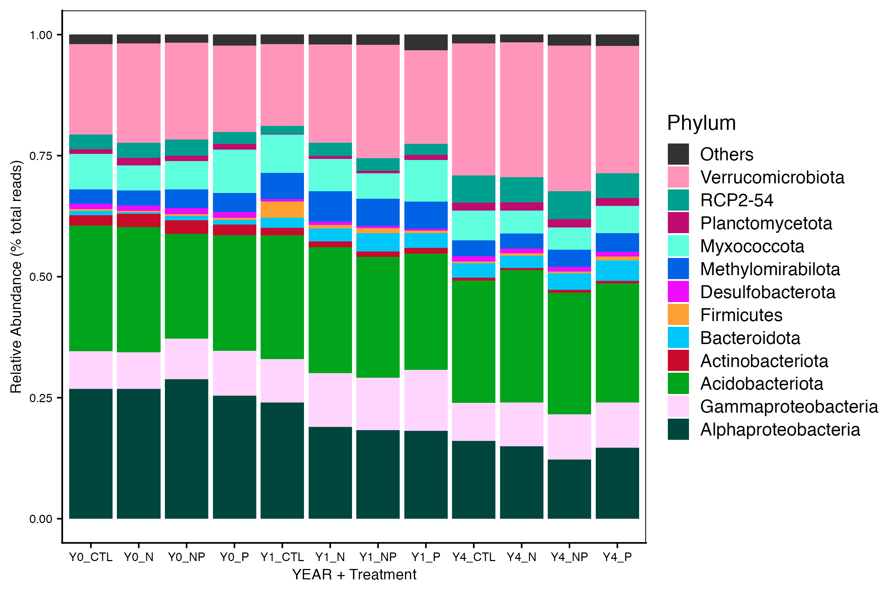
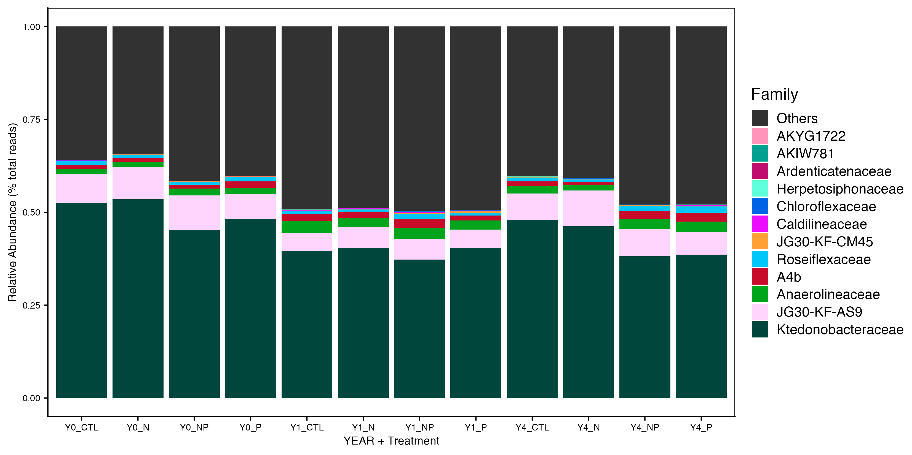
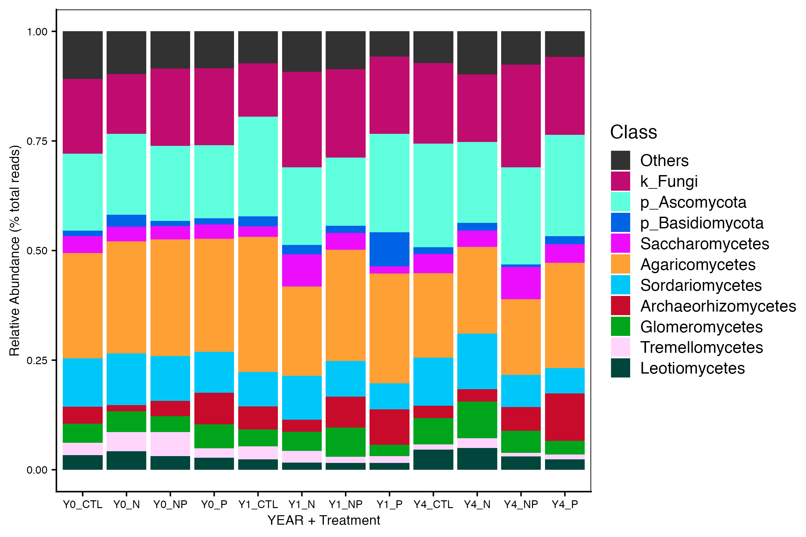
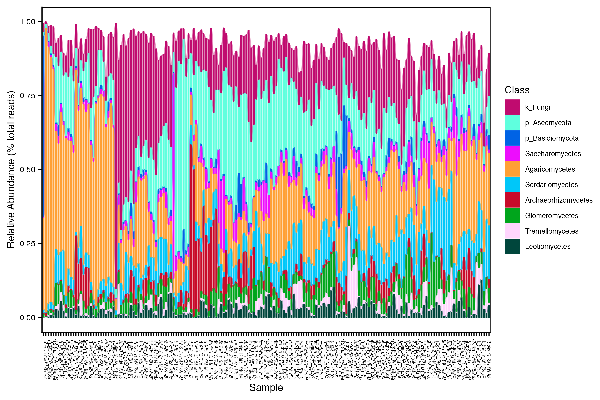

<details markdown="1">
<summary><strong>Click here</strong> for setup information.</summary>

```{r setup, message=FALSE, results = 'hide'}
knitr::opts_chunk$set(echo = TRUE, eval = FALSE)
set.seed(119)
#library(conflicted)
#pacman::p_depends(phangorn, local = TRUE)  
#pacman::p_depends_reverse(phangorn, local = TRUE)  

library(phyloseq); packageVersion("phyloseq")
library(Biostrings); packageVersion("Biostrings")
pacman::p_load(tidyverse, metacoder, hilldiv, patchwork, codefolder,
               microbiome, microeco, file2meco, cowplot,
               GUniFrac, ggalluvial, ggdendro, tidytree, igraph, reactable,
               pheatmap, SpiecEasi, Tax4Fun, WGCNA, microbiomeMarker,
               captioner, downloadthis,
               install = FALSE, update = FALSE)
options(scipen=999)
knitr::opts_current$get(c(
  "cache",
  "cache.path",
  "cache.rebuild",
  "dependson",
  "autodep"
))
```
</details>

```{r, echo=FALSE, eval=TRUE}
xaringanExtra::use_panelset()
```

```{r master_load_ssu18, include=FALSE, eval=TRUE}
## Load to build page only #2
remove(list = ls())
load("page_build/taxa_wf_ssu_1.rdata")
objects()
```

```{r, message=FALSE, results = 'hide', eval=TRUE}
### COmmon formatting scripts
### NOTE: captioner.R must be read BEFORE captions_XYZ.R
source("assets/captioner/captioner.R")
source("assets/captions/captions/captions_taxa.R")
source("assets/reactable/download_this_fun.R")
source("assets/reactable/styles.R")
source("assets/reactable/table_functions/beta.R")
```

# Synopsis

This workflow contains taxonomic diversity assessments for the 16S rRNA and ITS data sets. In order to run the workflow, you either need to first run the  [DADA2 Workflow](dada2.html), then the [Data Preparation workflow](data-prep.html), and finally the  [Filtering workflow](filtering.html). 

In this workflow, we use the [microeco](https://github.com/ChiLiubio/microeco) to look at the taxonomic distribution of microbial communities.

# 16s rRNA

```{r, echo=FALSE}
## Initial Load for  ANALYSIS #1
remove(list = ls())
set.seed(119)
ssu_ps_work_Y0 <- readRDS("files/filtering/final_ps/ssu_ps_work_Y0.rds")
ssu_ps_work_Y1 <- readRDS("files/filtering/final_ps/ssu_ps_work_Y1.rds")
ssu_ps_work_Y4 <- readRDS("files/filtering/final_ps/ssu_ps_work_Y4.rds")

ssu_ps_filt_Y0 <- readRDS("files/filtering/final_ps/ssu_ps_filt_Y0.rds")
ssu_ps_filt_Y1 <- readRDS("files/filtering/final_ps/ssu_ps_filt_Y1.rds")
ssu_ps_filt_Y4 <- readRDS("files/filtering/final_ps/ssu_ps_filt_Y4.rds")

ssu_ps_perfect_Y0 <- readRDS("files/filtering/final_ps/ssu_ps_perfect_Y0.rds")
ssu_ps_perfect_Y1 <- readRDS("files/filtering/final_ps/ssu_ps_perfect_Y1.rds")
ssu_ps_perfect_Y4 <- readRDS("files/filtering/final_ps/ssu_ps_perfect_Y4.rds")

ssu_ps_pime_Y0 <- readRDS("files/filtering/final_ps/ssu_ps_pime_Y0.rds")
ssu_ps_pime_Y1 <- readRDS("files/filtering/final_ps/ssu_ps_pime_Y1.rds")
ssu_ps_pime_Y4 <- readRDS("files/filtering/final_ps/ssu_ps_pime_Y4.rds")
objects()
```

Here we compare the taxonomic breakdown of the Full (unfiltered), Arbitrary filtered, PERfect filtered, and PIME filtered  data sets, split by temperature treatment.

First, we want to separate out the Proteobacteria classes so we can plot these along with other phyla. To accomplish this we perform the following steps:

## Formatting data sets

1) Get all Class-level Proteobacteria names

```{r, code_folding=TRUE}
ssu_data_sets <- c("ssu_ps_work_Y0", "ssu_ps_work_Y1", "ssu_ps_work_Y4", 
                   "ssu_ps_filt_Y0", "ssu_ps_filt_Y1", "ssu_ps_filt_Y4", 
                   "ssu_ps_perfect_Y0", "ssu_ps_perfect_Y1", "ssu_ps_perfect_Y4", 
                   "ssu_ps_pime_Y0", "ssu_ps_pime_Y1", "ssu_ps_pime_Y4")

for (i in ssu_data_sets) {
     tmp_name <- purrr::map_chr(i, ~paste0(., "_proteo"))
     tmp_get <- get(i)
     tmp_df <- subset_taxa(tmp_get, Phylum == "Proteobacteria")
     assign(tmp_name, tmp_df)
     print(tmp_name)
     tmp_get_taxa <- get_taxa_unique(tmp_df,
                                     taxonomic.rank = rank_names(tmp_df)[3],
                                     errorIfNULL=TRUE)
     print(tmp_get_taxa)
     rm(list = ls(pattern = "tmp_"))
     rm(list = ls(pattern = "_proteo"))
}
```

2) Replace Phylum Proteobacteria with the Class name.

```{r, code_folding=TRUE}
for (j in ssu_data_sets) {
  tmp_name <- purrr::map_chr(j, ~paste0(., "_proteo_clean"))
  tmp_get <- get(j)
  tmp_clean <- data.frame(tax_table(tmp_get))

   for (i in 1:nrow(tmp_clean)){
       if (tmp_clean[i,2] == "Proteobacteria" & tmp_clean[i,3] == "Alphaproteobacteria"){
           phylum <- base::paste("Alphaproteobacteria")
           tmp_clean[i, 2] <- phylum
   }   else if (tmp_clean[i,2] == "Proteobacteria" & tmp_clean[i,3] == "Gammaproteobacteria"){
           phylum <- base::paste("Gammaproteobacteria")
           tmp_clean[i, 2] <- phylum
   }   else if (tmp_clean[i,2] == "Proteobacteria" & tmp_clean[i,3] == "Zetaproteobacteria"){
              phylum <- base::paste("Zetaproteobacteria")
           tmp_clean[i, 2] <- phylum
   }   else if (tmp_clean[i,2] == "Proteobacteria" & tmp_clean[i,3] == "p_Proteobacteria"){
           phylum <- base::paste("p_Proteobacteria")
           tmp_clean[i, 2] <- phylum
       }
     }
  tax_table(tmp_get) <- as.matrix(tmp_clean)
  rank_names(tmp_get)
  assign(tmp_name, tmp_get)
  print(c(tmp_name, tmp_get))
  print(length(get_taxa_unique(tmp_get,
                               taxonomic.rank = rank_names(tmp_get)[2],
                               errorIfNULL=TRUE)))
  tmp_path <- file.path("files/taxa/rdata/")
  saveRDS(tmp_get, paste(tmp_path, j, "_clean.rds", sep = ""))
  rm(list = ls(pattern = "tmp_"))
}
rm(class, order, phylum)
objects(pattern="_proteo_clean")
```

3) In order to use `microeco`, we need to add the rank designation as a prefix to each taxa. For example, `Actinobacteriota` is changed to `p__Actinobacteriota`. 

```{r, code_folding=TRUE}
for (i in ssu_data_sets) {
  tmp_get <- get(purrr::map_chr(i, ~paste0(., "_proteo_clean")))
  #tmp_get <- get(i)
  #tmp_path <- file.path("files/alpha/rdata/")
  #tmp_read <- readRDS(paste(tmp_path, i, ".rds", sep = ""))
  tmp_sam_data <- sample_data(tmp_get)
  tmp_tax_data <- data.frame(tax_table(tmp_get))
  tmp_tax_data$Phylum <- gsub("p_Proteobacteria", "Proteobacteria", tmp_tax_data$Phylum)

  #tmp_tax_data[,c(1:6)]
  tmp_tax_data$ASV_ID <- NULL # Some have, some do not
  tmp_tax_data$ASV_SEQ <- NULL
  
  tmp_tax_data[] <- data.frame(lapply(tmp_tax_data, gsub, 
                                      pattern = "^[k | p | c | o | f]_.*", 
                                      replacement = "", fixed = FALSE))
  tmp_tax_data$Kingdom <- paste("k__", tmp_tax_data$Kingdom, sep = "")
  tmp_tax_data$Phylum <- paste("p__", tmp_tax_data$Phylum, sep = "")
  tmp_tax_data$Class <- paste("c__", tmp_tax_data$Class, sep = "")
  tmp_tax_data$Order <- paste("o__", tmp_tax_data$Order, sep = "")
  tmp_tax_data$Family <- paste("f__", tmp_tax_data$Family, sep = "")
  tmp_tax_data$Genus <- paste("g__", tmp_tax_data$Genus, sep = "")
  tmp_tax_data <- as.matrix(tmp_tax_data)
  
  tmp_ps <- phyloseq(otu_table(tmp_get),
                     phy_tree(tmp_get),
                     tax_table(tmp_tax_data),
                     tmp_sam_data)
  assign(i, tmp_ps)
  rm(list = ls(pattern = "tmp_"))
}
rm(list = ls(pattern = "_proteo_clean"))
```

4) Next, we need to covert each `phyloseq object` to a `microtable class`.  The microtable class is the basic data structure for the `microeco` package and designed to store basic information from all the downstream analyses (e.g, alpha diversity, beta diversity, etc.). We use the [file2meco](https://github.com/ChiLiubio/file2meco) to read the phyloseq object and convert into a microtable object. We can add `_me` as a suffix to each object to distinguish it from its' phyloseq counterpart. 

```{r, code_folding=TRUE}
for (i in ssu_data_sets) {
    tmp_get <- get(i)
    tmp_otu_table <- data.frame(t(otu_table(tmp_get)))
    tmp_sample_info <- data.frame(sample_data(tmp_get))
    tmp_taxonomy_table <- data.frame(tax_table(tmp_get))
    tmp_phylo_tree <- phy_tree(tmp_get)
    tmp_taxonomy_table %<>% tidy_taxonomy
    tmp_dataset <- microtable$new(sample_table = tmp_sample_info, 
                                  otu_table = tmp_otu_table, 
                                  tax_table = tmp_taxonomy_table, 
                                  phylo_tree = tmp_phylo_tree)
    tmp_dataset$tidy_dataset()
    print(tmp_dataset)
    tmp_dataset$tax_table %<>% base::subset(Kingdom == "k__Archaea" | Kingdom == "k__Bacteria")
    print(tmp_dataset)
    tmp_dataset$filter_pollution(taxa = c("mitochondria", "chloroplast"))
    print(tmp_dataset)
    tmp_dataset$tidy_dataset()
    print(tmp_dataset)
    tmp_name <- purrr::map_chr(i, ~paste0(., "_me")) 
    assign(tmp_name, tmp_dataset)
    rm(list = ls(pattern = "tmp_"))
}  
objects()
```

Here is an example of what a new microeco object looks like when you call it.

```{r, eval=TRUE, echo=TRUE}
ssu_ps_work_Y0_me
ssu_ps_work_Y0
```


```{r, echo=FALSE}
for (i in objects(pattern = "_me")) {
  saveRDS(get(i), paste("files/taxa/rdata/", i, ".rds", sep = ""))
}
```

## Calculate the taxa abundance

5) Now, we calculate the taxa abundance at each taxonomic rank using `cal_abund()`. This function return a list called `taxa_abund` containing several data frame of the abundance information at each taxonomic rank. The list is stored in the microtable object automatically. It’s worth noting that the `cal_abund()` function can be used to solve some complex cases, such as supporting both the relative and absolute abundance calculation and selecting the partial taxonomic columns. More information can be found in the description of the [file2meco package](https://github.com/ChiLiubio/file2meco). In the same loop we also create a `trans_abund` class, which is used to transform taxonomic abundance data for plotting.

We can create a few additional variables so that changing the code will be a bit easier if we decide to use different settings.

```{r}
tax_rank <- "Phylum"
n_taxa <- 12
group_mean <- "YR_TREAT"
```

```{r, code_folding=TRUE}
for (i in ssu_data_sets) {
  tmp_me <- get(purrr::map_chr(i, ~paste0(., "_me")))
  tmp_me$cal_abund()
  tmp_me_abund <- trans_abund$new(dataset = tmp_me, taxrank = tax_rank, ntaxa = n_taxa)
  tmp_me_abund$abund_data$Abundance <- tmp_me_abund$abund_data$Abundance / 100
  tmp_me_abund_gr <- trans_abund$new(dataset = tmp_me, taxrank = tax_rank, ntaxa = n_taxa, 
                                  groupmean = group_mean)
  tmp_me_abund_gr$abund_data$Abundance <- tmp_me_abund_gr$abund_data$Abundance / 100
  tmp_name <- purrr::map_chr(i, ~paste0(., "_me_abund")) 
  assign(tmp_name, tmp_me_abund)  
  tmp_name_gr <- purrr::map_chr(i, ~paste0(., "_me_abund_group")) 
  assign(tmp_name_gr, tmp_me_abund_gr)  
  rm(list = ls(pattern = "tmp_"))
}
objects()
```

```
The result is stored in object$taxa_abund ...
YR_TREAT column is used to calculate mean abundance ...
```

6) I prefer to specify the order of taxa in these kinds of plots. We can look the top `ntaxa` (defined above) by accessing the `use_taxanames` character vector of each microtable object.


```{r, echo=FALSE}
print("FULL Data set (ssu_ps_work_Y0_me)", quote = FALSE)
sort(ssu_ps_work_Y0_me_abund$use_taxanames)
print("--------------------------------------------", quote = FALSE)
print("FULL Data set (ssu_ps_work_Y1_me)", quote = FALSE)
sort(ssu_ps_work_Y1_me_abund$use_taxanames)
print("--------------------------------------------", quote = FALSE)
print("FULL Data set (ssu_ps_work_Y4_me)", quote = FALSE)
sort(ssu_ps_work_Y4_me_abund$use_taxanames)
print("--------------------------------------------", quote = FALSE)
```

```{r, echo=FALSE}
print("Arbitrary filtered  (ssu_ps_filt_Y0_me)", quote = FALSE)
sort(ssu_ps_filt_Y0_me_abund$use_taxanames)
print("--------------------------------------------", quote = FALSE)
print("Arbitrary filtered  (ssu_ps_filt_Y1_me)", quote = FALSE)
sort(ssu_ps_filt_Y1_me_abund$use_taxanames)
print("--------------------------------------------", quote = FALSE)
print("Arbitrary filtered  (ssu_ps_filt_Y4_me)", quote = FALSE)
sort(ssu_ps_filt_Y4_me_abund$use_taxanames)
print("--------------------------------------------", quote = FALSE)
```

```{r, echo=FALSE}
print("PERFect filtered  (ssu_ps_perfect_Y0_me)", quote = FALSE)
sort(ssu_ps_perfect_Y0_me_abund$use_taxanames)
print("--------------------------------------------", quote = FALSE)
print("PERFect filtered  (ssu_ps_perfect_Y1_me)", quote = FALSE)
sort(ssu_ps_perfect_Y1_me_abund$use_taxanames)
print("--------------------------------------------", quote = FALSE)
print("PERFect filtered  (ssu_ps_perfect_Y4_me)", quote = FALSE)
sort(ssu_ps_perfect_Y4_me_abund$use_taxanames)
print("--------------------------------------------", quote = FALSE)
```

```{r, echo=FALSE}
print("PIME filtered  (ssu_ps_pime_Y0_me)", quote = FALSE)
sort(ssu_ps_pime_Y0_me_abund$use_taxanames)
print("--------------------------------------------", quote = FALSE)
print("PIME filtered  (ssu_ps_pime_Y1_me)", quote = FALSE)
sort(ssu_ps_pime_Y1_me_abund$use_taxanames)
print("--------------------------------------------", quote = FALSE)
print("PIME filtered  (ssu_ps_pime_Y4_me)", quote = FALSE)
sort(ssu_ps_pime_Y4_me_abund$use_taxanames)
print("--------------------------------------------", quote = FALSE)
```


Hum. Similar but not the same. This means we need to define the order for each separately. Once we do that, we will override the `use_taxanames` character vectors with the reordered vectors.

```{r code_folding=TRUE}
ssu_ps_work_Y0_tax_ord <- c("Alphaproteobacteria", "Gammaproteobacteria", "Acidobacteriota", "Actinobacteriota", "Bacteroidota", "Verrucomicrobiota", "RCP2-54", "Planctomycetota", "Methylomirabilota", "Myxococcota", "Chloroflexi", "Latescibacterota")
ssu_ps_work_Y1_tax_ord <- c("Alphaproteobacteria", "Gammaproteobacteria", "Acidobacteriota", "Actinobacteriota", "Bacteroidota", "Verrucomicrobiota", "RCP2-54", "Planctomycetota", "Methylomirabilota", "Myxococcota", "Chloroflexi", "Firmicutes")
ssu_ps_work_Y4_tax_ord <- c("Alphaproteobacteria", "Gammaproteobacteria", "Acidobacteriota", "Actinobacteriota", "Bacteroidota", "Verrucomicrobiota", "RCP2-54", "Planctomycetota", "Methylomirabilota", "Myxococcota", "Chloroflexi", "Desulfobacterota")

ssu_ps_filt_Y0_tax_ord <- c("Alphaproteobacteria", "Gammaproteobacteria", "Acidobacteriota", "Actinobacteriota", "Bacteroidota", "Verrucomicrobiota", "RCP2-54", "Planctomycetota", "Methylomirabilota", "Myxococcota", "Chloroflexi", "Desulfobacterota")
ssu_ps_filt_Y1_tax_ord <- c("Alphaproteobacteria", "Gammaproteobacteria", "Acidobacteriota", "Actinobacteriota", "Bacteroidota", "Verrucomicrobiota", "RCP2-54", "Planctomycetota", "Methylomirabilota", "Myxococcota", "Chloroflexi", "Firmicutes")
ssu_ps_filt_Y4_tax_ord <- c("Alphaproteobacteria", "Gammaproteobacteria", "Acidobacteriota", "Actinobacteriota", "Bacteroidota", "Verrucomicrobiota", "RCP2-54", "Planctomycetota", "Methylomirabilota", "Myxococcota", "Chloroflexi", "Desulfobacterota")

ssu_ps_perfect_Y0_tax_ord <- c("Alphaproteobacteria", "Gammaproteobacteria", "Acidobacteriota", "Actinobacteriota", "Bacteroidota", "Verrucomicrobiota", "RCP2-54", "Planctomycetota", "Methylomirabilota", "Myxococcota", "Chloroflexi", "Desulfobacterota")
ssu_ps_perfect_Y1_tax_ord <- c("Alphaproteobacteria", "Gammaproteobacteria", "Acidobacteriota", "Actinobacteriota", "Bacteroidota", "Verrucomicrobiota", "RCP2-54", "Planctomycetota", "Methylomirabilota", "Myxococcota", "Chloroflexi", "Firmicutes")
ssu_ps_perfect_Y4_tax_ord <- c("Alphaproteobacteria", "Gammaproteobacteria", "Acidobacteriota", "Actinobacteriota", "Bacteroidota", "Verrucomicrobiota", "RCP2-54", "Planctomycetota", "Methylomirabilota", "Myxococcota", "Chloroflexi", "Desulfobacterota")

ssu_ps_pime_Y0_tax_ord <- c("Alphaproteobacteria", "Gammaproteobacteria", "Acidobacteriota", "Actinobacteriota", "Bacteroidota", "Verrucomicrobiota", "RCP2-54", "Planctomycetota", "Methylomirabilota", "Myxococcota", "Entotheonellaeota", "Desulfobacterota")
ssu_ps_pime_Y1_tax_ord <- c("Alphaproteobacteria", "Gammaproteobacteria", "Acidobacteriota", "Actinobacteriota", "Bacteroidota", "Verrucomicrobiota", "RCP2-54", "Planctomycetota", "Methylomirabilota", "Myxococcota", "Chloroflexi", "Firmicutes")
ssu_ps_pime_Y4_tax_ord <- c("Alphaproteobacteria", "Gammaproteobacteria", "Acidobacteriota", "Actinobacteriota", "Bacteroidota", "Verrucomicrobiota", "RCP2-54", "Planctomycetota", "Methylomirabilota", "Myxococcota", "Entotheonellaeota", "Desulfobacterota")
```

7) And one more little step before plotting. Here we  **a**) specify a custom color palette and  **b**) specify the sample order. 


```{r, code_folding=TRUE}
ssu_colvec.tax <- c("#00463C","#FFD5FD","#00A51C","#C80B2A","#00C7F9","#FFA035",
                      "#ED0DFD","#0063E5","#5FFFDE","#C00B6F","#00A090","#FF95BA")
```

## Code for Plots

8) Now we can generate plots (in a loop) for each  data set.

```{r, code_folding=TRUE}
for (i in ssu_data_sets) {
  tmp_abund <- get(purrr::map_chr(i, ~paste0(., "_me_abund")))
  tmp_tax_order <- get(purrr::map_chr(i, ~paste0(., "_tax_ord")))
  tmp_abund$use_taxanames <- tmp_tax_order
  tmp_facet_plot <- tmp_abund$plot_bar(use_colors = ssu_colvec.tax, 
                                       use_alluvium = TRUE, clustering = TRUE,
                                       others_color = "#323232", 
                                       #facet = "AGE", 
                                       xtext_keep = TRUE, 
                                       xtext_type_hor = FALSE, 
                                       legend_text_italic = FALSE, 
                                       xtext_size = 6, 
                                       #facet_color = "#cccccc", 
                                       #order_x = ssu_samp_order
                                       )
  tmp_facet_name <- purrr::map_chr(i, ~paste0(., "_alluvial_plot")) 
  assign(tmp_facet_name, tmp_facet_plot)  
  rm(list = ls(pattern = "tmp_"))
}
objects(pattern = "_alluvial_plot")

```

Then add a little formatting to the alluvial plots.

```{r, code_folding=TRUE}
for (i in  objects(pattern = "_alluvial_plot")) {
    tmp_get <- get(i)
    tmp_get <- tmp_get +
    theme_cowplot() +
    guides(fill = guide_legend(title = tax_rank, reverse = FALSE,
                               keywidth = 0.7, keyheight = 0.7)) +
    ylab("Relative Abundance (% total reads)") + xlab("Sample") +
    theme(panel.grid.major = element_blank(), panel.grid.minor = element_blank(),
        panel.background = element_rect(fill = "transparent", colour = NA),
        plot.background = element_rect(fill = "transparent", colour = NA),
        panel.border = element_rect(fill = NA, color = "black"),
        legend.text = element_text(size = 7),
        legend.title = element_text(size = 10),
        legend.position = "right",
        axis.text.y = element_text(size = 8),
        axis.text.x = element_text(size = 3, angle = 90),
        strip.text = element_text(size = 8, angle = 0),
        axis.title = element_text(size = 10)) + #ylab(NULL) +
      scale_y_continuous()
  assign(i, tmp_get)
  rm(list = ls(pattern = "tmp_")) 
}
```

```{r, echo=FALSE}
for (i in objects(pattern = "_alluvial_plot")) {
  tmp_get <- get(i)
  ggplot2::ggsave(tmp_get, file = paste0("files/taxa/figures/", i, ".png", sep = ""), 
                   height = 14, width = 21, units = 'cm', bg = "white")
  ggplot2::ggsave(tmp_get, file = paste0("files/taxa/figures/", i, ".pdf", sep = ""), 
                   height = 14, width = 21, units = 'cm', bg = "white")
  rm(list = ls(pattern = "tmp_"))
}
```

```{r, code_folding=TRUE}
for (i in ssu_data_sets) {
  tmp_abund <- get(purrr::map_chr(i, ~paste0(., "_me_abund")))
  tmp_tax_order <- get(purrr::map_chr(i, ~paste0(., "_tax_ord")))
  tmp_abund$use_taxanames <- tmp_tax_order
  tmp_facet_plot <- tmp_abund$plot_bar(use_colors = ssu_colvec.tax, 
                                       use_alluvium = TRUE, clustering = TRUE,
                                       others_color = "#323232", 
                                       facet = "TREAT", 
                                       xtext_keep = TRUE, 
                                       xtext_type_hor = FALSE, 
                                       legend_text_italic = FALSE, 
                                       xtext_size = 6, 
                                       facet_color = "#cccccc", 
                                       #order_x = ssu_samp_order
                                       )
  tmp_facet_name <- purrr::map_chr(i, ~paste0(., "_alluvial_facet")) 
  assign(tmp_facet_name, tmp_facet_plot)  
  rm(list = ls(pattern = "tmp_"))
}
objects(pattern = "_alluvial_facet")

```

Then add a little formatting to the bar plots.

```{r, code_folding=TRUE}
for (i in  objects(pattern = "_alluvial_facet")) {
    tmp_get <- get(i)
    tmp_get <- tmp_get +
    theme_cowplot() +
    guides(fill = guide_legend(title = tax_rank, reverse = FALSE,
                               keywidth = 0.7, keyheight = 0.7)) +
    ylab("Relative Abundance (% total reads)") + xlab("Sample") +
    theme(panel.grid.major = element_blank(), panel.grid.minor = element_blank(),
        panel.background = element_rect(fill = "transparent", colour = NA),
        plot.background = element_rect(fill = "transparent", colour = NA),
        panel.border = element_rect(fill = NA, color = "black"),
        legend.text = element_text(size = 7),
        legend.title = element_text(size = 10),
        legend.position = "right",
        axis.text.y = element_text(size = 8),
        axis.text.x = element_text(size = 3, angle = 90),
        strip.text = element_text(size = 8, angle = 0),
        axis.title = element_text(size = 10)) + #ylab(NULL) +
      scale_y_continuous()
  assign(i, tmp_get)
  rm(list = ls(pattern = "tmp_")) 
}
```

```{r, echo=FALSE}
for (i in objects(pattern = "_alluvial_facet")) {
  tmp_get <- get(i)
  ggplot2::ggsave(tmp_get, file = paste0("files/taxa/figures/", i, ".png", sep = ""), 
                   height = 14, width = 21, units = 'cm', bg = "white")
  ggplot2::ggsave(tmp_get, file = paste0("files/taxa/figures/", i, ".pdf", sep = ""), 
                   height = 14, width = 21, units = 'cm', bg = "white")
  rm(list = ls(pattern = "tmp_"))
}
```

And now plots for the group means sets. We can use the same taxa order since that should not have changed.

```{r, code_folding=TRUE}
for (i in ssu_data_sets) {
  tmp_abund <- get(purrr::map_chr(i, ~paste0(., "_me_abund_group")))
  tmp_tax_order <- get(purrr::map_chr(i, ~paste0(., "_tax_ord")))
  tmp_abund$use_taxanames <- tmp_tax_order
  tmp_group_plot <- tmp_abund$plot_bar(use_colors = ssu_colvec.tax, 
                                       others_color = "#323232", 
                                       xtext_keep = TRUE, 
                                       xtext_type_hor = TRUE, 
                                       legend_text_italic = FALSE, 
                                       xtext_size = 10, 
                                       facet_color = "#cccccc")
  tmp_group_name <- purrr::map_chr(i, ~paste0(., "_group_plot")) 
  assign(tmp_group_name, tmp_group_plot)  
  rm(list = ls(pattern = "tmp_"))
}
objects(pattern = "_group_plot")
```

Let's also add a little formatting to the group mean plots.

```{r, code_folding=TRUE}
for (i in  objects(pattern = "_group_plot")) {
     tmp_get <- get(i)
     tmp_get <- tmp_get +
       theme_cowplot() +
       ylab("Relative Abundance (% total reads)") + xlab("YEAR + Treatment") +
       theme(panel.grid.major = element_blank(), panel.grid.minor = element_blank(),
             panel.background = element_rect(fill = "transparent", colour = NA),
             plot.background = element_rect(fill = "transparent", colour = NA),
             panel.border = element_rect(fill = NA, color = "black"),
             legend.position = "right",
             axis.text = element_text(size = 8),
             axis.title = element_text(size = 10)) + 
       scale_y_continuous()

     assign(i, tmp_get)
     rm(list = ls(pattern = "tmp_"))
}
```

```{r, echo=FALSE}
for (i in objects(pattern = "_group_plot")) {
  tmp_get <- get(i)
  ggplot2::ggsave(tmp_get, file = paste0("files/taxa/figures/", i, ".png", sep = ""), 
                   height = 14, width = 21, units = 'cm', bg = "white")
  ggplot2::ggsave(tmp_get, file = paste0("files/taxa/figures/", i, ".pdf", sep = ""), 
                   height = 14, width = 21, units = 'cm', bg = "white")
  rm(list = ls(pattern = "tmp_"))
}

save.image("page_build/taxa_wf_ssu_1.rdata")
```

##########################################
############## F
############## I
############## X
############## 
############## T
############## HIS SECTION
##########################################


<br/>

> It is important to note that while most of the dominant taxa are the same across the FULL, Arbitrary, PIME, and PERfect data sets, there a few key difference. Relative to the FULL data set, these differences are:

1) Latescibaterota was not among the dominant taxa in the Arbitrary filtered data set. Desulfobacterota  was substituted.

1) Latescibacterota and  Chloroflexi were not among the dominant taxa in the PIME data set. Firmicutes and Desulfobacterota were substituted. 

## Group mean plots

::: l-body-outset
::: {.panelset}
::: {.panel}

#### FULL (unfiltered)

```{r, echo=FALSE, eval=TRUE, warning=FALSE, layout='l-body-outset'}

```
:::

::: {.panel}

#### Arbitrary filtered

```{r, echo=FALSE, eval=TRUE, warning=FALSE, layout='l-body-outset'}

```
:::

::: {.panel}
#### PERFECT filtered

```{r, echo=FALSE, eval=TRUE, warning=FALSE, layout='l-body-outset'}

```
:::

::: {.panel}
#### PIME filtered

```{r, echo=FALSE, eval=TRUE, warning=FALSE, layout='l-body-outset'}

```
:::
:::
:::

## Alluvial plots

::: l-page
::: {.panelset}
::: {.panel}

#### FULL (unfiltered)

```{r, echo=FALSE, eval=TRUE, warning=FALSE, layout='l-page'}

```
:::

::: {.panel}

#### Arbitrary filtered

```{r, echo=FALSE, eval=TRUE, warning=FALSE, layout='l-page'}

```
:::


::: {.panel}
#### PERFECT filtered

```{r, echo=FALSE, eval=TRUE, warning=FALSE, layout='l-page'}

```
:::

::: {.panel}
#### PIME filtered

```{r, echo=FALSE, eval=TRUE, warning=FALSE, layout='l-page'}
knitr::include_graphics("include/taxa/ssu_ps_pime_alluvial_plot.png")
```
:::
:::
:::

##########################################
############## S
############## T
############## A
############## R
############## T
############## HERE
##########################################

# Major Bacterial taxa by Family

```{r, echo=FALSE, eval=TRUE}
remove(list = ls())
load("page_build/taxa_wf_ssu_2.rdata")
```


We also look at the relative abundance of groups within dominant Phyla. **Please note** these analyses are for the FULL data set only, before any type of filtering. For this analysis, we use the phyloseq object created in the Data Preparation wokflow section [Rename NA taxonomic ranks](data-prep.html#rename-na-taxonomic-ranks) where unclassified ranks were renamed by the next highest rank. See step #1 below for an example of the taxa table structure. 

<aside>
This code ***only*** works for multiple taxa from a *single* phyloseq object.
</aside>

<details markdown="1">
<summary><strong>Complete workflow</strong> for assessing Bacterial families. </summary>

> Please note, this section has minimal annotation.

```{r, echo=FALSE, eval=FALSE}
remove(list = ls())
ssu_ps_work <- readRDS("files/taxa/rdata/ssu_ps_work_clean.rds")
ssu_ps_work_me <- readRDS("files/taxa/rdata/ssu_ps_work_me.rds")
#head(data.frame(tax_table(ssu_ps_work)))[,1:6]
data.frame(tax_table(ssu_ps_work))
ssu_ps_work_me$tax_table
```

```{r}
set_to_plot <- "ssu_ps_work"
tax_group <- c("p__Alphaproteobacteria", "p__Gammaproteobacteria",
               "p__Acidobacteriota", "p__Actinobacteriota", "p__Planctomycetota",
               "p__Bacteroidota", "p__Chloroflexi",
               "p__Myxococcota", "p__Verrucomicrobiota")
```

```{r}
for (i in set_to_plot) {
  for (select_tax in tax_group) {
  tmp_get <- get(purrr::map_chr(i, ~ paste0(., "_me")))
  tmp_clone <- clone(tmp_get)
  tmp_clone$tax_table %<>% base::subset(Phylum == select_tax)
  tmp_clone$tidy_dataset()
  tmp_name <- purrr::map_chr(i, ~ paste0(., "_me_", select_tax))
  tmp_name <- gsub("_[a-z]__",  "_", tmp_name)
  assign(tmp_name, tmp_clone)
  rm(list = ls(pattern = "tmp_"))
  }
}
objects()
```

```{r}
tax_rank <- "Family"
n_taxa <- 12
group_mean <- "YR_TREAT"
```


```{r, code_folding=TRUE}
for (i in tax_group) {
  tmp_tax <- gsub("[a-z]__",  "", i)
  tmp_me_name <- paste0(set_to_plot, "_me_", tmp_tax, sep = "") 
  tmp_me <- get(tmp_me_name)
  tmp_me$cal_abund()
  tmp_me_abund <- trans_abund$new(dataset = tmp_me, taxrank = tax_rank, ntaxa = n_taxa)
  tmp_me_abund$abund_data$Abundance <- tmp_me_abund$abund_data$Abundance / 100
  tmp_me_abund_gr <- trans_abund$new(dataset = tmp_me, taxrank = tax_rank, ntaxa = n_taxa, 
                                  groupmean = group_mean)
  tmp_me_abund_gr$abund_data$Abundance <- tmp_me_abund_gr$abund_data$Abundance / 100
  tmp_name <- purrr::map_chr(tmp_me_name, ~paste0(., "_abund")) 
  assign(tmp_name, tmp_me_abund)  
  tmp_name_gr <- purrr::map_chr(tmp_me_name, ~paste0(., "_abund_group")) 
  assign(tmp_name_gr, tmp_me_abund_gr)  
  rm(list = ls(pattern = "p__"))
}
objects()

```

```
The result is stored in object$taxa_abund ...
YR_TREAT column is used to calculate mean abundance ...
```

```{r, echo=FALSE}
for (i in tax_group) {
  tmp_tax <- gsub("[a-z]__",  "", i)
  tmp_me <- get(paste0(set_to_plot, "_me_", tmp_tax, "_abund", sep = ""))
  print(tmp_tax, quote = FALSE) 
  print(tmp_me$use_taxanames)
  print("--------------------------------------------", quote = FALSE)
  rm(list = ls(pattern = "tmp_"))
}
```

```{r code_folding=TRUE}
Alphaproteobacteria_tax_ord <- 
c("Xanthobacteraceae", 
"Micropepsaceae", 
"Sphingomonadaceae", 
"Hyphomicrobiaceae", 
"Reyranellaceae", 
"Caulobacteraceae", 
"Methyloligellaceae", 
"Acetobacteraceae", 
"KF-JG30-B3", 
"Dongiaceae", 
"Beijerinckiaceae", 
"Rhizobiaceae")

Gammaproteobacteria_tax_ord <- 
c("Nitrosomonadaceae", 
"A21b", 
"SC-I-84", 
"Comamonadaceae", 
"Burkholderiaceae", 
"Sutterellaceae", 
"Rhodanobacteraceae", 
"Steroidobacteraceae", 
"Diplorickettsiaceae", 
"B1-7BS", 
"Oxalobacteraceae", 
"Rhodocyclaceae") 

Acidobacteriota_tax_ord <- 
c("Solibacteraceae", 
"Koribacteraceae", 
"Acidobacteriaceae_(Subgroup_1)", 
"Pyrinomonadaceae", 
"Bryobacteraceae", 
"Vicinamibacteraceae", 
"Blastocatellaceae", 
"Thermoanaerobaculaceae", 
"Holophagaceae", 
"Acidobacteriae_fa")

Actinobacteriota_tax_ord <- 
c("Acidothermaceae", 
"Micromonosporaceae", 
"Solirubrobacteraceae", 
"Gaiellaceae", 
"Mycobacteriaceae", 
"67-14", 
"Streptomycetaceae", 
"Pseudonocardiaceae", 
"Frankiaceae", 
"Nocardioidaceae", 
"Ilumatobacteraceae", 
"Thermomonosporaceae") 

Planctomycetota_tax_ord <- 
c("Gemmataceae", 
"WD2101_soil_group", 
"Pirellulaceae", 
"Isosphaeraceae", 
"Phycisphaeraceae", 
"CPla-3_termite_group", 
"Gimesiaceae", 
"Rubinisphaeraceae", 
"Tepidisphaeraceae", 
"Schlesneriaceae", 
"AKAU3564_sediment_group", 
"GWC2-45-44") 

Bacteroidota_tax_ord <- 
c("Chitinophagaceae", 
"Microscillaceae", 
"Flavobacteriaceae", 
"AKYH767", 
"BSV26", 
"Sphingobacteriaceae", 
"Cytophagaceae", 
"env.OPS_17", 
"37-13", 
"Saprospiraceae", 
"Hymenobacteraceae", 
"NS11-12_marine_group") 

Chloroflexi_tax_ord <- 
c("Ktedonobacteraceae", 
"JG30-KF-AS9", 
"Anaerolineaceae", 
"A4b", 
"Roseiflexaceae", 
"JG30-KF-CM45", 
"Caldilineaceae", 
"Chloroflexaceae", 
"Herpetosiphonaceae", 
"Ardenticatenaceae", 
"AKIW781", 
"AKYG1722") 

Myxococcota_tax_ord <- 
c("Anaeromyxobacteraceae", 
"Myxococcaceae", 
"Haliangiaceae", 
"Polyangiaceae", 
"BIrii41", 
"Phaselicystidaceae", 
"Sandaracinaceae", 
"Vulgatibacteraceae", 
"Nannocystaceae", 
"27F-1492R", 
"Eel-36e1D6", 
"Amb-16S-1034") 

Verrucomicrobiota_tax_ord <- 
c("Chthoniobacteraceae", 
"Pedosphaeraceae", 
"Xiphinematobacteraceae", 
"Opitutaceae", 
"cvE6", 
"Simkaniaceae", 
"Methylacidiphilaceae", 
"Parachlamydiaceae", 
"Verrucomicrobiaceae", 
"Puniceicoccaceae", 
"Omnitrophaceae", 
"Rubritaleaceae") 

```


```{r, code_folding=TRUE}
ssu_colvec.tax <- c("#00463C","#FFD5FD","#00A51C","#C80B2A","#00C7F9","#FFA035",
                      "#ED0DFD","#0063E5","#5FFFDE","#C00B6F","#00A090","#FF95BA")
```


```{r, code_folding=TRUE}
for (i in tax_group) {
  tmp_tax <- gsub("[a-z]__",  "", i)
  tmp_abund <- get(paste0(set_to_plot, "_me_", tmp_tax, "_abund", sep = ""))

  #tmp_abund <- get(purrr::map_chr(i, ~paste0(., "_me_abund")))
  tmp_tax_order <- get(purrr::map_chr(tmp_tax, ~paste0(., "_tax_ord")))
  tmp_abund$use_taxanames <- tmp_tax_order
  tmp_facet_plot <- tmp_abund$plot_bar(use_colors = ssu_colvec.tax, 
                                       use_alluvium = TRUE, clustering = TRUE,
                                       others_color = "#323232", 
                                       #facet = "AGE", 
                                       xtext_keep = TRUE, 
                                       xtext_type_hor = FALSE, 
                                       legend_text_italic = FALSE, 
                                       xtext_size = 6, 
                                       #facet_color = "#cccccc", 
                                       #order_x = ssu_samp_order
                                       )
  ### FORMATTING
    tmp_facet_plot <- tmp_facet_plot +
    theme_cowplot() +
    guides(fill = guide_legend(title = tax_rank, reverse = FALSE,
                               keywidth = 0.7, keyheight = 0.7)) +
    ylab("Relative Abundance (% total reads)") + xlab("Sample") +
    theme(panel.grid.major = element_blank(), panel.grid.minor = element_blank(),
        panel.background = element_rect(fill = "transparent", colour = NA),
        plot.background = element_rect(fill = "transparent", colour = NA),
        panel.border = element_rect(fill = NA, color = "black"),
        legend.text = element_text(size = 7),
        legend.title = element_text(size = 10),
        legend.position = "right",
        axis.text.y = element_text(size = 8),
        axis.text.x = element_text(size = 3, angle = 90),
        strip.text = element_text(size = 8, angle = 0),
        axis.title = element_text(size = 10)) + #ylab(NULL) +
      scale_y_continuous()
      
  tmp_facet_name <- purrr::map_chr(tmp_tax, ~paste0(., "_phyla_alluvial_plot")) 
  assign(tmp_facet_name, tmp_facet_plot)  
  rm(list = ls(pattern = "tmp_"))
}

objects(pattern = "_phyla_alluvial_plot")
objects()
```

```{r, echo=FALSE}
for (i in objects(pattern = "_phyla_alluvial_plot")) {
  tmp_get <- get(i)
  ggplot2::ggsave(tmp_get, file = paste0("files/taxa/figures/", i, ".png", sep = ""), 
                   height = 14, width = 28, units = 'cm', bg = "white")
  ggplot2::ggsave(tmp_get, file = paste0("files/taxa/figures/", i, ".pdf", sep = ""), 
                   height = 14, width = 28, units = 'cm', bg = "white")
  rm(list = ls(pattern = "tmp_"))
}
```

```{r, echo=FALSE}
system("cp files/taxa/figures/Acidobacteriota_phyla_alluvial_plot.png include/taxa/Acidobacteriota_phyla_alluvial_plot.png")
system("cp files/taxa/figures/Actinobacteriota_phyla_alluvial_plot.png include/taxa/Actinobacteriota_phyla_alluvial_plot.png")
system("cp files/taxa/figures/Alphaproteobacteria_phyla_alluvial_plot.png include/taxa/Alphaproteobacteria_phyla_alluvial_plot.png")
system("cp files/taxa/figures/Bacteroidota_phyla_alluvial_plot.png include/taxa/Bacteroidota_phyla_alluvial_plot.png")
system("cp files/taxa/figures/Chloroflexi_phyla_alluvial_plot.png include/taxa/Chloroflexi_phyla_alluvial_plot.png")
system("cp files/taxa/figures/Gammaproteobacteria_phyla_alluvial_plot.png include/taxa/Gammaproteobacteria_phyla_alluvial_plot.png")
system("cp files/taxa/figures/Myxococcota_phyla_alluvial_plot.png include/taxa/Myxococcota_phyla_alluvial_plot.png")
system("cp files/taxa/figures/Planctomycetota_phyla_alluvial_plot.png include/taxa/Planctomycetota_phyla_alluvial_plot.png")
system("cp files/taxa/figures/Verrucomicrobiota_phyla_alluvial_plot.png include/taxa/Verrucomicrobiota_phyla_alluvial_plot.png")
```


```{r, code_folding=TRUE}
for (i in tax_group) {
  tmp_tax <- gsub("[a-z]__",  "", i)
  tmp_abund <- get(paste0(set_to_plot, "_me_", tmp_tax, "_abund_group", sep = ""))
  #tmp_abund <- get(purrr::map_chr(i, ~paste0(., "_me_abund")))
  tmp_tax_order <- get(purrr::map_chr(tmp_tax, ~paste0(., "_tax_ord")))
  tmp_abund$use_taxanames <- tmp_tax_order
  tmp_group_plot <- tmp_abund$plot_bar(use_colors = ssu_colvec.tax, 
                                       others_color = "#323232", 
                                       xtext_keep = TRUE, 
                                       xtext_type_hor = TRUE, 
                                       legend_text_italic = FALSE, 
                                       xtext_size = 10, 
                                       facet_color = "#cccccc")
  
  tmp_group_plot <- tmp_group_plot +
       theme_cowplot() +
       ylab("Relative Abundance (% total reads)") + xlab("YEAR + Treatment") +
       theme(panel.grid.major = element_blank(), panel.grid.minor = element_blank(),
             panel.background = element_rect(fill = "transparent", colour = NA),
             plot.background = element_rect(fill = "transparent", colour = NA),
             panel.border = element_rect(fill = NA, color = "black"),
             legend.position = "right",
             axis.text = element_text(size = 8),
             axis.title = element_text(size = 10)) + 
       scale_y_continuous()
  
  tmp_facet_name <- purrr::map_chr(tmp_tax, ~paste0(., "_phyla_group_plot")) 
  assign(tmp_facet_name, tmp_group_plot)  
  rm(list = ls(pattern = "tmp_"))
}
```


```{r, echo=FALSE}
for (i in objects(pattern = "_phyla_group_plot")) {
  tmp_get <- get(i)
  ggplot2::ggsave(tmp_get, file = paste0("files/taxa/figures/", i, ".png", sep = ""), 
                   height = 14, width = 28, units = 'cm', bg = "white")
  ggplot2::ggsave(tmp_get, file = paste0("files/taxa/figures/", i, ".pdf", sep = ""), 
                   height = 14, width = 28, units = 'cm', bg = "white")
  rm(list = ls(pattern = "tmp_"))
}
```

```{r, echo=FALSE}
system("cp files/taxa/figures/Acidobacteriota_phyla_group_plot.png include/taxa/Acidobacteriota_phyla_group_plot.png")
system("cp files/taxa/figures/Actinobacteriota_phyla_group_plot.png include/taxa/Actinobacteriota_phyla_group_plot.png")
system("cp files/taxa/figures/Alphaproteobacteria_phyla_group_plot.png include/taxa/Alphaproteobacteria_phyla_group_plot.png")
system("cp files/taxa/figures/Bacteroidota_phyla_group_plot.png include/taxa/Bacteroidota_phyla_group_plot.png")
system("cp files/taxa/figures/Chloroflexi_phyla_group_plot.png include/taxa/Chloroflexi_phyla_group_plot.png")
system("cp files/taxa/figures/Gammaproteobacteria_phyla_group_plot.png include/taxa/Gammaproteobacteria_phyla_group_plot.png")
system("cp files/taxa/figures/Myxococcota_phyla_group_plot.png include/taxa/Myxococcota_phyla_group_plot.png")
system("cp files/taxa/figures/Planctomycetota_phyla_group_plot.png include/taxa/Planctomycetota_phyla_group_plot.png")
system("cp files/taxa/figures/Verrucomicrobiota_phyla_group_plot.png include/taxa/Verrucomicrobiota_phyla_group_plot.png")
```
</details>


```{r, echo=FALSE}
save.image("page_build/taxa_wf_ssu_2.rdata")
```

## Group mean plots

::: l-body-outset
::: {.panelset}

::: {.panel}
#### Alphaproteobacteria

```{r, echo=FALSE, eval=TRUE, warning=FALSE, layout='l-body-outset'}
knitr::include_graphics("include/taxa/Alphaproteobacteria_phyla_group_plot.png")
```
:::

::: {.panel}
#### Gammaproteobacteria

```{r, echo=FALSE, eval=TRUE, warning=FALSE, layout='l-body-outset'}

```
:::

::: {.panel}
#### Acidobacteriota

```{r, echo=FALSE, eval=TRUE, warning=FALSE, layout='l-body-outset'}
knitr::include_graphics("include/taxa/Acidobacteriota_phyla_group_plot.png")
```
:::

::: {.panel}
#### Actinobacteriota

```{r, echo=FALSE, eval=TRUE, warning=FALSE, layout='l-body-outset'}

```
:::

::: {.panel}
#### Bacteroidota

```{r, echo=FALSE, eval=TRUE, warning=FALSE, layout='l-body-outset'}
knitr::include_graphics("include/taxa/Bacteroidota_phyla_group_plot.png")
```
:::

::: {.panel}
#### Chloroflexi

```{r, echo=FALSE, eval=TRUE, warning=FALSE, layout='l-body-outset'}

```
:::

::: {.panel}
#### Myxococcota

```{r, echo=FALSE, eval=TRUE, warning=FALSE, layout='l-body-outset'}

```
:::

::: {.panel}
#### Planctomycetota

```{r, echo=FALSE, eval=TRUE, warning=FALSE, layout='l-body-outset'}

```
:::

::: {.panel}
#### Verrucomicrobiota

```{r, echo=FALSE, eval=TRUE, warning=FALSE, layout='l-body-outset'}

```
:::
:::
:::


## Alluvial plots

::: l-page
::: {.panelset}

::: {.panel}
#### Alphaproteobacteria

```{r, echo=FALSE, eval=TRUE, warning=FALSE, layout='l-page'}
knitr::include_graphics("include/taxa/Alphaproteobacteria_phyla_alluvial_plot.png")
```
:::

::: {.panel}
#### Gammaproteobacteria

```{r, echo=FALSE, eval=TRUE, warning=FALSE, layout='l-page'}

```
:::

::: {.panel}
#### Acidobacteriota

```{r, echo=FALSE, eval=TRUE, warning=FALSE, layout='l-page'}

```
:::

::: {.panel}
#### Actinobacteriota

```{r, echo=FALSE, eval=TRUE, warning=FALSE, layout='l-page'}

```
:::

::: {.panel}
#### Bacteroidota

```{r, echo=FALSE, eval=TRUE, warning=FALSE, layout='l-page'}

```
:::

::: {.panel}
#### Chloroflexi

```{r, echo=FALSE, eval=TRUE, warning=FALSE, layout='l-page'}

```
:::

::: {.panel}
#### Myxococcota

```{r, echo=FALSE, eval=TRUE, warning=FALSE, layout='l-page'}

```
:::

::: {.panel}
#### Planctomycetota

```{r, echo=FALSE, eval=TRUE, warning=FALSE, layout='l-page'}

```
:::

::: {.panel}
#### Verrucomicrobiota

```{r, echo=FALSE, eval=TRUE, warning=FALSE, layout='l-page'}
knitr::include_graphics("include/taxa/Verrucomicrobiota_phyla_alluvial_plot.png")
```
:::
:::
:::


# ITS

```{r, eval=TRUE, echo=FALSE}
#TEMP LOAD ONLY REMOVE WHEN WORKFLOW FINISHED
remove(list = ls())
load("page_build/taxa_wf_its_1.rdata")
```

```{r, eval=FALSE, echo=FALSE}
## Initial Load for  ANALYSIS #1
remove(list = ls())
set.seed(119)
its_ps_work_Y0 <- readRDS("files/filtering/final_ps/its_ps_work_Y0.rds")
its_ps_work_Y1 <- readRDS("files/filtering/final_ps/its_ps_work_Y1.rds")
its_ps_work_Y4 <- readRDS("files/filtering/final_ps/its_ps_work_Y4.rds")

its_ps_filt_Y0 <- readRDS("files/filtering/final_ps/its_ps_filt_Y0.rds")
its_ps_filt_Y1 <- readRDS("files/filtering/final_ps/its_ps_filt_Y1.rds")
its_ps_filt_Y4 <- readRDS("files/filtering/final_ps/its_ps_filt_Y4.rds")

its_ps_perfect_Y0 <- readRDS("files/filtering/final_ps/its_ps_perfect_Y0.rds")
its_ps_perfect_Y1 <- readRDS("files/filtering/final_ps/its_ps_perfect_Y1.rds")
its_ps_perfect_Y4 <- readRDS("files/filtering/final_ps/its_ps_perfect_Y4.rds")

its_ps_pime_Y0 <- readRDS("files/filtering/final_ps/its_ps_pime_Y0.rds")
its_ps_pime_Y1 <- readRDS("files/filtering/final_ps/its_ps_pime_Y1.rds")
its_ps_pime_Y4 <- readRDS("files/filtering/final_ps/its_ps_pime_Y4.rds")
```


Here we compare the taxonomic breakdown of the FULL (unfiltered), PIME filtered, and PERfect filtered data sets, split by temperature treatment for the ITS data. The workflow is basically the same as the 16S rRNA data. Click the box below to see the entire workflow.

```{r, echo=FALSE}
its_data_sets <- c("its_ps_work_Y0", "its_ps_work_Y1", "its_ps_work_Y4", 
                   "its_ps_filt_Y0", "its_ps_filt_Y1", "its_ps_filt_Y4", 
                   "its_ps_perfect_Y0", "its_ps_perfect_Y1", "its_ps_perfect_Y4", 
                   "its_ps_pime_Y0", "its_ps_pime_Y1", "its_ps_pime_Y4")
```

<details markdown="1">
<summary><strong>Detailed workflow</strong> for ITS taxonomic analysis.</summary>

1) Choose the **number** of taxa to display and the taxonomic **level**. Aggregate the rest into "Other".

```{r}
tax_rank <- "Class"
n_taxa <- 10
group_mean <- "YR_TREAT"
```

As above, in order to use `microeco`, we need to add the rank designation as a prefix to each taxa. For example, `Basidiomycota` is changed to `p__Basidiomycota`. 

```{r}
for (i in its_data_sets) {
  tmp_get <- get(i)
  tmp_sam_data <- sample_data(tmp_get)
  tmp_tax_data <- data.frame(tax_table(tmp_get))
  tmp_tax_data$ASV_ID <- NULL # Some have, some do not
  tmp_tax_data$ASV_SEQ <- NULL
  
#  tmp_tax_data[] <- data.frame(lapply(tmp_tax_data, gsub, 
#                                      pattern = "^[k | p | c | o | f]_.*", 
#                                      replacement = "", fixed = FALSE))
  tmp_tax_data$Kingdom <- paste("k__", tmp_tax_data$Kingdom, sep = "")
  tmp_tax_data$Phylum <- paste("p__", tmp_tax_data$Phylum, sep = "")
  tmp_tax_data$Class <- paste("c__", tmp_tax_data$Class, sep = "")
  tmp_tax_data$Order <- paste("o__", tmp_tax_data$Order, sep = "")
  tmp_tax_data$Family <- paste("f__", tmp_tax_data$Family, sep = "")
  tmp_tax_data$Genus <- paste("g__", tmp_tax_data$Genus, sep = "")
  tmp_tax_data <- as.matrix(tmp_tax_data)
  
  tmp_ps <- phyloseq(otu_table(tmp_get),
                     tax_table(tmp_tax_data),
                     tmp_sam_data)
  assign(i, tmp_ps)
  rm(list = ls(pattern = "tmp_"))
}
data.frame(tax_table(its_ps_work_Y0))
```

```{r}
for (i in its_data_sets) {
    tmp_get <- get(i)
    tmp_otu_table <- data.frame(t(otu_table(tmp_get)))
    tmp_sample_info <- data.frame(sample_data(tmp_get))
    tmp_taxonomy_table <- data.frame(tax_table(tmp_get))
    #tmp_taxonomy_table %<>% tidy_taxonomy
    tmp_dataset <- microtable$new(sample_table = tmp_sample_info, 
                                  otu_table = tmp_otu_table, 
                                  tax_table = tmp_taxonomy_table)
    tmp_dataset$tidy_dataset()
    print(tmp_dataset)
    tmp_dataset$tax_table %<>% base::subset(Kingdom == "k__Fungi")
    print(tmp_dataset)
    tmp_dataset$tidy_dataset()
    print(tmp_dataset)
    tmp_name <- purrr::map_chr(i, ~paste0(., "_me")) 
    assign(tmp_name, tmp_dataset)
    rm(list = ls(pattern = "tmp_"))
}  
objects()
```

Here is an example of what a new microeco object looks like when you call it.

```{r, eval=TRUE, echo=TRUE}
its_ps_work_Y0
its_ps_work_Y0_me
```

```{r, echo=FALSE}
saveRDS(its_ps_work_Y0_me, "files/taxa/rdata/its_ps_work_Y0_me.rds")
saveRDS(its_ps_work_Y1_me, "files/taxa/rdata/its_ps_work_Y1_me.rds")
saveRDS(its_ps_work_Y4_me, "files/taxa/rdata/its_ps_work_Y4_me.rds")
saveRDS(its_ps_filt_Y0_me, "files/taxa/rdata/its_ps_filt_Y0_me.rds")
saveRDS(its_ps_filt_Y1_me, "files/taxa/rdata/its_ps_filt_Y1_me.rds")
saveRDS(its_ps_filt_Y4_me, "files/taxa/rdata/its_ps_filt_Y4_me.rds")
saveRDS(its_ps_perfect_Y0_me, "files/taxa/rdata/its_ps_perfect_Y0_me.rds")
saveRDS(its_ps_perfect_Y1_me, "files/taxa/rdata/its_ps_perfect_Y1_me.rds")
saveRDS(its_ps_perfect_Y4_me, "files/taxa/rdata/its_ps_perfect_Y4_me.rds")
saveRDS(its_ps_pime_Y0_me, "files/taxa/rdata/its_ps_pime_Y0_me.rds")
saveRDS(its_ps_pime_Y1_me, "files/taxa/rdata/its_ps_pime_Y1_me.rds")
saveRDS(its_ps_pime_Y4_me, "files/taxa/rdata/its_ps_pime_Y4_me.rds")
```


5) Now, we calculate the taxa abundance at each taxonomic rank using `cal_abund()`. This function return a list called `taxa_abund` containing several data frame of the abundance information at each taxonomic rank. The list is stored in the microtable object automatically. It’s worth noting that the `cal_abund()` function can be used to solve some complex cases, such as supporting both the relative and absolute abundance calculation and selecting the partial taxonomic columns. More information can be found in the description of the [file2meco package](https://github.com/ChiLiubio/file2meco). In the same loop we also create a `trans_abund` class, which is used to transform taxonomic abundance data for plotting.


```{r}
for (i in its_data_sets) {
  tmp_me <- get(purrr::map_chr(i, ~paste0(., "_me")))
  tmp_me$cal_abund()
  tmp_me_abund <- trans_abund$new(dataset = tmp_me, taxrank = tax_rank, ntaxa = n_taxa)
  tmp_me_abund$abund_data$Abundance <- tmp_me_abund$abund_data$Abundance / 100
  tmp_me_abund_gr <- trans_abund$new(dataset = tmp_me, taxrank = tax_rank, ntaxa = n_taxa, 
                                  groupmean = group_mean)
  tmp_me_abund_gr$abund_data$Abundance <- tmp_me_abund_gr$abund_data$Abundance / 100
  tmp_name <- purrr::map_chr(i, ~paste0(., "_me_abund")) 
  assign(tmp_name, tmp_me_abund)  
  tmp_name_gr <- purrr::map_chr(i, ~paste0(., "_me_abund_group")) 
  assign(tmp_name_gr, tmp_me_abund_gr)  
  rm(list = ls(pattern = "tmp_"))
}
```

```
The result is stored in object$taxa_abund ...
```

6) I prefer to specify the order of taxa in these kinds of plots. We can look the top `ntaxa` (defined above) by accessing the `use_taxanames` character vector of each microtable object.

```{r, echo=FALSE}
print("FULL Data set (its_ps_work_Y0_me)", quote = FALSE)
sort(its_ps_work_Y0_me_abund$use_taxanames)
print("--------------------------------------------", quote = FALSE)
print("FULL Data set (its_ps_work_Y1_me)", quote = FALSE)
sort(its_ps_work_Y1_me_abund$use_taxanames)
print("--------------------------------------------", quote = FALSE)
print("FULL Data set (its_ps_work_Y4_me)", quote = FALSE)
sort(its_ps_work_Y4_me_abund$use_taxanames)
print("--------------------------------------------", quote = FALSE)
```

```{r, echo=FALSE}
print("Arbitrary filtered  (its_ps_filt_Y0_me)", quote = FALSE)
sort(its_ps_filt_Y0_me_abund$use_taxanames)
print("--------------------------------------------", quote = FALSE)
print("Arbitrary filtered  (its_ps_filt_Y1_me)", quote = FALSE)
sort(its_ps_filt_Y1_me_abund$use_taxanames)
print("--------------------------------------------", quote = FALSE)
print("Arbitrary filtered  (its_ps_filt_Y4_me)", quote = FALSE)
sort(its_ps_filt_Y4_me_abund$use_taxanames)
print("--------------------------------------------", quote = FALSE)
```

```{r, echo=FALSE}
print("PERFect filtered  (its_ps_perfect_Y0_me)", quote = FALSE)
sort(its_ps_perfect_Y0_me_abund$use_taxanames)
print("--------------------------------------------", quote = FALSE)
print("PERFect filtered  (its_ps_perfect_Y1_me)", quote = FALSE)
sort(its_ps_perfect_Y1_me_abund$use_taxanames)
print("--------------------------------------------", quote = FALSE)
print("PERFect filtered  (its_ps_perfect_Y4_me)", quote = FALSE)
sort(its_ps_perfect_Y4_me_abund$use_taxanames)
print("--------------------------------------------", quote = FALSE)
```

```{r, echo=FALSE}
print("PIME filtered  (its_ps_pime_Y0_me)", quote = FALSE)
sort(its_ps_pime_Y0_me_abund$use_taxanames)
print("--------------------------------------------", quote = FALSE)
print("PIME filtered  (its_ps_pime_Y1_me)", quote = FALSE)
sort(its_ps_pime_Y1_me_abund$use_taxanames)
print("--------------------------------------------", quote = FALSE)
print("PIME filtered  (its_ps_pime_Y4_me)", quote = FALSE)
sort(its_ps_pime_Y4_me_abund$use_taxanames)
print("--------------------------------------------", quote = FALSE)
```

Hum. Similar but not the same. This means we need to define the order for each separately. Once we do that, we will override the `use_taxanames` character vectors with the reordered vectors.

```{r code_folding=TRUE}
its_ps_work_Y0_tax_ord <- c("Agaricomycetes", "Archaeorhizomycetes", "Glomeromycetes", "Tremellomycetes", "Dothideomycetes", "Leotiomycetes", "Saccharomycetes", "Sordariomycetes", "p_Ascomycota", "k_Fungi")
its_ps_work_Y1_tax_ord <- c("Agaricomycetes", "Archaeorhizomycetes", "Glomeromycetes", "Tremellomycetes", "Saccharomycetes", "Sordariomycetes", "p_Chytridiomycota", "p_Basidiomycota", "p_Ascomycota", "k_Fungi")
its_ps_work_Y4_tax_ord <- c("Agaricomycetes", "Archaeorhizomycetes", "Glomeromycetes", "Sordariomycetes", "Leotiomycetes", "Mortierellomycetes", "Saccharomycetes", "p_Basidiomycota", "p_Ascomycota", "k_Fungi")

its_ps_filt_Y0_tax_ord <- c("Agaricomycetes", "Archaeorhizomycetes", "Glomeromycetes", "Tremellomycetes", "Dothideomycetes", "Leotiomycetes", "Mortierellomycetes", "Sordariomycetes", "p_Ascomycota", "k_Fungi")
its_ps_filt_Y1_tax_ord <- c("Agaricomycetes", "Archaeorhizomycetes", "Glomeromycetes", "Tremellomycetes", "Leotiomycetes", "Saccharomycetes", "Sordariomycetes", "p_Chytridiomycota", "p_Ascomycota", "k_Fungi")
its_ps_filt_Y4_tax_ord <- c("Agaricomycetes", "Archaeorhizomycetes", "Glomeromycetes", "Tremellomycetes", "Leotiomycetes", "Mortierellomycetes", "Saccharomycetes", "Sordariomycetes", "p_Ascomycota", "k_Fungi")

its_ps_perfect_Y0_tax_ord <- c("Agaricomycetes", "Archaeorhizomycetes", "Glomeromycetes", "Tremellomycetes", "Leotiomycetes", "Mortierellomycetes", "Saccharomycetes", "Sordariomycetes", "p_Ascomycota", "k_Fungi")
its_ps_perfect_Y1_tax_ord <- c("Agaricomycetes", "Archaeorhizomycetes", "Glomeromycetes", "Tremellomycetes", "Saccharomycetes", "Sordariomycetes", "p_Chytridiomycota", "p_Basidiomycota", "p_Ascomycota", "k_Fungi")
its_ps_perfect_Y4_tax_ord <- c("Agaricomycetes", "Archaeorhizomycetes", "Glomeromycetes", "Tremellomycetes", "Leotiomycetes", "Mortierellomycetes", "Saccharomycetes", "Sordariomycetes", "p_Ascomycota", "k_Fungi")

its_ps_pime_Y0_tax_ord <- c("Agaricomycetes", "Archaeorhizomycetes", "Glomeromycetes", "Tremellomycetes", "Dothideomycetes", "Leotiomycetes", "Mortierellomycetes", "Sordariomycetes", "p_Ascomycota", "k_Fungi")
its_ps_pime_Y1_tax_ord <- c("Agaricomycetes", "Archaeorhizomycetes", "Glomeromycetes", "Tremellomycetes", "Dothideomycetes", "Leotiomycetes", "Sordariomycetes", "p_Chytridiomycota", "p_Ascomycota", "k_Fungi")
its_ps_pime_Y4_tax_ord <- c("Agaricomycetes", "Archaeorhizomycetes", "Glomeromycetes", "Tremellomycetes", "Leotiomycetes", "Mortierellomycetes", "Sordariomycetes", "p_Chytridiomycota", "p_Ascomycota", "k_Fungi")
```

7) And one more little step before plotting. Here we  **a**) specify a custom color palette and  **b**) specify the sample order. 

```{r}
its_colvec.tax <- c("#00463C","#FFD5FD","#00A51C","#C80B2A","#00C7F9","#FFA035",
                      "#ED0DFD","#0063E5","#5FFFDE","#C00B6F","#00A090","#FF95BA")

#its_colvec.tax <- rev(c("#323232", "#004949", "#924900", "#490092", 
#                      "#6db6ff", "#920000", "#ffb6db", "#24ff24", 
#                      "#006ddb", "#db6d00", "#b66dff", "#ffff6d", 
#                      "#009292", "#b6dbff", "#ff6db6"))
tmp_samp <- its_ps_work_Y0_me_abund$sample_table
its_samp_order <- row.names(tmp_samp[order(tmp_samp$YEAR, tmp_samp$TREAT),] )
```

8) Now we can generate plots (in a loop) for each faceted data set.

```{r, code_folding=TRUE}
for (i in its_data_sets) {
  tmp_abund <- get(purrr::map_chr(i, ~paste0(., "_me_abund")))
  tmp_tax_order <- get(purrr::map_chr(i, ~paste0(., "_tax_ord")))
  tmp_abund$use_taxanames <- tmp_tax_order
  tmp_facet_plot <- tmp_abund$plot_bar(use_colors = its_colvec.tax, 
                                       use_alluvium = TRUE, clustering = TRUE,
                                       others_color = "#323232", 
                                       #facet = "AGE", 
                                       xtext_keep = TRUE, 
                                       xtext_type_hor = FALSE, 
                                       legend_text_italic = FALSE, 
                                       xtext_size = 6, 
                                       #facet_color = "#cccccc", 
                                       #order_x = its_samp_order
                                       )
  tmp_facet_name <- purrr::map_chr(i, ~paste0(., "_alluvial_plot")) 
  assign(tmp_facet_name, tmp_facet_plot)  
  rm(list = ls(pattern = "tmp_"))
}

objects(pattern = "_alluvial_plot")
its_ps_work_Y0_alluvial_plot
```

Then add a little formatting to the alluvial plots.

```{r, code_folding=TRUE}
for (i in  objects(pattern = "_alluvial_plot")) {
    tmp_get <- get(i)
    tmp_get <- tmp_get +
    theme_cowplot() +
    guides(fill = guide_legend(title = tax_rank, reverse = FALSE,
                               keywidth = 0.7, keyheight = 0.7)) +
    ylab("Relative Abundance (% total reads)") + xlab("Sample") +
    theme(panel.grid.major = element_blank(), panel.grid.minor = element_blank(),
        panel.background = element_rect(fill = "transparent", colour = NA),
        plot.background = element_rect(fill = "transparent", colour = NA),
        panel.border = element_rect(fill = NA, color = "black"),
        legend.text = element_text(size = 7),
        legend.title = element_text(size = 10),
        legend.position = "right",
        axis.text.y = element_text(size = 8),
        axis.text.x = element_text(size = 3, angle = 90),
        strip.text = element_text(size = 8, angle = 0),
        axis.title = element_text(size = 10)) + #ylab(NULL) +
      scale_y_continuous()
  assign(i, tmp_get)
  rm(list = ls(pattern = "tmp_")) 
}
```


```{r, echo=FALSE}
for (i in objects(pattern = "_alluvial_plot")) {
  tmp_get <- get(i)
  ggplot2::ggsave(tmp_get, file = paste0("files/taxa/figures/", i, ".png", sep = ""), 
                   height = 14, width = 21, units = 'cm', bg = "white")
  ggplot2::ggsave(tmp_get, file = paste0("files/taxa/figures/", i, ".pdf", sep = ""), 
                   height = 14, width = 21, units = 'cm', bg = "white")
  rm(list = ls(pattern = "tmp_"))
}
```

```{r, code_folding=TRUE}
for (i in its_data_sets) {
  tmp_abund <- get(purrr::map_chr(i, ~paste0(., "_me_abund")))
  tmp_tax_order <- get(purrr::map_chr(i, ~paste0(., "_tax_ord")))
  tmp_abund$use_taxanames <- tmp_tax_order
  tmp_facet_plot <- tmp_abund$plot_bar(use_colors = its_colvec.tax, 
                                       use_alluvium = TRUE, clustering = TRUE,
                                       others_color = "#323232", 
                                       facet = "TREAT", 
                                       xtext_keep = TRUE, 
                                       xtext_type_hor = FALSE, 
                                       legend_text_italic = FALSE, 
                                       xtext_size = 6, 
                                       facet_color = "#cccccc", 
                                       #order_x = ssu_samp_order
                                       )
  tmp_facet_name <- purrr::map_chr(i, ~paste0(., "_alluvial_facet")) 
  assign(tmp_facet_name, tmp_facet_plot)  
  rm(list = ls(pattern = "tmp_"))
}
objects(pattern = "_alluvial_facet")

```

Then add a little formatting to the bar plots.

```{r, code_folding=TRUE}
for (i in  objects(pattern = "_alluvial_facet")) {
    tmp_get <- get(i)
    tmp_get <- tmp_get +
    theme_cowplot() +
    guides(fill = guide_legend(title = tax_rank, reverse = FALSE,
                               keywidth = 0.7, keyheight = 0.7)) +
    ylab("Relative Abundance (% total reads)") + xlab("Sample") +
    theme(panel.grid.major = element_blank(), panel.grid.minor = element_blank(),
        panel.background = element_rect(fill = "transparent", colour = NA),
        plot.background = element_rect(fill = "transparent", colour = NA),
        panel.border = element_rect(fill = NA, color = "black"),
        legend.text = element_text(size = 7),
        legend.title = element_text(size = 10),
        legend.position = "right",
        axis.text.y = element_text(size = 8),
        axis.text.x = element_text(size = 3, angle = 90),
        strip.text = element_text(size = 8, angle = 0),
        axis.title = element_text(size = 10)) + #ylab(NULL) +
      scale_y_continuous()
  assign(i, tmp_get)
  rm(list = ls(pattern = "tmp_")) 
}
```

```{r, echo=FALSE}
for (i in objects(pattern = "_alluvial_facet")) {
  tmp_get <- get(i)
  ggplot2::ggsave(tmp_get, file = paste0("files/taxa/figures/", i, ".png", sep = ""), 
                   height = 14, width = 21, units = 'cm', bg = "white")
  ggplot2::ggsave(tmp_get, file = paste0("files/taxa/figures/", i, ".pdf", sep = ""), 
                   height = 14, width = 21, units = 'cm', bg = "white")
  rm(list = ls(pattern = "tmp_"))
}
```


And now plots for the group means sets. We can use the same taxa order since that should not have changed.

```{r, code_folding=TRUE}
for (i in its_data_sets) {
  tmp_abund <- get(purrr::map_chr(i, ~paste0(., "_me_abund_group")))
  tmp_tax_order <- get(purrr::map_chr(i, ~paste0(., "_tax_ord")))
  tmp_abund$use_taxanames <- tmp_tax_order
  tmp_group_plot <- tmp_abund$plot_bar(use_colors = its_colvec.tax, 
                                       others_color = "#323232", 
                                       xtext_keep = TRUE, 
                                       xtext_type_hor = TRUE, 
                                       legend_text_italic = FALSE, 
                                       xtext_size = 10, 
                                       facet_color = "#cccccc")
  tmp_group_name <- purrr::map_chr(i, ~paste0(., "_group_plot")) 
  assign(tmp_group_name, tmp_group_plot)  
  rm(list = ls(pattern = "tmp_"))
}
```

Let's also add a little formatting to the group mean plots.

```{r, code_folding=TRUE}
for (i in  objects(pattern = "_group_plot")) {
     tmp_get <- get(i)
     tmp_get <- tmp_get +
       theme_cowplot() +
       ylab("Relative Abundance (% total reads)") + xlab("YEAR + Treatment") +
       theme(panel.grid.major = element_blank(), panel.grid.minor = element_blank(),
             panel.background = element_rect(fill = "transparent", colour = NA),
             plot.background = element_rect(fill = "transparent", colour = NA),
             panel.border = element_rect(fill = NA, color = "black"),
             legend.position = "right",
             axis.text = element_text(size = 8),
             axis.title = element_text(size = 10)) + 
       scale_y_continuous()

     assign(i, tmp_get)
     rm(list = ls(pattern = "tmp_"))
}
```


```{r, echo=FALSE}
for (i in objects(pattern = "_group_plot")) {
  tmp_get <- get(i)
  ggplot2::ggsave(tmp_get, file = paste0("files/taxa/figures/", i, ".png", sep = ""), 
                   height = 14, width = 21, units = 'cm', bg = "white")
  ggplot2::ggsave(tmp_get, file = paste0("files/taxa/figures/", i, ".pdf", sep = ""), 
                   height = 14, width = 21, units = 'cm', bg = "white")
  rm(list = ls(pattern = "tmp_"))
}
```

```{r, echo=FALSE}
save.image("page_build/taxa_wf_its_1.rdata")
```
</details>

<br/>

> It is important to note that while most of the dominant taxa are the same across the FULL, Arbitrary, PIME, and PERfect data sets, there a few key difference. Relative to the FULL data set, these differences are:

## Group mean plots

::: l-body-outset
::: {.panelset}
::: {.panel}

#### FULL (unfiltered)

```{r, echo=FALSE, eval=TRUE, warning=FALSE, layout='l-body-outset'}

```
:::

::: {.panel}

#### Arbitrary filtered

```{r, echo=FALSE, eval=TRUE, warning=FALSE, layout='l-body-outset'}

```
:::

::: {.panel}
#### PERFECT filtered

```{r, echo=FALSE, eval=TRUE, warning=FALSE, layout='l-body-outset'}

```
:::

::: {.panel}
#### PIME filtered

```{r, echo=FALSE, eval=TRUE, warning=FALSE, layout='l-body-outset'}

```
:::
:::
:::

## Alluvial plots

::: l-page
::: {.panelset}
::: {.panel}

#### FULL (unfiltered)

```{r, echo=FALSE, eval=TRUE, warning=FALSE, layout='l-page'}

```
:::

::: {.panel}

#### Arbitrary filtered

```{r, echo=FALSE, eval=TRUE, warning=FALSE, layout='l-page'}

```
:::


::: {.panel}
#### PERFECT filtered

```{r, echo=FALSE, eval=TRUE, warning=FALSE, layout='l-page'}

```
:::

::: {.panel}
#### PIME filtered

```{r, echo=FALSE, eval=TRUE, warning=FALSE, layout='l-page'}

```
:::
:::
:::


##  Source Code {.appendix}

The source code for this page can be accessed on GitHub by [clicking this link](https://github.com/agua-salud/nutrients/blob/main/taxa.Rmd).

## Data Availability {.appendix}

Data generated in this workflow and the Rdata need to run the workflow can be accessed on figshare at [10.25573/data.16826737](https://doi.org/10.25573/data.16826737).